<h1 style="color:skyblue;text-align:center">Spring Security学习笔记</h1>


---


# 简介

Spring 是非常流行和成功的 Java 应用开发框架，Spring Security 正是 Spring 家族中的 成员。Spring Security 基于 Spring 框架，提供了一套 Web 应用安全性的完整解决方案。

关于安全方面的两个主要区域是“认证”和“授权”（或者访问控制），一般来说，Web 应用的安全性包括用户认证（Authentication）和用户授权 （Authorization）两个部分，这两点也是 Spring Security 重要核心功能

* 用户认证指的是：验证某个用户是否为系统中的合法主体，也就是说用户能否访问 该系统。用户认证一般要求用户提供用户名和密码。系统通过校验用户名和密码来完成证过程。通俗点说就是系统认为用户是否能登录
* 用户授权指的是验证某个用户是否有权限执行某个操作。在一个系统中，不同用户所具有的权限是不同的。比如对一个文件来说，有的用户只能进行读取，而有的用户可以进行修改。一般来说，系统会为不同的用户分配不同的角色，而每个角色则对应一系列的 权限。通俗点讲就是系统判断用户是否有权限去做某些事情


# 特点

* 和 Spring 无缝整合
* 全面的权限控制
* 专门为 Web 开发而设计
  * 旧版本不能脱离 Web 环境使用	
  * 新版本对整个框架进行了分层抽取，分成了核心模块和 Web 模块。单独引入核心模块就可以脱离 Web 环境
* 重量级


# 案例

## 创建spring boot项目

名字为springSecurity_demo


## pom文件


```xml
<?xml version="1.0" encoding="UTF-8"?>
<project xmlns="http://maven.apache.org/POM/4.0.0" xmlns:xsi="http://www.w3.org/2001/XMLSchema-instance"
         xsi:schemaLocation="http://maven.apache.org/POM/4.0.0 https://maven.apache.org/xsd/maven-4.0.0.xsd">
    <modelVersion>4.0.0</modelVersion>
    <parent>
        <groupId>org.springframework.boot</groupId>
        <artifactId>spring-boot-starter-parent</artifactId>
        <version>2.7.2</version>
        <relativePath/> <!-- lookup parent from repository -->
    </parent>
    <groupId>mao</groupId>
    <artifactId>springSecurity_demo</artifactId>
    <version>0.0.1-SNAPSHOT</version>
    <name>springSecurity_demo</name>
    <description>springSecurity_demo</description>
    <properties>
        <java.version>11</java.version>
    </properties>
    <dependencies>
        <dependency>
            <groupId>org.springframework.boot</groupId>
            <artifactId>spring-boot-starter-web</artifactId>
        </dependency>

        <dependency>
            <groupId>org.springframework.boot</groupId>
            <artifactId>spring-boot-starter-test</artifactId>
            <scope>test</scope>
        </dependency>

        <!-- spring security 安全框架依赖 -->
        <dependency>
            <groupId>org.springframework.boot</groupId>
            <artifactId>spring-boot-starter-security</artifactId>
        </dependency>

        <!-- spring security 安全框架测试依赖 -->
        <dependency>
            <groupId>org.springframework.security</groupId>
            <artifactId>spring-security-test</artifactId>
            <scope>test</scope>
        </dependency>

    </dependencies>

    <build>
        <plugins>
            <plugin>
                <groupId>org.springframework.boot</groupId>
                <artifactId>spring-boot-maven-plugin</artifactId>
            </plugin>
        </plugins>
    </build>

</project>
```


## 配置类


```java
package mao.springsecurity_demo.config;

import org.springframework.context.annotation.Configuration;
import org.springframework.security.config.annotation.web.builders.HttpSecurity;
import org.springframework.security.config.annotation.web.configuration.WebSecurityConfigurerAdapter;

/**
 * Project name(项目名称)：springSecurity_demo
 * Package(包名): mao.springsecurity_demo.config
 * Class(类名): SecurityConfig
 * Author(作者）: mao
 * Author QQ：1296193245
 * GitHub：https://github.com/maomao124/
 * Date(创建日期)： 2022/7/30
 * Time(创建时间)： 20:30
 * Version(版本): 1.0
 * Description(描述)： 无
 */

@Configuration
public class SecurityConfig extends WebSecurityConfigurerAdapter
{
    @Override
    protected void configure(HttpSecurity http) throws Exception
    {
        //表单登录
        http.formLogin()
                .and()
                //认证配置
                .authorizeRequests()
                //如何请求都需要身份认证
                .anyRequest().authenticated();

    }
}
```


## 启动服务


```sh
OpenJDK 64-Bit Server VM warning: Options -Xverify:none and -noverify were deprecated in JDK 13 and will likely be removed in a future release.

  .   ____          _            __ _ _
 /\\ / ___'_ __ _ _(_)_ __  __ _ \ \ \ \
( ( )\___ | '_ | '_| | '_ \/ _` | \ \ \ \
 \\/  ___)| |_)| | | | | || (_| |  ) ) ) )
  '  |____| .__|_| |_|_| |_\__, | / / / /
 =========|_|==============|___/=/_/_/_/
 :: Spring Boot ::                (v2.7.2)

2022-07-30 20:45:49.478  INFO 4904 --- [           main] m.s.SpringSecurityDemoApplication        : Starting SpringSecurityDemoApplication using Java 16.0.2 on mao with PID 4904 (H:\程序\大三暑假\springSecurity_demo\target\classes started by mao in H:\程序\大三暑假\springSecurity_demo)
2022-07-30 20:45:49.480 DEBUG 4904 --- [           main] m.s.SpringSecurityDemoApplication        : Running with Spring Boot v2.7.2, Spring v5.3.22
2022-07-30 20:45:49.480  INFO 4904 --- [           main] m.s.SpringSecurityDemoApplication        : The following 1 profile is active: "dev"
2022-07-30 20:45:50.123  INFO 4904 --- [           main] o.s.b.w.embedded.tomcat.TomcatWebServer  : Tomcat initialized with port(s): 8080 (http)
2022-07-30 20:45:50.130  INFO 4904 --- [           main] o.apache.catalina.core.StandardService   : Starting service [Tomcat]
2022-07-30 20:45:50.130  INFO 4904 --- [           main] org.apache.catalina.core.StandardEngine  : Starting Servlet engine: [Apache Tomcat/9.0.65]
2022-07-30 20:45:50.200  INFO 4904 --- [           main] o.a.c.c.C.[Tomcat].[localhost].[/]       : Initializing Spring embedded WebApplicationContext
2022-07-30 20:45:50.200  INFO 4904 --- [           main] w.s.c.ServletWebServerApplicationContext : Root WebApplicationContext: initialization completed in 686 ms
2022-07-30 20:45:50.434  WARN 4904 --- [           main] .s.s.UserDetailsServiceAutoConfiguration : 

Using generated security password: 9c652816-7891-4bf2-b4da-a1d6cbf08221

This generated password is for development use only. Your security configuration must be updated before running your application in production.

2022-07-30 20:45:50.484  INFO 4904 --- [           main] o.s.s.web.DefaultSecurityFilterChain     : Will secure any request with [org.springframework.security.web.session.DisableEncodeUrlFilter@1d901f20, org.springframework.security.web.context.request.async.WebAsyncManagerIntegrationFilter@6d08b4e6, org.springframework.security.web.context.SecurityContextPersistenceFilter@28369db0, org.springframework.security.web.header.HeaderWriterFilter@36920bd6, org.springframework.security.web.csrf.CsrfFilter@5fef2aac, org.springframework.security.web.authentication.logout.LogoutFilter@6bfaa0a6, org.springframework.security.web.authentication.UsernamePasswordAuthenticationFilter@76e9f00b, org.springframework.security.web.authentication.ui.DefaultLoginPageGeneratingFilter@7cf78c85, org.springframework.security.web.authentication.ui.DefaultLogoutPageGeneratingFilter@1015a4b9, org.springframework.security.web.savedrequest.RequestCacheAwareFilter@2e86807a, org.springframework.security.web.servletapi.SecurityContextHolderAwareRequestFilter@40d23c82, org.springframework.security.web.authentication.AnonymousAuthenticationFilter@1acb74ad, org.springframework.security.web.session.SessionManagementFilter@6bee793f, org.springframework.security.web.access.ExceptionTranslationFilter@205df5dc, org.springframework.security.web.access.intercept.FilterSecurityInterceptor@695c938d]
2022-07-30 20:45:50.518  INFO 4904 --- [           main] o.s.b.w.embedded.tomcat.TomcatWebServer  : Tomcat started on port(s): 8080 (http) with context path ''
2022-07-30 20:45:50.527  INFO 4904 --- [           main] m.s.SpringSecurityDemoApplication        : Started SpringSecurityDemoApplication in 1.367 seconds (JVM running for 1.79)
```


## 访问


http://localhost:8080/


默认的用户名：user

密码在项目启动的时候在控制台会打印


# 概念


## 主体

使用系统的用户或设备或从其他系统远程登录的用户等等。简单说就是谁使用系统谁就是主体


## 认证

权限管理系统确认一个主体的身份，允许主体进入系统。简单说就是“主体”证明自己是谁


## 授权

将操作系统的“权力”“授予”“主体”，这样主体就具备了操作系统中特定功能的能力


# 基本原理

SpringSecurity 本质是一个过滤器链


## FilterSecurityInterceptor


是一个方法级的权限过滤器, 基本位于过滤链的最底部


```java
package org.springframework.security.web.access.intercept;

import java.io.IOException;

import javax.servlet.Filter;
import javax.servlet.FilterChain;
import javax.servlet.FilterConfig;
import javax.servlet.ServletException;
import javax.servlet.ServletRequest;
import javax.servlet.ServletResponse;

import org.springframework.security.access.SecurityMetadataSource;
import org.springframework.security.access.intercept.AbstractSecurityInterceptor;
import org.springframework.security.access.intercept.InterceptorStatusToken;
import org.springframework.security.web.FilterInvocation;

/**
 * Performs security handling of HTTP resources via a filter implementation.
 * <p>
 * The <code>SecurityMetadataSource</code> required by this security interceptor is of
 * type {@link FilterInvocationSecurityMetadataSource}.
 * <p>
 * Refer to {@link AbstractSecurityInterceptor} for details on the workflow.
 * </p>
 *
 * @author Ben Alex
 * @author Rob Winch
 */
public class FilterSecurityInterceptor extends AbstractSecurityInterceptor implements Filter {

   private static final String FILTER_APPLIED = "__spring_security_filterSecurityInterceptor_filterApplied";

   private FilterInvocationSecurityMetadataSource securityMetadataSource;

   private boolean observeOncePerRequest = true;

   /**
    * Not used (we rely on IoC container lifecycle services instead)
    * @param arg0 ignored
    *
    */
   @Override
   public void init(FilterConfig arg0) {
   }

   /**
    * Not used (we rely on IoC container lifecycle services instead)
    */
   @Override
   public void destroy() {
   }

   /**
    * Method that is actually called by the filter chain. Simply delegates to the
    * {@link #invoke(FilterInvocation)} method.
    * @param request the servlet request
    * @param response the servlet response
    * @param chain the filter chain
    * @throws IOException if the filter chain fails
    * @throws ServletException if the filter chain fails
    */
   @Override
   public void doFilter(ServletRequest request, ServletResponse response, FilterChain chain)
         throws IOException, ServletException {
      invoke(new FilterInvocation(request, response, chain));
   }

   public FilterInvocationSecurityMetadataSource getSecurityMetadataSource() {
      return this.securityMetadataSource;
   }

   @Override
   public SecurityMetadataSource obtainSecurityMetadataSource() {
      return this.securityMetadataSource;
   }

   public void setSecurityMetadataSource(FilterInvocationSecurityMetadataSource newSource) {
      this.securityMetadataSource = newSource;
   }

   @Override
   public Class<?> getSecureObjectClass() {
      return FilterInvocation.class;
   }

   public void invoke(FilterInvocation filterInvocation) throws IOException, ServletException {
      if (isApplied(filterInvocation) && this.observeOncePerRequest) {
         // filter already applied to this request and user wants us to observe
         // once-per-request handling, so don't re-do security checking
         filterInvocation.getChain().doFilter(filterInvocation.getRequest(), filterInvocation.getResponse());
         return;
      }
      // first time this request being called, so perform security checking
      if (filterInvocation.getRequest() != null && this.observeOncePerRequest) {
         filterInvocation.getRequest().setAttribute(FILTER_APPLIED, Boolean.TRUE);
      }
      InterceptorStatusToken token = super.beforeInvocation(filterInvocation);
      try {
         filterInvocation.getChain().doFilter(filterInvocation.getRequest(), filterInvocation.getResponse());
      }
      finally {
         super.finallyInvocation(token);
      }
      super.afterInvocation(token, null);
   }

   private boolean isApplied(FilterInvocation filterInvocation) {
      return (filterInvocation.getRequest() != null)
            && (filterInvocation.getRequest().getAttribute(FILTER_APPLIED) != null);
   }

   /**
    * Indicates whether once-per-request handling will be observed. By default this is
    * <code>true</code>, meaning the <code>FilterSecurityInterceptor</code> will only
    * execute once-per-request. Sometimes users may wish it to execute more than once per
    * request, such as when JSP forwards are being used and filter security is desired on
    * each included fragment of the HTTP request.
    * @return <code>true</code> (the default) if once-per-request is honoured, otherwise
    * <code>false</code> if <code>FilterSecurityInterceptor</code> will enforce
    * authorizations for each and every fragment of the HTTP request.
    */
   public boolean isObserveOncePerRequest() {
      return this.observeOncePerRequest;
   }

   public void setObserveOncePerRequest(boolean observeOncePerRequest) {
      this.observeOncePerRequest = observeOncePerRequest;
   }

}
```


## ExceptionTranslationFilter


是个异常过滤器，用来处理在认证授权过程中抛出的异常


```java
package org.springframework.security.web.access;

import java.io.IOException;

import javax.servlet.FilterChain;
import javax.servlet.ServletException;
import javax.servlet.ServletRequest;
import javax.servlet.ServletResponse;
import javax.servlet.http.HttpServletRequest;
import javax.servlet.http.HttpServletResponse;

import org.springframework.context.MessageSource;
import org.springframework.context.MessageSourceAware;
import org.springframework.context.support.MessageSourceAccessor;
import org.springframework.core.log.LogMessage;
import org.springframework.security.access.AccessDeniedException;
import org.springframework.security.authentication.AuthenticationTrustResolver;
import org.springframework.security.authentication.AuthenticationTrustResolverImpl;
import org.springframework.security.authentication.InsufficientAuthenticationException;
import org.springframework.security.core.Authentication;
import org.springframework.security.core.AuthenticationException;
import org.springframework.security.core.SpringSecurityMessageSource;
import org.springframework.security.core.context.SecurityContext;
import org.springframework.security.core.context.SecurityContextHolder;
import org.springframework.security.web.AuthenticationEntryPoint;
import org.springframework.security.web.savedrequest.HttpSessionRequestCache;
import org.springframework.security.web.savedrequest.RequestCache;
import org.springframework.security.web.util.ThrowableAnalyzer;
import org.springframework.util.Assert;
import org.springframework.web.filter.GenericFilterBean;

/**
 * Handles any <code>AccessDeniedException</code> and <code>AuthenticationException</code>
 * thrown within the filter chain.
 * <p>
 * This filter is necessary because it provides the bridge between Java exceptions and
 * HTTP responses. It is solely concerned with maintaining the user interface. This filter
 * does not do any actual security enforcement.
 * <p>
 * If an {@link AuthenticationException} is detected, the filter will launch the
 * <code>authenticationEntryPoint</code>. This allows common handling of authentication
 * failures originating from any subclass of
 * {@link org.springframework.security.access.intercept.AbstractSecurityInterceptor}.
 * <p>
 * If an {@link AccessDeniedException} is detected, the filter will determine whether or
 * not the user is an anonymous user. If they are an anonymous user, the
 * <code>authenticationEntryPoint</code> will be launched. If they are not an anonymous
 * user, the filter will delegate to the
 * {@link org.springframework.security.web.access.AccessDeniedHandler}. By default the
 * filter will use
 * {@link org.springframework.security.web.access.AccessDeniedHandlerImpl}.
 * <p>
 * To use this filter, it is necessary to specify the following properties:
 * <ul>
 * <li><code>authenticationEntryPoint</code> indicates the handler that should commence
 * the authentication process if an <code>AuthenticationException</code> is detected. Note
 * that this may also switch the current protocol from http to https for an SSL
 * login.</li>
 * <li><tt>requestCache</tt> determines the strategy used to save a request during the
 * authentication process in order that it may be retrieved and reused once the user has
 * authenticated. The default implementation is {@link HttpSessionRequestCache}.</li>
 * </ul>
 *
 * @author Ben Alex
 * @author colin sampaleanu
 */
public class ExceptionTranslationFilter extends GenericFilterBean implements MessageSourceAware {

	private AccessDeniedHandler accessDeniedHandler = new AccessDeniedHandlerImpl();

	private AuthenticationEntryPoint authenticationEntryPoint;

	private AuthenticationTrustResolver authenticationTrustResolver = new AuthenticationTrustResolverImpl();

	private ThrowableAnalyzer throwableAnalyzer = new DefaultThrowableAnalyzer();

	private RequestCache requestCache = new HttpSessionRequestCache();

	protected MessageSourceAccessor messages = SpringSecurityMessageSource.getAccessor();

	public ExceptionTranslationFilter(AuthenticationEntryPoint authenticationEntryPoint) {
		this(authenticationEntryPoint, new HttpSessionRequestCache());
	}

	public ExceptionTranslationFilter(AuthenticationEntryPoint authenticationEntryPoint, RequestCache requestCache) {
		Assert.notNull(authenticationEntryPoint, "authenticationEntryPoint cannot be null");
		Assert.notNull(requestCache, "requestCache cannot be null");
		this.authenticationEntryPoint = authenticationEntryPoint;
		this.requestCache = requestCache;
	}

	@Override
	public void afterPropertiesSet() {
		Assert.notNull(this.authenticationEntryPoint, "authenticationEntryPoint must be specified");
	}

	@Override
	public void doFilter(ServletRequest request, ServletResponse response, FilterChain chain)
			throws IOException, ServletException {
		doFilter((HttpServletRequest) request, (HttpServletResponse) response, chain);
	}

	private void doFilter(HttpServletRequest request, HttpServletResponse response, FilterChain chain)
			throws IOException, ServletException {
		try {
			chain.doFilter(request, response);
		}
		catch (IOException ex) {
			throw ex;
		}
		catch (Exception ex) {
			// Try to extract a SpringSecurityException from the stacktrace
			Throwable[] causeChain = this.throwableAnalyzer.determineCauseChain(ex);
			RuntimeException securityException = (AuthenticationException) this.throwableAnalyzer
					.getFirstThrowableOfType(AuthenticationException.class, causeChain);
			if (securityException == null) {
				securityException = (AccessDeniedException) this.throwableAnalyzer
						.getFirstThrowableOfType(AccessDeniedException.class, causeChain);
			}
			if (securityException == null) {
				rethrow(ex);
			}
			if (response.isCommitted()) {
				throw new ServletException("Unable to handle the Spring Security Exception "
						+ "because the response is already committed.", ex);
			}
			handleSpringSecurityException(request, response, chain, securityException);
		}
	}

	private void rethrow(Exception ex) throws ServletException {
		// Rethrow ServletExceptions and RuntimeExceptions as-is
		if (ex instanceof ServletException) {
			throw (ServletException) ex;
		}
		if (ex instanceof RuntimeException) {
			throw (RuntimeException) ex;
		}
		// Wrap other Exceptions. This shouldn't actually happen
		// as we've already covered all the possibilities for doFilter
		throw new RuntimeException(ex);
	}

	public AuthenticationEntryPoint getAuthenticationEntryPoint() {
		return this.authenticationEntryPoint;
	}

	protected AuthenticationTrustResolver getAuthenticationTrustResolver() {
		return this.authenticationTrustResolver;
	}

	private void handleSpringSecurityException(HttpServletRequest request, HttpServletResponse response,
			FilterChain chain, RuntimeException exception) throws IOException, ServletException {
		if (exception instanceof AuthenticationException) {
			handleAuthenticationException(request, response, chain, (AuthenticationException) exception);
		}
		else if (exception instanceof AccessDeniedException) {
			handleAccessDeniedException(request, response, chain, (AccessDeniedException) exception);
		}
	}

	private void handleAuthenticationException(HttpServletRequest request, HttpServletResponse response,
			FilterChain chain, AuthenticationException exception) throws ServletException, IOException {
		this.logger.trace("Sending to authentication entry point since authentication failed", exception);
		sendStartAuthentication(request, response, chain, exception);
	}

	private void handleAccessDeniedException(HttpServletRequest request, HttpServletResponse response,
			FilterChain chain, AccessDeniedException exception) throws ServletException, IOException {
		Authentication authentication = SecurityContextHolder.getContext().getAuthentication();
		boolean isAnonymous = this.authenticationTrustResolver.isAnonymous(authentication);
		if (isAnonymous || this.authenticationTrustResolver.isRememberMe(authentication)) {
			if (logger.isTraceEnabled()) {
				logger.trace(LogMessage.format("Sending %s to authentication entry point since access is denied",
						authentication), exception);
			}
			sendStartAuthentication(request, response, chain,
					new InsufficientAuthenticationException(
							this.messages.getMessage("ExceptionTranslationFilter.insufficientAuthentication",
									"Full authentication is required to access this resource")));
		}
		else {
			if (logger.isTraceEnabled()) {
				logger.trace(
						LogMessage.format("Sending %s to access denied handler since access is denied", authentication),
						exception);
			}
			this.accessDeniedHandler.handle(request, response, exception);
		}
	}

	protected void sendStartAuthentication(HttpServletRequest request, HttpServletResponse response, FilterChain chain,
			AuthenticationException reason) throws ServletException, IOException {
		// SEC-112: Clear the SecurityContextHolder's Authentication, as the
		// existing Authentication is no longer considered valid
		SecurityContext context = SecurityContextHolder.createEmptyContext();
		SecurityContextHolder.setContext(context);
		this.requestCache.saveRequest(request, response);
		this.authenticationEntryPoint.commence(request, response, reason);
	}

	public void setAccessDeniedHandler(AccessDeniedHandler accessDeniedHandler) {
		Assert.notNull(accessDeniedHandler, "AccessDeniedHandler required");
		this.accessDeniedHandler = accessDeniedHandler;
	}

	public void setAuthenticationTrustResolver(AuthenticationTrustResolver authenticationTrustResolver) {
		Assert.notNull(authenticationTrustResolver, "authenticationTrustResolver must not be null");
		this.authenticationTrustResolver = authenticationTrustResolver;
	}

	public void setThrowableAnalyzer(ThrowableAnalyzer throwableAnalyzer) {
		Assert.notNull(throwableAnalyzer, "throwableAnalyzer must not be null");
		this.throwableAnalyzer = throwableAnalyzer;
	}

	/**
	 * @since 5.5
	 */
	@Override
	public void setMessageSource(MessageSource messageSource) {
		Assert.notNull(messageSource, "messageSource cannot be null");
		this.messages = new MessageSourceAccessor(messageSource);
	}

	/**
	 * Default implementation of <code>ThrowableAnalyzer</code> which is capable of also
	 * unwrapping <code>ServletException</code>s.
	 */
	private static final class DefaultThrowableAnalyzer extends ThrowableAnalyzer {

		/**
		 * @see org.springframework.security.web.util.ThrowableAnalyzer#initExtractorMap()
		 */
		@Override
		protected void initExtractorMap() {
			super.initExtractorMap();
			registerExtractor(ServletException.class, (throwable) -> {
				ThrowableAnalyzer.verifyThrowableHierarchy(throwable, ServletException.class);
				return ((ServletException) throwable).getRootCause();
			});
		}

	}

}
```


## UsernamePasswordAuthenticationFilter


对/login 的 POST 请求做拦截，校验表单中用户名，密码


```java
package org.springframework.security.web.authentication;

import javax.servlet.http.HttpServletRequest;
import javax.servlet.http.HttpServletResponse;

import org.springframework.lang.Nullable;
import org.springframework.security.authentication.AuthenticationManager;
import org.springframework.security.authentication.AuthenticationServiceException;
import org.springframework.security.authentication.UsernamePasswordAuthenticationToken;
import org.springframework.security.core.Authentication;
import org.springframework.security.core.AuthenticationException;
import org.springframework.security.web.util.matcher.AntPathRequestMatcher;
import org.springframework.util.Assert;

/**
 * Processes an authentication form submission. Called
 * {@code AuthenticationProcessingFilter} prior to Spring Security 3.0.
 * <p>
 * Login forms must present two parameters to this filter: a username and password. The
 * default parameter names to use are contained in the static fields
 * {@link #SPRING_SECURITY_FORM_USERNAME_KEY} and
 * {@link #SPRING_SECURITY_FORM_PASSWORD_KEY}. The parameter names can also be changed by
 * setting the {@code usernameParameter} and {@code passwordParameter} properties.
 * <p>
 * This filter by default responds to the URL {@code /login}.
 *
 * @author Ben Alex
 * @author Colin Sampaleanu
 * @author Luke Taylor
 * @since 3.0
 */
public class UsernamePasswordAuthenticationFilter extends AbstractAuthenticationProcessingFilter {

	public static final String SPRING_SECURITY_FORM_USERNAME_KEY = "username";

	public static final String SPRING_SECURITY_FORM_PASSWORD_KEY = "password";

	private static final AntPathRequestMatcher DEFAULT_ANT_PATH_REQUEST_MATCHER = new AntPathRequestMatcher("/login",
			"POST");

	private String usernameParameter = SPRING_SECURITY_FORM_USERNAME_KEY;

	private String passwordParameter = SPRING_SECURITY_FORM_PASSWORD_KEY;

	private boolean postOnly = true;

	public UsernamePasswordAuthenticationFilter() {
		super(DEFAULT_ANT_PATH_REQUEST_MATCHER);
	}

	public UsernamePasswordAuthenticationFilter(AuthenticationManager authenticationManager) {
		super(DEFAULT_ANT_PATH_REQUEST_MATCHER, authenticationManager);
	}

	@Override
	public Authentication attemptAuthentication(HttpServletRequest request, HttpServletResponse response)
			throws AuthenticationException {
		if (this.postOnly && !request.getMethod().equals("POST")) {
			throw new AuthenticationServiceException("Authentication method not supported: " + request.getMethod());
		}
		String username = obtainUsername(request);
		username = (username != null) ? username.trim() : "";
		String password = obtainPassword(request);
		password = (password != null) ? password : "";
		UsernamePasswordAuthenticationToken authRequest = UsernamePasswordAuthenticationToken.unauthenticated(username,
				password);
		// Allow subclasses to set the "details" property
		setDetails(request, authRequest);
		return this.getAuthenticationManager().authenticate(authRequest);
	}

	/**
	 * Enables subclasses to override the composition of the password, such as by
	 * including additional values and a separator.
	 * <p>
	 * This might be used for example if a postcode/zipcode was required in addition to
	 * the password. A delimiter such as a pipe (|) should be used to separate the
	 * password and extended value(s). The <code>AuthenticationDao</code> will need to
	 * generate the expected password in a corresponding manner.
	 * </p>
	 * @param request so that request attributes can be retrieved
	 * @return the password that will be presented in the <code>Authentication</code>
	 * request token to the <code>AuthenticationManager</code>
	 */
	@Nullable
	protected String obtainPassword(HttpServletRequest request) {
		return request.getParameter(this.passwordParameter);
	}

	/**
	 * Enables subclasses to override the composition of the username, such as by
	 * including additional values and a separator.
	 * @param request so that request attributes can be retrieved
	 * @return the username that will be presented in the <code>Authentication</code>
	 * request token to the <code>AuthenticationManager</code>
	 */
	@Nullable
	protected String obtainUsername(HttpServletRequest request) {
		return request.getParameter(this.usernameParameter);
	}

	/**
	 * Provided so that subclasses may configure what is put into the authentication
	 * request's details property.
	 * @param request that an authentication request is being created for
	 * @param authRequest the authentication request object that should have its details
	 * set
	 */
	protected void setDetails(HttpServletRequest request, UsernamePasswordAuthenticationToken authRequest) {
		authRequest.setDetails(this.authenticationDetailsSource.buildDetails(request));
	}

	/**
	 * Sets the parameter name which will be used to obtain the username from the login
	 * request.
	 * @param usernameParameter the parameter name. Defaults to "username".
	 */
	public void setUsernameParameter(String usernameParameter) {
		Assert.hasText(usernameParameter, "Username parameter must not be empty or null");
		this.usernameParameter = usernameParameter;
	}

	/**
	 * Sets the parameter name which will be used to obtain the password from the login
	 * request..
	 * @param passwordParameter the parameter name. Defaults to "password".
	 */
	public void setPasswordParameter(String passwordParameter) {
		Assert.hasText(passwordParameter, "Password parameter must not be empty or null");
		this.passwordParameter = passwordParameter;
	}

	/**
	 * Defines whether only HTTP POST requests will be allowed by this filter. If set to
	 * true, and an authentication request is received which is not a POST request, an
	 * exception will be raised immediately and authentication will not be attempted. The
	 * <tt>unsuccessfulAuthentication()</tt> method will be called as if handling a failed
	 * authentication.
	 * <p>
	 * Defaults to <tt>true</tt> but may be overridden by subclasses.
	 */
	public void setPostOnly(boolean postOnly) {
		this.postOnly = postOnly;
	}

	public final String getUsernameParameter() {
		return this.usernameParameter;
	}

	public final String getPasswordParameter() {
		return this.passwordParameter;
	}

}
```


## UserDetailsService 接口

当什么也没有配置的时候，账号和密码是由 Spring Security 定义生成的。而在实际项目中 账号和密码都是从数据库中查询出来的。 所以我们要通过自定义逻辑控制认证逻辑

如果需要自定义逻辑时，只需要实现 UserDetailsService 接口即可


接口定义：

```java
package org.springframework.security.core.userdetails;

/**
 * Core interface which loads user-specific data.
 * <p>
 * It is used throughout the framework as a user DAO and is the strategy used by the
 * {@link org.springframework.security.authentication.dao.DaoAuthenticationProvider
 * DaoAuthenticationProvider}.
 *
 * <p>
 * The interface requires only one read-only method, which simplifies support for new
 * data-access strategies.
 *
 * @author Ben Alex
 * @see org.springframework.security.authentication.dao.DaoAuthenticationProvider
 * @see UserDetails
 */
public interface UserDetailsService {

	/**
	 * Locates the user based on the username. In the actual implementation, the search
	 * may possibly be case sensitive, or case insensitive depending on how the
	 * implementation instance is configured. In this case, the <code>UserDetails</code>
	 * object that comes back may have a username that is of a different case than what
	 * was actually requested..
	 * @param username the username identifying the user whose data is required.
	 * @return a fully populated user record (never <code>null</code>)
	 * @throws UsernameNotFoundException if the user could not be found or the user has no
	 * GrantedAuthority
	 */
	UserDetails loadUserByUsername(String username) throws UsernameNotFoundException;

}

```


返回值是UserDetails，这个类是系统默认的用户“主体”


```java
package org.springframework.security.core.userdetails;

import java.io.Serializable;
import java.util.Collection;

import org.springframework.security.core.Authentication;
import org.springframework.security.core.GrantedAuthority;

/**
 * Provides core user information.
 *
 * <p>
 * Implementations are not used directly by Spring Security for security purposes. They
 * simply store user information which is later encapsulated into {@link Authentication}
 * objects. This allows non-security related user information (such as email addresses,
 * telephone numbers etc) to be stored in a convenient location.
 * <p>
 * Concrete implementations must take particular care to ensure the non-null contract
 * detailed for each method is enforced. See
 * {@link org.springframework.security.core.userdetails.User} for a reference
 * implementation (which you might like to extend or use in your code).
 *
 * @author Ben Alex
 * @see UserDetailsService
 * @see UserCache
 */
public interface UserDetails extends Serializable {

   /**
    * Returns the authorities granted to the user. Cannot return <code>null</code>.
    * @return the authorities, sorted by natural key (never <code>null</code>)
    */
   Collection<? extends GrantedAuthority> getAuthorities();

   /**
    * Returns the password used to authenticate the user.
    * @return the password
    */
   String getPassword();

   /**
    * Returns the username used to authenticate the user. Cannot return
    * <code>null</code>.
    * @return the username (never <code>null</code>)
    */
   String getUsername();

   /**
    * Indicates whether the user's account has expired. An expired account cannot be
    * authenticated.
    * @return <code>true</code> if the user's account is valid (ie non-expired),
    * <code>false</code> if no longer valid (ie expired)
    */
   boolean isAccountNonExpired();

   /**
    * Indicates whether the user is locked or unlocked. A locked user cannot be
    * authenticated.
    * @return <code>true</code> if the user is not locked, <code>false</code> otherwise
    */
   boolean isAccountNonLocked();

   /**
    * Indicates whether the user's credentials (password) has expired. Expired
    * credentials prevent authentication.
    * @return <code>true</code> if the user's credentials are valid (ie non-expired),
    * <code>false</code> if no longer valid (ie expired)
    */
   boolean isCredentialsNonExpired();

   /**
    * Indicates whether the user is enabled or disabled. A disabled user cannot be
    * authenticated.
    * @return <code>true</code> if the user is enabled, <code>false</code> otherwise
    */
   boolean isEnabled();

}
```


实现类user：


```java
package org.springframework.security.core.userdetails;

import java.io.Serializable;
import java.util.ArrayList;
import java.util.Arrays;
import java.util.Collection;
import java.util.Collections;
import java.util.Comparator;
import java.util.List;
import java.util.Set;
import java.util.SortedSet;
import java.util.TreeSet;
import java.util.function.Function;

import org.apache.commons.logging.Log;
import org.apache.commons.logging.LogFactory;

import org.springframework.security.core.CredentialsContainer;
import org.springframework.security.core.GrantedAuthority;
import org.springframework.security.core.SpringSecurityCoreVersion;
import org.springframework.security.core.authority.AuthorityUtils;
import org.springframework.security.core.authority.SimpleGrantedAuthority;
import org.springframework.security.crypto.factory.PasswordEncoderFactories;
import org.springframework.security.crypto.password.PasswordEncoder;
import org.springframework.util.Assert;

/**
 * Models core user information retrieved by a {@link UserDetailsService}.
 * <p>
 * Developers may use this class directly, subclass it, or write their own
 * {@link UserDetails} implementation from scratch.
 * <p>
 * {@code equals} and {@code hashcode} implementations are based on the {@code username}
 * property only, as the intention is that lookups of the same user principal object (in a
 * user registry, for example) will match where the objects represent the same user, not
 * just when all the properties (authorities, password for example) are the same.
 * <p>
 * Note that this implementation is not immutable. It implements the
 * {@code CredentialsContainer} interface, in order to allow the password to be erased
 * after authentication. This may cause side-effects if you are storing instances
 * in-memory and reusing them. If so, make sure you return a copy from your
 * {@code UserDetailsService} each time it is invoked.
 *
 * @author Ben Alex
 * @author Luke Taylor
 */
public class User implements UserDetails, CredentialsContainer {

   private static final long serialVersionUID = SpringSecurityCoreVersion.SERIAL_VERSION_UID;

   private static final Log logger = LogFactory.getLog(User.class);

   private String password;

   private final String username;

   private final Set<GrantedAuthority> authorities;

   private final boolean accountNonExpired;

   private final boolean accountNonLocked;

   private final boolean credentialsNonExpired;

   private final boolean enabled;

   /**
    * Calls the more complex constructor with all boolean arguments set to {@code true}.
    */
   public User(String username, String password, Collection<? extends GrantedAuthority> authorities) {
      this(username, password, true, true, true, true, authorities);
   }

   /**
    * Construct the <code>User</code> with the details required by
    * {@link org.springframework.security.authentication.dao.DaoAuthenticationProvider}.
    * @param username the username presented to the
    * <code>DaoAuthenticationProvider</code>
    * @param password the password that should be presented to the
    * <code>DaoAuthenticationProvider</code>
    * @param enabled set to <code>true</code> if the user is enabled
    * @param accountNonExpired set to <code>true</code> if the account has not expired
    * @param credentialsNonExpired set to <code>true</code> if the credentials have not
    * expired
    * @param accountNonLocked set to <code>true</code> if the account is not locked
    * @param authorities the authorities that should be granted to the caller if they
    * presented the correct username and password and the user is enabled. Not null.
    * @throws IllegalArgumentException if a <code>null</code> value was passed either as
    * a parameter or as an element in the <code>GrantedAuthority</code> collection
    */
   public User(String username, String password, boolean enabled, boolean accountNonExpired,
         boolean credentialsNonExpired, boolean accountNonLocked,
         Collection<? extends GrantedAuthority> authorities) {
      Assert.isTrue(username != null && !"".equals(username) && password != null,
            "Cannot pass null or empty values to constructor");
      this.username = username;
      this.password = password;
      this.enabled = enabled;
      this.accountNonExpired = accountNonExpired;
      this.credentialsNonExpired = credentialsNonExpired;
      this.accountNonLocked = accountNonLocked;
      this.authorities = Collections.unmodifiableSet(sortAuthorities(authorities));
   }

   @Override
   public Collection<GrantedAuthority> getAuthorities() {
      return this.authorities;
   }

   @Override
   public String getPassword() {
      return this.password;
   }

   @Override
   public String getUsername() {
      return this.username;
   }

   @Override
   public boolean isEnabled() {
      return this.enabled;
   }

   @Override
   public boolean isAccountNonExpired() {
      return this.accountNonExpired;
   }

   @Override
   public boolean isAccountNonLocked() {
      return this.accountNonLocked;
   }

   @Override
   public boolean isCredentialsNonExpired() {
      return this.credentialsNonExpired;
   }

   @Override
   public void eraseCredentials() {
      this.password = null;
   }

   private static SortedSet<GrantedAuthority> sortAuthorities(Collection<? extends GrantedAuthority> authorities) {
      Assert.notNull(authorities, "Cannot pass a null GrantedAuthority collection");
      // Ensure array iteration order is predictable (as per
      // UserDetails.getAuthorities() contract and SEC-717)
      SortedSet<GrantedAuthority> sortedAuthorities = new TreeSet<>(new AuthorityComparator());
      for (GrantedAuthority grantedAuthority : authorities) {
         Assert.notNull(grantedAuthority, "GrantedAuthority list cannot contain any null elements");
         sortedAuthorities.add(grantedAuthority);
      }
      return sortedAuthorities;
   }

   /**
    * Returns {@code true} if the supplied object is a {@code User} instance with the
    * same {@code username} value.
    * <p>
    * In other words, the objects are equal if they have the same username, representing
    * the same principal.
    */
   @Override
   public boolean equals(Object obj) {
      if (obj instanceof User) {
         return this.username.equals(((User) obj).username);
      }
      return false;
   }

   /**
    * Returns the hashcode of the {@code username}.
    */
   @Override
   public int hashCode() {
      return this.username.hashCode();
   }

   @Override
   public String toString() {
      StringBuilder sb = new StringBuilder();
      sb.append(getClass().getName()).append(" [");
      sb.append("Username=").append(this.username).append(", ");
      sb.append("Password=[PROTECTED], ");
      sb.append("Enabled=").append(this.enabled).append(", ");
      sb.append("AccountNonExpired=").append(this.accountNonExpired).append(", ");
      sb.append("credentialsNonExpired=").append(this.credentialsNonExpired).append(", ");
      sb.append("AccountNonLocked=").append(this.accountNonLocked).append(", ");
      sb.append("Granted Authorities=").append(this.authorities).append("]");
      return sb.toString();
   }

   /**
    * Creates a UserBuilder with a specified user name
    * @param username the username to use
    * @return the UserBuilder
    */
   public static UserBuilder withUsername(String username) {
      return builder().username(username);
   }

   /**
    * Creates a UserBuilder
    * @return the UserBuilder
    */
   public static UserBuilder builder() {
      return new UserBuilder();
   }

   /**
    * <p>
    * <b>WARNING:</b> This method is considered unsafe for production and is only
    * intended for sample applications.
    * </p>
    * <p>
    * Creates a user and automatically encodes the provided password using
    * {@code PasswordEncoderFactories.createDelegatingPasswordEncoder()}. For example:
    * </p>
    *
    * <pre>
    * <code>
    * UserDetails user = User.withDefaultPasswordEncoder()
    *     .username("user")
    *     .password("password")
    *     .roles("USER")
    *     .build();
    * // outputs {bcrypt}$2a$10$dXJ3SW6G7P50lGmMkkmwe.20cQQubK3.HZWzG3YB1tlRy.fqvM/BG
    * System.out.println(user.getPassword());
    * </code> </pre>
    *
    * This is not safe for production (it is intended for getting started experience)
    * because the password "password" is compiled into the source code and then is
    * included in memory at the time of creation. This means there are still ways to
    * recover the plain text password making it unsafe. It does provide a slight
    * improvement to using plain text passwords since the UserDetails password is
    * securely hashed. This means if the UserDetails password is accidentally exposed,
    * the password is securely stored.
    *
    * In a production setting, it is recommended to hash the password ahead of time. For
    * example:
    *
    * <pre>
    * <code>
    * PasswordEncoder encoder = PasswordEncoderFactories.createDelegatingPasswordEncoder();
    * // outputs {bcrypt}$2a$10$dXJ3SW6G7P50lGmMkkmwe.20cQQubK3.HZWzG3YB1tlRy.fqvM/BG
    * // remember the password that is printed out and use in the next step
    * System.out.println(encoder.encode("password"));
    * </code> </pre>
    *
    * <pre>
    * <code>
    * UserDetails user = User.withUsername("user")
    *     .password("{bcrypt}$2a$10$dXJ3SW6G7P50lGmMkkmwe.20cQQubK3.HZWzG3YB1tlRy.fqvM/BG")
    *     .roles("USER")
    *     .build();
    * </code> </pre>
    * @return a UserBuilder that automatically encodes the password with the default
    * PasswordEncoder
    * @deprecated Using this method is not considered safe for production, but is
    * acceptable for demos and getting started. For production purposes, ensure the
    * password is encoded externally. See the method Javadoc for additional details.
    * There are no plans to remove this support. It is deprecated to indicate that this
    * is considered insecure for production purposes.
    */
   @Deprecated
   public static UserBuilder withDefaultPasswordEncoder() {
      logger.warn("User.withDefaultPasswordEncoder() is considered unsafe for production "
            + "and is only intended for sample applications.");
      PasswordEncoder encoder = PasswordEncoderFactories.createDelegatingPasswordEncoder();
      return builder().passwordEncoder(encoder::encode);
   }

   public static UserBuilder withUserDetails(UserDetails userDetails) {
      // @formatter:off
      return withUsername(userDetails.getUsername())
            .password(userDetails.getPassword())
            .accountExpired(!userDetails.isAccountNonExpired())
            .accountLocked(!userDetails.isAccountNonLocked())
            .authorities(userDetails.getAuthorities())
            .credentialsExpired(!userDetails.isCredentialsNonExpired())
            .disabled(!userDetails.isEnabled());
      // @formatter:on
   }

   private static class AuthorityComparator implements Comparator<GrantedAuthority>, Serializable {

      private static final long serialVersionUID = SpringSecurityCoreVersion.SERIAL_VERSION_UID;

      @Override
      public int compare(GrantedAuthority g1, GrantedAuthority g2) {
         // Neither should ever be null as each entry is checked before adding it to
         // the set. If the authority is null, it is a custom authority and should
         // precede others.
         if (g2.getAuthority() == null) {
            return -1;
         }
         if (g1.getAuthority() == null) {
            return 1;
         }
         return g1.getAuthority().compareTo(g2.getAuthority());
      }

   }

   /**
    * Builds the user to be added. At minimum the username, password, and authorities
    * should provided. The remaining attributes have reasonable defaults.
    */
   public static final class UserBuilder {

      private String username;

      private String password;

      private List<GrantedAuthority> authorities;

      private boolean accountExpired;

      private boolean accountLocked;

      private boolean credentialsExpired;

      private boolean disabled;

      private Function<String, String> passwordEncoder = (password) -> password;

      /**
       * Creates a new instance
       */
      private UserBuilder() {
      }

      /**
       * Populates the username. This attribute is required.
       * @param username the username. Cannot be null.
       * @return the {@link UserBuilder} for method chaining (i.e. to populate
       * additional attributes for this user)
       */
      public UserBuilder username(String username) {
         Assert.notNull(username, "username cannot be null");
         this.username = username;
         return this;
      }

      /**
       * Populates the password. This attribute is required.
       * @param password the password. Cannot be null.
       * @return the {@link UserBuilder} for method chaining (i.e. to populate
       * additional attributes for this user)
       */
      public UserBuilder password(String password) {
         Assert.notNull(password, "password cannot be null");
         this.password = password;
         return this;
      }

      /**
       * Encodes the current password (if non-null) and any future passwords supplied to
       * {@link #password(String)}.
       * @param encoder the encoder to use
       * @return the {@link UserBuilder} for method chaining (i.e. to populate
       * additional attributes for this user)
       */
      public UserBuilder passwordEncoder(Function<String, String> encoder) {
         Assert.notNull(encoder, "encoder cannot be null");
         this.passwordEncoder = encoder;
         return this;
      }

      /**
       * Populates the roles. This method is a shortcut for calling
       * {@link #authorities(String...)}, but automatically prefixes each entry with
       * "ROLE_". This means the following:
       *
       * <code>
       *     builder.roles("USER","ADMIN");
       * </code>
       *
       * is equivalent to
       *
       * <code>
       *     builder.authorities("ROLE_USER","ROLE_ADMIN");
       * </code>
       *
       * <p>
       * This attribute is required, but can also be populated with
       * {@link #authorities(String...)}.
       * </p>
       * @param roles the roles for this user (i.e. USER, ADMIN, etc). Cannot be null,
       * contain null values or start with "ROLE_"
       * @return the {@link UserBuilder} for method chaining (i.e. to populate
       * additional attributes for this user)
       */
      public UserBuilder roles(String... roles) {
         List<GrantedAuthority> authorities = new ArrayList<>(roles.length);
         for (String role : roles) {
            Assert.isTrue(!role.startsWith("ROLE_"),
                  () -> role + " cannot start with ROLE_ (it is automatically added)");
            authorities.add(new SimpleGrantedAuthority("ROLE_" + role));
         }
         return authorities(authorities);
      }

      /**
       * Populates the authorities. This attribute is required.
       * @param authorities the authorities for this user. Cannot be null, or contain
       * null values
       * @return the {@link UserBuilder} for method chaining (i.e. to populate
       * additional attributes for this user)
       * @see #roles(String...)
       */
      public UserBuilder authorities(GrantedAuthority... authorities) {
         return authorities(Arrays.asList(authorities));
      }

      /**
       * Populates the authorities. This attribute is required.
       * @param authorities the authorities for this user. Cannot be null, or contain
       * null values
       * @return the {@link UserBuilder} for method chaining (i.e. to populate
       * additional attributes for this user)
       * @see #roles(String...)
       */
      public UserBuilder authorities(Collection<? extends GrantedAuthority> authorities) {
         this.authorities = new ArrayList<>(authorities);
         return this;
      }

      /**
       * Populates the authorities. This attribute is required.
       * @param authorities the authorities for this user (i.e. ROLE_USER, ROLE_ADMIN,
       * etc). Cannot be null, or contain null values
       * @return the {@link UserBuilder} for method chaining (i.e. to populate
       * additional attributes for this user)
       * @see #roles(String...)
       */
      public UserBuilder authorities(String... authorities) {
         return authorities(AuthorityUtils.createAuthorityList(authorities));
      }

      /**
       * Defines if the account is expired or not. Default is false.
       * @param accountExpired true if the account is expired, false otherwise
       * @return the {@link UserBuilder} for method chaining (i.e. to populate
       * additional attributes for this user)
       */
      public UserBuilder accountExpired(boolean accountExpired) {
         this.accountExpired = accountExpired;
         return this;
      }

      /**
       * Defines if the account is locked or not. Default is false.
       * @param accountLocked true if the account is locked, false otherwise
       * @return the {@link UserBuilder} for method chaining (i.e. to populate
       * additional attributes for this user)
       */
      public UserBuilder accountLocked(boolean accountLocked) {
         this.accountLocked = accountLocked;
         return this;
      }

      /**
       * Defines if the credentials are expired or not. Default is false.
       * @param credentialsExpired true if the credentials are expired, false otherwise
       * @return the {@link UserBuilder} for method chaining (i.e. to populate
       * additional attributes for this user)
       */
      public UserBuilder credentialsExpired(boolean credentialsExpired) {
         this.credentialsExpired = credentialsExpired;
         return this;
      }

      /**
       * Defines if the account is disabled or not. Default is false.
       * @param disabled true if the account is disabled, false otherwise
       * @return the {@link UserBuilder} for method chaining (i.e. to populate
       * additional attributes for this user)
       */
      public UserBuilder disabled(boolean disabled) {
         this.disabled = disabled;
         return this;
      }

      public UserDetails build() {
         String encodedPassword = this.passwordEncoder.apply(this.password);
         return new User(this.username, encodedPassword, !this.disabled, !this.accountExpired,
               !this.credentialsExpired, !this.accountLocked, this.authorities);
      }

   }

}
```


## PasswordEncoder 接口


密码转换器


encode：

对原始密码进行编码。通常，一个好的编码算法应用 SHA-1 或更大的散列与 8 字节或更大的随机生成的盐相结合。


matches：

验证从存储中获得的编码密码与提交的原始密码在编码后是否匹配。如果密码匹配，则返回 true，否则返回 false。存储的密码本身永远不会被解码。
参数：

* rawPassword - 编码和匹配的原始密码
* encodedPassword - 存储中要与之比较的编码密码


```java

package org.springframework.security.crypto.password;

/**
 * Service interface for encoding passwords.
 *
 * The preferred implementation is {@code BCryptPasswordEncoder}.
 *
 * @author Keith Donald
 */
public interface PasswordEncoder {

   /**
    * Encode the raw password. Generally, a good encoding algorithm applies a SHA-1 or
    * greater hash combined with an 8-byte or greater randomly generated salt.
    */
   String encode(CharSequence rawPassword);

   /**
    * Verify the encoded password obtained from storage matches the submitted raw
    * password after it too is encoded. Returns true if the passwords match, false if
    * they do not. The stored password itself is never decoded.
    * @param rawPassword the raw password to encode and match
    * @param encodedPassword the encoded password from storage to compare with
    * @return true if the raw password, after encoding, matches the encoded password from
    * storage
    */
   boolean matches(CharSequence rawPassword, String encodedPassword);

   /**
    * Returns true if the encoded password should be encoded again for better security,
    * else false. The default implementation always returns false.
    * @param encodedPassword the encoded password to check
    * @return true if the encoded password should be encoded again for better security,
    * else false.
    */
   default boolean upgradeEncoding(String encodedPassword) {
      return false;
   }

}
```


BCryptPasswordEncoder 是 Spring Security 官方推荐的密码解析器，平时多使用这个解析 器。 BCryptPasswordEncoder 是对 bcrypt 强散列方法的具体实现。是基于 Hash 算法实现的单 向加密。可以通过 strength 控制加密强度，默认 10


```java

package org.springframework.security.crypto.bcrypt;

import java.security.SecureRandom;
import java.util.regex.Matcher;
import java.util.regex.Pattern;

import org.apache.commons.logging.Log;
import org.apache.commons.logging.LogFactory;

import org.springframework.security.crypto.password.PasswordEncoder;

/**
 * Implementation of PasswordEncoder that uses the BCrypt strong hashing function. Clients
 * can optionally supply a "version" ($2a, $2b, $2y) and a "strength" (a.k.a. log rounds
 * in BCrypt) and a SecureRandom instance. The larger the strength parameter the more work
 * will have to be done (exponentially) to hash the passwords. The default value is 10.
 *
 * @author Dave Syer
 */
public class BCryptPasswordEncoder implements PasswordEncoder {

   private Pattern BCRYPT_PATTERN = Pattern.compile("\\A\\$2(a|y|b)?\\$(\\d\\d)\\$[./0-9A-Za-z]{53}");

   private final Log logger = LogFactory.getLog(getClass());

   private final int strength;

   private final BCryptVersion version;

   private final SecureRandom random;

   public BCryptPasswordEncoder() {
      this(-1);
   }

   /**
    * @param strength the log rounds to use, between 4 and 31
    */
   public BCryptPasswordEncoder(int strength) {
      this(strength, null);
   }

   /**
    * @param version the version of bcrypt, can be 2a,2b,2y
    */
   public BCryptPasswordEncoder(BCryptVersion version) {
      this(version, null);
   }

   /**
    * @param version the version of bcrypt, can be 2a,2b,2y
    * @param random the secure random instance to use
    */
   public BCryptPasswordEncoder(BCryptVersion version, SecureRandom random) {
      this(version, -1, random);
   }

   /**
    * @param strength the log rounds to use, between 4 and 31
    * @param random the secure random instance to use
    */
   public BCryptPasswordEncoder(int strength, SecureRandom random) {
      this(BCryptVersion.$2A, strength, random);
   }

   /**
    * @param version the version of bcrypt, can be 2a,2b,2y
    * @param strength the log rounds to use, between 4 and 31
    */
   public BCryptPasswordEncoder(BCryptVersion version, int strength) {
      this(version, strength, null);
   }

   /**
    * @param version the version of bcrypt, can be 2a,2b,2y
    * @param strength the log rounds to use, between 4 and 31
    * @param random the secure random instance to use
    */
   public BCryptPasswordEncoder(BCryptVersion version, int strength, SecureRandom random) {
      if (strength != -1 && (strength < BCrypt.MIN_LOG_ROUNDS || strength > BCrypt.MAX_LOG_ROUNDS)) {
         throw new IllegalArgumentException("Bad strength");
      }
      this.version = version;
      this.strength = (strength == -1) ? 10 : strength;
      this.random = random;
   }

   @Override
   public String encode(CharSequence rawPassword) {
      if (rawPassword == null) {
         throw new IllegalArgumentException("rawPassword cannot be null");
      }
      String salt = getSalt();
      return BCrypt.hashpw(rawPassword.toString(), salt);
   }

   private String getSalt() {
      if (this.random != null) {
         return BCrypt.gensalt(this.version.getVersion(), this.strength, this.random);
      }
      return BCrypt.gensalt(this.version.getVersion(), this.strength);
   }

   @Override
   public boolean matches(CharSequence rawPassword, String encodedPassword) {
      if (rawPassword == null) {
         throw new IllegalArgumentException("rawPassword cannot be null");
      }
      if (encodedPassword == null || encodedPassword.length() == 0) {
         this.logger.warn("Empty encoded password");
         return false;
      }
      if (!this.BCRYPT_PATTERN.matcher(encodedPassword).matches()) {
         this.logger.warn("Encoded password does not look like BCrypt");
         return false;
      }
      return BCrypt.checkpw(rawPassword.toString(), encodedPassword);
   }

   @Override
   public boolean upgradeEncoding(String encodedPassword) {
      if (encodedPassword == null || encodedPassword.length() == 0) {
         this.logger.warn("Empty encoded password");
         return false;
      }
      Matcher matcher = this.BCRYPT_PATTERN.matcher(encodedPassword);
      if (!matcher.matches()) {
         throw new IllegalArgumentException("Encoded password does not look like BCrypt: " + encodedPassword);
      }
      int strength = Integer.parseInt(matcher.group(2));
      return strength < this.strength;
   }

   /**
    * Stores the default bcrypt version for use in configuration.
    *
    * @author Lin Feng
    */
   public enum BCryptVersion {

      $2A("$2a"),

      $2Y("$2y"),

      $2B("$2b");

      private final String version;

      BCryptVersion(String version) {
         this.version = version;
      }

      public String getVersion() {
         return this.version;
      }

   }

}
```


测试


```java
package mao.springsecurity_demo;

import org.junit.jupiter.api.Test;
import org.springframework.boot.test.context.SpringBootTest;
import org.springframework.security.crypto.bcrypt.BCryptPasswordEncoder;

@SpringBootTest
class SpringSecurityDemoApplicationTests
{

    @Test
    void contextLoads()
    {
    }

    @Test
    void testBCryptPasswordEncoder()
    {
        BCryptPasswordEncoder bCryptPasswordEncoder=new BCryptPasswordEncoder();
        String encode = bCryptPasswordEncoder.encode("123");
        System.out.println(encode);
        System.out.println(encode.length());
        System.out.println(bCryptPasswordEncoder.encode("saks"));
        System.out.println(bCryptPasswordEncoder.encode("123456789"));
        System.out.println(bCryptPasswordEncoder.matches("123",encode));
        System.out.println(bCryptPasswordEncoder.matches("124",encode));
        System.out.println(bCryptPasswordEncoder.matches("1123",encode));
    }
}

```


测试结果：

```sh
$2a$10$l2nW7ut0ThVV4fA1QeKR6eP6rPFqT.KUUNIp2LS6m3HEyeP9XAgNq
60
$2a$10$NXwYkEFRJ6PnF1iKT1yOiec2BjTSO2X.opMezz2hxzb06yUycCsmm
$2a$10$qd9Cov2lEj8RmrCo7wVoZOezCWFxR8ShtrYCdMe2LpTi.OWR3eWCy
true
false
false
```


第二次运行：

```sh
$2a$10$vNKzVK6cW2m2vv8vAPocwuMIBIHp6JHJZ8qzYp11PK8.U7c.4d0pS
60
$2a$10$yVqAF1MHyemO6vFTiZM66O/mKBzASOxl9Jh8oZ1.34GF0AQTiGli.
$2a$10$dO3cdl5Ce7op.qm9xAce1.Uh7Mmnzq3h1abW.t1lHyEgRRwZEEKme
true
false
false
```


更改代码：

```java
package mao.springsecurity_demo;

import org.junit.jupiter.api.Test;
import org.springframework.boot.test.context.SpringBootTest;
import org.springframework.security.crypto.bcrypt.BCryptPasswordEncoder;

@SpringBootTest
class SpringSecurityDemoApplicationTests
{

    @Test
    void contextLoads()
    {
    }

    @Test
    void testBCryptPasswordEncoder()
    {
        BCryptPasswordEncoder bCryptPasswordEncoder=new BCryptPasswordEncoder();
        String encode = bCryptPasswordEncoder.encode("123");
        System.out.println(encode);
        System.out.println(encode.length());
        System.out.println(bCryptPasswordEncoder.encode("saks"));
        System.out.println(bCryptPasswordEncoder.encode("123456789"));
        System.out.println(bCryptPasswordEncoder.matches("123",encode));
        System.out.println(bCryptPasswordEncoder.matches("124",encode));
        System.out.println(bCryptPasswordEncoder.matches("1123",encode));
        System.out.println(bCryptPasswordEncoder.matches("123","$2a$10$l2nW7ut0ThVV4fA1QeKR6eP6rPFqT.KUUNIp2LS6m3HEyeP9XAgNq"));
    }
}
```


运行：

```sh
$2a$10$ZHcX4sqcWKL8WcSpxcpZH.zcW0r26pBh8MrL4xUTV.0tQ3JziL1eS
60
$2a$10$69x/IOu3B4zFFCBHOzk64eCxeuixb.nZqlgLmiGLBcn/2vgw7gtqm
$2a$10$pQDk9/AR.jMi5Gv6eUF/KugZMOTiUc9QqdZtQXeID.SWcTFedFsB.
true
false
false
true
```


在使用穷举法暴力破解中，md5算法生成一个密文用时在微秒级，也就是说，一个6位密码的所有组合，通过穷举只需要40秒。

而使用bcrypt算法，生成一个密文用时在毫秒级，通过穷举法，需要用上好几年的时间才能列举所有可能值。

在SpringSecurity 3.0版本中，可以使用md5进行加密，但到了5.0版本，官方提倡使用bcrypt，不再提供md5算法加密，如需必要，需人工导入Md5算法的工具类。


# 设置登录系统的账号和密码


## 方法一


在配置文件里声明


```yaml
spring:
  security:
    user:
      name: abc
      password: 123456
```


```yaml

#多环境开发---单文件
spring:
  profiles:
    # 当前环境
    active: dev

#-----通用环境---------------------------------------------------------

  # 导入jdbc.properties文件
#  config:
#    import: classpath:jdbc.properties


  #spring-mvc配置
  mvc:
    # 视图解析器
    view:
      prefix:
      suffix: .html


  security:
    user:
      name: abc
      password: 123456


---
#------开发环境--------------------------------------------------------

spring:
  config:
    activate:
      on-profile: dev

#  # 配置数据源
#  datasource:
#    # driver-class-name: ${jdbc.driver}
#    # url: ${jdbc.url}
#    # username: ${jdbc.username}
#    # password: ${jdbc.password}
#    # 配置数据源-druid
#    druid:
#      driver-class-name: ${jdbc.driver}
#      url: ${jdbc.url}
#      username: ${jdbc.username}
#      password: ${jdbc.password}


# 开启debug模式，输出调试信息，常用于检查系统运行状况
#debug: true

# 设置日志级别，root表示根节点，即整体应用日志级别
logging:
 # 日志输出到文件的文件名
  file:
     name: server.log
  # 字符集
  charset:
    file: UTF-8
  # 分文件
  logback:
    rollingpolicy:
      #最大文件大小
      max-file-size: 16KB
      # 文件格式
      file-name-pattern: logs/server_log-%d{yyyy/MM月/dd日/}%i.log
  # 设置日志组
  group:
  # 自定义组名，设置当前组中所包含的包
    mao_pro: mao
  level:
    root: info
    # 为对应组设置日志级别
    mao_pro: debug
    # 日志输出格式
# pattern:
  # console: "%d %clr(%p) --- [%16t] %clr(%-40.40c){cyan} : %m %n"


---
#----生产环境----------------------------------------------------


spring:
  config:
    activate:
      on-profile: pro


---
#----测试环境-----------------------------------------------------

spring:
  config:
    activate:
      on-profile: test

```


访问：

http://localhost:8080/


认证成功


## 方法二


编写类实现接口


实现UserDetailsService

```java
package mao.springsecurity_demo.service;

import org.springframework.security.core.authority.AuthorityUtils;
import org.springframework.security.core.userdetails.User;
import org.springframework.security.core.userdetails.UserDetails;
import org.springframework.security.core.userdetails.UserDetailsService;
import org.springframework.security.core.userdetails.UsernameNotFoundException;
import org.springframework.stereotype.Service;

/**
 * Project name(项目名称)：springSecurity_demo
 * Package(包名): mao.springsecurity_demo.service
 * Class(类名): LoginService
 * Author(作者）: mao
 * Author QQ：1296193245
 * GitHub：https://github.com/maomao124/
 * Date(创建日期)： 2022/7/31
 * Time(创建时间)： 23:41
 * Version(版本): 1.0
 * Description(描述)： 无
 */

@Service
public class LoginService implements UserDetailsService
{

    @Override
    public UserDetails loadUserByUsername(String username) throws UsernameNotFoundException
    {
        //判空
        if (username == null || username.equals(""))
        {
            throw new UsernameNotFoundException("用户名不能为空！");
        }
        //判断用户名是否为abc
        if (!username.equals("abc"))
        {
            throw new UsernameNotFoundException("用户不存在！");
        }
        //设置abcd的密码，原密码为123
        String password = "$2a$10$ZHcX4sqcWKL8WcSpxcpZH.zcW0r26pBh8MrL4xUTV.0tQ3JziL1eS";
        return new User(username, password, AuthorityUtils.commaSeparatedStringToAuthorityList("admin,"));
    }
}
```


配置密码转换器

```java
package mao.springsecurity_demo.config;

import org.springframework.context.annotation.Bean;
import org.springframework.context.annotation.Configuration;
import org.springframework.security.config.annotation.web.builders.HttpSecurity;
import org.springframework.security.config.annotation.web.configuration.WebSecurityConfigurerAdapter;
import org.springframework.security.crypto.bcrypt.BCryptPasswordEncoder;
import org.springframework.security.crypto.password.PasswordEncoder;

/**
 * Project name(项目名称)：springSecurity_demo
 * Package(包名): mao.springsecurity_demo.config
 * Class(类名): SecurityConfig
 * Author(作者）: mao
 * Author QQ：1296193245
 * GitHub：https://github.com/maomao124/
 * Date(创建日期)： 2022/7/30
 * Time(创建时间)： 20:30
 * Version(版本): 1.0
 * Description(描述)： 无
 */

@Configuration
public class SecurityConfig extends WebSecurityConfigurerAdapter
{
    @Override
    protected void configure(HttpSecurity http) throws Exception
    {
        //表单登录
        http.formLogin()
                .and()
                //认证配置
                .authorizeRequests()
                //如何请求都需要身份认证
                .anyRequest().authenticated();

    }


    @Bean
    public PasswordEncoder passwordEncoder()
    {
        return new BCryptPasswordEncoder();
    }

}
```


访问：

http://localhost:8080/


用户名为abc

密码为123


# 基于数据库认证实现用户登录


## 准备sql


```sql
/*
 Navicat MySQL Data Transfer

 Source Server         : localhost_3306
 Source Server Type    : MySQL
 Source Server Version : 80027
 Source Host           : localhost:3306
 Source Schema         : student1

 Target Server Type    : MySQL
 Target Server Version : 80027
 File Encoding         : 65001

 Date: 01/08/2022 00:12:06
*/

SET NAMES utf8mb4;
SET FOREIGN_KEY_CHECKS = 0;

-- ----------------------------
-- Table structure for administrators
-- ----------------------------
DROP TABLE IF EXISTS `administrators`;
CREATE TABLE `administrators`  (
  `administrator_no` bigint NOT NULL COMMENT '管理员编号',
  `administrator_name` varchar(20) CHARACTER SET utf8 COLLATE utf8_general_ci NOT NULL COMMENT '管理员姓名',
  `administrator_sex` varchar(4) CHARACTER SET utf8 COLLATE utf8_general_ci NOT NULL COMMENT '管理员性别',
  `administrator_telephone_number` varchar(20) CHARACTER SET utf8 COLLATE utf8_general_ci NULL DEFAULT NULL COMMENT '管理员手机号码',
  `administrator_job` varchar(20) CHARACTER SET utf8 COLLATE utf8_general_ci NULL DEFAULT NULL COMMENT '管理员职务',
  `administrator_idcard` varchar(20) CHARACTER SET utf8 COLLATE utf8_general_ci NOT NULL COMMENT '管理员身份证号码',
  PRIMARY KEY (`administrator_no`) USING BTREE
) ENGINE = InnoDB CHARACTER SET = utf8 COLLATE = utf8_general_ci ROW_FORMAT = DYNAMIC;

-- ----------------------------
-- Records of administrators
-- ----------------------------
INSERT INTO `administrators` VALUES (10001, '唐淑玲', '女', '13801143638', '校长', '439165200008274998');
INSERT INTO `administrators` VALUES (10002, '隗瑶', '女', '15302990518', '副校长', '422080200209084877');
INSERT INTO `administrators` VALUES (10003, '甫黛', '女', '13204546288', '副校长', '435943200304212416');
INSERT INTO `administrators` VALUES (10004, '祖瑶影', '女', '13606453515', '计算机学院院长', '437336199902254962');
INSERT INTO `administrators` VALUES (10005, '裴策奇', '男', '13906801424', '计算机学院副院长', '436700200205167159');
INSERT INTO `administrators` VALUES (10006, '常新', '男', '15200884859', '计算机学院副院长', '425230199905174567');
INSERT INTO `administrators` VALUES (10007, '文波', '男', '13002966149', '计算机学院副院长', '440405199901072724');
INSERT INTO `administrators` VALUES (10008, '牛巧', '女', '15906467901', '管理员', '427804200109122721');
INSERT INTO `administrators` VALUES (10009, '琴有奇', '男', '13207633407', '管理员', '437776200107198012');
INSERT INTO `administrators` VALUES (10010, '容彪诚', '男', '13704933439', '管理员', '435874200305254814');
INSERT INTO `administrators` VALUES (10011, '酆馥霞', '女', '13805661106', '管理员', '432958199903241775');
INSERT INTO `administrators` VALUES (10012, '仇生良', '男', '13204292788', '管理员', '422574200108068146');
INSERT INTO `administrators` VALUES (10013, '蒙海冠', '男', '13003853784', '管理员', '423806200205164383');
INSERT INTO `administrators` VALUES (10014, '贡瑾育', '女', '13800310215', '管理员', '436145200003095722');
INSERT INTO `administrators` VALUES (10015, '钟园璐', '女', '15204391113', '管理员', '431764199909143390');
INSERT INTO `administrators` VALUES (10016, '向冠', '男', '15005897305', '管理员', '430461200304265635');
INSERT INTO `administrators` VALUES (10017, '彭辉生', '男', '13700370300', '管理员', '432611200105216186');
INSERT INTO `administrators` VALUES (10018, '常荣芝', '女', '13704638779', '管理员', '422857200104226262');
INSERT INTO `administrators` VALUES (10019, '李明', '男', '13804178399', '管理员', '434880200009014080');
INSERT INTO `administrators` VALUES (10020, '白鸣坚', '男', '15601790970', '管理员', '428468199903043027');
INSERT INTO `administrators` VALUES (10021, '富凝珠', '女', '13002418313', '管理员', '427292200111188298');
INSERT INTO `administrators` VALUES (10022, '宰广震', '男', '13306854395', '管理员', '435022200307255751');
INSERT INTO `administrators` VALUES (10023, '曾奇利', '男', '13503052929', '管理员', '431917200309113634');
INSERT INTO `administrators` VALUES (10024, '离良光', '男', '13205957069', '管理员', '427136200309201542');
INSERT INTO `administrators` VALUES (10025, '都德光', '男', '13908498869', '管理员', '427667200102066356');
INSERT INTO `administrators` VALUES (10026, '终泰', '男', '13402995699', '管理员', '421738200201021058');
INSERT INTO `administrators` VALUES (10027, '乐振', '男', '13802950621', '管理员', '432185200103143063');
INSERT INTO `administrators` VALUES (10028, '百咏眉', '女', '15900848912', '管理员', '432945200311205420');
INSERT INTO `administrators` VALUES (10029, '益育', '女', '13003655837', '管理员', '431957200302288367');
INSERT INTO `administrators` VALUES (10030, '姓岚玲', '女', '15500945048', '管理员', '427975200306115062');

SET FOREIGN_KEY_CHECKS = 1;
```


```sql
/*
 Navicat MySQL Data Transfer

 Source Server         : localhost_3306
 Source Server Type    : MySQL
 Source Server Version : 80027
 Source Host           : localhost:3306
 Source Schema         : student1

 Target Server Type    : MySQL
 Target Server Version : 80027
 File Encoding         : 65001

 Date: 01/08/2022 00:12:42
*/

SET NAMES utf8mb4;
SET FOREIGN_KEY_CHECKS = 0;

-- ----------------------------
-- Table structure for administrators_password
-- ----------------------------
DROP TABLE IF EXISTS `administrators_password`;
CREATE TABLE `administrators_password`  (
  `administrator_no` bigint NOT NULL COMMENT '管理员编号',
  `administrator_password` varchar(130) CHARACTER SET utf8 COLLATE utf8_general_ci NOT NULL COMMENT '管理员密码，散列值',
  INDEX `administrator_no`(`administrator_no`) USING BTREE,
  CONSTRAINT `administrator_no` FOREIGN KEY (`administrator_no`) REFERENCES `administrators` (`administrator_no`) ON DELETE RESTRICT ON UPDATE RESTRICT
) ENGINE = InnoDB CHARACTER SET = utf8 COLLATE = utf8_general_ci ROW_FORMAT = DYNAMIC;

-- ----------------------------
-- Records of administrators_password
-- ----------------------------
INSERT INTO `administrators_password` VALUES (10001, 'f6f701b41d908b621f711bb85b153e4bdf28563c5d9a4cc8658ea551e2b656d23fd21cc634dcc578719333ae549d6fd3fb1619fe9672fae2733eb6e1cec536a5');
INSERT INTO `administrators_password` VALUES (10002, 'f6f701b41d908b621f711bb85b153e4bdf28563c5d9a4cc8658ea551e2b656d23fd21cc634dcc578719333ae549d6fd3fb1619fe9672fae2733eb6e1cec536a5');
INSERT INTO `administrators_password` VALUES (10003, '527e2b092a7aafb298358a84847ac48ead7ffe512f9b60a17e36bdf4a3121c3ee11e848badbfe4f81ef5708cf63256096a3de4b4dc3735f8e1ea5a2c8c834987');
INSERT INTO `administrators_password` VALUES (10004, '66e7d009807bc5672fa1260f367486431b0d78b0c7439c566a2ce52c37c5dae98b3649bdb9958852e46a94f8dfc2da0872aa74cc99eb97d5d1b38ae94cdb3501');
INSERT INTO `administrators_password` VALUES (10005, 'a603d6300e74b6df96c29d856e9f17dd398d62c3396f5a83b41f388dc4de63b89eb3ba499dac92ec9f02ccabad0c5d715913a83e2a5fc22acd1de0620323a6c5');
INSERT INTO `administrators_password` VALUES (10006, '5737864d4aee7f6337a8d00dfea3a9455f9124cacef194e2d8445cc0fb408d8efbf6e6b3d244448d100dcd04218b4721781c6343bfaceb084f35de74f4050509');
INSERT INTO `administrators_password` VALUES (10007, 'dede253f18a5f01334d13519d0d331bf3775560be18893ecf011a250672f30bc9a1b00e9c0b94cf27312c59f3fdb94d7d5bf00e32b23e0b0273a0526e81b1d3d');
INSERT INTO `administrators_password` VALUES (10008, '355fcef1e85f8dc5cbb875dcd2859059e17b65762b1f86d16a99659329dfe2326f9afe788da3673689754f90ffe87566b9aa74a5d116126b18d54c422209d8ff');
INSERT INTO `administrators_password` VALUES (10009, 'b65d52ea5045886f97d4a68329159c6551d182a1b0fda2b23ee856f3a4b24400a08f18373e394bc80aad15c473f5b6af526322da77105ce587bf14ae9876800c');
INSERT INTO `administrators_password` VALUES (10010, '97d0455eb959748dcc06436f8c07f0a735560a82af2f2bf119d7afbcc9c017b925d6048a11ae995dbcae21709233e9519ef05e5250cd0e8510b64ed130512d67');
INSERT INTO `administrators_password` VALUES (10011, 'dca2cf36b39f366b246e63b33564e0709ecb11cad206cde76b1e0d36e4aaeed7863abc7bb61cbb86af1fd09c01c73bbe8e482cf7f90316254f23b8de53a2ce88');
INSERT INTO `administrators_password` VALUES (10012, '6801a4b78b320392b22650557316f733461fbafd696cc704e71b3b70a409c4afd215fe4dc1fd8e1e614c3fa0306bc081fa662a0347d14c39fd33bf856f34e424');
INSERT INTO `administrators_password` VALUES (10013, 'd9594e70d32751fd3854ec52f057bf3d76aa23a38bed17fd42257f6d6a9188af902ffaa326da693af3b47d9c2303065a1e7e3e2fcc92644956a719cefbc5c8dc');
INSERT INTO `administrators_password` VALUES (10014, '8da5ad3b9b2a6bee9eea4855c8e0293280ebe8f8ef4b45fccb9e44c538b07b699e12d4eab969de838e3bb938c782c34f2be598d2a6e0270bb96f171ac3d8f595');
INSERT INTO `administrators_password` VALUES (10015, '96a0b69c0b96e64f1b4488e8bfc211be6884be0175798783fab4f877dfa9b615c8e045cffb1665ce764f4cd6ff8c649fd5952780c127be64435f2a461eb3459f');
INSERT INTO `administrators_password` VALUES (10016, '6366050392ddcaef89ee152bb155a24a64df704b665bc2690ae9b16e2746c12714424230a2800567ba16aeffce7dddb59bca6b7973881ac1dc3065f2123ec3cd');
INSERT INTO `administrators_password` VALUES (10017, '47c5c3fd98b0a8db01ddc3bec5dca96a0b1d080dff9d355e22e3d7e1968aeaaa47e82ebc21a97c6569816b07f541647330e5d6a69efc20a9a872352bbc610eb5');
INSERT INTO `administrators_password` VALUES (10018, '61a57773a2f598a7093376e92947148660c40c2af70ad380c041e5ee9806289e25ae32f393d15b6bf9420058a084d35a14dbefb07cca6d35eabc88367eefed68');
INSERT INTO `administrators_password` VALUES (10019, '351e53506ed3d25a88eeee2e23663d8def008d80f21fd68703f4258b716b1269986cd35c6cbe82ffa0242d47f216f9dff5e9bd7e855cc763fa1754da1f24e9e5');
INSERT INTO `administrators_password` VALUES (10020, 'fcb6173c708d343531ae02b7ec15c13b433eed9be37dcfa62feb6116082489cd19202447488d985f74dc16ed1817bd406ae722bcbea7bc085beb1b5a8ab6c1cc');
INSERT INTO `administrators_password` VALUES (10021, '2e59b1040a14da3fc257d8f2403d1eeb487e6191acc0b5d8c467cf8061900cde60285201d8259db159a30cd5814f3129c38629a3af641d8e8588d4261c09dc93');
INSERT INTO `administrators_password` VALUES (10022, 'c1420b70768099d81b1c738a531c47accd58c951d59f1703ff90d0d7c6936adca4c1b7eb6d6683a75b822df90279d55e06b1b28b868a1d67eea036aa760f0814');
INSERT INTO `administrators_password` VALUES (10023, 'ee4117b3661b6c9de71d118bb2b6d1d35ce6830f78cc76cc0419e974677902f40d4d08accb1b658f77396c0ca57f2d5b89e03a456bd7b19bef9960f5484f1163');
INSERT INTO `administrators_password` VALUES (10024, '7797155d0e5a391d9e0c9f52c213665a8389d3feaf85088215c06cb422c142fe06328eb94284ad25ffa1a835cf46a4afaea6fc99f1c44a741fbf05873af45269');
INSERT INTO `administrators_password` VALUES (10025, '9854bed4cc960b727014383b5bcd3f5bb5ed89a204d3e397f7d55a0d28baabb5e7e42b6cbb5a5bb1ef4bd233633f099957752d7d4584dfce9e5860fc44126125');
INSERT INTO `administrators_password` VALUES (10026, '1633c429d84041a2d58f16f122a3291672d6d717dc2e34fb81adb74974f59901ab463b3c42c86ef8ff69bb2f0c435fce57f628879d804352415612f541ec2693');
INSERT INTO `administrators_password` VALUES (10027, 'dce96367f3a26eddcc738cab52347e90e1c6ca2570f8828bdf018720c3ac80be4d026fb37397ddab808c4379dfa04a81bce440e1e87b1fb7b3e1e8be7247500a');
INSERT INTO `administrators_password` VALUES (10028, '260b49fdc931debae66ab2b1e5dbe13f207f9dfe1adf3ccfc4befee3ed6cd460105a1786b3e4a57691fe8d84ac1b42fa36c11a90b0b2043005faaf209e7d2886');
INSERT INTO `administrators_password` VALUES (10029, '89e02ead289a62bbecff5090127816339d23b58f4a9ff5b7777e5428a63b05d747e9c8d49ec4b362a8c6b9f7753648124054beb5303641951c6df654e9ca0f5e');
INSERT INTO `administrators_password` VALUES (10030, '9cb2e38b9060c99614dceb52841fb798f8dbdc8c6d4a11cb3e5e07778318972b8f9815156c84925c01e535d1d468b0985e608316f82247cd32cfcf4ccd18946c');

SET FOREIGN_KEY_CHECKS = 1;
```


加密算法为sha3_512

密码默认为身份证后六位，部分已更改


## 更改pom文件


```xml
<?xml version="1.0" encoding="UTF-8"?>
<project xmlns="http://maven.apache.org/POM/4.0.0" xmlns:xsi="http://www.w3.org/2001/XMLSchema-instance"
         xsi:schemaLocation="http://maven.apache.org/POM/4.0.0 https://maven.apache.org/xsd/maven-4.0.0.xsd">
    <modelVersion>4.0.0</modelVersion>
    <parent>
        <groupId>org.springframework.boot</groupId>
        <artifactId>spring-boot-starter-parent</artifactId>
        <version>2.7.2</version>
        <relativePath/> <!-- lookup parent from repository -->
    </parent>
    <groupId>mao</groupId>
    <artifactId>springSecurity_demo</artifactId>
    <version>0.0.1-SNAPSHOT</version>
    <name>springSecurity_demo</name>
    <description>springSecurity_demo</description>
    <properties>
        <java.version>11</java.version>
    </properties>
    <dependencies>
        <dependency>
            <groupId>org.springframework.boot</groupId>
            <artifactId>spring-boot-starter-web</artifactId>
        </dependency>

        <dependency>
            <groupId>org.springframework.boot</groupId>
            <artifactId>spring-boot-starter-test</artifactId>
            <scope>test</scope>
        </dependency>

        <!-- spring security 安全框架依赖 -->
        <dependency>
            <groupId>org.springframework.boot</groupId>
            <artifactId>spring-boot-starter-security</artifactId>
        </dependency>

        <!-- spring security 安全框架测试依赖 -->
        <dependency>
            <groupId>org.springframework.security</groupId>
            <artifactId>spring-security-test</artifactId>
            <scope>test</scope>
        </dependency>

        <!--mysql依赖 spring-boot-->
        <dependency>
            <groupId>mysql</groupId>
            <artifactId>mysql-connector-java</artifactId>
            <version>8.0.27</version>
            <scope>runtime</scope>
        </dependency>

        <!--spring-boot druid连接池依赖-->
        <dependency>
            <groupId>com.alibaba</groupId>
            <artifactId>druid-spring-boot-starter</artifactId>
            <version>1.2.8</version>
        </dependency>

        <!--spring-boot mybatis-plus依赖-->
        <dependency>
            <groupId>com.baomidou</groupId>
            <artifactId>mybatis-plus-boot-starter</artifactId>
            <version>3.5.1</version>
        </dependency>

        <!--mybatis-plus代码生成器-->
        <dependency>
            <groupId>com.baomidou</groupId>
            <artifactId>mybatis-plus-generator</artifactId>
            <version>3.5.1</version>
        </dependency>
        <!-- 模板引擎 默认 -->
        <dependency>
            <groupId>org.apache.velocity</groupId>
            <artifactId>velocity-engine-core</artifactId>
            <version>2.3</version>
        </dependency>
        <!--swagger-->
        <dependency>
            <groupId>io.springfox</groupId>
            <artifactId>springfox-swagger2</artifactId>
            <version>2.7.0</version>
        </dependency>

    </dependencies>

    <build>
        <plugins>
            <plugin>
                <groupId>org.springframework.boot</groupId>
                <artifactId>spring-boot-maven-plugin</artifactId>
            </plugin>
        </plugins>
    </build>

</project>

```


## jdbc.properties

```properties
#驱动
jdbc.driver=com.mysql.cj.jdbc.Driver
#url
jdbc.url=jdbc:mysql://localhost:3306/student1
#用户名
jdbc.username=root
#密码
jdbc.password=20010713
```


## 代码生成类


```java
package mao.springsecurity_demo;

import com.baomidou.mybatisplus.generator.FastAutoGenerator;
import com.baomidou.mybatisplus.generator.config.OutputFile;

import java.io.IOException;
import java.io.InputStream;
import java.util.Collections;
import java.util.Properties;

/**
 * Project name(项目名称)：springSecurity_demo
 * Package(包名): mao.springsecurity_demo
 * Class(类名): MybatisPlusSqlGenerator
 * Author(作者）: mao
 * Author QQ：1296193245
 * GitHub：https://github.com/maomao124/
 * Date(创建日期)： 2022/8/1
 * Time(创建时间)： 13:26
 * Version(版本): 1.0
 * Description(描述)： 无
 */

public class MybatisPlusSqlGenerator
{
public static void main(String[] args) throws IOException
    {
        /*
        //旧
        // 1、创建代码生成器
        AutoGenerator autoGenerator = new AutoGenerator();

        // 2、全局配置
        GlobalConfig globalConfig = new GlobalConfig();
        String projectPath = System.getProperty("user.dir");
        // 项目输出根目录
        globalConfig.setOutputDir(projectPath + "/src/main/java");
        // 作者
        globalConfig.setAuthor("mao");
        //生成后是否打开资源管理器
        globalConfig.setOpen(false);
        //去掉Service接口的首字母I
        globalConfig.setServiceName("%sService");
        //主键策略
        globalConfig.setIdType(IdType.AUTO);
        //开启Swagger2模式
        globalConfig.setSwagger2(true);
        autoGenerator.setGlobalConfig(globalConfig);

        // 3、数据源配置
        InputStream inputStream = MybatisPlusSqlGenerator.class.getClassLoader().getResourceAsStream("jdbc.properties");
        Properties properties=new Properties();
        properties.load(inputStream);
        DataSourceConfig dataSourceConfig = new DataSourceConfig();
        dataSourceConfig.setUrl(properties.getProperty("jdbc.url"));
        dataSourceConfig.setDriverName(properties.getProperty("jdbc.driver"));
        dataSourceConfig.setUsername(properties.getProperty("jdbc.username"));
        dataSourceConfig.setPassword(properties.getProperty("jdbc.password"));
        //设置方言
        dataSourceConfig.setDbType(DbType.MYSQL);
        autoGenerator.setDataSource(dataSourceConfig);

        // 4、包配置
        PackageConfig packageConfig = new PackageConfig();
        // 生成的文件放在那个目录下  若没有该文件 则会创建
        packageConfig.setParent("com.alibaba.product");
        //此对象与数据库表结构一一对应，通过 DAO 层向上传输数据源对象。
        packageConfig.setEntity("pojo.entity");
        autoGenerator.setPackageInfo(packageConfig);

        // 5、策略配置
        StrategyConfig strategy = new StrategyConfig();
        //数据库表映射到实体的命名策略
        strategy.setNaming(NamingStrategy.underline_to_camel);
        //数据库表字段映射到实体的命名策略
        strategy.setColumnNaming(NamingStrategy.underline_to_camel);
        // lombok
        strategy.setEntityLombokModel(false);
        //逻辑删除字段名
        strategy.setLogicDeleteFieldName("is_deleted");
        //去掉布尔值的is_前缀（确保tinyint(1)）
        strategy.setEntityBooleanColumnRemoveIsPrefix(true);
        //restful api风格控制器
        strategy.setRestControllerStyle(true);
        autoGenerator.setStrategy(strategy);

        // 6、执行
        autoGenerator.execute();
        */

        //新
        InputStream inputStream = MybatisPlusSqlGenerator.class.getClassLoader().getResourceAsStream("jdbc.properties");
        Properties properties=new Properties();
        properties.load(inputStream);
        FastAutoGenerator.create(properties.getProperty("jdbc.url"),
                        properties.getProperty("jdbc.username"),
                        properties.getProperty("jdbc.password"))
                .globalConfig(builder ->
                {
                    builder.author("mao") // 设置作者
                            .enableSwagger() // 开启 swagger 模式
                            //.fileOverride() // 覆盖已生成文件
                            .outputDir("src\\main\\java"); // 指定输出目录
                })
                .packageConfig(builder ->
                {
                    builder.parent("mao.springsecurity_demo") // 设置父包名
                            //.moduleName("system") // 设置父包模块名
                            .pathInfo(Collections.singletonMap(OutputFile.mapperXml, "src\\main\\resources\\mapper")); // 设置mapperXml生成路径
                })
                .strategyConfig(builder ->
                {
                    builder.addInclude("administrators"); // 设置需要生成的表名
                    builder.addInclude("administrators_password");
                            //.addTablePrefix("t_", "c_"); // 设置过滤表前缀
                })
                //.templateEngine(new FreemarkerTemplateEngine()) // 使用Freemarker引擎模板，默认的是Velocity引擎模板
                .execute();
    }
}
```


## 运行


```sh
13:30:31.087 [main] DEBUG com.baomidou.mybatisplus.generator.AutoGenerator - ==========================准备生成文件...==========================
13:30:31.109 [main] WARN org.apache.velocity.deprecation - configuration key 'file.resource.loader.class' has been deprecated in favor of 'resource.loader.file.class'
13:30:31.110 [main] WARN org.apache.velocity.deprecation - configuration key 'file.resource.loader.unicode' has been deprecated in favor of 'resource.loader.file.unicode'
13:30:31.654 [main] DEBUG com.baomidou.mybatisplus.generator.config.querys.MySqlQuery - 执行SQL:show table status WHERE 1=1  AND NAME IN ('administrators_password','administrators')
13:30:31.696 [main] DEBUG com.baomidou.mybatisplus.generator.config.querys.MySqlQuery - 返回记录数:2,耗时(ms):41
13:30:31.720 [main] DEBUG com.baomidou.mybatisplus.generator.config.querys.MySqlQuery - 执行SQL:show full fields from `administrators`
13:30:31.730 [main] DEBUG com.baomidou.mybatisplus.generator.config.querys.MySqlQuery - 返回记录数:6,耗时(ms):10
13:30:31.744 [main] DEBUG com.baomidou.mybatisplus.generator.config.querys.MySqlQuery - 执行SQL:show full fields from `administrators_password`
13:30:31.748 [main] DEBUG com.baomidou.mybatisplus.generator.config.querys.MySqlQuery - 返回记录数:2,耗时(ms):4
13:30:31.756 [main] DEBUG org.apache.velocity - Initializing Velocity, Calling init()...
13:30:31.756 [main] DEBUG org.apache.velocity - Starting Apache Velocity v2.3
13:30:31.759 [main] DEBUG org.apache.velocity - Default Properties resource: org/apache/velocity/runtime/defaults/velocity.properties
13:30:31.769 [main] DEBUG org.apache.velocity - ResourceLoader instantiated: org.apache.velocity.runtime.resource.loader.ClasspathResourceLoader
13:30:31.770 [main] DEBUG org.apache.velocity - initialized (class org.apache.velocity.runtime.resource.ResourceCacheImpl) with class java.util.Collections$SynchronizedMap cache map.
13:30:31.771 [main] DEBUG org.apache.velocity - Loaded System Directive: org.apache.velocity.runtime.directive.Stop
13:30:31.772 [main] DEBUG org.apache.velocity - Loaded System Directive: org.apache.velocity.runtime.directive.Define
13:30:31.772 [main] DEBUG org.apache.velocity - Loaded System Directive: org.apache.velocity.runtime.directive.Break
13:30:31.773 [main] DEBUG org.apache.velocity - Loaded System Directive: org.apache.velocity.runtime.directive.Evaluate
13:30:31.773 [main] DEBUG org.apache.velocity - Loaded System Directive: org.apache.velocity.runtime.directive.Macro
13:30:31.774 [main] DEBUG org.apache.velocity - Loaded System Directive: org.apache.velocity.runtime.directive.Parse
13:30:31.775 [main] DEBUG org.apache.velocity - Loaded System Directive: org.apache.velocity.runtime.directive.Include
13:30:31.775 [main] DEBUG org.apache.velocity - Loaded System Directive: org.apache.velocity.runtime.directive.Foreach
13:30:31.790 [main] DEBUG org.apache.velocity.parser - Created '20' parsers.
13:30:31.805 [main] DEBUG org.apache.velocity.macro - "velocimacro.library.path" is not set. Trying default library: velocimacros.vtl
13:30:31.806 [main] DEBUG org.apache.velocity.loader.file - Could not load resource 'velocimacros.vtl' from ResourceLoader org.apache.velocity.runtime.resource.loader.ClasspathResourceLoader
13:30:31.806 [main] DEBUG org.apache.velocity.macro - Default library velocimacros.vtl not found. Trying old default library: VM_global_library.vm
13:30:31.806 [main] DEBUG org.apache.velocity.loader.file - Could not load resource 'VM_global_library.vm' from ResourceLoader org.apache.velocity.runtime.resource.loader.ClasspathResourceLoader
13:30:31.806 [main] DEBUG org.apache.velocity.macro - Old default library VM_global_library.vm not found.
13:30:31.806 [main] DEBUG org.apache.velocity.macro - allowInline = true: VMs can be defined inline in templates
13:30:31.806 [main] DEBUG org.apache.velocity.macro - allowInlineToOverride = false: VMs defined inline may NOT replace previous VM definitions
13:30:31.806 [main] DEBUG org.apache.velocity.macro - allowInlineLocal = false: VMs defined inline will be global in scope if allowed.
13:30:31.806 [main] DEBUG org.apache.velocity.macro - autoload off: VM system will not automatically reload global library macros
13:30:31.829 [main] DEBUG org.apache.velocity.loader - ResourceManager: found /templates/entity.java.vm with loader org.apache.velocity.runtime.resource.loader.ClasspathResourceLoader
13:30:31.850 [main] DEBUG org.apache.velocity.loader - ResourceManager: found /templates/mapper.java.vm with loader org.apache.velocity.runtime.resource.loader.ClasspathResourceLoader
13:30:31.855 [main] DEBUG org.apache.velocity.loader - ResourceManager: found /templates/mapper.xml.vm with loader org.apache.velocity.runtime.resource.loader.ClasspathResourceLoader
13:30:31.858 [main] DEBUG org.apache.velocity.loader - ResourceManager: found /templates/service.java.vm with loader org.apache.velocity.runtime.resource.loader.ClasspathResourceLoader
13:30:31.862 [main] DEBUG org.apache.velocity.loader - ResourceManager: found /templates/serviceImpl.java.vm with loader org.apache.velocity.runtime.resource.loader.ClasspathResourceLoader
13:30:31.867 [main] DEBUG org.apache.velocity.loader - ResourceManager: found /templates/controller.java.vm with loader org.apache.velocity.runtime.resource.loader.ClasspathResourceLoader
13:30:31.875 [main] DEBUG org.apache.velocity.loader - ResourceManager: found /templates/entity.java.vm with loader org.apache.velocity.runtime.resource.loader.ClasspathResourceLoader
13:30:31.882 [main] DEBUG org.apache.velocity.loader - ResourceManager: found /templates/mapper.java.vm with loader org.apache.velocity.runtime.resource.loader.ClasspathResourceLoader
13:30:31.887 [main] DEBUG org.apache.velocity.loader - ResourceManager: found /templates/mapper.xml.vm with loader org.apache.velocity.runtime.resource.loader.ClasspathResourceLoader
13:30:31.889 [main] DEBUG org.apache.velocity.loader - ResourceManager: found /templates/service.java.vm with loader org.apache.velocity.runtime.resource.loader.ClasspathResourceLoader
13:30:31.891 [main] DEBUG org.apache.velocity.loader - ResourceManager: found /templates/serviceImpl.java.vm with loader org.apache.velocity.runtime.resource.loader.ClasspathResourceLoader
13:30:31.894 [main] DEBUG org.apache.velocity.loader - ResourceManager: found /templates/controller.java.vm with loader org.apache.velocity.runtime.resource.loader.ClasspathResourceLoader
13:30:31.908 [main] DEBUG com.baomidou.mybatisplus.generator.AutoGenerator - ==========================文件生成完成！！！==========================

进程已结束，退出代码为 0
```


## 更改配置文件


```yaml
#多环境开发---单文件
spring:
  profiles:
    # 当前环境
    active: dev

#-----通用环境---------------------------------------------------------

  # 导入jdbc.properties文件
  config:
    import: classpath:jdbc.properties


#  security:
#    user:
#      name: abc
#      password: 123456


---
#------开发环境--------------------------------------------------------

spring:
  config:
    activate:
      on-profile: dev

  # 配置数据源
  datasource:
    # driver-class-name: ${jdbc.driver}
    # url: ${jdbc.url}
    # username: ${jdbc.username}
    # password: ${jdbc.password}
    # 配置数据源-druid
    druid:
      driver-class-name: ${jdbc.driver}
      url: ${jdbc.url}
      username: ${jdbc.username}
      password: ${jdbc.password}


# 开启debug模式，输出调试信息，常用于检查系统运行状况
#debug: true

# 设置日志级别，root表示根节点，即整体应用日志级别
logging:
 # 日志输出到文件的文件名
  file:
     name: server.log
  # 字符集
  charset:
    file: UTF-8
  # 分文件
  logback:
    rollingpolicy:
      #最大文件大小
      max-file-size: 16KB
      # 文件格式
      file-name-pattern: logs/server_log-%d{yyyy/MM月/dd日/}%i.log
  # 设置日志组
  group:
  # 自定义组名，设置当前组中所包含的包
    mao_pro: mao
  level:
    root: info
    # 为对应组设置日志级别
    mao_pro: debug
    # 日志输出格式
# pattern:
  # console: "%d %clr(%p) --- [%16t] %clr(%-40.40c){cyan} : %m %n"


---
#----生产环境----------------------------------------------------


spring:
  config:
    activate:
      on-profile: pro


---
#----测试环境-----------------------------------------------------

spring:
  config:
    activate:
      on-profile: test
```


## 注释掉passwordEncoder的bean


```java
package mao.springsecurity_demo.config;

import org.springframework.context.annotation.Bean;
import org.springframework.context.annotation.Configuration;
import org.springframework.security.config.annotation.web.builders.HttpSecurity;
import org.springframework.security.config.annotation.web.configuration.WebSecurityConfigurerAdapter;
import org.springframework.security.crypto.bcrypt.BCryptPasswordEncoder;
import org.springframework.security.crypto.password.PasswordEncoder;

/**
 * Project name(项目名称)：springSecurity_demo
 * Package(包名): mao.springsecurity_demo.config
 * Class(类名): SecurityConfig
 * Author(作者）: mao
 * Author QQ：1296193245
 * GitHub：https://github.com/maomao124/
 * Date(创建日期)： 2022/7/30
 * Time(创建时间)： 20:30
 * Version(版本): 1.0
 * Description(描述)： 无
 */

@Configuration
public class SecurityConfig extends WebSecurityConfigurerAdapter
{
    @Override
    protected void configure(HttpSecurity http) throws Exception
    {
        //表单登录
        http.formLogin()
                .and()
                //认证配置
                .authorizeRequests()
                //如何请求都需要身份认证
                .anyRequest().authenticated();

    }


//    @Bean
//    public PasswordEncoder passwordEncoder()
//    {
//        return new BCryptPasswordEncoder();
//    }

}
```


## SHA3_512类


```java
package mao.springsecurity_demo.sha;

import java.security.MessageDigest;
import java.security.NoSuchAlgorithmException;

/**
 * Project name(项目名称)：springSecurity_demo
 * Package(包名): mao.springsecurity_demo.sha
 * Class(类名): SHA3_512
 * Author(作者）: mao
 * Author QQ：1296193245
 * GitHub：https://github.com/maomao124/
 * Date(创建日期)： 2022/8/1
 * Time(创建时间)： 0:19
 * Version(版本): 1.0
 * Description(描述)： 无
 */

public class SHA3_512
{
    private static String SHA(final String strText)
    {
        String strResult = null;
        if (strText != null && strText.length() > 0)
        {
            try
            {
                MessageDigest messageDigest = MessageDigest.getInstance("SHA3-512");
                messageDigest.update(strText.getBytes());
                byte[] byteBuffer = messageDigest.digest();
                StringBuilder strHexString = new StringBuilder();
                for (int i = 0; i < byteBuffer.length; i++)
                {
                    String hex = Integer.toHexString(0xff & byteBuffer[i]);
                    if (hex.length() == 1)
                    {
                        strHexString.append('0');
                    }
                    strHexString.append(hex);
                }
                strResult = strHexString.toString();
            }
            catch (NoSuchAlgorithmException e)
            {
                e.printStackTrace();
            }
        }
        return strResult;
    }

    public static String getSHA3_512(String strText)
    {
        return SHA(strText);
    }

    public static String getSHA3_512toUpperCase(String strText)
    {
        return SHA(strText).toUpperCase();
    }
}
```


## SHA3_512PasswordEncoder类


```java
package mao.springsecurity_demo.passwordEncoder;

import mao.springsecurity_demo.sha.SHA3_512;
import org.springframework.security.crypto.password.PasswordEncoder;
import org.springframework.stereotype.Component;

/**
 * Project name(项目名称)：springSecurity_demo
 * Package(包名): mao.springsecurity_demo.passwordEncoder
 * Class(类名): SHA3_512PasswordEncoder
 * Author(作者）: mao
 * Author QQ：1296193245
 * GitHub：https://github.com/maomao124/
 * Date(创建日期)： 2022/8/1
 * Time(创建时间)： 0:18
 * Version(版本): 1.0
 * Description(描述)： 无
 */

@Component
public class SHA3_512PasswordEncoder implements PasswordEncoder
{

    @Override
    public String encode(CharSequence rawPassword)
    {
        return SHA3_512.getSHA3_512(rawPassword.toString());
    }

    @Override
    public boolean matches(CharSequence rawPassword, String encodedPassword)
    {
        return SHA3_512.getSHA3_512(rawPassword.toString()).equals(encodedPassword);
    }
}
```


## 注释的掉LoginService类上的注解@Service


## AdministratorsLoginService类


```java
package mao.springsecurity_demo.service;

import mao.springsecurity_demo.entity.AdministratorsPassword;
import org.springframework.beans.factory.annotation.Autowired;
import org.springframework.security.core.authority.AuthorityUtils;
import org.springframework.security.core.userdetails.User;
import org.springframework.security.core.userdetails.UserDetails;
import org.springframework.security.core.userdetails.UserDetailsService;
import org.springframework.security.core.userdetails.UsernameNotFoundException;
import org.springframework.stereotype.Service;

/**
 * Project name(项目名称)：springSecurity_demo
 * Package(包名): mao.springsecurity_demo.service
 * Class(类名): AdministratorsLoginService
 * Author(作者）: mao
 * Author QQ：1296193245
 * GitHub：https://github.com/maomao124/
 * Date(创建日期)： 2022/8/1
 * Time(创建时间)： 14:23
 * Version(版本): 1.0
 * Description(描述)： 无
 */

@Service
public class AdministratorsLoginService implements UserDetailsService
{

    @Autowired
    private IAdministratorsPasswordService administratorsPasswordService;


    @Override
    public UserDetails loadUserByUsername(String username) throws UsernameNotFoundException
    {
        //判空
        if (username == null || username.equals(""))
        {
            throw new UsernameNotFoundException("用户名不能为空！");
        }
        Long id = null;
        try
        {
            id = Long.parseLong(username);
        }
        catch (Exception e)
        {
            throw new UsernameNotFoundException("用户名必须为数字！");
        }
        //查数据库
        AdministratorsPassword administratorsPassword = administratorsPasswordService.query().eq("administrator_no", id).one();
        //判断是否存在
        if (administratorsPassword == null || administratorsPassword.getAdministratorNo() == null)
        {
            throw new UsernameNotFoundException("用户名不存在！");
        }
        //将数据放入user对象里并返回
        return new User(administratorsPassword.getAdministratorNo().toString(),
                administratorsPassword.getAdministratorPassword(),
                AuthorityUtils.createAuthorityList("administrator"));
    }
}
```


## TestController类


```java
package mao.springsecurity_demo.controller;

import org.springframework.web.bind.annotation.GetMapping;
import org.springframework.web.bind.annotation.RequestMapping;
import org.springframework.web.bind.annotation.RestController;

/**
 * Project name(项目名称)：springSecurity_demo
 * Package(包名): mao.springsecurity_demo.controller
 * Class(类名): TestController
 * Author(作者）: mao
 * Author QQ：1296193245
 * GitHub：https://github.com/maomao124/
 * Date(创建日期)： 2022/7/30
 * Time(创建时间)： 20:52
 * Version(版本): 1.0
 * Description(描述)： 无
 */

@RestController
@RequestMapping("/test")
public class TestController
{
    @GetMapping("")
    public String success()
    {
        return "success";
    }

}
```


## 启动服务


```sh
OpenJDK 64-Bit Server VM warning: Options -Xverify:none and -noverify were deprecated in JDK 13 and will likely be removed in a future release.

  .   ____          _            __ _ _
 /\\ / ___'_ __ _ _(_)_ __  __ _ \ \ \ \
( ( )\___ | '_ | '_| | '_ \/ _` | \ \ \ \
 \\/  ___)| |_)| | | | | || (_| |  ) ) ) )
  '  |____| .__|_| |_|_| |_\__, | / / / /
 =========|_|==============|___/=/_/_/_/
 :: Spring Boot ::                (v2.7.2)

2022-08-01 14:58:01.438  INFO 15684 --- [           main] m.s.SpringSecurityDemoApplication        : Starting SpringSecurityDemoApplication using Java 16.0.2 on mao with PID 15684 (H:\程序\大三暑假\springSecurity_demo\target\classes started by mao in H:\程序\大三暑假\springSecurity_demo)
2022-08-01 14:58:01.440 DEBUG 15684 --- [           main] m.s.SpringSecurityDemoApplication        : Running with Spring Boot v2.7.2, Spring v5.3.22
2022-08-01 14:58:01.441  INFO 15684 --- [           main] m.s.SpringSecurityDemoApplication        : The following 1 profile is active: "dev"
2022-08-01 14:58:02.318  INFO 15684 --- [           main] o.s.b.w.embedded.tomcat.TomcatWebServer  : Tomcat initialized with port(s): 8080 (http)
2022-08-01 14:58:02.328  INFO 15684 --- [           main] o.apache.catalina.core.StandardService   : Starting service [Tomcat]
2022-08-01 14:58:02.328  INFO 15684 --- [           main] org.apache.catalina.core.StandardEngine  : Starting Servlet engine: [Apache Tomcat/9.0.65]
2022-08-01 14:58:02.417  INFO 15684 --- [           main] o.a.c.c.C.[Tomcat].[localhost].[/]       : Initializing Spring embedded WebApplicationContext
2022-08-01 14:58:02.418  INFO 15684 --- [           main] w.s.c.ServletWebServerApplicationContext : Root WebApplicationContext: initialization completed in 944 ms
2022-08-01 14:58:02.529  INFO 15684 --- [           main] c.a.d.s.b.a.DruidDataSourceAutoConfigure : Init DruidDataSource
2022-08-01 14:58:02.624  INFO 15684 --- [           main] com.alibaba.druid.pool.DruidDataSource   : {dataSource-1} inited
2022-08-01 14:58:02.730  WARN 15684 --- [           main] c.b.m.core.metadata.TableInfoHelper      : Can not find table primary key in Class: "mao.springsecurity_demo.entity.Administrators".
2022-08-01 14:58:02.735  WARN 15684 --- [           main] c.b.m.core.injector.DefaultSqlInjector   : class mao.springsecurity_demo.entity.Administrators ,Not found @TableId annotation, Cannot use Mybatis-Plus 'xxById' Method.
2022-08-01 14:58:02.793  WARN 15684 --- [           main] c.b.m.core.metadata.TableInfoHelper      : Can not find table primary key in Class: "mao.springsecurity_demo.entity.AdministratorsPassword".
2022-08-01 14:58:02.794  WARN 15684 --- [           main] c.b.m.core.injector.DefaultSqlInjector   : class mao.springsecurity_demo.entity.AdministratorsPassword ,Not found @TableId annotation, Cannot use Mybatis-Plus 'xxById' Method.
 _ _   |_  _ _|_. ___ _ |    _ 
| | |\/|_)(_| | |_\  |_)||_|_\ 
     /               |         
                        3.5.1 
2022-08-01 14:58:03.184  INFO 15684 --- [           main] o.s.s.web.DefaultSecurityFilterChain     : Will secure any request with [org.springframework.security.web.session.DisableEncodeUrlFilter@599f1b7, org.springframework.security.web.context.request.async.WebAsyncManagerIntegrationFilter@22791b75, org.springframework.security.web.context.SecurityContextPersistenceFilter@119290b9, org.springframework.security.web.header.HeaderWriterFilter@463afa6e, org.springframework.security.web.csrf.CsrfFilter@4c18516, org.springframework.security.web.authentication.logout.LogoutFilter@67b61834, org.springframework.security.web.authentication.UsernamePasswordAuthenticationFilter@3b0d3a63, org.springframework.security.web.authentication.ui.DefaultLoginPageGeneratingFilter@615db358, org.springframework.security.web.authentication.ui.DefaultLogoutPageGeneratingFilter@64f4f12, org.springframework.security.web.savedrequest.RequestCacheAwareFilter@62cbc478, org.springframework.security.web.servletapi.SecurityContextHolderAwareRequestFilter@7e61e25c, org.springframework.security.web.authentication.AnonymousAuthenticationFilter@37d28938, org.springframework.security.web.session.SessionManagementFilter@7ccd611e, org.springframework.security.web.access.ExceptionTranslationFilter@5d194314, org.springframework.security.web.access.intercept.FilterSecurityInterceptor@45554613]
2022-08-01 14:58:03.241  INFO 15684 --- [           main] o.s.b.w.embedded.tomcat.TomcatWebServer  : Tomcat started on port(s): 8080 (http) with context path ''
2022-08-01 14:58:03.251  INFO 15684 --- [           main] m.s.SpringSecurityDemoApplication        : Started SpringSecurityDemoApplication in 2.196 seconds (JVM running for 2.818)
```


## 访问


http://localhost:8080/test


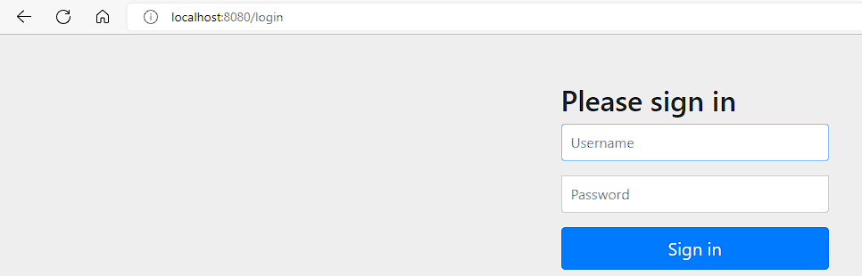


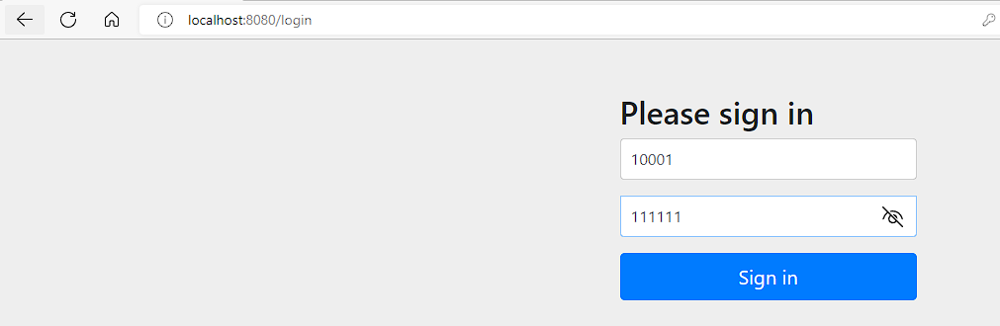


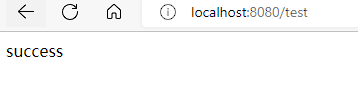


## 查看日志


```sh
2022-08-01 14:58:03.241  INFO 15684 --- [           main] o.s.b.w.embedded.tomcat.TomcatWebServer  : Tomcat started on port(s): 8080 (http) with context path ''
2022-08-01 14:58:03.251  INFO 15684 --- [           main] m.s.SpringSecurityDemoApplication        : Started SpringSecurityDemoApplication in 2.196 seconds (JVM running for 2.818)
2022-08-01 14:59:07.053  INFO 15684 --- [nio-8080-exec-1] o.a.c.c.C.[Tomcat].[localhost].[/]       : Initializing Spring DispatcherServlet 'dispatcherServlet'
2022-08-01 14:59:07.053  INFO 15684 --- [nio-8080-exec-1] o.s.web.servlet.DispatcherServlet        : Initializing Servlet 'dispatcherServlet'
2022-08-01 14:59:07.054  INFO 15684 --- [nio-8080-exec-1] o.s.web.servlet.DispatcherServlet        : Completed initialization in 1 ms
2022-08-01 15:00:21.315 DEBUG 15684 --- [nio-8080-exec-5] m.s.m.A.selectList                       : ==>  Preparing: SELECT administrator_no,administrator_password FROM administrators_password WHERE (administrator_no = ?)
2022-08-01 15:00:21.331 DEBUG 15684 --- [nio-8080-exec-5] m.s.m.A.selectList                       : ==> Parameters: 10001(Long)
2022-08-01 15:00:21.346 DEBUG 15684 --- [nio-8080-exec-5] m.s.m.A.selectList                       : <==      Total: 1
```


# 自定义页面


## login.html


```html
<!DOCTYPE html>

<!--
Project name(项目名称)：springSecurity_demo
  File name(文件名): login
  Authors(作者）: mao
  Author QQ：1296193245
  GitHub：https://github.com/maomao124/
  Date(创建日期)： 2022/8/1
  Time(创建时间)： 15:09
  Description(描述)： 无
-->

<html lang="en">
<head>
    <meta charset="UTF-8">
    <title>登录</title>
    <link rel="stylesheet" href="css/form.css">
    <link rel="stylesheet" href="css/animate.css">
    <style>
        body {
            background-color: skyblue;
        }
    </style>
</head>
<body>


<div class="text_position">
    <div class="text animated flipInY">
        登录
    </div>
</div>

<div class="form_position">
    <div class="animated bounceInDown">
        <div class="form">
            <form action="/login"  method="post">
                <table border="1">
                    <tr>
                        <td colspan="2" align="center">
                        </td>
                    </tr>
                    <tr>
                        <td class="prompt">用户ID</td>
                        <td>
                            <label>
                                <input class="input" type="text" name="username" required="required">
                            </label>
                        </td>
                    </tr>
                    <tr>
                        <td class="prompt">密码</td>
                        <td>
                            <label>
                                <input class="input" type="password" name="password" required="required">
                            </label>
                        </td>
                    </tr>
                    <tr>
                        <td colspan="2" align="center">
                            <input class="submit" type="submit" value="提交"/>
                        </td>
                    </tr>
                </table>
            </form>
        </div>
    </div>
</div>
</body>

<script>


</script>

</html>
```


## error.html


```html
<!DOCTYPE html>

<!--
Project name(项目名称)：springSecurity_demo
  File name(文件名): error
  Authors(作者）: mao
  Author QQ：1296193245
  GitHub：https://github.com/maomao124/
  Date(创建日期)： 2022/8/1
  Time(创建时间)： 15:51
  Description(描述)： 无
-->

<html lang="en">
<head>
    <meta charset="UTF-8">
    <title>error</title>
    <link rel="stylesheet" href="css/error.css">
</head>
<body>

<a class="warning" href="login.html">错误：账号或者密码不正确</a>

</body>
</html>
```


## index.html


```html
<!DOCTYPE html>

<!--
Project name(项目名称)：springSecurity_demo
  File name(文件名): index
  Authors(作者）: mao
  Author QQ：1296193245
  GitHub：https://github.com/maomao124/
  Date(创建日期)： 2022/8/1
  Time(创建时间)： 18:49
  Description(描述)： 无
-->

<html lang="en">
<head>
    <meta charset="UTF-8">
    <title>索引</title>
</head>
<body>
<h1>
  登录成功
</h1>
</body>
</html>
```


## form.css


```css
/*
  Project name(项目名称)：springSecurity_demo 
  File name(文件名): form
  Author(作者）: mao
  Author QQ：1296193245
  GitHub：https://github.com/maomao124/
  Date(创建日期)： 2022/8/1 
  Time(创建时间)： 15:11
  Version(版本): 1.0
  Description(描述)： 无
 */


/*表单位置*/
div.form_position {
    position: absolute;
    top: 50%;
    left: 50%;
    transform: translate(-50%, -50%);
}

/*表单的边框*/
div.form {
    border: 10px skyblue dotted;
}


/*表*/
table {
    width: 600px;
    border-collapse: collapse;
    color: #4edaff;
    background-color: #ffe4da;
    transition: all 1s linear 0s;
}

table:hover {
    background-color: #b4ffab;
    /*width: 800px;*/
    /*transition: all 1s linear 0s;*/
}


/*设置字体*/
td, input, input.input {
    font-size: 30px;
}

input {
    /*font-size: 24px;*/
    /*width: 90%;*/
    color: coral;
}

input.input {
    width: 85%;
    color: coral;
    transition: all 0.5s linear 0s;
}

input.input:hover {
    width: 98%;
    transition: all 0.5s linear 0s;
    background-color: #fcffee;
}


/*设置提示*/
.prompt {
    text-align: center;
    width: 200px;
    transition: all 1s linear 0.2s;
}

.prompt:hover {
    transition: all 1s linear 0.2s;
    color: #ff2e2f;
}

/*提交按钮*/
input.submit {
    color: #6739ff;
}

input.submit:hover {

}

/*最上面的字*/
div.text {
    border: 10px violet dotted;
    text-align: center;
    font-size: 32px;
    color: tomato;
    background: bisque;
}

/*最上面的字的位置*/
div.text_position {
    position: absolute;
    top: 2%;
    left: 50%;
    transform: translate(-50%, 0%);
}
```


## error.css


```css
/*
  Project name(项目名称)：springSecurity_demo 
  File name(文件名): error
  Author(作者）: mao
  Author QQ：1296193245
  GitHub：https://github.com/maomao124/
  Date(创建日期)： 2022/8/1 
  Time(创建时间)： 15:52
  Version(版本): 1.0
  Description(描述)： 无
 */


body {
    margin: 0;
    height: 100vh;
    display: flex;
    align-items: center;
    justify-content: center;
    background-color: rgb(20%, 20%, 20%);
}

a {
    text-decoration: none;
}

.warning {
    color: whitesmoke;
    font-size: 80px;
    font-family: sans-serif;
    font-weight: bold;
    position: relative;
    padding: 0.6em 0.4em;
}

.warning::before,
.warning::after {
    content: '';
    position: absolute;
    top: 0;
    left: 0;
    width: 100%;
    height: 100%;
    border: 0.2em solid transparent;
    box-sizing: border-box;
    color: orangered;
    animation: rotating 10s infinite;
}

.warning::before {
    border-top-color: currentColor;
    border-right-color: currentColor;
    z-index: -1;
}

.warning::after {
    border-bottom-color: currentColor;
    border-left-color: currentColor;
    box-shadow: 0.3em 0.3em 0.3em rgba(20%, 20%, 20%, 0.8);
}

@keyframes rotating {
    to {
        transform: rotate(360deg);
    }
}
```


## animate.css


过多，略


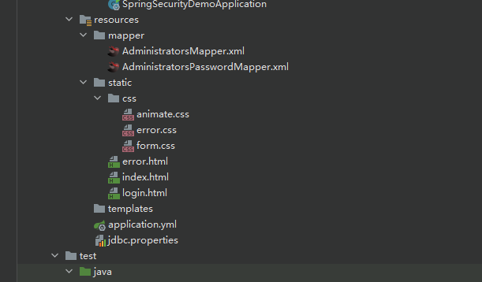


## 更改SecurityConfig类


```java
package mao.springsecurity_demo.config;

import org.springframework.context.annotation.Bean;
import org.springframework.context.annotation.Configuration;
import org.springframework.security.config.annotation.web.builders.HttpSecurity;
import org.springframework.security.config.annotation.web.configuration.WebSecurityConfigurerAdapter;
import org.springframework.security.crypto.bcrypt.BCryptPasswordEncoder;
import org.springframework.security.crypto.password.PasswordEncoder;

/**
 * Project name(项目名称)：springSecurity_demo
 * Package(包名): mao.springsecurity_demo.config
 * Class(类名): SecurityConfig
 * Author(作者）: mao
 * Author QQ：1296193245
 * GitHub：https://github.com/maomao124/
 * Date(创建日期)： 2022/7/30
 * Time(创建时间)： 20:30
 * Version(版本): 1.0
 * Description(描述)： 无
 */

@Configuration
public class SecurityConfig extends WebSecurityConfigurerAdapter
{
    @Override
    protected void configure(HttpSecurity http) throws Exception
    {
        //表单登录
        http.formLogin()
                //设置登录页面
                .loginPage("/login.html")
                //设置哪个是登录的 url
                .loginProcessingUrl("/login")
                //设置登录成功之后跳转到哪个 url
                .defaultSuccessUrl("/index.html", false)
                //.successForwardUrl("/index")
                //设置登录失败之后跳转到哪个url
                .failureUrl("/error.html")
                //.failureForwardUrl("fail")
                //设置表单的用户名项参数名称
                .usernameParameter("username")
                //设置表单的密码项参数名称
                .passwordParameter("password");

        //关闭csrf
        http.csrf().disable();

        //认证配置
        http.authorizeRequests()
                //指定页面不需要验证
                .antMatchers("/login.html", "/login", "/error.html",
                        "/css/**", "/js/**", "/img/**", "/test/noauth")
                .permitAll()
                //其它请求都需要身份认证
                .anyRequest()
                .authenticated();

    }


/*
    @Bean
    public PasswordEncoder passwordEncoder()
    {
        return new BCryptPasswordEncoder();
    }
*/

}

```


## 启动服务


```sh
OpenJDK 64-Bit Server VM warning: Options -Xverify:none and -noverify were deprecated in JDK 13 and will likely be removed in a future release.

  .   ____          _            __ _ _
 /\\ / ___'_ __ _ _(_)_ __  __ _ \ \ \ \
( ( )\___ | '_ | '_| | '_ \/ _` | \ \ \ \
 \\/  ___)| |_)| | | | | || (_| |  ) ) ) )
  '  |____| .__|_| |_|_| |_\__, | / / / /
 =========|_|==============|___/=/_/_/_/
 :: Spring Boot ::                (v2.7.2)

2022-08-01 19:15:20.395  INFO 3744 --- [           main] m.s.SpringSecurityDemoApplication        : Starting SpringSecurityDemoApplication using Java 16.0.2 on mao with PID 3744 (H:\程序\大三暑假\springSecurity_demo\target\classes started by mao in H:\程序\大三暑假\springSecurity_demo)
2022-08-01 19:15:20.398 DEBUG 3744 --- [           main] m.s.SpringSecurityDemoApplication        : Running with Spring Boot v2.7.2, Spring v5.3.22
2022-08-01 19:15:20.398  INFO 3744 --- [           main] m.s.SpringSecurityDemoApplication        : The following 1 profile is active: "dev"
2022-08-01 19:15:21.189  INFO 3744 --- [           main] o.s.b.w.embedded.tomcat.TomcatWebServer  : Tomcat initialized with port(s): 8080 (http)
2022-08-01 19:15:21.196  INFO 3744 --- [           main] o.apache.catalina.core.StandardService   : Starting service [Tomcat]
2022-08-01 19:15:21.196  INFO 3744 --- [           main] org.apache.catalina.core.StandardEngine  : Starting Servlet engine: [Apache Tomcat/9.0.65]
2022-08-01 19:15:21.280  INFO 3744 --- [           main] o.a.c.c.C.[Tomcat].[localhost].[/]       : Initializing Spring embedded WebApplicationContext
2022-08-01 19:15:21.280  INFO 3744 --- [           main] w.s.c.ServletWebServerApplicationContext : Root WebApplicationContext: initialization completed in 851 ms
2022-08-01 19:15:21.375  INFO 3744 --- [           main] c.a.d.s.b.a.DruidDataSourceAutoConfigure : Init DruidDataSource
2022-08-01 19:15:21.468  INFO 3744 --- [           main] com.alibaba.druid.pool.DruidDataSource   : {dataSource-1} inited
 _ _   |_  _ _|_. ___ _ |    _ 
| | |\/|_)(_| | |_\  |_)||_|_\ 
     /               |         
                        3.5.1 
2022-08-01 19:15:21.807  INFO 3744 --- [           main] o.s.b.a.w.s.WelcomePageHandlerMapping    : Adding welcome page: class path resource [static/index.html]
2022-08-01 19:15:21.975  INFO 3744 --- [           main] o.s.s.web.DefaultSecurityFilterChain     : Will secure any request with [org.springframework.security.web.session.DisableEncodeUrlFilter@272778ae, org.springframework.security.web.context.request.async.WebAsyncManagerIntegrationFilter@2cccf134, org.springframework.security.web.context.SecurityContextPersistenceFilter@28d739f1, org.springframework.security.web.header.HeaderWriterFilter@212fafd1, org.springframework.security.web.authentication.logout.LogoutFilter@10d18696, org.springframework.security.web.authentication.UsernamePasswordAuthenticationFilter@6b8b5020, org.springframework.security.web.savedrequest.RequestCacheAwareFilter@7e3d2ebd, org.springframework.security.web.servletapi.SecurityContextHolderAwareRequestFilter@51888019, org.springframework.security.web.authentication.AnonymousAuthenticationFilter@3c18942, org.springframework.security.web.session.SessionManagementFilter@787988f4, org.springframework.security.web.access.ExceptionTranslationFilter@7d59e968, org.springframework.security.web.access.intercept.FilterSecurityInterceptor@4652c74d]
2022-08-01 19:15:22.025  INFO 3744 --- [           main] o.s.b.w.embedded.tomcat.TomcatWebServer  : Tomcat started on port(s): 8080 (http) with context path ''
2022-08-01 19:15:22.035  INFO 3744 --- [           main] m.s.SpringSecurityDemoApplication        : Started SpringSecurityDemoApplication in 1.958 seconds (JVM running for 2.435)
```


## 访问


http://localhost:8080/test/noauth


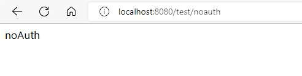


无需登录就能访问


http://localhost:8080


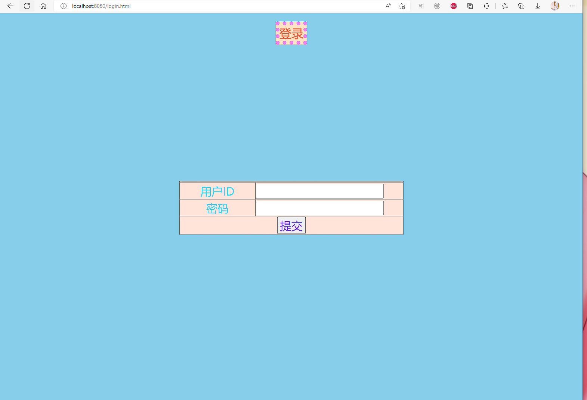


需要登录


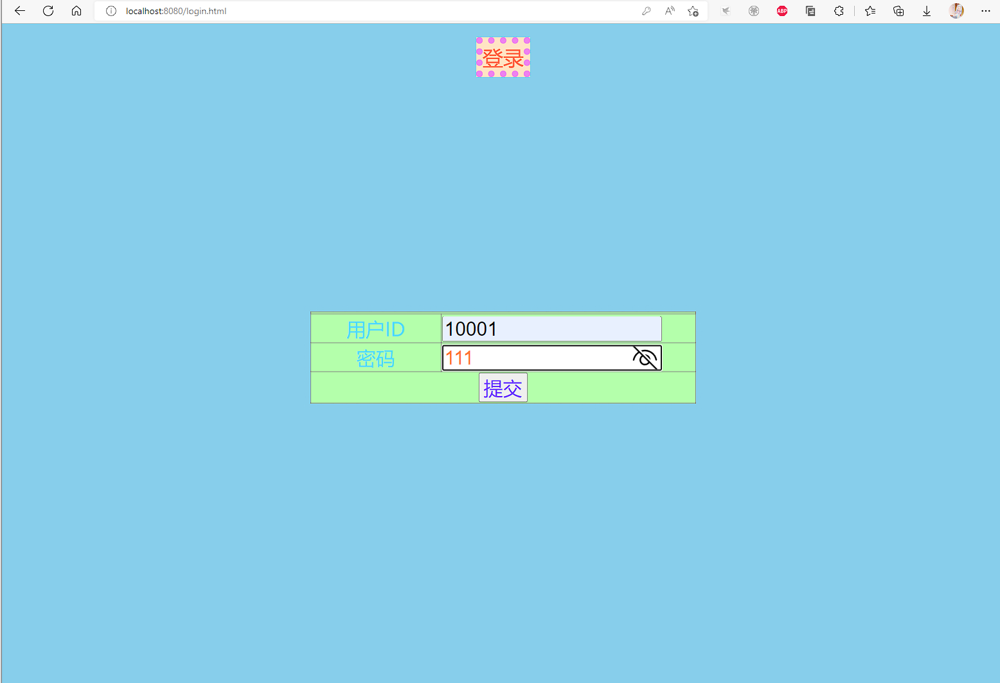


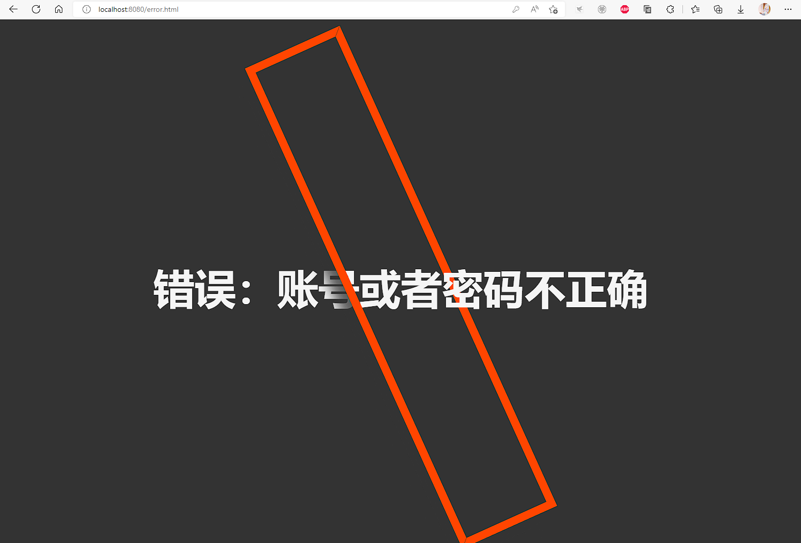


登录失败，跳转到错误页面


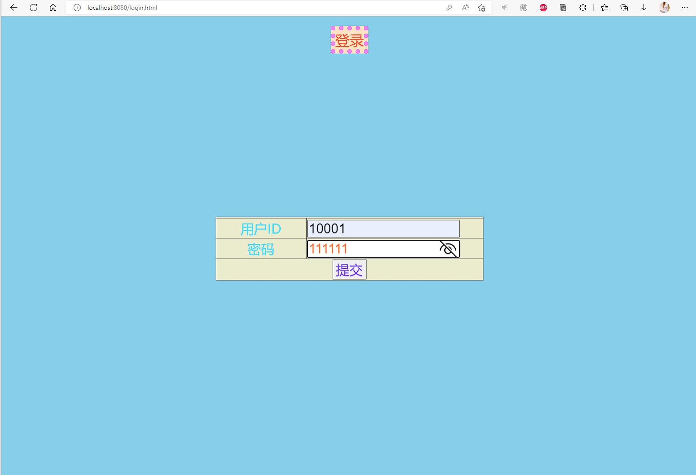


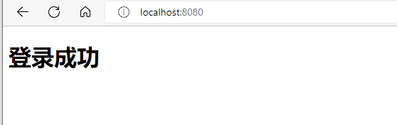


登录成功


# 基于角色或权限进行访问控制


## hasAuthority 方法


在SecurityConfig类的configure方法配置。

如果当前的主体具有指定的权限，则返回 true,否则返回 false


给/test/root资源设置root权限

给/test/admin资源设置admin权限


访问的用户中必须具有相应的权限才能访问


### 更改TestController类


```java
package mao.springsecurity_demo.controller;

import org.springframework.web.bind.annotation.GetMapping;
import org.springframework.web.bind.annotation.RequestMapping;
import org.springframework.web.bind.annotation.RestController;

/**
 * Project name(项目名称)：springSecurity_demo
 * Package(包名): mao.springsecurity_demo.controller
 * Class(类名): TestController
 * Author(作者）: mao
 * Author QQ：1296193245
 * GitHub：https://github.com/maomao124/
 * Date(创建日期)： 2022/7/30
 * Time(创建时间)： 20:52
 * Version(版本): 1.0
 * Description(描述)： 无
 */

@RestController
@RequestMapping("/test")
public class TestController
{
    @GetMapping("")
    public String success()
    {
        return "success";
    }

    @GetMapping("/noauth")
    public String noAuth()
    {
        return "noAuth";
    }

    @GetMapping("/root")
    public String root()
    {
        return "root权限，访问成功";
    }

    @GetMapping("/admin")
    public String admin()
    {
        return "admin权限，访问成功";
    }

}
```


### 更改SecurityConfig类


给/test/root资源设置root权限

给/test/admin资源设置admin权限


```java
package mao.springsecurity_demo.config;

import org.springframework.context.annotation.Bean;
import org.springframework.context.annotation.Configuration;
import org.springframework.security.config.annotation.web.builders.HttpSecurity;
import org.springframework.security.config.annotation.web.configuration.WebSecurityConfigurerAdapter;
import org.springframework.security.crypto.bcrypt.BCryptPasswordEncoder;
import org.springframework.security.crypto.password.PasswordEncoder;

/**
 * Project name(项目名称)：springSecurity_demo
 * Package(包名): mao.springsecurity_demo.config
 * Class(类名): SecurityConfig
 * Author(作者）: mao
 * Author QQ：1296193245
 * GitHub：https://github.com/maomao124/
 * Date(创建日期)： 2022/7/30
 * Time(创建时间)： 20:30
 * Version(版本): 1.0
 * Description(描述)： 无
 */

@Configuration
public class SecurityConfig extends WebSecurityConfigurerAdapter
{
    @Override
    protected void configure(HttpSecurity http) throws Exception
    {
        //表单登录
        http.formLogin()
                //设置登录页面
                .loginPage("/login.html")
                //设置哪个是登录的 url
                .loginProcessingUrl("/login")
                //设置登录成功之后跳转到哪个 url
                .defaultSuccessUrl("/index.html", false)
                //.successForwardUrl("/index")
                //设置登录失败之后跳转到哪个url
                .failureUrl("/error.html")
                //.failureForwardUrl("fail")
                //设置表单的用户名项参数名称
                .usernameParameter("username")
                //设置表单的密码项参数名称
                .passwordParameter("password");

        //关闭csrf
        http.csrf().disable();

        //认证配置
        http.authorizeRequests()
                //指定页面不需要验证
                .antMatchers("/login.html", "/login", "/error.html",
                        "/css/**", "/js/**", "/img/**", "/test/noauth")
                .permitAll()
                .antMatchers("/test/root").hasAuthority("root")
                .antMatchers("/test/admin").hasAuthority("admin")
                //其它请求都需要身份认证
                .anyRequest()
                .authenticated();

    }


/*
    @Bean
    public PasswordEncoder passwordEncoder()
    {
        return new BCryptPasswordEncoder();
    }
*/

}
```


### 重启服务


### 访问


http://localhost:8080/test/


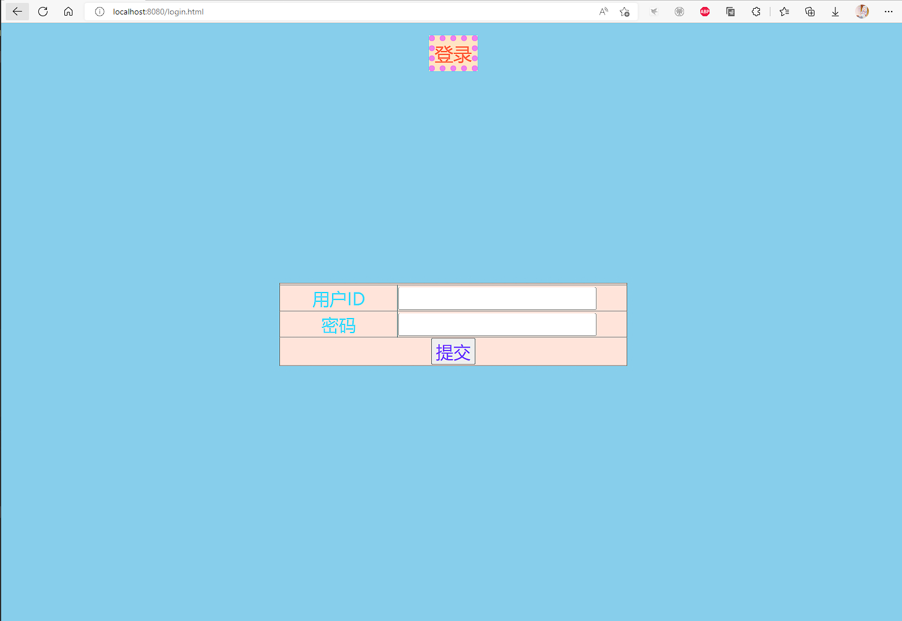


需要登录


用户名和密码：

10001

111111


无权限要求的能正常访问


访问http://localhost:8080/test/admin


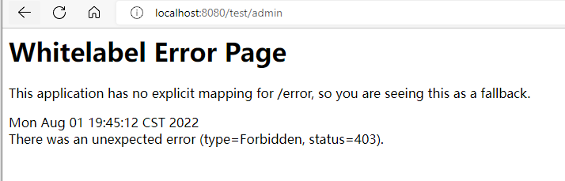


状态码为403，无权限


访问http://localhost:8080/test/root


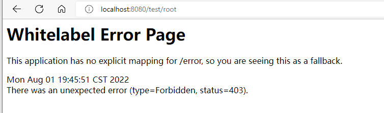


也没有权限


### 更改用户权限


将用户权限更改为admin


```java
package mao.springsecurity_demo.service;

import mao.springsecurity_demo.entity.AdministratorsPassword;
import org.slf4j.Logger;
import org.slf4j.LoggerFactory;
import org.springframework.beans.factory.annotation.Autowired;
import org.springframework.security.core.authority.AuthorityUtils;
import org.springframework.security.core.userdetails.User;
import org.springframework.security.core.userdetails.UserDetails;
import org.springframework.security.core.userdetails.UserDetailsService;
import org.springframework.security.core.userdetails.UsernameNotFoundException;
import org.springframework.stereotype.Service;

/**
 * Project name(项目名称)：springSecurity_demo
 * Package(包名): mao.springsecurity_demo.service
 * Class(类名): AdministratorsLoginService
 * Author(作者）: mao
 * Author QQ：1296193245
 * GitHub：https://github.com/maomao124/
 * Date(创建日期)： 2022/8/1
 * Time(创建时间)： 14:23
 * Version(版本): 1.0
 * Description(描述)： 无
 */

@Service
public class AdministratorsLoginService implements UserDetailsService
{

    private static final Logger log = LoggerFactory.getLogger(AdministratorsLoginService.class);


    @Autowired
    private IAdministratorsPasswordService administratorsPasswordService;


    @Override
    public UserDetails loadUserByUsername(String username) throws UsernameNotFoundException
    {
        log.debug("进入AdministratorsLoginService");

        //判空
        if (username == null || username.equals(""))
        {
            throw new UsernameNotFoundException("用户名不能为空！");
        }
        Long id = null;
        try
        {
            id = Long.parseLong(username);
        }
        catch (Exception e)
        {
            throw new UsernameNotFoundException("用户名必须为数字！");
        }
        //查数据库
        AdministratorsPassword administratorsPassword = administratorsPasswordService.query().eq("administrator_no", id).one();
        //判断是否存在
        if (administratorsPassword == null || administratorsPassword.getAdministratorNo() == null)
        {
            throw new UsernameNotFoundException("用户名不存在！");
        }
        //将数据放入user对象里并返回
        return new User(administratorsPassword.getAdministratorNo().toString(),
                administratorsPassword.getAdministratorPassword(),
                //AuthorityUtils.createAuthorityList("administrator"));
                AuthorityUtils.createAuthorityList("admin"));
    }
}
```


### 重启服务


### 访问


http://localhost:8080/test/


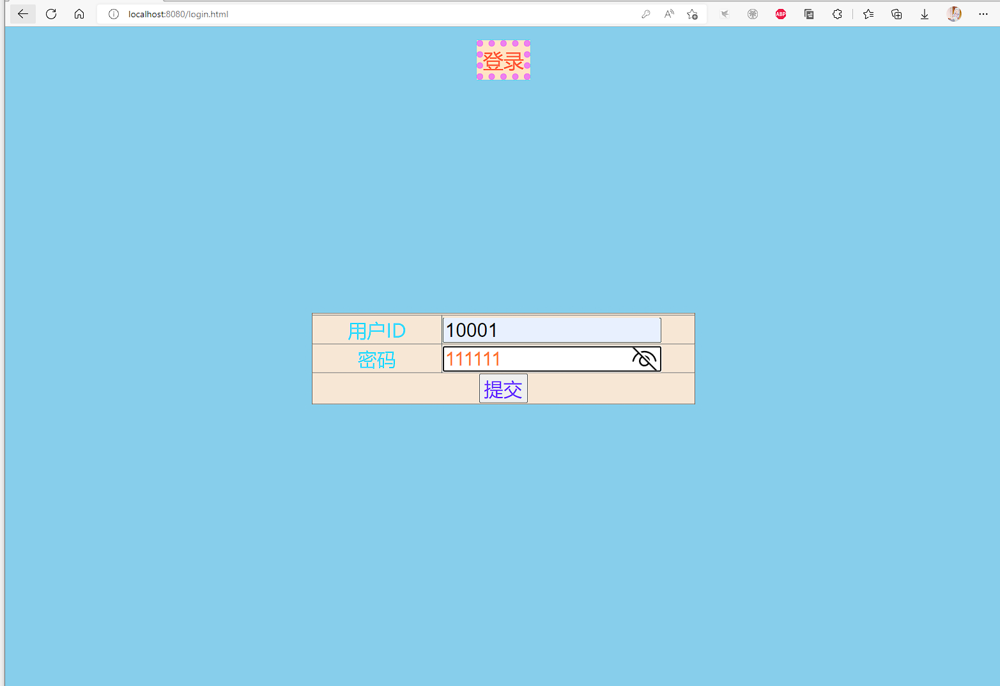


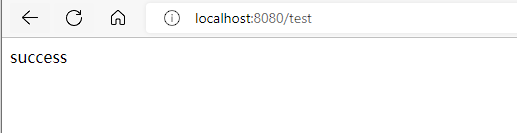


无权限要求的能正常访问


访问http://localhost:8080/test/admin


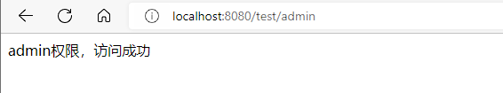


能访问


访问http://localhost:8080/test/root


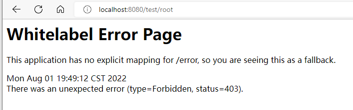


无权限，不能访问


### 更改用户权限


```java
package mao.springsecurity_demo.service;

import mao.springsecurity_demo.entity.AdministratorsPassword;
import org.slf4j.Logger;
import org.slf4j.LoggerFactory;
import org.springframework.beans.factory.annotation.Autowired;
import org.springframework.security.core.authority.AuthorityUtils;
import org.springframework.security.core.userdetails.User;
import org.springframework.security.core.userdetails.UserDetails;
import org.springframework.security.core.userdetails.UserDetailsService;
import org.springframework.security.core.userdetails.UsernameNotFoundException;
import org.springframework.stereotype.Service;

/**
 * Project name(项目名称)：springSecurity_demo
 * Package(包名): mao.springsecurity_demo.service
 * Class(类名): AdministratorsLoginService
 * Author(作者）: mao
 * Author QQ：1296193245
 * GitHub：https://github.com/maomao124/
 * Date(创建日期)： 2022/8/1
 * Time(创建时间)： 14:23
 * Version(版本): 1.0
 * Description(描述)： 无
 */

@Service
public class AdministratorsLoginService implements UserDetailsService
{

    private static final Logger log = LoggerFactory.getLogger(AdministratorsLoginService.class);


    @Autowired
    private IAdministratorsPasswordService administratorsPasswordService;


    @Override
    public UserDetails loadUserByUsername(String username) throws UsernameNotFoundException
    {
        log.debug("进入AdministratorsLoginService");

        //判空
        if (username == null || username.equals(""))
        {
            throw new UsernameNotFoundException("用户名不能为空！");
        }
        Long id = null;
        try
        {
            id = Long.parseLong(username);
        }
        catch (Exception e)
        {
            throw new UsernameNotFoundException("用户名必须为数字！");
        }
        //查数据库
        AdministratorsPassword administratorsPassword = administratorsPasswordService.query().eq("administrator_no", id).one();
        //判断是否存在
        if (administratorsPassword == null || administratorsPassword.getAdministratorNo() == null)
        {
            throw new UsernameNotFoundException("用户名不存在！");
        }
        //将数据放入user对象里并返回
        return new User(administratorsPassword.getAdministratorNo().toString(),
                administratorsPassword.getAdministratorPassword(),
                //AuthorityUtils.createAuthorityList("administrator"));
                //AuthorityUtils.createAuthorityList("admin"));
                AuthorityUtils.createAuthorityList("root"));
    }
}
```


### 重启服务


### 访问


http://localhost:8080/test/


登录过程略


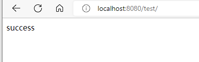


访问http://localhost:8080/test/admin


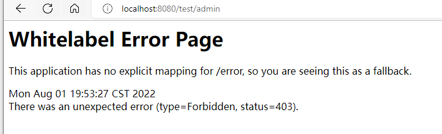


无权限


访问http://localhost:8080/test/root


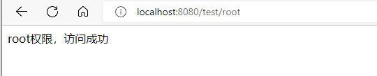


能访问


### 更改用户权限


用户同时具有root和admin权限


```java
package mao.springsecurity_demo.service;

import mao.springsecurity_demo.entity.AdministratorsPassword;
import org.slf4j.Logger;
import org.slf4j.LoggerFactory;
import org.springframework.beans.factory.annotation.Autowired;
import org.springframework.security.core.authority.AuthorityUtils;
import org.springframework.security.core.userdetails.User;
import org.springframework.security.core.userdetails.UserDetails;
import org.springframework.security.core.userdetails.UserDetailsService;
import org.springframework.security.core.userdetails.UsernameNotFoundException;
import org.springframework.stereotype.Service;

/**
 * Project name(项目名称)：springSecurity_demo
 * Package(包名): mao.springsecurity_demo.service
 * Class(类名): AdministratorsLoginService
 * Author(作者）: mao
 * Author QQ：1296193245
 * GitHub：https://github.com/maomao124/
 * Date(创建日期)： 2022/8/1
 * Time(创建时间)： 14:23
 * Version(版本): 1.0
 * Description(描述)： 无
 */

@Service
public class AdministratorsLoginService implements UserDetailsService
{

    private static final Logger log = LoggerFactory.getLogger(AdministratorsLoginService.class);


    @Autowired
    private IAdministratorsPasswordService administratorsPasswordService;


    @Override
    public UserDetails loadUserByUsername(String username) throws UsernameNotFoundException
    {
        log.debug("进入AdministratorsLoginService");

        //判空
        if (username == null || username.equals(""))
        {
            throw new UsernameNotFoundException("用户名不能为空！");
        }
        Long id = null;
        try
        {
            id = Long.parseLong(username);
        }
        catch (Exception e)
        {
            throw new UsernameNotFoundException("用户名必须为数字！");
        }
        //查数据库
        AdministratorsPassword administratorsPassword = administratorsPasswordService.query().eq("administrator_no", id).one();
        //判断是否存在
        if (administratorsPassword == null || administratorsPassword.getAdministratorNo() == null)
        {
            throw new UsernameNotFoundException("用户名不存在！");
        }
        //将数据放入user对象里并返回
        return new User(administratorsPassword.getAdministratorNo().toString(),
                administratorsPassword.getAdministratorPassword(),
                //AuthorityUtils.createAuthorityList("administrator"));
                //AuthorityUtils.createAuthorityList("admin"));
                //AuthorityUtils.createAuthorityList("root"));
                AuthorityUtils.createAuthorityList("root","admin"));
    }
}
```


### 重启服务


### 访问


http://localhost:8080/test/


登录过程略


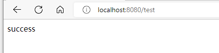


访问http://localhost:8080/test/admin


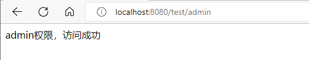


访问成功


访问http://localhost:8080/test/root


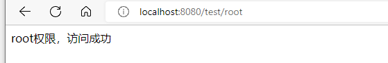


访问成功


## hasAnyAuthority 方法


如果当前的主体有任何提供的角色的话（只要有其中一个权限），返回 true


给/test/rootOrAdmin资源设置root权限和admin权限


### 更改SecurityConfig类


给/test/rootOrAdmin资源设置root权限和admin权限


```java
package mao.springsecurity_demo.config;

import org.springframework.context.annotation.Bean;
import org.springframework.context.annotation.Configuration;
import org.springframework.security.config.annotation.web.builders.HttpSecurity;
import org.springframework.security.config.annotation.web.configuration.WebSecurityConfigurerAdapter;
import org.springframework.security.crypto.bcrypt.BCryptPasswordEncoder;
import org.springframework.security.crypto.password.PasswordEncoder;

/**
 * Project name(项目名称)：springSecurity_demo
 * Package(包名): mao.springsecurity_demo.config
 * Class(类名): SecurityConfig
 * Author(作者）: mao
 * Author QQ：1296193245
 * GitHub：https://github.com/maomao124/
 * Date(创建日期)： 2022/7/30
 * Time(创建时间)： 20:30
 * Version(版本): 1.0
 * Description(描述)： 无
 */

@Configuration
public class SecurityConfig extends WebSecurityConfigurerAdapter
{
    @Override
    protected void configure(HttpSecurity http) throws Exception
    {
        //表单登录
        http.formLogin()
                //设置登录页面
                .loginPage("/login.html")
                //设置哪个是登录的 url
                .loginProcessingUrl("/login")
                //设置登录成功之后跳转到哪个 url
                .defaultSuccessUrl("/index.html", false)
                //.successForwardUrl("/index")
                //设置登录失败之后跳转到哪个url
                .failureUrl("/error.html")
                //.failureForwardUrl("fail")
                //设置表单的用户名项参数名称
                .usernameParameter("username")
                //设置表单的密码项参数名称
                .passwordParameter("password");

        //关闭csrf
        http.csrf().disable();

        //认证配置
        http.authorizeRequests()
                //指定页面不需要验证
                .antMatchers("/login.html", "/login", "/error.html",
                        "/css/**", "/js/**", "/img/**", "/test/noauth")
                .permitAll()
                .antMatchers("/test/root").hasAuthority("root")
                .antMatchers("/test/admin").hasAuthority("admin")
                .antMatchers("/test/rootOrAdmin").hasAnyAuthority("root","admin")
                //其它请求都需要身份认证
                .anyRequest()
                .authenticated();

    }


/*
    @Bean
    public PasswordEncoder passwordEncoder()
    {
        return new BCryptPasswordEncoder();
    }
*/

}
```


## 更改用户权限


权限为root


```java
package mao.springsecurity_demo.service;

import mao.springsecurity_demo.entity.AdministratorsPassword;
import org.slf4j.Logger;
import org.slf4j.LoggerFactory;
import org.springframework.beans.factory.annotation.Autowired;
import org.springframework.security.core.authority.AuthorityUtils;
import org.springframework.security.core.userdetails.User;
import org.springframework.security.core.userdetails.UserDetails;
import org.springframework.security.core.userdetails.UserDetailsService;
import org.springframework.security.core.userdetails.UsernameNotFoundException;
import org.springframework.stereotype.Service;

/**
 * Project name(项目名称)：springSecurity_demo
 * Package(包名): mao.springsecurity_demo.service
 * Class(类名): AdministratorsLoginService
 * Author(作者）: mao
 * Author QQ：1296193245
 * GitHub：https://github.com/maomao124/
 * Date(创建日期)： 2022/8/1
 * Time(创建时间)： 14:23
 * Version(版本): 1.0
 * Description(描述)： 无
 */

@Service
public class AdministratorsLoginService implements UserDetailsService
{

    private static final Logger log = LoggerFactory.getLogger(AdministratorsLoginService.class);


    @Autowired
    private IAdministratorsPasswordService administratorsPasswordService;


    @Override
    public UserDetails loadUserByUsername(String username) throws UsernameNotFoundException
    {
        log.debug("进入AdministratorsLoginService");

        //判空
        if (username == null || username.equals(""))
        {
            throw new UsernameNotFoundException("用户名不能为空！");
        }
        Long id = null;
        try
        {
            id = Long.parseLong(username);
        }
        catch (Exception e)
        {
            throw new UsernameNotFoundException("用户名必须为数字！");
        }
        //查数据库
        AdministratorsPassword administratorsPassword = administratorsPasswordService.query().eq("administrator_no", id).one();
        //判断是否存在
        if (administratorsPassword == null || administratorsPassword.getAdministratorNo() == null)
        {
            throw new UsernameNotFoundException("用户名不存在！");
        }
        //将数据放入user对象里并返回
        return new User(administratorsPassword.getAdministratorNo().toString(),
                administratorsPassword.getAdministratorPassword(),
                //AuthorityUtils.createAuthorityList("administrator"));
                //AuthorityUtils.createAuthorityList("admin"));
                AuthorityUtils.createAuthorityList("root"));
                //AuthorityUtils.createAuthorityList("root","admin"));
    }
}
```


### 重启服务


### 访问


http://localhost:8080/test/rootOrAdmin


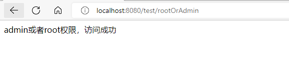


访问成功


### 更改用户权限


权限为admin


```java
package mao.springsecurity_demo.service;

import mao.springsecurity_demo.entity.AdministratorsPassword;
import org.slf4j.Logger;
import org.slf4j.LoggerFactory;
import org.springframework.beans.factory.annotation.Autowired;
import org.springframework.security.core.authority.AuthorityUtils;
import org.springframework.security.core.userdetails.User;
import org.springframework.security.core.userdetails.UserDetails;
import org.springframework.security.core.userdetails.UserDetailsService;
import org.springframework.security.core.userdetails.UsernameNotFoundException;
import org.springframework.stereotype.Service;

/**
 * Project name(项目名称)：springSecurity_demo
 * Package(包名): mao.springsecurity_demo.service
 * Class(类名): AdministratorsLoginService
 * Author(作者）: mao
 * Author QQ：1296193245
 * GitHub：https://github.com/maomao124/
 * Date(创建日期)： 2022/8/1
 * Time(创建时间)： 14:23
 * Version(版本): 1.0
 * Description(描述)： 无
 */

@Service
public class AdministratorsLoginService implements UserDetailsService
{

    private static final Logger log = LoggerFactory.getLogger(AdministratorsLoginService.class);


    @Autowired
    private IAdministratorsPasswordService administratorsPasswordService;


    @Override
    public UserDetails loadUserByUsername(String username) throws UsernameNotFoundException
    {
        log.debug("进入AdministratorsLoginService");

        //判空
        if (username == null || username.equals(""))
        {
            throw new UsernameNotFoundException("用户名不能为空！");
        }
        Long id = null;
        try
        {
            id = Long.parseLong(username);
        }
        catch (Exception e)
        {
            throw new UsernameNotFoundException("用户名必须为数字！");
        }
        //查数据库
        AdministratorsPassword administratorsPassword = administratorsPasswordService.query().eq("administrator_no", id).one();
        //判断是否存在
        if (administratorsPassword == null || administratorsPassword.getAdministratorNo() == null)
        {
            throw new UsernameNotFoundException("用户名不存在！");
        }
        //将数据放入user对象里并返回
        return new User(administratorsPassword.getAdministratorNo().toString(),
                administratorsPassword.getAdministratorPassword(),
                //AuthorityUtils.createAuthorityList("administrator"));
                //AuthorityUtils.createAuthorityList("admin"));
                AuthorityUtils.createAuthorityList("admin"));
                //AuthorityUtils.createAuthorityList("root","admin"));
    }
}
```


### 重启服务


### 访问


http://localhost:8080/test/rootOrAdmin


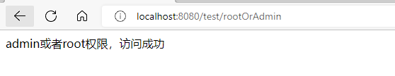


正常访问


### 更改访问权限


更改为admin1，不相关的权限


```java
package mao.springsecurity_demo.service;

import mao.springsecurity_demo.entity.AdministratorsPassword;
import org.slf4j.Logger;
import org.slf4j.LoggerFactory;
import org.springframework.beans.factory.annotation.Autowired;
import org.springframework.security.core.authority.AuthorityUtils;
import org.springframework.security.core.userdetails.User;
import org.springframework.security.core.userdetails.UserDetails;
import org.springframework.security.core.userdetails.UserDetailsService;
import org.springframework.security.core.userdetails.UsernameNotFoundException;
import org.springframework.stereotype.Service;

/**
 * Project name(项目名称)：springSecurity_demo
 * Package(包名): mao.springsecurity_demo.service
 * Class(类名): AdministratorsLoginService
 * Author(作者）: mao
 * Author QQ：1296193245
 * GitHub：https://github.com/maomao124/
 * Date(创建日期)： 2022/8/1
 * Time(创建时间)： 14:23
 * Version(版本): 1.0
 * Description(描述)： 无
 */

@Service
public class AdministratorsLoginService implements UserDetailsService
{

    private static final Logger log = LoggerFactory.getLogger(AdministratorsLoginService.class);


    @Autowired
    private IAdministratorsPasswordService administratorsPasswordService;


    @Override
    public UserDetails loadUserByUsername(String username) throws UsernameNotFoundException
    {
        log.debug("进入AdministratorsLoginService");

        //判空
        if (username == null || username.equals(""))
        {
            throw new UsernameNotFoundException("用户名不能为空！");
        }
        Long id = null;
        try
        {
            id = Long.parseLong(username);
        }
        catch (Exception e)
        {
            throw new UsernameNotFoundException("用户名必须为数字！");
        }
        //查数据库
        AdministratorsPassword administratorsPassword = administratorsPasswordService.query().eq("administrator_no", id).one();
        //判断是否存在
        if (administratorsPassword == null || administratorsPassword.getAdministratorNo() == null)
        {
            throw new UsernameNotFoundException("用户名不存在！");
        }
        //将数据放入user对象里并返回
        return new User(administratorsPassword.getAdministratorNo().toString(),
                administratorsPassword.getAdministratorPassword(),
                //AuthorityUtils.createAuthorityList("administrator"));
                //AuthorityUtils.createAuthorityList("admin"));
                AuthorityUtils.createAuthorityList("admin1"));
                //AuthorityUtils.createAuthorityList("root","admin"));
    }
}
```


### 重启服务


### 访问


http://localhost:8080/test/rootOrAdmin


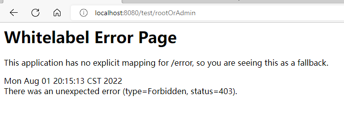


无权限访问


## hasRole 方法


如果用户具备给定角色就允许访问


给/test/role_root资源添加角色root


### 更改TestController类


```java
package mao.springsecurity_demo.controller;

import org.springframework.web.bind.annotation.GetMapping;
import org.springframework.web.bind.annotation.RequestMapping;
import org.springframework.web.bind.annotation.RestController;

/**
 * Project name(项目名称)：springSecurity_demo
 * Package(包名): mao.springsecurity_demo.controller
 * Class(类名): TestController
 * Author(作者）: mao
 * Author QQ：1296193245
 * GitHub：https://github.com/maomao124/
 * Date(创建日期)： 2022/7/30
 * Time(创建时间)： 20:52
 * Version(版本): 1.0
 * Description(描述)： 无
 */

@RestController
@RequestMapping("/test")
public class TestController
{
    @GetMapping("")
    public String success()
    {
        return "success";
    }

    @GetMapping("/noauth")
    public String noAuth()
    {
        return "noAuth";
    }

    @GetMapping("/root")
    public String root()
    {
        return "root权限，访问成功";
    }

    @GetMapping("/admin")
    public String admin()
    {
        return "admin权限，访问成功";
    }

    @GetMapping("/rootOrAdmin")
    public String rootOrAdmin()
    {
        return "admin或者root权限，访问成功";
    }

    @GetMapping("/role_root")
    public String role_root()
    {
        return "具有role_root角色，访问成功";
    }

}
```


### 更改SecurityConfig类


```java
package mao.springsecurity_demo.config;

import org.springframework.context.annotation.Bean;
import org.springframework.context.annotation.Configuration;
import org.springframework.security.config.annotation.web.builders.HttpSecurity;
import org.springframework.security.config.annotation.web.configuration.WebSecurityConfigurerAdapter;
import org.springframework.security.crypto.bcrypt.BCryptPasswordEncoder;
import org.springframework.security.crypto.password.PasswordEncoder;

/**
 * Project name(项目名称)：springSecurity_demo
 * Package(包名): mao.springsecurity_demo.config
 * Class(类名): SecurityConfig
 * Author(作者）: mao
 * Author QQ：1296193245
 * GitHub：https://github.com/maomao124/
 * Date(创建日期)： 2022/7/30
 * Time(创建时间)： 20:30
 * Version(版本): 1.0
 * Description(描述)： 无
 */

@Configuration
public class SecurityConfig extends WebSecurityConfigurerAdapter
{
    @Override
    protected void configure(HttpSecurity http) throws Exception
    {
        //表单登录
        http.formLogin()
                //设置登录页面
                .loginPage("/login.html")
                //设置哪个是登录的 url
                .loginProcessingUrl("/login")
                //设置登录成功之后跳转到哪个 url
                .defaultSuccessUrl("/index.html", false)
                //.successForwardUrl("/index")
                //设置登录失败之后跳转到哪个url
                .failureUrl("/error.html")
                //.failureForwardUrl("fail")
                //设置表单的用户名项参数名称
                .usernameParameter("username")
                //设置表单的密码项参数名称
                .passwordParameter("password");

        //关闭csrf
        http.csrf().disable();

        //认证配置
        http.authorizeRequests()
                //指定页面不需要验证
                .antMatchers("/login.html", "/login", "/error.html",
                        "/css/**", "/js/**", "/img/**", "/test/noauth")
                .permitAll()
                .antMatchers("/test/root").hasAuthority("root")
                .antMatchers("/test/admin").hasAuthority("admin")
                .antMatchers("/test/rootOrAdmin").hasAnyAuthority("root", "admin")
                .antMatchers("/test/role_root").hasRole("root")
                //其它请求都需要身份认证
                .anyRequest()
                .authenticated();

    }


/*
    @Bean
    public PasswordEncoder passwordEncoder()
    {
        return new BCryptPasswordEncoder();
    }
*/

}
```


### 重启服务


### 访问


http://localhost:8080/test/role_root


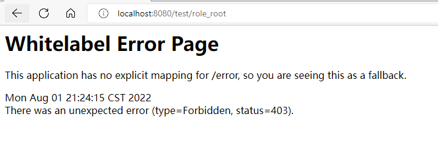


没有权限


### 更改用户权限


授予root角色


在service中，必须添加ROLE_前缀


```java
package mao.springsecurity_demo.service;

import mao.springsecurity_demo.entity.AdministratorsPassword;
import org.slf4j.Logger;
import org.slf4j.LoggerFactory;
import org.springframework.beans.factory.annotation.Autowired;
import org.springframework.security.core.authority.AuthorityUtils;
import org.springframework.security.core.userdetails.User;
import org.springframework.security.core.userdetails.UserDetails;
import org.springframework.security.core.userdetails.UserDetailsService;
import org.springframework.security.core.userdetails.UsernameNotFoundException;
import org.springframework.stereotype.Service;

/**
 * Project name(项目名称)：springSecurity_demo
 * Package(包名): mao.springsecurity_demo.service
 * Class(类名): AdministratorsLoginService
 * Author(作者）: mao
 * Author QQ：1296193245
 * GitHub：https://github.com/maomao124/
 * Date(创建日期)： 2022/8/1
 * Time(创建时间)： 14:23
 * Version(版本): 1.0
 * Description(描述)： 无
 */

@Service
public class AdministratorsLoginService implements UserDetailsService
{

    private static final Logger log = LoggerFactory.getLogger(AdministratorsLoginService.class);


    @Autowired
    private IAdministratorsPasswordService administratorsPasswordService;


    @Override
    public UserDetails loadUserByUsername(String username) throws UsernameNotFoundException
    {
        log.debug("进入AdministratorsLoginService");

        //判空
        if (username == null || username.equals(""))
        {
            throw new UsernameNotFoundException("用户名不能为空！");
        }
        Long id = null;
        try
        {
            id = Long.parseLong(username);
        }
        catch (Exception e)
        {
            throw new UsernameNotFoundException("用户名必须为数字！");
        }
        //查数据库
        AdministratorsPassword administratorsPassword = administratorsPasswordService.query().eq("administrator_no", id).one();
        //判断是否存在
        if (administratorsPassword == null || administratorsPassword.getAdministratorNo() == null)
        {
            throw new UsernameNotFoundException("用户名不存在！");
        }
        //将数据放入user对象里并返回
        return new User(administratorsPassword.getAdministratorNo().toString(),
                administratorsPassword.getAdministratorPassword(),
                //AuthorityUtils.createAuthorityList("administrator"));
                //AuthorityUtils.createAuthorityList("admin"));
                //AuthorityUtils.createAuthorityList("admin"));
                //AuthorityUtils.createAuthorityList("root","admin"));
                AuthorityUtils.createAuthorityList("admin","ROLE_root"));
    }
}
```


### 重启服务


### 访问


http://localhost:8080/test/role_root


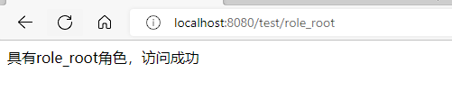


正常访问


## hasAnyRole


表示用户具备任何一个角色都可以访问


给/role_root_or_admin资源设置root和admin角色


### 更改TestController类


```java
package mao.springsecurity_demo.controller;

import org.springframework.web.bind.annotation.GetMapping;
import org.springframework.web.bind.annotation.RequestMapping;
import org.springframework.web.bind.annotation.RestController;

/**
 * Project name(项目名称)：springSecurity_demo
 * Package(包名): mao.springsecurity_demo.controller
 * Class(类名): TestController
 * Author(作者）: mao
 * Author QQ：1296193245
 * GitHub：https://github.com/maomao124/
 * Date(创建日期)： 2022/7/30
 * Time(创建时间)： 20:52
 * Version(版本): 1.0
 * Description(描述)： 无
 */

@RestController
@RequestMapping("/test")
public class TestController
{
    @GetMapping("")
    public String success()
    {
        return "success";
    }

    @GetMapping("/noauth")
    public String noAuth()
    {
        return "noAuth";
    }

    @GetMapping("/root")
    public String root()
    {
        return "root权限，访问成功";
    }

    @GetMapping("/admin")
    public String admin()
    {
        return "admin权限，访问成功";
    }

    @GetMapping("/rootOrAdmin")
    public String rootOrAdmin()
    {
        return "admin或者root权限，访问成功";
    }

    @GetMapping("/role_root")
    public String role_root()
    {
        return "具有role_root角色，访问成功";
    }

    @GetMapping("/role_root_or_admin")
    public String role_root_or_admin()
    {
        return "具有root或者admin角色，访问成功";
    }

}
```


### 更改SecurityConfig类


```java
package mao.springsecurity_demo.config;

import org.springframework.context.annotation.Bean;
import org.springframework.context.annotation.Configuration;
import org.springframework.security.config.annotation.web.builders.HttpSecurity;
import org.springframework.security.config.annotation.web.configuration.WebSecurityConfigurerAdapter;
import org.springframework.security.crypto.bcrypt.BCryptPasswordEncoder;
import org.springframework.security.crypto.password.PasswordEncoder;

/**
 * Project name(项目名称)：springSecurity_demo
 * Package(包名): mao.springsecurity_demo.config
 * Class(类名): SecurityConfig
 * Author(作者）: mao
 * Author QQ：1296193245
 * GitHub：https://github.com/maomao124/
 * Date(创建日期)： 2022/7/30
 * Time(创建时间)： 20:30
 * Version(版本): 1.0
 * Description(描述)： 无
 */

@Configuration
public class SecurityConfig extends WebSecurityConfigurerAdapter
{
    @Override
    protected void configure(HttpSecurity http) throws Exception
    {
        //表单登录
        http.formLogin()
                //设置登录页面
                .loginPage("/login.html")
                //设置哪个是登录的 url
                .loginProcessingUrl("/login")
                //设置登录成功之后跳转到哪个 url
                .defaultSuccessUrl("/index.html", false)
                //.successForwardUrl("/index")
                //设置登录失败之后跳转到哪个url
                .failureUrl("/error.html")
                //.failureForwardUrl("fail")
                //设置表单的用户名项参数名称
                .usernameParameter("username")
                //设置表单的密码项参数名称
                .passwordParameter("password");

        //关闭csrf
        http.csrf().disable();

        //认证配置
        http.authorizeRequests()
                //指定页面不需要验证
                .antMatchers("/login.html", "/login", "/error.html",
                        "/css/**", "/js/**", "/img/**", "/test/noauth")
                .permitAll()
                .antMatchers("/test/root").hasAuthority("root")
                .antMatchers("/test/admin").hasAuthority("admin")
                .antMatchers("/test/rootOrAdmin").hasAnyAuthority("root", "admin")
                .antMatchers("/test/role_root").hasRole("root")
                .antMatchers("/test/role_root_or_admin").hasAnyRole("root", "admin")
                //其它请求都需要身份认证
                .anyRequest()
                .authenticated();

    }


/*
    @Bean
    public PasswordEncoder passwordEncoder()
    {
        return new BCryptPasswordEncoder();
    }
*/

}
```


### 重启服务


### 访问


http://localhost:8080/test/role_root_or_admin


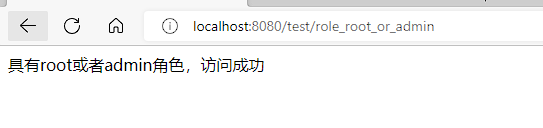


正常访问


### 更改用户权限


```java
package mao.springsecurity_demo.service;

import mao.springsecurity_demo.entity.AdministratorsPassword;
import org.slf4j.Logger;
import org.slf4j.LoggerFactory;
import org.springframework.beans.factory.annotation.Autowired;
import org.springframework.security.core.authority.AuthorityUtils;
import org.springframework.security.core.userdetails.User;
import org.springframework.security.core.userdetails.UserDetails;
import org.springframework.security.core.userdetails.UserDetailsService;
import org.springframework.security.core.userdetails.UsernameNotFoundException;
import org.springframework.stereotype.Service;

/**
 * Project name(项目名称)：springSecurity_demo
 * Package(包名): mao.springsecurity_demo.service
 * Class(类名): AdministratorsLoginService
 * Author(作者）: mao
 * Author QQ：1296193245
 * GitHub：https://github.com/maomao124/
 * Date(创建日期)： 2022/8/1
 * Time(创建时间)： 14:23
 * Version(版本): 1.0
 * Description(描述)： 无
 */

@Service
public class AdministratorsLoginService implements UserDetailsService
{

    private static final Logger log = LoggerFactory.getLogger(AdministratorsLoginService.class);


    @Autowired
    private IAdministratorsPasswordService administratorsPasswordService;


    @Override
    public UserDetails loadUserByUsername(String username) throws UsernameNotFoundException
    {
        log.debug("进入AdministratorsLoginService");

        //判空
        if (username == null || username.equals(""))
        {
            throw new UsernameNotFoundException("用户名不能为空！");
        }
        Long id = null;
        try
        {
            id = Long.parseLong(username);
        }
        catch (Exception e)
        {
            throw new UsernameNotFoundException("用户名必须为数字！");
        }
        //查数据库
        AdministratorsPassword administratorsPassword = administratorsPasswordService.query().eq("administrator_no", id).one();
        //判断是否存在
        if (administratorsPassword == null || administratorsPassword.getAdministratorNo() == null)
        {
            throw new UsernameNotFoundException("用户名不存在！");
        }
        //将数据放入user对象里并返回
        return new User(administratorsPassword.getAdministratorNo().toString(),
                administratorsPassword.getAdministratorPassword(),
                //AuthorityUtils.createAuthorityList("administrator"));
                //AuthorityUtils.createAuthorityList("admin"));
                //AuthorityUtils.createAuthorityList("admin"));
                //AuthorityUtils.createAuthorityList("root","admin"));
                //AuthorityUtils.createAuthorityList("admin", "ROLE_root"));
                AuthorityUtils.createAuthorityList("admin", "ROLE_admin"));
    }
}
```


### 重启服务


### 访问


http://localhost:8080/test/role_root_or_admin


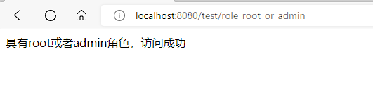


正常访问


### 更改用户权限


角色为ROLE_admin1


```java
package mao.springsecurity_demo.service;

import mao.springsecurity_demo.entity.AdministratorsPassword;
import org.slf4j.Logger;
import org.slf4j.LoggerFactory;
import org.springframework.beans.factory.annotation.Autowired;
import org.springframework.security.core.authority.AuthorityUtils;
import org.springframework.security.core.userdetails.User;
import org.springframework.security.core.userdetails.UserDetails;
import org.springframework.security.core.userdetails.UserDetailsService;
import org.springframework.security.core.userdetails.UsernameNotFoundException;
import org.springframework.stereotype.Service;

/**
 * Project name(项目名称)：springSecurity_demo
 * Package(包名): mao.springsecurity_demo.service
 * Class(类名): AdministratorsLoginService
 * Author(作者）: mao
 * Author QQ：1296193245
 * GitHub：https://github.com/maomao124/
 * Date(创建日期)： 2022/8/1
 * Time(创建时间)： 14:23
 * Version(版本): 1.0
 * Description(描述)： 无
 */

@Service
public class AdministratorsLoginService implements UserDetailsService
{

    private static final Logger log = LoggerFactory.getLogger(AdministratorsLoginService.class);


    @Autowired
    private IAdministratorsPasswordService administratorsPasswordService;


    @Override
    public UserDetails loadUserByUsername(String username) throws UsernameNotFoundException
    {
        log.debug("进入AdministratorsLoginService");

        //判空
        if (username == null || username.equals(""))
        {
            throw new UsernameNotFoundException("用户名不能为空！");
        }
        Long id = null;
        try
        {
            id = Long.parseLong(username);
        }
        catch (Exception e)
        {
            throw new UsernameNotFoundException("用户名必须为数字！");
        }
        //查数据库
        AdministratorsPassword administratorsPassword = administratorsPasswordService.query().eq("administrator_no", id).one();
        //判断是否存在
        if (administratorsPassword == null || administratorsPassword.getAdministratorNo() == null)
        {
            throw new UsernameNotFoundException("用户名不存在！");
        }
        //将数据放入user对象里并返回
        return new User(administratorsPassword.getAdministratorNo().toString(),
                administratorsPassword.getAdministratorPassword(),
                //AuthorityUtils.createAuthorityList("administrator"));
                //AuthorityUtils.createAuthorityList("admin"));
                //AuthorityUtils.createAuthorityList("admin"));
                //AuthorityUtils.createAuthorityList("root","admin"));
                //AuthorityUtils.createAuthorityList("admin", "ROLE_root"));
                AuthorityUtils.createAuthorityList("admin", "ROLE_admin1"));
    }
}
```


### 重启访问


### 访问


http://localhost:8080/test/role_root_or_admin


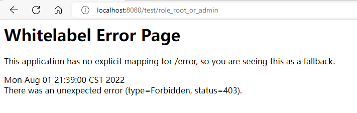


无权限访问


### 更改用户权限


同时具备root和admin权限


```java
package mao.springsecurity_demo.service;

import mao.springsecurity_demo.entity.AdministratorsPassword;
import org.slf4j.Logger;
import org.slf4j.LoggerFactory;
import org.springframework.beans.factory.annotation.Autowired;
import org.springframework.security.core.authority.AuthorityUtils;
import org.springframework.security.core.userdetails.User;
import org.springframework.security.core.userdetails.UserDetails;
import org.springframework.security.core.userdetails.UserDetailsService;
import org.springframework.security.core.userdetails.UsernameNotFoundException;
import org.springframework.stereotype.Service;

/**
 * Project name(项目名称)：springSecurity_demo
 * Package(包名): mao.springsecurity_demo.service
 * Class(类名): AdministratorsLoginService
 * Author(作者）: mao
 * Author QQ：1296193245
 * GitHub：https://github.com/maomao124/
 * Date(创建日期)： 2022/8/1
 * Time(创建时间)： 14:23
 * Version(版本): 1.0
 * Description(描述)： 无
 */

@Service
public class AdministratorsLoginService implements UserDetailsService
{

    private static final Logger log = LoggerFactory.getLogger(AdministratorsLoginService.class);


    @Autowired
    private IAdministratorsPasswordService administratorsPasswordService;


    @Override
    public UserDetails loadUserByUsername(String username) throws UsernameNotFoundException
    {
        log.debug("进入AdministratorsLoginService");

        //判空
        if (username == null || username.equals(""))
        {
            throw new UsernameNotFoundException("用户名不能为空！");
        }
        Long id = null;
        try
        {
            id = Long.parseLong(username);
        }
        catch (Exception e)
        {
            throw new UsernameNotFoundException("用户名必须为数字！");
        }
        //查数据库
        AdministratorsPassword administratorsPassword = administratorsPasswordService.query().eq("administrator_no", id).one();
        //判断是否存在
        if (administratorsPassword == null || administratorsPassword.getAdministratorNo() == null)
        {
            throw new UsernameNotFoundException("用户名不存在！");
        }
        //将数据放入user对象里并返回
        return new User(administratorsPassword.getAdministratorNo().toString(),
                administratorsPassword.getAdministratorPassword(),
                //AuthorityUtils.createAuthorityList("administrator"));
                //AuthorityUtils.createAuthorityList("admin"));
                //AuthorityUtils.createAuthorityList("admin"));
                //AuthorityUtils.createAuthorityList("root","admin"));
                //AuthorityUtils.createAuthorityList("admin", "ROLE_root"));
                //AuthorityUtils.createAuthorityList("admin", "ROLE_admin1"));
                AuthorityUtils.createAuthorityList("admin", "ROLE_admin", "ROLE_root"));
    }
}
```


### 重启服务


### 访问


http://localhost:8080/test/role_root_or_admin


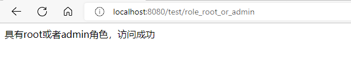


正常访问


# 自定义 403 页面


## 更改SecurityConfig类

配置异常处理


```java
package mao.springsecurity_demo.config;

import org.springframework.context.annotation.Bean;
import org.springframework.context.annotation.Configuration;
import org.springframework.security.config.annotation.web.builders.HttpSecurity;
import org.springframework.security.config.annotation.web.configuration.WebSecurityConfigurerAdapter;
import org.springframework.security.crypto.bcrypt.BCryptPasswordEncoder;
import org.springframework.security.crypto.password.PasswordEncoder;

/**
 * Project name(项目名称)：springSecurity_demo
 * Package(包名): mao.springsecurity_demo.config
 * Class(类名): SecurityConfig
 * Author(作者）: mao
 * Author QQ：1296193245
 * GitHub：https://github.com/maomao124/
 * Date(创建日期)： 2022/7/30
 * Time(创建时间)： 20:30
 * Version(版本): 1.0
 * Description(描述)： 无
 */

@Configuration
public class SecurityConfig extends WebSecurityConfigurerAdapter
{
    @Override
    protected void configure(HttpSecurity http) throws Exception
    {
        //表单登录配置
        http.formLogin()
                //设置登录页面
                .loginPage("/login.html")
                //设置哪个是登录的 url
                .loginProcessingUrl("/login")
                //设置登录成功之后跳转到哪个 url
                .defaultSuccessUrl("/index.html", false)
                //.successForwardUrl("/index")
                //设置登录失败之后跳转到哪个url
                .failureUrl("/error.html")
                //.failureForwardUrl("fail")
                //设置表单的用户名项参数名称
                .usernameParameter("username")
                //设置表单的密码项参数名称
                .passwordParameter("password");

        //关闭csrf
        http.csrf().disable();

        //异常处理配置，403页面配置
        http.exceptionHandling().accessDeniedPage("/unAuth.html");

        //认证配置
        http.authorizeRequests()
                //指定页面不需要验证
                .antMatchers("/login.html", "/login", "/error.html",
                        "/css/**", "/js/**", "/img/**", "/test/noauth")
                .permitAll()
                .antMatchers("/test/root").hasAuthority("root")
                .antMatchers("/test/admin").hasAuthority("admin")
                .antMatchers("/test/rootOrAdmin").hasAnyAuthority("root", "admin")
                .antMatchers("/test/role_root").hasRole("root")
                .antMatchers("/test/role_root_or_admin").hasAnyRole("root", "admin")
                //其它请求都需要身份认证
                .anyRequest()
                .authenticated();

    }


/*
    @Bean
    public PasswordEncoder passwordEncoder()
    {
        return new BCryptPasswordEncoder();
    }
*/

}
```


## 添加页面


unAuth.html

```html
<!DOCTYPE html>

<!--
Project name(项目名称)：springSecurity_demo
  File name(文件名): unAuth
  Authors(作者）: mao
  Author QQ：1296193245
  GitHub：https://github.com/maomao124/
  Date(创建日期)： 2022/8/1
  Time(创建时间)： 21:59
  Description(描述)： 无
-->

<html lang="en">
<head>
    <meta charset="UTF-8">
    <title>无权限访问</title>
    <link rel="stylesheet" href="/css/error.css">
    <link rel="stylesheet" href="/css/animate.css">
</head>
<body>

<div class="animated fadeInDown">
    <div class="warning" href="login.html" onclick="back()">您无权限访问此页面，点击返回</div>
</div>

</body>

<script>

    function back()
    {
        window.history.back()
    }

</script>
</html>
```


## 重启服务


## 访问


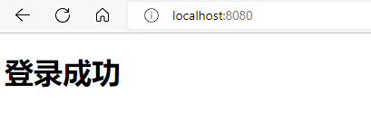


访问http://localhost:8080/test/root页面


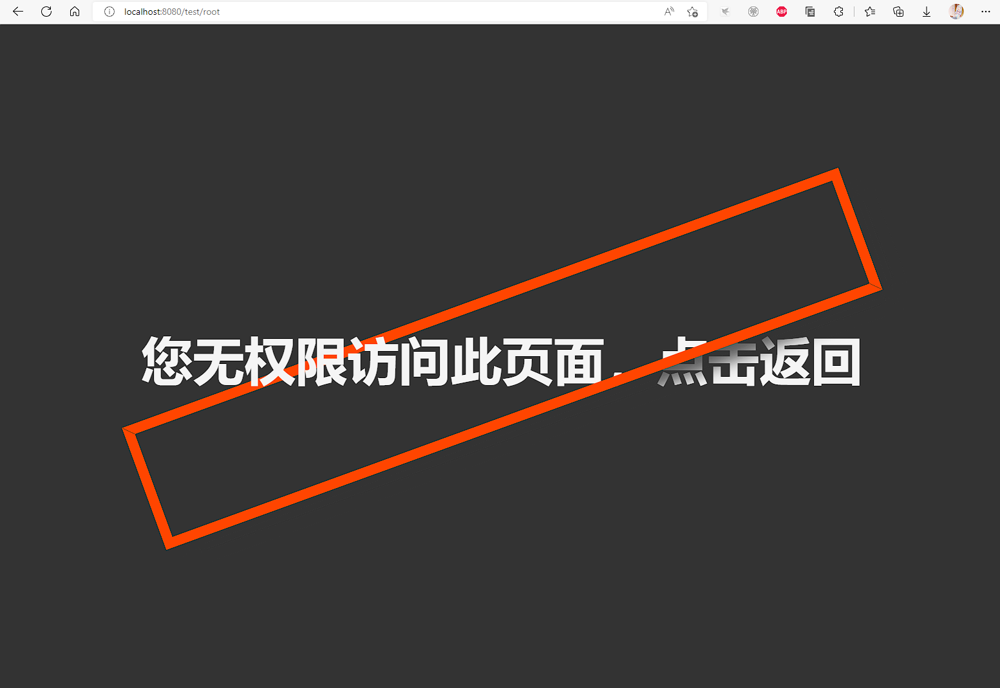


# 用户注销


## 更改索引页面

在索引页面添加一个退出连接


```java
<!DOCTYPE html>

<!--
Project name(项目名称)：springSecurity_demo
  File name(文件名): index
  Authors(作者）: mao
  Author QQ：1296193245
  GitHub：https://github.com/maomao124/
  Date(创建日期)： 2022/8/1
  Time(创建时间)： 18:49
  Description(描述)： 无
-->

<html lang="en">
<head>
    <meta charset="UTF-8">
    <title>索引</title>
    <style>
        .logout {
            position: absolute;
            top: 1%;
            right: 0.5%;
            text-decoration: none;
            font-size: 2em;
            transition: all 1s linear 0s;
            color: royalblue;
        }

        .logout:hover {
            transition: all 1s linear 0s;
            color: red;
        }

    </style>
</head>
<body>

<h1>
    登录成功
</h1>

<a class="logout" href="/logout">退出登录</a>

</body>
</html>
```


## 添加退出成功页面


thanks.html

```html
<!DOCTYPE html>

<!--
Project name(项目名称)：springSecurity_demo
  File name(文件名): thanks
  Authors(作者）: mao
  Author QQ：1296193245
  GitHub：https://github.com/maomao124/
  Date(创建日期)： 2022/8/2
  Time(创建时间)： 13:27
  Description(描述)： 无
-->

<html lang="en">
<head>
    <meta charset="UTF-8">
    <title>感谢使用</title>
    <link rel="stylesheet" href="/css/thanks.css">
</head>
<body>

<div>
    <div class="thanks">
        <a href="/login.html" class="sign">感谢使用</a>
        <!--<div class="sign">感谢</div>-->
        <div class="strings"></div>
        <div class="pin top"></div>
        <div class="pin left"></div>
        <div class="pin right"></div>
    </div>
</div>

</body>
</html>
```


thanks.css

```css
/*
  Project name(项目名称)：springSecurity_demo 
  File name(文件名): thanks
  Author(作者）: mao
  Author QQ：1296193245
  GitHub：https://github.com/maomao124/
  Date(创建日期)： 2022/8/2 
  Time(创建时间)： 13:27
  Version(版本): 1.0
  Description(描述)： 无
 */


html, body {
    width: 100%;
    height: 100%;
    display: flex;
    align-items: center;
    justify-content: center;
    background: radial-gradient(circle at center 60%, white, sandybrown);
}

a {
    text-decoration: none;
}

.thanks {
    width: 400px;
    height: 300px;
    position: relative;
    animation: swinging 1.5s ease-in-out infinite alternate;
    transform-origin: 200px 13px;
}

.sign {
    width: 100%;
    height: 200px;
    background: burlywood;
    border-radius: 15px;
    position: absolute;
    bottom: 0;
    font-size: 70px;
    color: saddlebrown;
    font-family: serif;
    font-weight: bold;
    text-align: center;
    line-height: 200px;
    text-shadow: 0 2px 0 rgba(255, 255, 255, 0.3),
    0 -2px 0 rgba(0, 0, 0, 0.7);
}

.strings {
    width: 150px;
    height: 150px;
    border: 5px solid brown;
    position: absolute;
    border-right: none;
    border-bottom: none;
    transform: rotate(45deg);
    top: 38px;
    left: 122px;
}

.pin {
    width: 25px;
    height: 25px;
    border-radius: 50%;
    position: absolute;
}

.pin.top {
    background: gray;
    left: 187px;
}

.pin.left,
.pin.right {
    background: brown;
    top: 110px;
    box-shadow: 0 2px 0 rgba(255, 255, 255, 0.3);
}

.pin.left {
    left: 80px;
}

.pin.right {
    right: 80px;
}

@keyframes swinging {
    from {
        transform: rotate(10deg);
    }

    to {
        transform: rotate(-10deg);
    }
}
```


## 更改SecurityConfig类


在配置类中添加退出映射地址


```java
package mao.springsecurity_demo.config;

import org.springframework.context.annotation.Bean;
import org.springframework.context.annotation.Configuration;
import org.springframework.security.config.annotation.web.builders.HttpSecurity;
import org.springframework.security.config.annotation.web.configuration.WebSecurityConfigurerAdapter;
import org.springframework.security.crypto.bcrypt.BCryptPasswordEncoder;
import org.springframework.security.crypto.password.PasswordEncoder;

/**
 * Project name(项目名称)：springSecurity_demo
 * Package(包名): mao.springsecurity_demo.config
 * Class(类名): SecurityConfig
 * Author(作者）: mao
 * Author QQ：1296193245
 * GitHub：https://github.com/maomao124/
 * Date(创建日期)： 2022/7/30
 * Time(创建时间)： 20:30
 * Version(版本): 1.0
 * Description(描述)： 无
 */

@Configuration
public class SecurityConfig extends WebSecurityConfigurerAdapter
{
    @Override
    protected void configure(HttpSecurity http) throws Exception
    {
        //表单登录配置
        http.formLogin()
                //设置登录页面
                .loginPage("/login.html")
                //设置哪个是登录的 url
                .loginProcessingUrl("/login")
                //设置登录成功之后跳转到哪个 url
                .defaultSuccessUrl("/index.html", false)
                //.successForwardUrl("/index")
                //设置登录失败之后跳转到哪个url
                .failureUrl("/error.html")
                //.failureForwardUrl("fail")
                //设置表单的用户名项参数名称
                .usernameParameter("username")
                //设置表单的密码项参数名称
                .passwordParameter("password");

        //关闭csrf
        http.csrf().disable();

        //异常处理配置，403页面配置
        http.exceptionHandling().accessDeniedPage("/unAuth.html");

        //退出登录配置
        http.logout()
                //设置退出登录的url
                .logoutUrl("/logout")
                //设置退出登录成功后要跳转的url
                .logoutSuccessUrl("/thanks.html")
                .permitAll();

        //认证配置
        http.authorizeRequests()
                //指定页面不需要验证
                .antMatchers("/login.html", "/login", "/error.html", "/thanks.html",
                        "/css/**", "/js/**", "/img/**", "/test/noauth")
                .permitAll()
                .antMatchers("/test/root").hasAuthority("root")
                .antMatchers("/test/admin").hasAuthority("admin")
                .antMatchers("/test/rootOrAdmin").hasAnyAuthority("root", "admin")
                .antMatchers("/test/role_root").hasRole("root")
                .antMatchers("/test/role_root_or_admin").hasAnyRole("root", "admin")
                //其它请求都需要身份认证
                .anyRequest()
                .authenticated();

    }


/*
    @Bean
    public PasswordEncoder passwordEncoder()
    {
        return new BCryptPasswordEncoder();
    }
*/

}
```


## 重启服务


## 访问


http://localhost:8080/


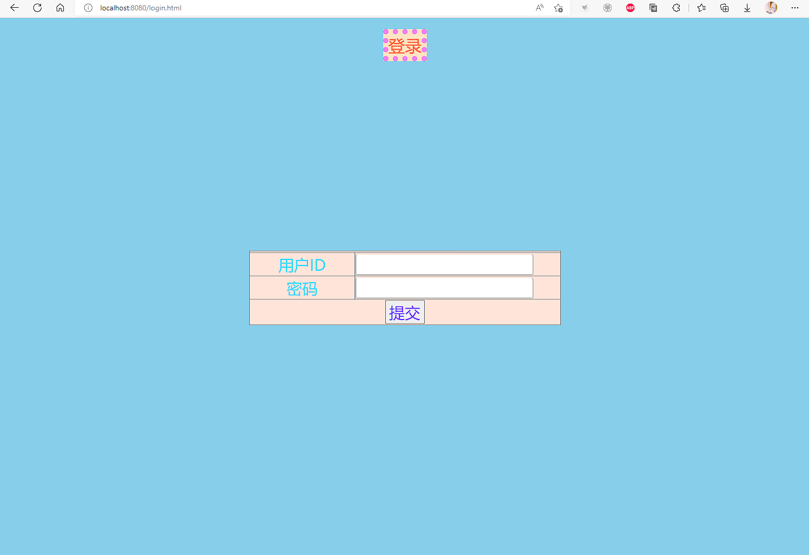


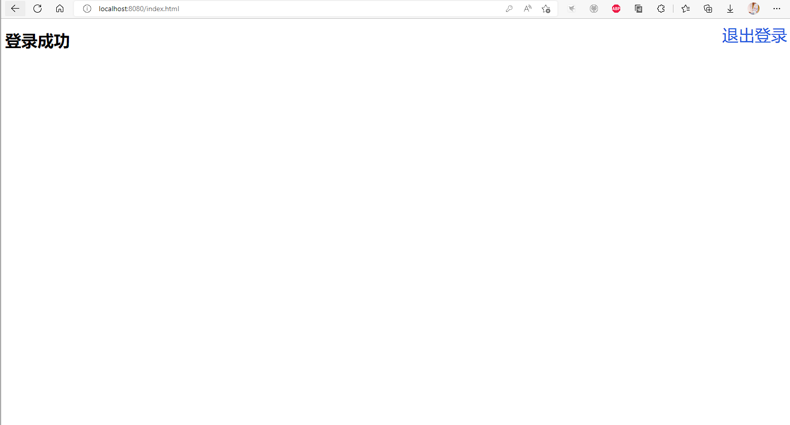


点击退出登录


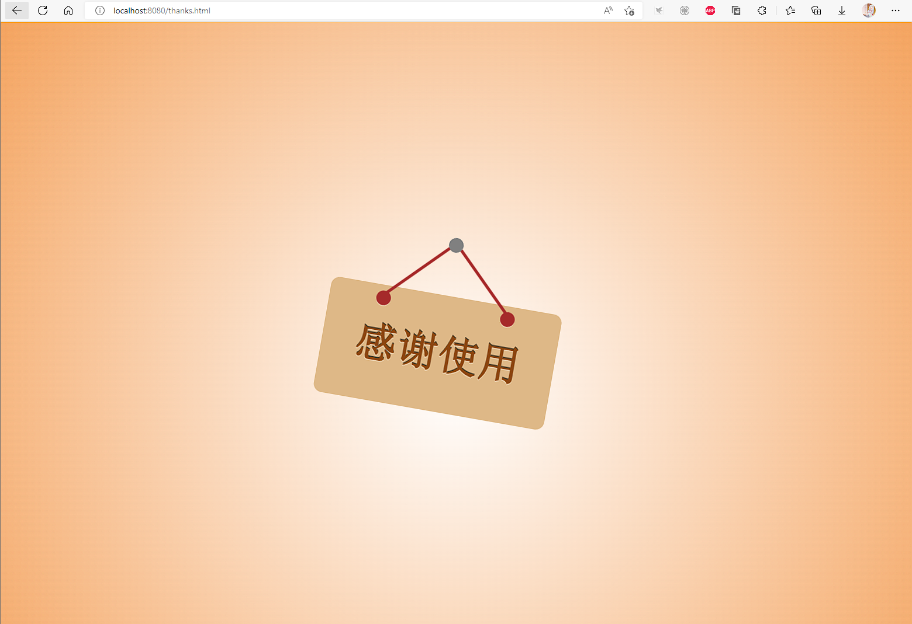


访问http://localhost:8080/test

http://localhost:8080/test/root

http://localhost:8080/test/admin


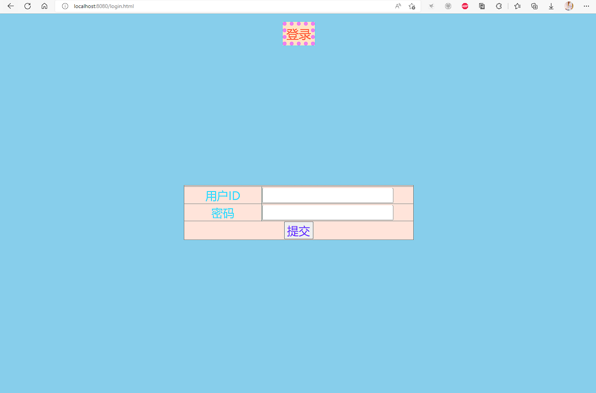


都需要登录


# 注解


## 开启注解功能


在启动类上加上：

```java
@EnableGlobalMethodSecurity(securedEnabled = true, prePostEnabled = true)
```


```java
package mao.springsecurity_demo;

import org.springframework.boot.SpringApplication;
import org.springframework.boot.autoconfigure.SpringBootApplication;
import org.springframework.security.config.annotation.method.configuration.EnableGlobalMethodSecurity;

@SpringBootApplication
@EnableGlobalMethodSecurity(securedEnabled = true, prePostEnabled = true)
public class SpringSecurityDemoApplication
{

    public static void main(String[] args)
    {
        SpringApplication.run(SpringSecurityDemoApplication.class, args);
    }

}
```


## @Secured


判断是否具有某个角色，需要注意的是这里匹配的字符串需要添加前缀“ROLE_“


### 添加一个controller


TestAnnotationController


```java
package mao.springsecurity_demo.controller;

import org.springframework.security.access.annotation.Secured;
import org.springframework.web.bind.annotation.GetMapping;
import org.springframework.web.bind.annotation.RequestMapping;
import org.springframework.web.bind.annotation.RestController;

/**
 * Project name(项目名称)：springSecurity_demo
 * Package(包名): mao.springsecurity_demo.controller
 * Class(类名): TestAnnotationController
 * Author(作者）: mao
 * Author QQ：1296193245
 * GitHub：https://github.com/maomao124/
 * Date(创建日期)： 2022/8/2
 * Time(创建时间)： 13:55
 * Version(版本): 1.0
 * Description(描述)： 无
 */

@RestController
@RequestMapping("/test")
public class TestAnnotationController
{
    @Secured({"ROLE_root"})
    @GetMapping("/anno/root")
    public String role_root()
    {
        return "注解测试，当前需要root角色，访问成功";
    }

    @Secured({"ROLE_root1"})
    @GetMapping("/anno/root1")
    public String role_root1()
    {
        return "注解测试，当前需要root1角色，访问成功";
    }

    @Secured({"ROLE_admin"})
    @GetMapping("/anno/admin")
    public String role_admin()
    {
        return "注解测试，当前需要admin角色，访问成功";
    }

    @Secured({"ROLE_admin1"})
    @GetMapping("/anno/admin1")
    public String role_admin1()
    {
        return "注解测试，当前需要admin角色，访问成功";
    }

    @Secured({"ROLE_admin", "ROLE_root"})
    @GetMapping("/anno/admin_or_root")
    public String role_admin_or_root()
    {
        return "注解测试，当前需要admin或者root角色，访问成功";
    }

    @Secured({"ROLE_admin", "ROLE_root1"})
    @GetMapping("/anno/admin_or_root1")
    public String role_admin_or_root1()
    {
        return "注解测试，当前需要admin或者root1角色，访问成功";
    }

    @Secured({"ROLE_admin1", "ROLE_root1"})
    @GetMapping("/anno/admin1_or_root1")
    public String role_admin1_or_root1()
    {
        return "注解测试，当前需要admin1或者root1角色，访问成功";
    }
}
```


当前用户都具有admin和root角色


### 重启服务


### 访问


访问http://localhost:8080/test/anno/root


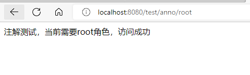


访问http://localhost:8080/test/anno/root1


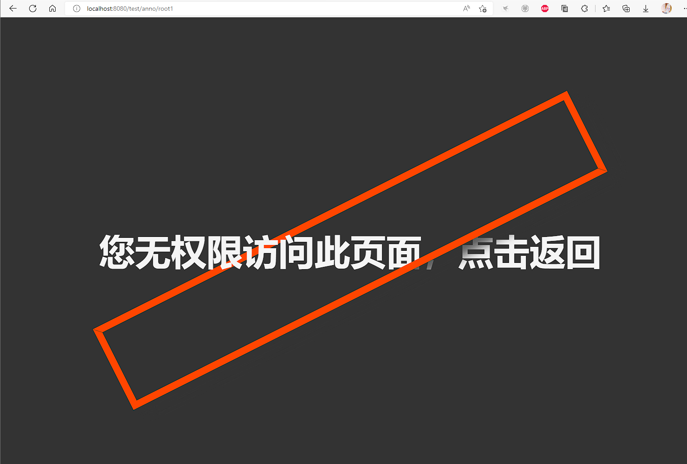


访问http://localhost:8080/test/anno/admin


访问http://localhost:8080/test/anno/admin1


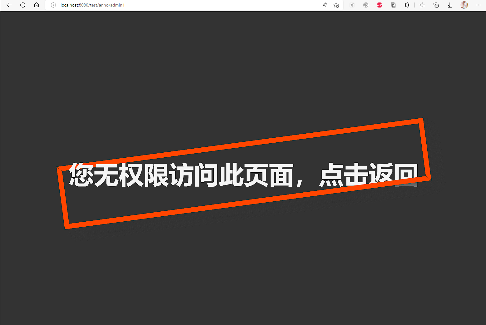


访问http://localhost:8080/test/anno/admin_or_root


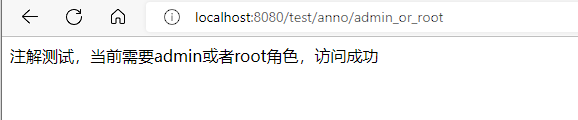


访问http://localhost:8080/test/anno/admin_or_root1


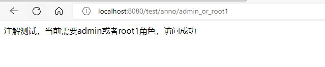


访问http://localhost:8080/test/anno/admin1_or_root1


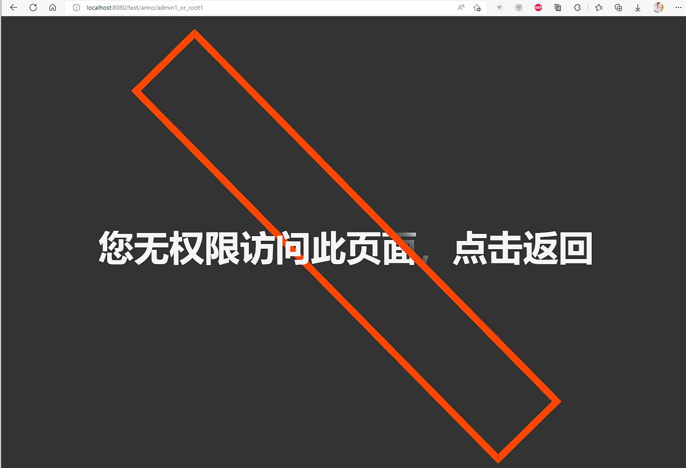


## @PreAuthorize


用于进入方法前的权限验证


### 更改controller


```java
package mao.springsecurity_demo.controller;

import org.springframework.security.access.annotation.Secured;
import org.springframework.security.access.prepost.PreAuthorize;
import org.springframework.web.bind.annotation.GetMapping;
import org.springframework.web.bind.annotation.RequestMapping;
import org.springframework.web.bind.annotation.RestController;

/**
 * Project name(项目名称)：springSecurity_demo
 * Package(包名): mao.springsecurity_demo.controller
 * Class(类名): TestAnnotationController
 * Author(作者）: mao
 * Author QQ：1296193245
 * GitHub：https://github.com/maomao124/
 * Date(创建日期)： 2022/8/2
 * Time(创建时间)： 13:55
 * Version(版本): 1.0
 * Description(描述)： 无
 */


@RestController
@RequestMapping("/test")
public class TestAnnotationController
{
    /**
     * Role root string.
     *
     * @return the string
     */
    @Secured({"ROLE_root"})
    @GetMapping("/anno/root")
    public String role_root()
    {
        return "注解测试，当前需要root角色，访问成功";
    }

    /**
     * Role root 1 string.
     *
     * @return the string
     */
    @Secured({"ROLE_root1"})
    @GetMapping("/anno/root1")
    public String role_root1()
    {
        return "注解测试，当前需要root1角色，访问成功";
    }

    /**
     * Role admin string.
     *
     * @return the string
     */
    @Secured({"ROLE_admin"})
    @GetMapping("/anno/admin")
    public String role_admin()
    {
        return "注解测试，当前需要admin角色，访问成功";
    }

    /**
     * Role admin 1 string.
     *
     * @return the string
     */
    @Secured({"ROLE_admin1"})
    @GetMapping("/anno/admin1")
    public String role_admin1()
    {
        return "注解测试，当前需要admin角色，访问成功";
    }

    /**
     * Role admin or root string.
     *
     * @return the string
     */
    @Secured({"ROLE_admin", "ROLE_root"})
    @GetMapping("/anno/admin_or_root")
    public String role_admin_or_root()
    {
        return "注解测试，当前需要admin或者root角色，访问成功";
    }

    /**
     * Role admin or root 1 string.
     *
     * @return the string
     */
    @Secured({"ROLE_admin", "ROLE_root1"})
    @GetMapping("/anno/admin_or_root1")
    public String role_admin_or_root1()
    {
        return "注解测试，当前需要admin或者root1角色，访问成功";
    }

    /**
     * Role admin 1 or root 1 string.
     *
     * @return the string
     */
    @Secured({"ROLE_admin1", "ROLE_root1"})
    @GetMapping("/anno/admin1_or_root1")
    public String role_admin1_or_root1()
    {
        return "注解测试，当前需要admin1或者root1角色，访问成功";
    }

    //--------------------------------------------

    /**
     * Authority root string.
     *
     * @return the string
     */
    @PreAuthorize("hasAnyAuthority('root')")
    @GetMapping("/anno2/root")
    public String authority_root()
    {
        return "注解测试，当前需要root权限，访问成功";
    }

    /**
     * Authority root 1 string.
     *
     * @return the string
     */
    @PreAuthorize("hasAnyAuthority('root1')")
    @GetMapping("/anno2/root1")
    public String authority_root1()
    {
        return "注解测试，当前需要root1权限，访问成功";
    }

    /**
     * Authority admin string.
     *
     * @return the string
     */
    @PreAuthorize("hasAnyAuthority('admin')")
    @GetMapping("/anno2/admin")
    public String authority_admin()
    {
        return "注解测试，当前需要admin权限，访问成功";
    }

    /**
     * Authority admin 1 string.
     *
     * @return the string
     */
    @PreAuthorize("hasAnyAuthority('admin1')")
    @GetMapping("/anno2/admin1")
    public String authority_admin1()
    {
        return "注解测试，当前需要admin1权限，访问成功";
    }

    /**
     * Authority admin or root string.
     *
     * @return the string
     */
    @PreAuthorize("hasAnyAuthority('admin','root')")
    @GetMapping("/anno2/admin_or_root")
    public String authority_admin_or_root()
    {
        return "注解测试，当前需要admin或者root权限，访问成功";
    }


    /**
     * Authority admin or root 1 string.
     *
     * @return the string
     */
    @PreAuthorize("hasAnyAuthority('admin','root1')")
    @GetMapping("/anno2/admin_or_root1")
    public String authority_admin_or_root1()
    {
        return "注解测试，当前需要admin或者root1权限，访问成功";
    }

    /**
     * Authority admin 1 or root string.
     *
     * @return the string
     */
    @PreAuthorize("hasAnyAuthority('admin1','root')")
    @GetMapping("/anno2/admin1_or_root")
    public String authority_admin1_or_root()
    {
        return "注解测试，当前需要admin1或者root权限，访问成功";
    }

    /**
     * Authority admin 1 or root 1 string.
     *
     * @return the string
     */
    @PreAuthorize("hasAnyAuthority('admin1','root1')")
    @GetMapping("/anno2/admin1_or_root1")
    public String authority_admin1_or_root1()
    {
        return "注解测试，当前需要admin1或者root1权限，访问成功";
    }

}
```


当前用于具有admin一个权限


### 重启服务


### 访问


访问http://localhost:8080/test/anno2/root


访问http://localhost:8080/test/anno2/roo1


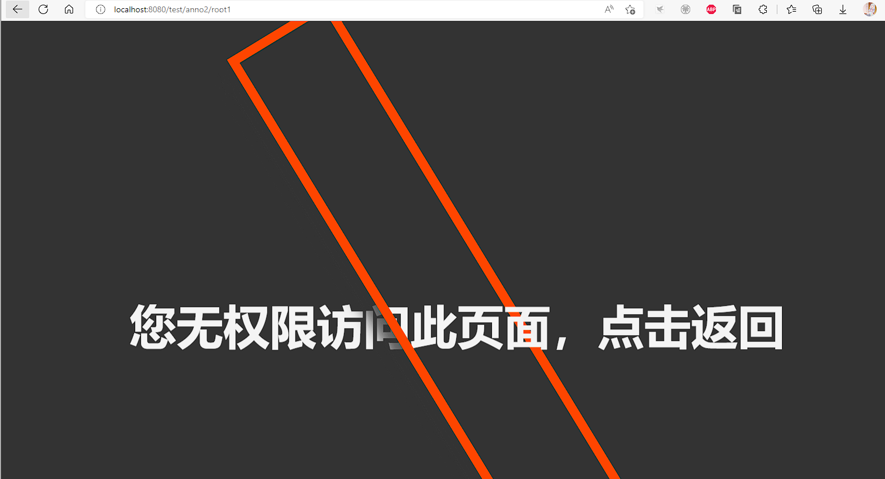


访问http://localhost:8080/test/anno2/admin


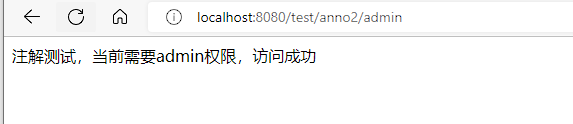


访问http://localhost:8080/test/anno2/admin1


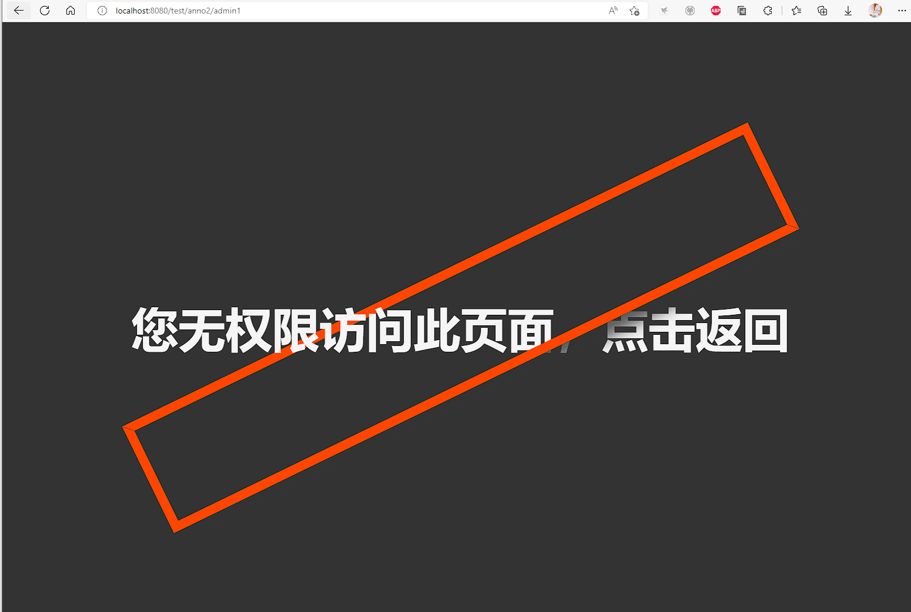


访问http://localhost:8080/test/anno2/admin_or_root


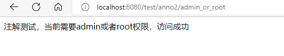


访问http://localhost:8080/test/anno2/admin_or_root1


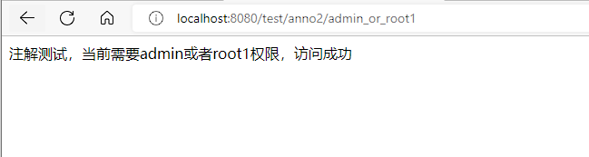


访问http://localhost:8080/test/anno2/admin1_or_root


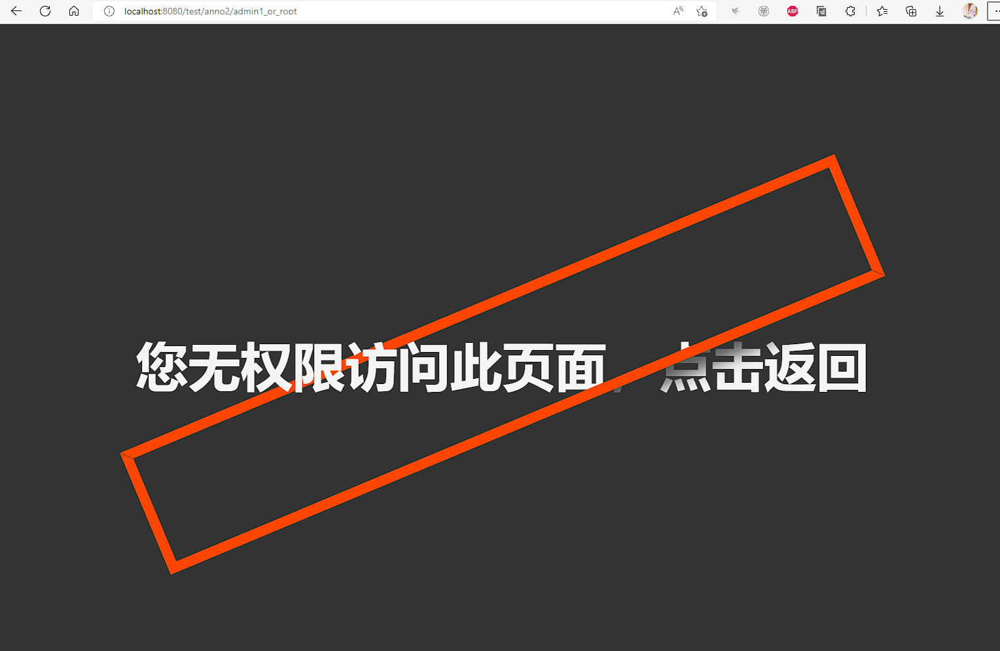


访问http://localhost:8080/test/anno2/admin1_or_root1


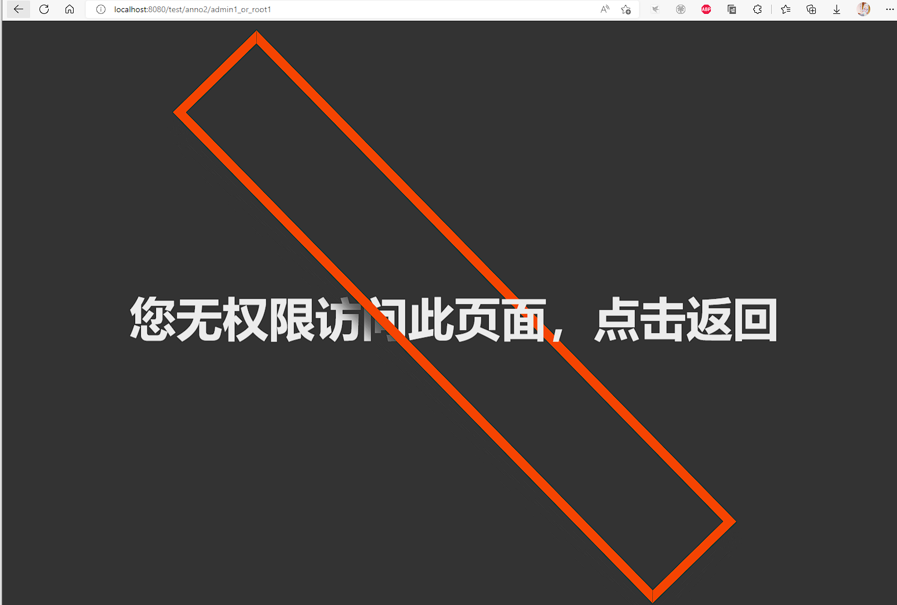


## @PostAuthorize


用于在方法执行后再进行权限验证，适合验证带有返回值 的权限


### 更改controller


```java
package mao.springsecurity_demo.controller;

import org.slf4j.Logger;
import org.slf4j.LoggerFactory;
import org.springframework.security.access.annotation.Secured;
import org.springframework.security.access.prepost.PostAuthorize;
import org.springframework.security.access.prepost.PreAuthorize;
import org.springframework.web.bind.annotation.GetMapping;
import org.springframework.web.bind.annotation.RequestMapping;
import org.springframework.web.bind.annotation.RestController;


/**
 * Project name(项目名称)：springSecurity_demo
 * Package(包名): mao.springsecurity_demo.controller
 * Class(类名): TestAnnotationController
 * Author(作者）: mao
 * Author QQ：1296193245
 * GitHub：https://github.com/maomao124/
 * Date(创建日期)： 2022/8/2
 * Time(创建时间)： 13:55
 * Version(版本): 1.0
 * Description(描述)： 无
 */


@RestController
@RequestMapping("/test")
public class TestAnnotationController
{

    private static final Logger log = LoggerFactory.getLogger(TestAnnotationController.class);

    /**
     * Role root string.
     *
     * @return the string
     */
    @Secured({"ROLE_root"})
    @GetMapping("/anno/root")
    public String role_root()
    {
        return "注解测试，当前需要root角色，访问成功";
    }

    /**
     * Role root 1 string.
     *
     * @return the string
     */
    @Secured({"ROLE_root1"})
    @GetMapping("/anno/root1")
    public String role_root1()
    {
        return "注解测试，当前需要root1角色，访问成功";
    }

    /**
     * Role admin string.
     *
     * @return the string
     */
    @Secured({"ROLE_admin"})
    @GetMapping("/anno/admin")
    public String role_admin()
    {
        return "注解测试，当前需要admin角色，访问成功";
    }

    /**
     * Role admin 1 string.
     *
     * @return the string
     */
    @Secured({"ROLE_admin1"})
    @GetMapping("/anno/admin1")
    public String role_admin1()
    {
        return "注解测试，当前需要admin角色，访问成功";
    }

    /**
     * Role admin or root string.
     *
     * @return the string
     */
    @Secured({"ROLE_admin", "ROLE_root"})
    @GetMapping("/anno/admin_or_root")
    public String role_admin_or_root()
    {
        return "注解测试，当前需要admin或者root角色，访问成功";
    }

    /**
     * Role admin or root 1 string.
     *
     * @return the string
     */
    @Secured({"ROLE_admin", "ROLE_root1"})
    @GetMapping("/anno/admin_or_root1")
    public String role_admin_or_root1()
    {
        return "注解测试，当前需要admin或者root1角色，访问成功";
    }

    /**
     * Role admin 1 or root 1 string.
     *
     * @return the string
     */
    @Secured({"ROLE_admin1", "ROLE_root1"})
    @GetMapping("/anno/admin1_or_root1")
    public String role_admin1_or_root1()
    {
        return "注解测试，当前需要admin1或者root1角色，访问成功";
    }

    //--------------------------------------------

    /**
     * Authority root string.
     *
     * @return the string
     */
    @PreAuthorize("hasAnyAuthority('root')")
    @GetMapping("/anno2/root")
    public String authority_root()
    {
        return "注解测试，当前需要root权限，访问成功";
    }

    /**
     * Authority root 1 string.
     *
     * @return the string
     */
    @PreAuthorize("hasAnyAuthority('root1')")
    @GetMapping("/anno2/root1")
    public String authority_root1()
    {
        return "注解测试，当前需要root1权限，访问成功";
    }

    /**
     * Authority admin string.
     *
     * @return the string
     */
    @PreAuthorize("hasAnyAuthority('admin')")
    @GetMapping("/anno2/admin")
    public String authority_admin()
    {
        return "注解测试，当前需要admin权限，访问成功";
    }

    /**
     * Authority admin 1 string.
     *
     * @return the string
     */
    @PreAuthorize("hasAnyAuthority('admin1')")
    @GetMapping("/anno2/admin1")
    public String authority_admin1()
    {
        return "注解测试，当前需要admin1权限，访问成功";
    }

    /**
     * Authority admin or root string.
     *
     * @return the string
     */
    @PreAuthorize("hasAnyAuthority('admin','root')")
    @GetMapping("/anno2/admin_or_root")
    public String authority_admin_or_root()
    {
        return "注解测试，当前需要admin或者root权限，访问成功";
    }


    /**
     * Authority admin or root 1 string.
     *
     * @return the string
     */
    @PreAuthorize("hasAnyAuthority('admin','root1')")
    @GetMapping("/anno2/admin_or_root1")
    public String authority_admin_or_root1()
    {
        return "注解测试，当前需要admin或者root1权限，访问成功";
    }

    /**
     * Authority admin 1 or root string.
     *
     * @return the string
     */
    @PreAuthorize("hasAnyAuthority('admin1','root')")
    @GetMapping("/anno2/admin1_or_root")
    public String authority_admin1_or_root()
    {
        return "注解测试，当前需要admin1或者root权限，访问成功";
    }

    /**
     * Authority admin 1 or root 1 string.
     *
     * @return the string
     */
    @PreAuthorize("hasAnyAuthority('admin1','root1')")
    @GetMapping("/anno2/admin1_or_root1")
    public String authority_admin1_or_root1()
    {
        return "注解测试，当前需要admin1或者root1权限，访问成功";
    }


    //----------------------------------------

    /**
     * Authority 2 root string.
     *
     * @return the string
     */
    @PostAuthorize("hasAnyAuthority('root')")
    @GetMapping("/anno3/root")
    public String authority2_root()
    {
        log.info("PostAuthorize注解测试，当前需要root权限");
        return "PostAuthorize注解测试，当前需要root权限，访问成功";
    }

    /**
     * Authority 2 root 1 string.
     *
     * @return the string
     */
    @PostAuthorize("hasAnyAuthority('root1')")
    @GetMapping("/anno3/root1")
    public String authority2_root1()
    {
        log.info("PostAuthorize注解测试，当前需要root1权限");
        return "PostAuthorize注解测试，当前需要root1权限，访问成功";
    }

    /**
     * Authority 2 admin string.
     *
     * @return the string
     */
    @PostAuthorize("hasAnyAuthority('admin')")
    @GetMapping("/anno3/admin")
    public String authority2_admin()
    {
        log.info("PostAuthorize注解测试，当前需要admin权限");
        return "PostAuthorize注解测试，当前需要admin权限，访问成功";
    }

    /**
     * Authority 2 admin 1 string.
     *
     * @return the string
     */
    @PostAuthorize("hasAnyAuthority('admin1')")
    @GetMapping("/anno3/admin1")
    public String authority2_admin1()
    {
        log.info("PostAuthorize注解测试，当前需要admin1权限");
        return "PostAuthorize注解测试，当前需要admin1权限，访问成功";
    }

}
```


### 重启服务


### 访问


访问http://localhost:8080/test/anno3/root


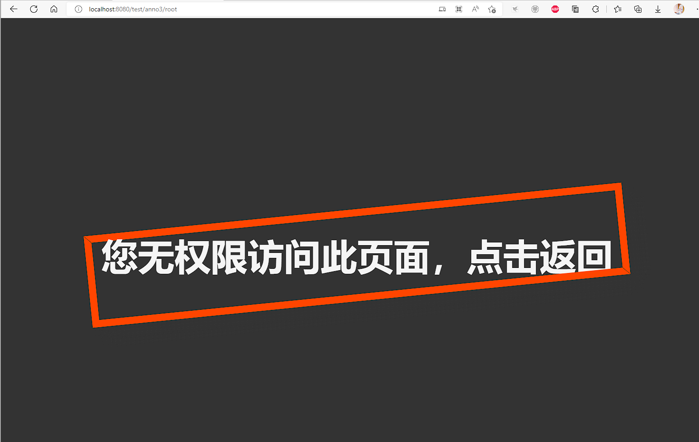


访问http://localhost:8080/test/anno3/root1


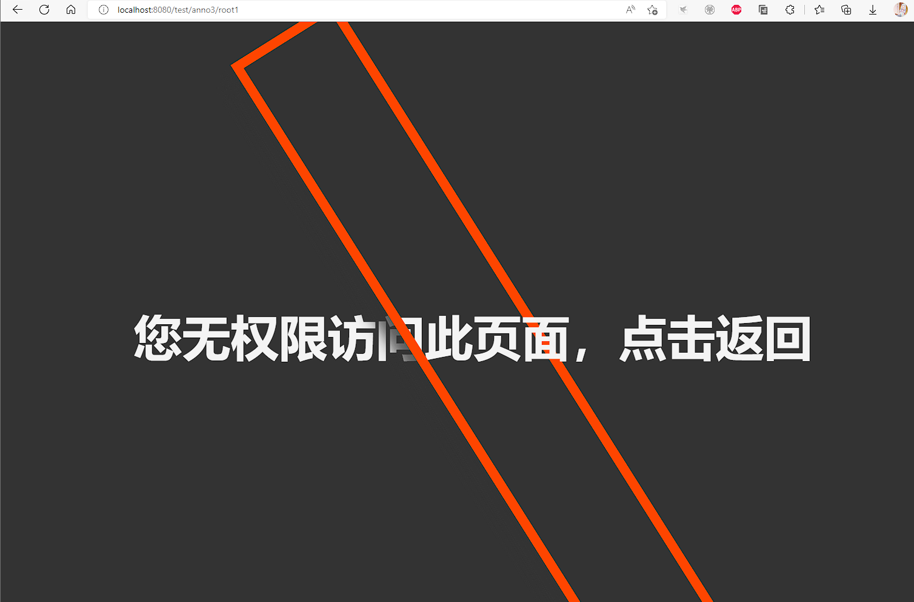


访问http://localhost:8080/test/anno3/admin


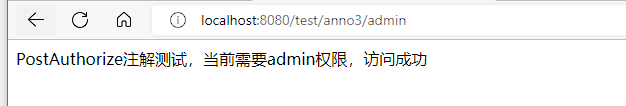


访问http://localhost:8080/test/anno3/admin1


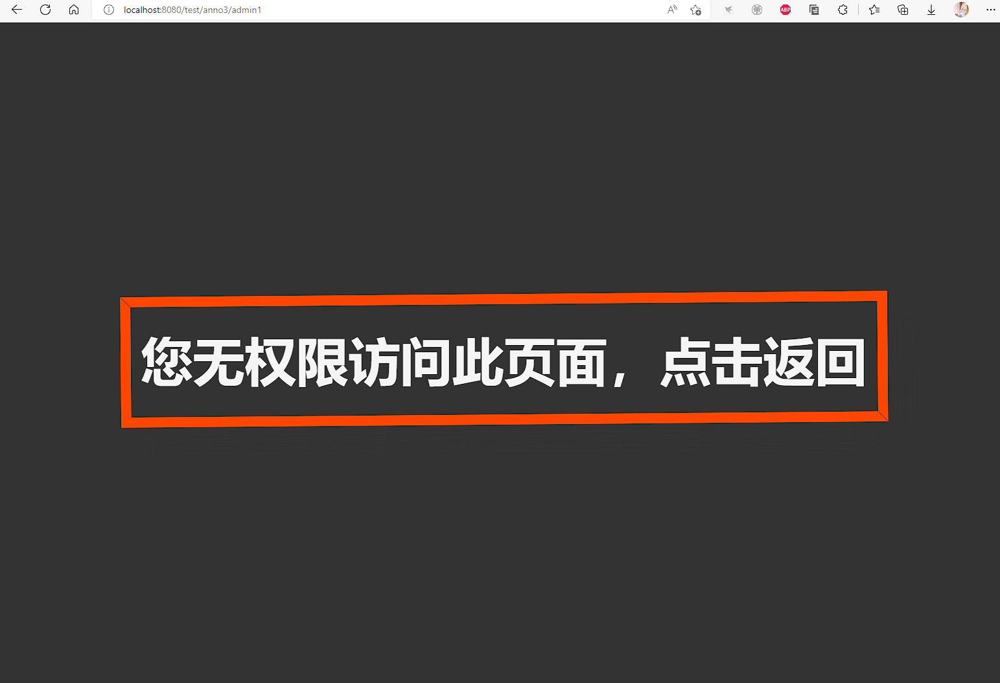


### 查看日志


```sh
2022-08-02 21:57:06.796  INFO 14508 --- [           main] m.s.SpringSecurityDemoApplication        : Starting SpringSecurityDemoApplication using Java 16.0.2 on mao with PID 14508 (H:\程序\大三暑假\springSecurity_demo\target\classes started by mao in H:\程序\大三暑假\springSecurity_demo)
2022-08-02 21:57:06.799 DEBUG 14508 --- [           main] m.s.SpringSecurityDemoApplication        : Running with Spring Boot v2.7.2, Spring v5.3.22
2022-08-02 21:57:06.799  INFO 14508 --- [           main] m.s.SpringSecurityDemoApplication        : The following 1 profile is active: "dev"
2022-08-02 21:57:07.657  INFO 14508 --- [           main] o.s.b.w.embedded.tomcat.TomcatWebServer  : Tomcat initialized with port(s): 8080 (http)
2022-08-02 21:57:07.664  INFO 14508 --- [           main] o.apache.catalina.core.StandardService   : Starting service [Tomcat]
2022-08-02 21:57:07.664  INFO 14508 --- [           main] org.apache.catalina.core.StandardEngine  : Starting Servlet engine: [Apache Tomcat/9.0.65]
2022-08-02 21:57:07.759  INFO 14508 --- [           main] o.a.c.c.C.[Tomcat].[localhost].[/]       : Initializing Spring embedded WebApplicationContext
2022-08-02 21:57:07.759  INFO 14508 --- [           main] w.s.c.ServletWebServerApplicationContext : Root WebApplicationContext: initialization completed in 925 ms
2022-08-02 21:57:07.906  INFO 14508 --- [           main] c.a.d.s.b.a.DruidDataSourceAutoConfigure : Init DruidDataSource
2022-08-02 21:57:07.994  INFO 14508 --- [           main] com.alibaba.druid.pool.DruidDataSource   : {dataSource-1} inited
 _ _   |_  _ _|_. ___ _ |    _ 
| | |\/|_)(_| | |_\  |_)||_|_\ 
     /               |         
                        3.5.1 
2022-08-02 21:57:08.398  INFO 14508 --- [           main] o.s.b.a.w.s.WelcomePageHandlerMapping    : Adding welcome page: class path resource [static/index.html]
2022-08-02 21:57:08.640  INFO 14508 --- [           main] o.s.s.web.DefaultSecurityFilterChain     : Will secure any request with [org.springframework.security.web.session.DisableEncodeUrlFilter@76e4212, org.springframework.security.web.context.request.async.WebAsyncManagerIntegrationFilter@23121d14, org.springframework.security.web.context.SecurityContextPersistenceFilter@1c7f9861, org.springframework.security.web.header.HeaderWriterFilter@7d50f2a8, org.springframework.security.web.authentication.logout.LogoutFilter@9b2dc56, org.springframework.security.web.authentication.UsernamePasswordAuthenticationFilter@621f23ac, org.springframework.security.web.savedrequest.RequestCacheAwareFilter@154b8cb6, org.springframework.security.web.servletapi.SecurityContextHolderAwareRequestFilter@39449465, org.springframework.security.web.authentication.AnonymousAuthenticationFilter@72af90e8, org.springframework.security.web.session.SessionManagementFilter@37ca3ca8, org.springframework.security.web.access.ExceptionTranslationFilter@307cf964, org.springframework.security.web.access.intercept.FilterSecurityInterceptor@79add732]
2022-08-02 21:57:08.698  INFO 14508 --- [           main] o.s.b.w.embedded.tomcat.TomcatWebServer  : Tomcat started on port(s): 8080 (http) with context path ''
2022-08-02 21:57:08.712  INFO 14508 --- [           main] m.s.SpringSecurityDemoApplication        : Started SpringSecurityDemoApplication in 2.248 seconds (JVM running for 2.73)
2022-08-02 21:57:16.735  INFO 14508 --- [nio-8080-exec-1] o.a.c.c.C.[Tomcat].[localhost].[/]       : Initializing Spring DispatcherServlet 'dispatcherServlet'
2022-08-02 21:57:16.735  INFO 14508 --- [nio-8080-exec-1] o.s.web.servlet.DispatcherServlet        : Initializing Servlet 'dispatcherServlet'
2022-08-02 21:57:16.736  INFO 14508 --- [nio-8080-exec-1] o.s.web.servlet.DispatcherServlet        : Completed initialization in 1 ms
2022-08-02 21:57:20.705 DEBUG 14508 --- [nio-8080-exec-4] m.s.service.AdministratorsLoginService   : 进入AdministratorsLoginService
2022-08-02 21:57:20.952 DEBUG 14508 --- [nio-8080-exec-4] m.s.m.A.selectList                       : ==>  Preparing: SELECT administrator_no,administrator_password FROM administrators_password WHERE (administrator_no = ?)
2022-08-02 21:57:20.969 DEBUG 14508 --- [nio-8080-exec-4] m.s.m.A.selectList                       : ==> Parameters: 10001(Long)
2022-08-02 21:57:20.984 DEBUG 14508 --- [nio-8080-exec-4] m.s.m.A.selectList                       : <==      Total: 1
2022-08-02 21:57:35.557  INFO 14508 --- [nio-8080-exec-8] m.s.controller.TestAnnotationController  : PostAuthorize注解测试，当前需要root权限
2022-08-02 21:58:30.529  INFO 14508 --- [nio-8080-exec-2] m.s.controller.TestAnnotationController  : PostAuthorize注解测试，当前需要root1权限
2022-08-02 21:58:48.710  INFO 14508 --- [nio-8080-exec-6] m.s.controller.TestAnnotationController  : PostAuthorize注解测试，当前需要admin权限
2022-08-02 21:59:02.441  INFO 14508 --- [nio-8080-exec-7] m.s.controller.TestAnnotationController  : PostAuthorize注解测试，当前需要admin1权限
```


## @PostFilter


权限验证之后对数据进行过滤

Filter target must be a collection, array, map or stream type


### 更改controller


```java
package mao.springsecurity_demo.controller;

import mao.springsecurity_demo.entity.Administrators;
import mao.springsecurity_demo.service.IAdministratorsService;
import org.slf4j.Logger;
import org.slf4j.LoggerFactory;
import org.springframework.beans.factory.annotation.Autowired;
import org.springframework.security.access.annotation.Secured;
import org.springframework.security.access.prepost.PostAuthorize;
import org.springframework.security.access.prepost.PostFilter;
import org.springframework.security.access.prepost.PreAuthorize;
import org.springframework.web.bind.annotation.GetMapping;
import org.springframework.web.bind.annotation.RequestMapping;
import org.springframework.web.bind.annotation.RestController;

import java.util.ArrayList;
import java.util.List;


/**
 * Project name(项目名称)：springSecurity_demo
 * Package(包名): mao.springsecurity_demo.controller
 * Class(类名): TestAnnotationController
 * Author(作者）: mao
 * Author QQ：1296193245
 * GitHub：https://github.com/maomao124/
 * Date(创建日期)： 2022/8/2
 * Time(创建时间)： 13:55
 * Version(版本): 1.0
 * Description(描述)： 无
 */


@RestController
@RequestMapping("/test")
public class TestAnnotationController
{

    private static final Logger log = LoggerFactory.getLogger(TestAnnotationController.class);

    /**
     * Role root string.
     *
     * @return the string
     */
    @Secured({"ROLE_root"})
    @GetMapping("/anno/root")
    public String role_root()
    {
        return "注解测试，当前需要root角色，访问成功";
    }

    /**
     * Role root 1 string.
     *
     * @return the string
     */
    @Secured({"ROLE_root1"})
    @GetMapping("/anno/root1")
    public String role_root1()
    {
        return "注解测试，当前需要root1角色，访问成功";
    }

    /**
     * Role admin string.
     *
     * @return the string
     */
    @Secured({"ROLE_admin"})
    @GetMapping("/anno/admin")
    public String role_admin()
    {
        return "注解测试，当前需要admin角色，访问成功";
    }

    /**
     * Role admin 1 string.
     *
     * @return the string
     */
    @Secured({"ROLE_admin1"})
    @GetMapping("/anno/admin1")
    public String role_admin1()
    {
        return "注解测试，当前需要admin角色，访问成功";
    }

    /**
     * Role admin or root string.
     *
     * @return the string
     */
    @Secured({"ROLE_admin", "ROLE_root"})
    @GetMapping("/anno/admin_or_root")
    public String role_admin_or_root()
    {
        return "注解测试，当前需要admin或者root角色，访问成功";
    }

    /**
     * Role admin or root 1 string.
     *
     * @return the string
     */
    @Secured({"ROLE_admin", "ROLE_root1"})
    @GetMapping("/anno/admin_or_root1")
    public String role_admin_or_root1()
    {
        return "注解测试，当前需要admin或者root1角色，访问成功";
    }

    /**
     * Role admin 1 or root 1 string.
     *
     * @return the string
     */
    @Secured({"ROLE_admin1", "ROLE_root1"})
    @GetMapping("/anno/admin1_or_root1")
    public String role_admin1_or_root1()
    {
        return "注解测试，当前需要admin1或者root1角色，访问成功";
    }

    //--------------------------------------------

    /**
     * Authority root string.
     *
     * @return the string
     */
    @PreAuthorize("hasAnyAuthority('root')")
    @GetMapping("/anno2/root")
    public String authority_root()
    {
        return "注解测试，当前需要root权限，访问成功";
    }

    /**
     * Authority root 1 string.
     *
     * @return the string
     */
    @PreAuthorize("hasAnyAuthority('root1')")
    @GetMapping("/anno2/root1")
    public String authority_root1()
    {
        return "注解测试，当前需要root1权限，访问成功";
    }

    /**
     * Authority admin string.
     *
     * @return the string
     */
    @PreAuthorize("hasAnyAuthority('admin')")
    @GetMapping("/anno2/admin")
    public String authority_admin()
    {
        return "注解测试，当前需要admin权限，访问成功";
    }

    /**
     * Authority admin 1 string.
     *
     * @return the string
     */
    @PreAuthorize("hasAnyAuthority('admin1')")
    @GetMapping("/anno2/admin1")
    public String authority_admin1()
    {
        return "注解测试，当前需要admin1权限，访问成功";
    }

    /**
     * Authority admin or root string.
     *
     * @return the string
     */
    @PreAuthorize("hasAnyAuthority('admin','root')")
    @GetMapping("/anno2/admin_or_root")
    public String authority_admin_or_root()
    {
        return "注解测试，当前需要admin或者root权限，访问成功";
    }


    /**
     * Authority admin or root 1 string.
     *
     * @return the string
     */
    @PreAuthorize("hasAnyAuthority('admin','root1')")
    @GetMapping("/anno2/admin_or_root1")
    public String authority_admin_or_root1()
    {
        return "注解测试，当前需要admin或者root1权限，访问成功";
    }

    /**
     * Authority admin 1 or root string.
     *
     * @return the string
     */
    @PreAuthorize("hasAnyAuthority('admin1','root')")
    @GetMapping("/anno2/admin1_or_root")
    public String authority_admin1_or_root()
    {
        return "注解测试，当前需要admin1或者root权限，访问成功";
    }

    /**
     * Authority admin 1 or root 1 string.
     *
     * @return the string
     */
    @PreAuthorize("hasAnyAuthority('admin1','root1')")
    @GetMapping("/anno2/admin1_or_root1")
    public String authority_admin1_or_root1()
    {
        return "注解测试，当前需要admin1或者root1权限，访问成功";
    }


    //----------------------------------------

    /**
     * Authority 2 root string.
     *
     * @return the string
     */
    @PostAuthorize("hasAnyAuthority('root')")
    @GetMapping("/anno3/root")
    public String authority2_root()
    {
        log.info("PostAuthorize注解测试，当前需要root权限");
        return "PostAuthorize注解测试，当前需要root权限，访问成功";
    }

    /**
     * Authority 2 root 1 string.
     *
     * @return the string
     */
    @PostAuthorize("hasAnyAuthority('root1')")
    @GetMapping("/anno3/root1")
    public String authority2_root1()
    {
        log.info("PostAuthorize注解测试，当前需要root1权限");
        return "PostAuthorize注解测试，当前需要root1权限，访问成功";
    }

    /**
     * Authority 2 admin string.
     *
     * @return the string
     */
    @PostAuthorize("hasAnyAuthority('admin')")
    @GetMapping("/anno3/admin")
    public String authority2_admin()
    {
        log.info("PostAuthorize注解测试，当前需要admin权限");
        return "PostAuthorize注解测试，当前需要admin权限，访问成功";
    }

    /**
     * Authority 2 admin 1 string.
     *
     * @return the string
     */
    @PostAuthorize("hasAnyAuthority('admin1')")
    @GetMapping("/anno3/admin1")
    public String authority2_admin1()
    {
        log.info("PostAuthorize注解测试，当前需要admin1权限");
        return "PostAuthorize注解测试，当前需要admin1权限，访问成功";
    }

    //-------------------------------------

    /**
     * Anno 4 1 list.
     *
     * @return the list
     */
    @PostFilter("filterObject.administratorNo==10002L")
    @GetMapping("/anno4/1")
    public List<Administrators> anno4_1()
    {
        log.info("执行/anno4/1");
        List<Administrators> list = new ArrayList<>();
        Administrators administrators = new Administrators();
        administrators.setAdministratorNo(10002L);
        list.add(administrators);
        return list;
    }

    /**
     * Anno 4 2 list.
     *
     * @return the list
     */
    @PostFilter("filterObject.administratorNo==10003L")
    @GetMapping("/anno4/2")
    public List<Administrators> anno4_2()
    {
        log.info("执行/anno4/2");
        List<Administrators> list = new ArrayList<>();
        Administrators administrators = new Administrators();
        administrators.setAdministratorNo(10002L);
        list.add(administrators);
        return list;
    }

    /**
     * Anno 4 3 list.
     *
     * @return the list
     */
    @PostFilter("filterObject.administratorNo==10003L")
    @GetMapping("/anno4/3")
    public List<Administrators> anno4_3()
    {
        log.info("执行/anno4/3");
        List<Administrators> list = new ArrayList<>();
        Administrators administrators1 = new Administrators();
        administrators1.setAdministratorNo(10002L);
        Administrators administrators2 = new Administrators();
        administrators2.setAdministratorNo(10003L);
        Administrators administrators3 = new Administrators();
        administrators3.setAdministratorNo(10004L);
        list.add(administrators1);
        list.add(administrators2);
        list.add(administrators3);
        return list;
    }

    /**
     * Anno 4 4 list.
     *
     * @return the list
     */
    @PostFilter("filterObject.administratorNo!=10003L")
    @GetMapping("/anno4/4")
    public List<Administrators> anno4_4()
    {
        log.info("执行/anno4/4");
        List<Administrators> list = new ArrayList<>();
        Administrators administrators1 = new Administrators();
        administrators1.setAdministratorNo(10002L);
        Administrators administrators2 = new Administrators();
        administrators2.setAdministratorNo(10003L);
        Administrators administrators3 = new Administrators();
        administrators3.setAdministratorNo(10004L);
        list.add(administrators1);
        list.add(administrators2);
        list.add(administrators3);
        return list;
    }

    /**
     * Anno 4 5 list.
     *
     * @return the list
     */
    @PostFilter("filterObject.administratorName!=null")
    @GetMapping("/anno4/5")
    public List<Administrators> anno4_5()
    {
        log.info("执行/anno4/5");
        List<Administrators> list = new ArrayList<>();
        Administrators administrators1 = new Administrators();
        administrators1.setAdministratorNo(10002L);
        administrators1.setAdministratorName("张三");
        Administrators administrators2 = new Administrators();
        administrators2.setAdministratorNo(10003L);
        Administrators administrators3 = new Administrators();
        administrators3.setAdministratorNo(10004L);
        list.add(administrators1);
        list.add(administrators2);
        list.add(administrators3);
        return list;
    }

    /**
     * Anno 4 6 list.
     *
     * @return the list
     */
    @PostFilter("(filterObject.administratorName!=null)&&(filterObject.administratorSex.equals('男'))")
    @GetMapping("/anno4/6")
    public List<Administrators> anno4_6()
    {
        log.info("执行/anno4/6");
        List<Administrators> list = new ArrayList<>();
        Administrators administrators1 = new Administrators();
        administrators1.setAdministratorNo(10002L);
        administrators1.setAdministratorName("张三");
        administrators1.setAdministratorSex("女");
        Administrators administrators2 = new Administrators();
        administrators2.setAdministratorNo(10003L);
        Administrators administrators3 = new Administrators();
        administrators3.setAdministratorNo(10004L);
        Administrators administrators4 = new Administrators();
        administrators4.setAdministratorNo(10005L);
        administrators4.setAdministratorName("李四");
        administrators4.setAdministratorSex("男");
        list.add(administrators1);
        list.add(administrators2);
        list.add(administrators3);
        list.add(administrators4);
        return list;
    }

    @Autowired
    private IAdministratorsService administratorsService;

    /**
     * 需求：从数据库查询性别为女的数据
     *
     * @return List<Administrators> 对象
     */
    @PostFilter("filterObject.administratorSex.equals('女')")
    @GetMapping("/anno4/7")
    public List<Administrators> anno4_7()
    {
        log.info("执行/anno4/7");
        List<Administrators> list = administratorsService.query().list();
        return list;
    }

    /**
     * 需求：从数据库查询性别为女的数据
     *
     * @return List<Administrators> 对象
     */
    @PostFilter("filterObject.administratorSex.equals('男')")
    @GetMapping("/anno4/8")
    public List<Administrators> anno4_8()
    {
        log.info("执行/anno4/8");
        List<Administrators> list = administratorsService.query().list();
        return list;
    }

}
```


### 重启服务


### 访问


访问http://localhost:8080/test/anno4/1


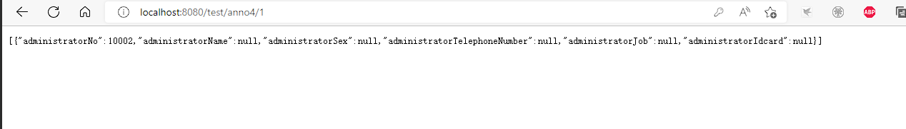


访问http://localhost:8080/test/anno4/2


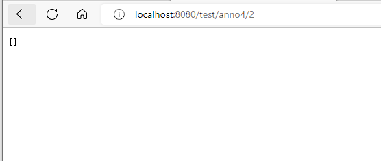


访问http://localhost:8080/test/anno4/3


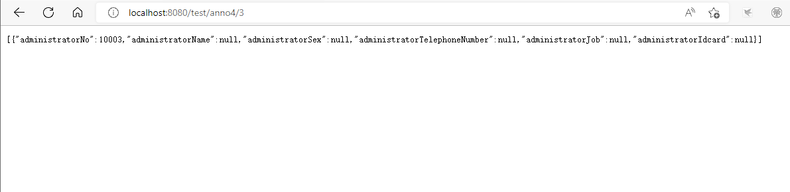


访问http://localhost:8080/test/anno4/4


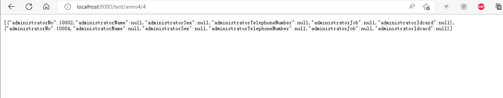


访问http://localhost:8080/test/anno4/5


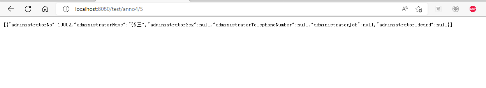


访问http://localhost:8080/test/anno4/6


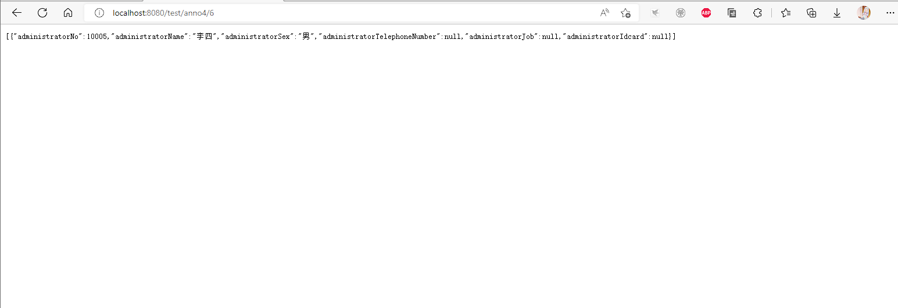


访问http://localhost:8080/test/anno4/7


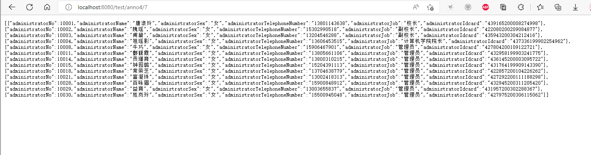


```json
[{"administratorNo":10001,"administratorName":"唐淑玲","administratorSex":"女","administratorTelephoneNumber":"13801143638","administratorJob":"校长","administratorIdcard":"439165200008274998"},{"administratorNo":10002,"administratorName":"隗瑶","administratorSex":"女","administratorTelephoneNumber":"15302990518","administratorJob":"副校长","administratorIdcard":"422080200209084877"},{"administratorNo":10003,"administratorName":"甫黛","administratorSex":"女","administratorTelephoneNumber":"13204546288","administratorJob":"副校长","administratorIdcard":"435943200304212416"},{"administratorNo":10004,"administratorName":"祖瑶影","administratorSex":"女","administratorTelephoneNumber":"13606453515","administratorJob":"计算机学院院长","administratorIdcard":"437336199902254962"},{"administratorNo":10008,"administratorName":"牛巧","administratorSex":"女","administratorTelephoneNumber":"15906467901","administratorJob":"管理员","administratorIdcard":"427804200109122721"},{"administratorNo":10011,"administratorName":"酆馥霞","administratorSex":"女","administratorTelephoneNumber":"13805661106","administratorJob":"管理员","administratorIdcard":"432958199903241775"},{"administratorNo":10014,"administratorName":"贡瑾育","administratorSex":"女","administratorTelephoneNumber":"13800310215","administratorJob":"管理员","administratorIdcard":"436145200003095722"},{"administratorNo":10015,"administratorName":"钟园璐","administratorSex":"女","administratorTelephoneNumber":"15204391113","administratorJob":"管理员","administratorIdcard":"431764199909143390"},{"administratorNo":10018,"administratorName":"常荣芝","administratorSex":"女","administratorTelephoneNumber":"13704638779","administratorJob":"管理员","administratorIdcard":"422857200104226262"},{"administratorNo":10021,"administratorName":"富凝珠","administratorSex":"女","administratorTelephoneNumber":"13002418313","administratorJob":"管理员","administratorIdcard":"427292200111188298"},{"administratorNo":10028,"administratorName":"百咏眉","administratorSex":"女","administratorTelephoneNumber":"15900848912","administratorJob":"管理员","administratorIdcard":"432945200311205420"},{"administratorNo":10029,"administratorName":"益育","administratorSex":"女","administratorTelephoneNumber":"13003655837","administratorJob":"管理员","administratorIdcard":"431957200302288367"},{"administratorNo":10030,"administratorName":"姓岚玲","administratorSex":"女","administratorTelephoneNumber":"15500945048","administratorJob":"管理员","administratorIdcard":"427975200306115062"}]
```


访问http://localhost:8080/test/anno4/8


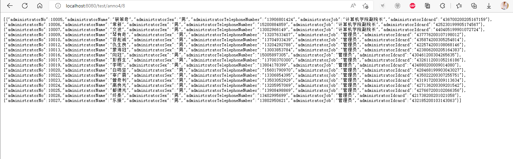


```json
[{"administratorNo":10005,"administratorName":"裴策奇","administratorSex":"男","administratorTelephoneNumber":"13906801424","administratorJob":"计算机学院副院长","administratorIdcard":"436700200205167159"},{"administratorNo":10006,"administratorName":"常新","administratorSex":"男","administratorTelephoneNumber":"15200884859","administratorJob":"计算机学院副院长","administratorIdcard":"425230199905174567"},{"administratorNo":10007,"administratorName":"文波","administratorSex":"男","administratorTelephoneNumber":"13002966149","administratorJob":"计算机学院副院长","administratorIdcard":"440405199901072724"},{"administratorNo":10009,"administratorName":"琴有奇","administratorSex":"男","administratorTelephoneNumber":"13207633407","administratorJob":"管理员","administratorIdcard":"437776200107198012"},{"administratorNo":10010,"administratorName":"容彪诚","administratorSex":"男","administratorTelephoneNumber":"13704933439","administratorJob":"管理员","administratorIdcard":"435874200305254814"},{"administratorNo":10012,"administratorName":"仇生良","administratorSex":"男","administratorTelephoneNumber":"13204292788","administratorJob":"管理员","administratorIdcard":"422574200108068146"},{"administratorNo":10013,"administratorName":"蒙海冠","administratorSex":"男","administratorTelephoneNumber":"13003853784","administratorJob":"管理员","administratorIdcard":"423806200205164383"},{"administratorNo":10016,"administratorName":"向冠","administratorSex":"男","administratorTelephoneNumber":"15005897305","administratorJob":"管理员","administratorIdcard":"430461200304265635"},{"administratorNo":10017,"administratorName":"彭辉生","administratorSex":"男","administratorTelephoneNumber":"13700370300","administratorJob":"管理员","administratorIdcard":"432611200105216186"},{"administratorNo":10019,"administratorName":"李明","administratorSex":"男","administratorTelephoneNumber":"13804178399","administratorJob":"管理员","administratorIdcard":"434880200009014080"},{"administratorNo":10020,"administratorName":"白鸣坚","administratorSex":"男","administratorTelephoneNumber":"15601790970","administratorJob":"管理员","administratorIdcard":"428468199903043027"},{"administratorNo":10022,"administratorName":"宰广震","administratorSex":"男","administratorTelephoneNumber":"13306854395","administratorJob":"管理员","administratorIdcard":"435022200307255751"},{"administratorNo":10023,"administratorName":"曾奇利","administratorSex":"男","administratorTelephoneNumber":"13503052929","administratorJob":"管理员","administratorIdcard":"431917200309113634"},{"administratorNo":10024,"administratorName":"离良光","administratorSex":"男","administratorTelephoneNumber":"13205957069","administratorJob":"管理员","administratorIdcard":"427136200309201542"},{"administratorNo":10025,"administratorName":"都德光","administratorSex":"男","administratorTelephoneNumber":"13908498869","administratorJob":"管理员","administratorIdcard":"427667200102066356"},{"administratorNo":10026,"administratorName":"终泰","administratorSex":"男","administratorTelephoneNumber":"13402995699","administratorJob":"管理员","administratorIdcard":"421738200201021058"},{"administratorNo":10027,"administratorName":"乐振","administratorSex":"男","administratorTelephoneNumber":"13802950621","administratorJob":"管理员","administratorIdcard":"432185200103143063"}]
```


### 查看日志


```sh
2022-08-02 23:10:59.357  INFO 18460 --- [           main] o.s.b.w.embedded.tomcat.TomcatWebServer  : Tomcat started on port(s): 8080 (http) with context path ''
2022-08-02 23:10:59.371  INFO 18460 --- [           main] m.s.SpringSecurityDemoApplication        : Started SpringSecurityDemoApplication in 2.248 seconds (JVM running for 2.746)
2022-08-02 23:10:59.543  INFO 18460 --- [nio-8080-exec-1] o.a.c.c.C.[Tomcat].[localhost].[/]       : Initializing Spring DispatcherServlet 'dispatcherServlet'
2022-08-02 23:10:59.543  INFO 18460 --- [nio-8080-exec-1] o.s.web.servlet.DispatcherServlet        : Initializing Servlet 'dispatcherServlet'
2022-08-02 23:10:59.544  INFO 18460 --- [nio-8080-exec-1] o.s.web.servlet.DispatcherServlet        : Completed initialization in 0 ms
2022-08-02 23:11:06.937 DEBUG 18460 --- [nio-8080-exec-5] m.s.service.AdministratorsLoginService   : 进入AdministratorsLoginService
2022-08-02 23:11:07.183 DEBUG 18460 --- [nio-8080-exec-5] m.s.m.A.selectList                       : ==>  Preparing: SELECT administrator_no,administrator_password FROM administrators_password WHERE (administrator_no = ?)
2022-08-02 23:11:07.200 DEBUG 18460 --- [nio-8080-exec-5] m.s.m.A.selectList                       : ==> Parameters: 10001(Long)
2022-08-02 23:11:07.216 DEBUG 18460 --- [nio-8080-exec-5] m.s.m.A.selectList                       : <==      Total: 1
2022-08-02 23:11:07.240  INFO 18460 --- [nio-8080-exec-6] m.s.controller.TestAnnotationController  : 执行/anno4/1
2022-08-02 23:11:33.067  INFO 18460 --- [nio-8080-exec-7] m.s.controller.TestAnnotationController  : 执行/anno4/2
2022-08-02 23:11:46.867  INFO 18460 --- [nio-8080-exec-8] m.s.controller.TestAnnotationController  : 执行/anno4/3
2022-08-02 23:12:03.320  INFO 18460 --- [nio-8080-exec-1] m.s.controller.TestAnnotationController  : 执行/anno4/4
2022-08-02 23:12:28.642  INFO 18460 --- [nio-8080-exec-2] m.s.controller.TestAnnotationController  : 执行/anno4/5
2022-08-02 23:12:44.683  INFO 18460 --- [nio-8080-exec-3] m.s.controller.TestAnnotationController  : 执行/anno4/6
2022-08-02 23:13:05.323  INFO 18460 --- [nio-8080-exec-5] m.s.controller.TestAnnotationController  : 执行/anno4/7
2022-08-02 23:13:05.335  WARN 18460 --- [nio-8080-exec-5] c.a.druid.pool.DruidAbstractDataSource   : discard long time none received connection. , jdbcUrl : jdbc:mysql://localhost:3306/student1, version : 1.2.8, lastPacketReceivedIdleMillis : 118122
2022-08-02 23:13:05.356 DEBUG 18460 --- [nio-8080-exec-5] m.s.m.AdministratorsMapper.selectList    : ==>  Preparing: SELECT administrator_no,administrator_name,administrator_sex,administrator_telephone_number,administrator_job,administrator_idcard FROM administrators
2022-08-02 23:13:05.357 DEBUG 18460 --- [nio-8080-exec-5] m.s.m.AdministratorsMapper.selectList    : ==> Parameters: 
2022-08-02 23:13:05.363 DEBUG 18460 --- [nio-8080-exec-5] m.s.m.AdministratorsMapper.selectList    : <==      Total: 30
2022-08-02 23:13:46.580  INFO 18460 --- [nio-8080-exec-6] m.s.controller.TestAnnotationController  : 执行/anno4/8
2022-08-02 23:13:46.580 DEBUG 18460 --- [nio-8080-exec-6] m.s.m.AdministratorsMapper.selectList    : ==>  Preparing: SELECT administrator_no,administrator_name,administrator_sex,administrator_telephone_number,administrator_job,administrator_idcard FROM administrators
2022-08-02 23:13:46.581 DEBUG 18460 --- [nio-8080-exec-6] m.s.m.AdministratorsMapper.selectList    : ==> Parameters: 
2022-08-02 23:13:46.585 DEBUG 18460 --- [nio-8080-exec-6] m.s.m.AdministratorsMapper.selectList    : <==      Total: 30
```


##  @PreFilter


用于进入控制器之前对数据进行过滤


### 更改controller

```java
package mao.springsecurity_demo.controller;

import mao.springsecurity_demo.entity.Administrators;
import mao.springsecurity_demo.service.IAdministratorsService;
import org.slf4j.Logger;
import org.slf4j.LoggerFactory;
import org.springframework.beans.factory.annotation.Autowired;
import org.springframework.security.access.annotation.Secured;
import org.springframework.security.access.prepost.PostAuthorize;
import org.springframework.security.access.prepost.PostFilter;
import org.springframework.security.access.prepost.PreAuthorize;
import org.springframework.security.access.prepost.PreFilter;
import org.springframework.web.bind.annotation.*;

import java.util.ArrayList;
import java.util.List;


/**
 * Project name(项目名称)：springSecurity_demo
 * Package(包名): mao.springsecurity_demo.controller
 * Class(类名): TestAnnotationController
 * Author(作者）: mao
 * Author QQ：1296193245
 * GitHub：https://github.com/maomao124/
 * Date(创建日期)： 2022/8/2
 * Time(创建时间)： 13:55
 * Version(版本): 1.0
 * Description(描述)： 无
 */


@RestController
@RequestMapping("/test")
public class TestAnnotationController
{

    private static final Logger log = LoggerFactory.getLogger(TestAnnotationController.class);

    /**
     * Role root string.
     *
     * @return the string
     */
    @Secured({"ROLE_root"})
    @GetMapping("/anno/root")
    public String role_root()
    {
        return "注解测试，当前需要root角色，访问成功";
    }

    /**
     * Role root 1 string.
     *
     * @return the string
     */
    @Secured({"ROLE_root1"})
    @GetMapping("/anno/root1")
    public String role_root1()
    {
        return "注解测试，当前需要root1角色，访问成功";
    }

    /**
     * Role admin string.
     *
     * @return the string
     */
    @Secured({"ROLE_admin"})
    @GetMapping("/anno/admin")
    public String role_admin()
    {
        return "注解测试，当前需要admin角色，访问成功";
    }

    /**
     * Role admin 1 string.
     *
     * @return the string
     */
    @Secured({"ROLE_admin1"})
    @GetMapping("/anno/admin1")
    public String role_admin1()
    {
        return "注解测试，当前需要admin角色，访问成功";
    }

    /**
     * Role admin or root string.
     *
     * @return the string
     */
    @Secured({"ROLE_admin", "ROLE_root"})
    @GetMapping("/anno/admin_or_root")
    public String role_admin_or_root()
    {
        return "注解测试，当前需要admin或者root角色，访问成功";
    }

    /**
     * Role admin or root 1 string.
     *
     * @return the string
     */
    @Secured({"ROLE_admin", "ROLE_root1"})
    @GetMapping("/anno/admin_or_root1")
    public String role_admin_or_root1()
    {
        return "注解测试，当前需要admin或者root1角色，访问成功";
    }

    /**
     * Role admin 1 or root 1 string.
     *
     * @return the string
     */
    @Secured({"ROLE_admin1", "ROLE_root1"})
    @GetMapping("/anno/admin1_or_root1")
    public String role_admin1_or_root1()
    {
        return "注解测试，当前需要admin1或者root1角色，访问成功";
    }

    //--------------------------------------------

    /**
     * Authority root string.
     *
     * @return the string
     */
    @PreAuthorize("hasAnyAuthority('root')")
    @GetMapping("/anno2/root")
    public String authority_root()
    {
        return "注解测试，当前需要root权限，访问成功";
    }

    /**
     * Authority root 1 string.
     *
     * @return the string
     */
    @PreAuthorize("hasAnyAuthority('root1')")
    @GetMapping("/anno2/root1")
    public String authority_root1()
    {
        return "注解测试，当前需要root1权限，访问成功";
    }

    /**
     * Authority admin string.
     *
     * @return the string
     */
    @PreAuthorize("hasAnyAuthority('admin')")
    @GetMapping("/anno2/admin")
    public String authority_admin()
    {
        return "注解测试，当前需要admin权限，访问成功";
    }

    /**
     * Authority admin 1 string.
     *
     * @return the string
     */
    @PreAuthorize("hasAnyAuthority('admin1')")
    @GetMapping("/anno2/admin1")
    public String authority_admin1()
    {
        return "注解测试，当前需要admin1权限，访问成功";
    }

    /**
     * Authority admin or root string.
     *
     * @return the string
     */
    @PreAuthorize("hasAnyAuthority('admin','root')")
    @GetMapping("/anno2/admin_or_root")
    public String authority_admin_or_root()
    {
        return "注解测试，当前需要admin或者root权限，访问成功";
    }


    /**
     * Authority admin or root 1 string.
     *
     * @return the string
     */
    @PreAuthorize("hasAnyAuthority('admin','root1')")
    @GetMapping("/anno2/admin_or_root1")
    public String authority_admin_or_root1()
    {
        return "注解测试，当前需要admin或者root1权限，访问成功";
    }

    /**
     * Authority admin 1 or root string.
     *
     * @return the string
     */
    @PreAuthorize("hasAnyAuthority('admin1','root')")
    @GetMapping("/anno2/admin1_or_root")
    public String authority_admin1_or_root()
    {
        return "注解测试，当前需要admin1或者root权限，访问成功";
    }

    /**
     * Authority admin 1 or root 1 string.
     *
     * @return the string
     */
    @PreAuthorize("hasAnyAuthority('admin1','root1')")
    @GetMapping("/anno2/admin1_or_root1")
    public String authority_admin1_or_root1()
    {
        return "注解测试，当前需要admin1或者root1权限，访问成功";
    }


    //----------------------------------------

    /**
     * Authority 2 root string.
     *
     * @return the string
     */
    @PostAuthorize("hasAnyAuthority('root')")
    @GetMapping("/anno3/root")
    public String authority2_root()
    {
        log.info("PostAuthorize注解测试，当前需要root权限");
        return "PostAuthorize注解测试，当前需要root权限，访问成功";
    }

    /**
     * Authority 2 root 1 string.
     *
     * @return the string
     */
    @PostAuthorize("hasAnyAuthority('root1')")
    @GetMapping("/anno3/root1")
    public String authority2_root1()
    {
        log.info("PostAuthorize注解测试，当前需要root1权限");
        return "PostAuthorize注解测试，当前需要root1权限，访问成功";
    }

    /**
     * Authority 2 admin string.
     *
     * @return the string
     */
    @PostAuthorize("hasAnyAuthority('admin')")
    @GetMapping("/anno3/admin")
    public String authority2_admin()
    {
        log.info("PostAuthorize注解测试，当前需要admin权限");
        return "PostAuthorize注解测试，当前需要admin权限，访问成功";
    }

    /**
     * Authority 2 admin 1 string.
     *
     * @return the string
     */
    @PostAuthorize("hasAnyAuthority('admin1')")
    @GetMapping("/anno3/admin1")
    public String authority2_admin1()
    {
        log.info("PostAuthorize注解测试，当前需要admin1权限");
        return "PostAuthorize注解测试，当前需要admin1权限，访问成功";
    }

    //-------------------------------------

    /**
     * Anno 4 1 list.
     *
     * @return the list
     */
    @PostFilter("filterObject.administratorNo==10002L")
    @GetMapping("/anno4/1")
    public List<Administrators> anno4_1()
    {
        log.info("执行/anno4/1");
        List<Administrators> list = new ArrayList<>();
        Administrators administrators = new Administrators();
        administrators.setAdministratorNo(10002L);
        list.add(administrators);
        return list;
    }

    /**
     * Anno 4 2 list.
     *
     * @return the list
     */
    @PostFilter("filterObject.administratorNo==10003L")
    @GetMapping("/anno4/2")
    public List<Administrators> anno4_2()
    {
        log.info("执行/anno4/2");
        List<Administrators> list = new ArrayList<>();
        Administrators administrators = new Administrators();
        administrators.setAdministratorNo(10002L);
        list.add(administrators);
        return list;
    }

    /**
     * Anno 4 3 list.
     *
     * @return the list
     */
    @PostFilter("filterObject.administratorNo==10003L")
    @GetMapping("/anno4/3")
    public List<Administrators> anno4_3()
    {
        log.info("执行/anno4/3");
        List<Administrators> list = new ArrayList<>();
        Administrators administrators1 = new Administrators();
        administrators1.setAdministratorNo(10002L);
        Administrators administrators2 = new Administrators();
        administrators2.setAdministratorNo(10003L);
        Administrators administrators3 = new Administrators();
        administrators3.setAdministratorNo(10004L);
        list.add(administrators1);
        list.add(administrators2);
        list.add(administrators3);
        return list;
    }

    /**
     * Anno 4 4 list.
     *
     * @return the list
     */
    @PostFilter("filterObject.administratorNo!=10003L")
    @GetMapping("/anno4/4")
    public List<Administrators> anno4_4()
    {
        log.info("执行/anno4/4");
        List<Administrators> list = new ArrayList<>();
        Administrators administrators1 = new Administrators();
        administrators1.setAdministratorNo(10002L);
        Administrators administrators2 = new Administrators();
        administrators2.setAdministratorNo(10003L);
        Administrators administrators3 = new Administrators();
        administrators3.setAdministratorNo(10004L);
        list.add(administrators1);
        list.add(administrators2);
        list.add(administrators3);
        return list;
    }

    /**
     * Anno 4 5 list.
     *
     * @return the list
     */
    @PostFilter("filterObject.administratorName!=null")
    @GetMapping("/anno4/5")
    public List<Administrators> anno4_5()
    {
        log.info("执行/anno4/5");
        List<Administrators> list = new ArrayList<>();
        Administrators administrators1 = new Administrators();
        administrators1.setAdministratorNo(10002L);
        administrators1.setAdministratorName("张三");
        Administrators administrators2 = new Administrators();
        administrators2.setAdministratorNo(10003L);
        Administrators administrators3 = new Administrators();
        administrators3.setAdministratorNo(10004L);
        list.add(administrators1);
        list.add(administrators2);
        list.add(administrators3);
        return list;
    }

    /**
     * Anno 4 6 list.
     *
     * @return the list
     */
    @PostFilter("(filterObject.administratorName!=null)&&(filterObject.administratorSex.equals('男'))")
    @GetMapping("/anno4/6")
    public List<Administrators> anno4_6()
    {
        log.info("执行/anno4/6");
        List<Administrators> list = new ArrayList<>();
        Administrators administrators1 = new Administrators();
        administrators1.setAdministratorNo(10002L);
        administrators1.setAdministratorName("张三");
        administrators1.setAdministratorSex("女");
        Administrators administrators2 = new Administrators();
        administrators2.setAdministratorNo(10003L);
        Administrators administrators3 = new Administrators();
        administrators3.setAdministratorNo(10004L);
        Administrators administrators4 = new Administrators();
        administrators4.setAdministratorNo(10005L);
        administrators4.setAdministratorName("李四");
        administrators4.setAdministratorSex("男");
        list.add(administrators1);
        list.add(administrators2);
        list.add(administrators3);
        list.add(administrators4);
        return list;
    }

    @Autowired
    private IAdministratorsService administratorsService;

    /**
     * 需求：从数据库查询性别为女的数据
     *
     * @return List<Administrators> 对象
     */
    @PostFilter("filterObject.administratorSex.equals('女')")
    @GetMapping("/anno4/7")
    public List<Administrators> anno4_7()
    {
        log.info("执行/anno4/7");
        List<Administrators> list = administratorsService.query().list();
        return list;
    }

    /**
     * 需求：从数据库查询性别为女的数据
     *
     * @return List<Administrators> 对象
     */
    @PostFilter("filterObject.administratorSex.equals('男')")
    @GetMapping("/anno4/8")
    public List<Administrators> anno4_8()
    {
        log.info("执行/anno4/8");
        List<Administrators> list = administratorsService.query().list();
        return list;
    }

    
    //---------------------------------------------
    
    /**
     * 查询全部
     *
     * @return List<Administrators>
     */
    @GetMapping("/anno5/0")
    public List<Administrators> anno5_0()
    {
        log.info("执行/anno5/0");
        List<Administrators> list = administratorsService.query().list();
        return list;
    }

    /**
     * 只需要性别为男的数据
     *
     * @param list List<Administrators>
     * @return List<Administrators> 结果
     */
    @PreFilter("filterObject.administratorSex.equals('男')")
    @PostMapping("/anno5/1")
    public List<Administrators> anno5_1(@RequestBody List<Administrators> list)
    {
        log.info("执行/anno5/1");
        for (Administrators administrators : list)
        {
            log.debug("\n" + administrators + "\n");
        }
        return list;
    }

    /**
     * 只需要性别为女的数据
     *
     * @param list List<Administrators>
     * @return List<Administrators> 结果
     */
    @PreFilter("filterObject.administratorSex.equals('女')")
    @PostMapping("/anno5/2")
    public List<Administrators> anno5_2(@RequestBody List<Administrators> list)
    {
        log.info("执行/anno5/2");
        for (Administrators administrators : list)
        {
            log.debug("\n" + administrators + "\n");
        }
        return list;
    }

    /**
     * 只需要名字包含‘唐’字的数据
     *
     * @param list List<Administrators>
     * @return List<Administrators> 结果
     */
    @PreFilter("filterObject.administratorName.contains('唐')")
    @PostMapping("/anno5/3")
    public List<Administrators> anno5_3(@RequestBody List<Administrators> list)
    {
        log.info("执行/anno5/3");
        for (Administrators administrators : list)
        {
            log.debug("\n" + administrators + "\n");
        }
        return list;
    }

}

```


### 更改SecurityConfig


```java
package mao.springsecurity_demo.config;

import org.springframework.context.annotation.Bean;
import org.springframework.context.annotation.Configuration;
import org.springframework.security.config.annotation.web.builders.HttpSecurity;
import org.springframework.security.config.annotation.web.configuration.WebSecurityConfigurerAdapter;
import org.springframework.security.crypto.bcrypt.BCryptPasswordEncoder;
import org.springframework.security.crypto.password.PasswordEncoder;

/**
 * Project name(项目名称)：springSecurity_demo
 * Package(包名): mao.springsecurity_demo.config
 * Class(类名): SecurityConfig
 * Author(作者）: mao
 * Author QQ：1296193245
 * GitHub：https://github.com/maomao124/
 * Date(创建日期)： 2022/7/30
 * Time(创建时间)： 20:30
 * Version(版本): 1.0
 * Description(描述)： 无
 */

@Configuration
public class SecurityConfig extends WebSecurityConfigurerAdapter
{
    @Override
    protected void configure(HttpSecurity http) throws Exception
    {
        //表单登录配置
        http.formLogin()
                //设置登录页面
                .loginPage("/login.html")
                //设置哪个是登录的 url
                .loginProcessingUrl("/login")
                //设置登录成功之后跳转到哪个 url
                .defaultSuccessUrl("/index.html", false)
                //.successForwardUrl("/index")
                //设置登录失败之后跳转到哪个url
                .failureUrl("/error.html")
                //.failureForwardUrl("fail")
                //设置表单的用户名项参数名称
                .usernameParameter("username")
                //设置表单的密码项参数名称
                .passwordParameter("password");

        //关闭csrf
        http.csrf().disable();

        //异常处理配置，403页面配置
        http.exceptionHandling().accessDeniedPage("/unAuth.html");

        //退出登录配置
        http.logout()
                //设置退出登录的url
                .logoutUrl("/logout")
                //设置退出登录成功后要跳转的url
                .logoutSuccessUrl("/thanks.html")
                .permitAll();

        //认证配置
        http.authorizeRequests()
                //指定页面不需要验证
                .antMatchers("/login.html", "/login", "/error.html", "/thanks.html",
                        "/css/**", "/js/**", "/img/**",
                        "/test/noauth", "/test/anno5/**")
                .permitAll()
                .antMatchers("/test/root").hasAuthority("root")
                .antMatchers("/test/admin").hasAuthority("admin")
                .antMatchers("/test/rootOrAdmin").hasAnyAuthority("root", "admin")
                .antMatchers("/test/role_root").hasRole("root")
                .antMatchers("/test/role_root_or_admin").hasAnyRole("root", "admin")
                //其它请求都需要身份认证
                .anyRequest()
                .authenticated();

    }


/*
    @Bean
    public PasswordEncoder passwordEncoder()
    {
        return new BCryptPasswordEncoder();
    }
*/

}
```


### 重启服务


### 访问

使用postman测试


请求体数据：

```json
[
    {
        "administratorNo": 10001,
        "administratorName": "唐淑玲",
        "administratorSex": "女",
        "administratorTelephoneNumber": "13801143638",
        "administratorJob": "校长",
        "administratorIdcard": "439165200008274998"
    },
    {
        "administratorNo": 10002,
        "administratorName": "隗瑶",
        "administratorSex": "女",
        "administratorTelephoneNumber": "15302990518",
        "administratorJob": "副校长",
        "administratorIdcard": "422080200209084877"
    },
    {
        "administratorNo": 10003,
        "administratorName": "甫黛",
        "administratorSex": "女",
        "administratorTelephoneNumber": "13204546288",
        "administratorJob": "副校长",
        "administratorIdcard": "435943200304212416"
    },
    {
        "administratorNo": 10004,
        "administratorName": "祖瑶影",
        "administratorSex": "女",
        "administratorTelephoneNumber": "13606453515",
        "administratorJob": "计算机学院院长",
        "administratorIdcard": "437336199902254962"
    },
    {
        "administratorNo": 10005,
        "administratorName": "裴策奇",
        "administratorSex": "男",
        "administratorTelephoneNumber": "13906801424",
        "administratorJob": "计算机学院副院长",
        "administratorIdcard": "436700200205167159"
    },
    {
        "administratorNo": 10006,
        "administratorName": "常新",
        "administratorSex": "男",
        "administratorTelephoneNumber": "15200884859",
        "administratorJob": "计算机学院副院长",
        "administratorIdcard": "425230199905174567"
    },
    {
        "administratorNo": 10007,
        "administratorName": "文波",
        "administratorSex": "男",
        "administratorTelephoneNumber": "13002966149",
        "administratorJob": "计算机学院副院长",
        "administratorIdcard": "440405199901072724"
    },
    {
        "administratorNo": 10008,
        "administratorName": "牛巧",
        "administratorSex": "女",
        "administratorTelephoneNumber": "15906467901",
        "administratorJob": "管理员",
        "administratorIdcard": "427804200109122721"
    },
    {
        "administratorNo": 10009,
        "administratorName": "琴有奇",
        "administratorSex": "男",
        "administratorTelephoneNumber": "13207633407",
        "administratorJob": "管理员",
        "administratorIdcard": "437776200107198012"
    },
    {
        "administratorNo": 10010,
        "administratorName": "容彪诚",
        "administratorSex": "男",
        "administratorTelephoneNumber": "13704933439",
        "administratorJob": "管理员",
        "administratorIdcard": "435874200305254814"
    },
    {
        "administratorNo": 10011,
        "administratorName": "酆馥霞",
        "administratorSex": "女",
        "administratorTelephoneNumber": "13805661106",
        "administratorJob": "管理员",
        "administratorIdcard": "432958199903241775"
    },
    {
        "administratorNo": 10012,
        "administratorName": "仇生良",
        "administratorSex": "男",
        "administratorTelephoneNumber": "13204292788",
        "administratorJob": "管理员",
        "administratorIdcard": "422574200108068146"
    },
    {
        "administratorNo": 10013,
        "administratorName": "蒙海冠",
        "administratorSex": "男",
        "administratorTelephoneNumber": "13003853784",
        "administratorJob": "管理员",
        "administratorIdcard": "423806200205164383"
    },
    {
        "administratorNo": 10014,
        "administratorName": "贡瑾育",
        "administratorSex": "女",
        "administratorTelephoneNumber": "13800310215",
        "administratorJob": "管理员",
        "administratorIdcard": "436145200003095722"
    },
    {
        "administratorNo": 10015,
        "administratorName": "钟园璐",
        "administratorSex": "女",
        "administratorTelephoneNumber": "15204391113",
        "administratorJob": "管理员",
        "administratorIdcard": "431764199909143390"
    },
    {
        "administratorNo": 10016,
        "administratorName": "向冠",
        "administratorSex": "男",
        "administratorTelephoneNumber": "15005897305",
        "administratorJob": "管理员",
        "administratorIdcard": "430461200304265635"
    },
    {
        "administratorNo": 10017,
        "administratorName": "彭辉生",
        "administratorSex": "男",
        "administratorTelephoneNumber": "13700370300",
        "administratorJob": "管理员",
        "administratorIdcard": "432611200105216186"
    },
    {
        "administratorNo": 10018,
        "administratorName": "常荣芝",
        "administratorSex": "女",
        "administratorTelephoneNumber": "13704638779",
        "administratorJob": "管理员",
        "administratorIdcard": "422857200104226262"
    },
    {
        "administratorNo": 10019,
        "administratorName": "李明",
        "administratorSex": "男",
        "administratorTelephoneNumber": "13804178399",
        "administratorJob": "管理员",
        "administratorIdcard": "434880200009014080"
    },
    {
        "administratorNo": 10020,
        "administratorName": "白鸣坚",
        "administratorSex": "男",
        "administratorTelephoneNumber": "15601790970",
        "administratorJob": "管理员",
        "administratorIdcard": "428468199903043027"
    },
    {
        "administratorNo": 10021,
        "administratorName": "富凝珠",
        "administratorSex": "女",
        "administratorTelephoneNumber": "13002418313",
        "administratorJob": "管理员",
        "administratorIdcard": "427292200111188298"
    },
    {
        "administratorNo": 10022,
        "administratorName": "宰广震",
        "administratorSex": "男",
        "administratorTelephoneNumber": "13306854395",
        "administratorJob": "管理员",
        "administratorIdcard": "435022200307255751"
    },
    {
        "administratorNo": 10023,
        "administratorName": "曾奇利",
        "administratorSex": "男",
        "administratorTelephoneNumber": "13503052929",
        "administratorJob": "管理员",
        "administratorIdcard": "431917200309113634"
    },
    {
        "administratorNo": 10024,
        "administratorName": "离良光",
        "administratorSex": "男",
        "administratorTelephoneNumber": "13205957069",
        "administratorJob": "管理员",
        "administratorIdcard": "427136200309201542"
    },
    {
        "administratorNo": 10025,
        "administratorName": "都德光",
        "administratorSex": "男",
        "administratorTelephoneNumber": "13908498869",
        "administratorJob": "管理员",
        "administratorIdcard": "427667200102066356"
    },
    {
        "administratorNo": 10026,
        "administratorName": "终泰",
        "administratorSex": "男",
        "administratorTelephoneNumber": "13402995699",
        "administratorJob": "管理员",
        "administratorIdcard": "421738200201021058"
    },
    {
        "administratorNo": 10027,
        "administratorName": "乐振",
        "administratorSex": "男",
        "administratorTelephoneNumber": "13802950621",
        "administratorJob": "管理员",
        "administratorIdcard": "432185200103143063"
    },
    {
        "administratorNo": 10028,
        "administratorName": "百咏眉",
        "administratorSex": "女",
        "administratorTelephoneNumber": "15900848912",
        "administratorJob": "管理员",
        "administratorIdcard": "432945200311205420"
    },
    {
        "administratorNo": 10029,
        "administratorName": "益育",
        "administratorSex": "女",
        "administratorTelephoneNumber": "13003655837",
        "administratorJob": "管理员",
        "administratorIdcard": "431957200302288367"
    },
    {
        "administratorNo": 10030,
        "administratorName": "姓岚玲",
        "administratorSex": "女",
        "administratorTelephoneNumber": "15500945048",
        "administratorJob": "管理员",
        "administratorIdcard": "427975200306115062"
    }
]
```


访问http://localhost:8080/test/anno5/1

post请求


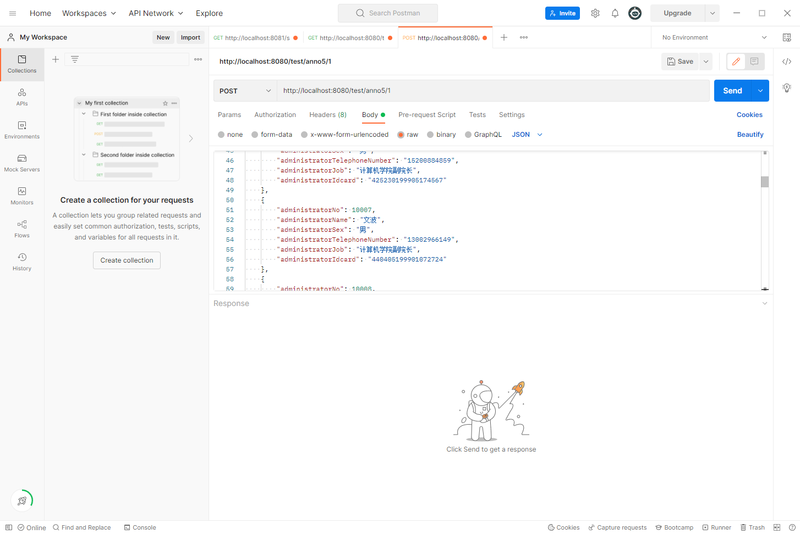


查看结果


```json
[
    {
        "administratorNo": 10005,
        "administratorName": "裴策奇",
        "administratorSex": "男",
        "administratorTelephoneNumber": "13906801424",
        "administratorJob": "计算机学院副院长",
        "administratorIdcard": "436700200205167159"
    },
    {
        "administratorNo": 10006,
        "administratorName": "常新",
        "administratorSex": "男",
        "administratorTelephoneNumber": "15200884859",
        "administratorJob": "计算机学院副院长",
        "administratorIdcard": "425230199905174567"
    },
    {
        "administratorNo": 10007,
        "administratorName": "文波",
        "administratorSex": "男",
        "administratorTelephoneNumber": "13002966149",
        "administratorJob": "计算机学院副院长",
        "administratorIdcard": "440405199901072724"
    },
    {
        "administratorNo": 10009,
        "administratorName": "琴有奇",
        "administratorSex": "男",
        "administratorTelephoneNumber": "13207633407",
        "administratorJob": "管理员",
        "administratorIdcard": "437776200107198012"
    },
    {
        "administratorNo": 10010,
        "administratorName": "容彪诚",
        "administratorSex": "男",
        "administratorTelephoneNumber": "13704933439",
        "administratorJob": "管理员",
        "administratorIdcard": "435874200305254814"
    },
    {
        "administratorNo": 10012,
        "administratorName": "仇生良",
        "administratorSex": "男",
        "administratorTelephoneNumber": "13204292788",
        "administratorJob": "管理员",
        "administratorIdcard": "422574200108068146"
    },
    {
        "administratorNo": 10013,
        "administratorName": "蒙海冠",
        "administratorSex": "男",
        "administratorTelephoneNumber": "13003853784",
        "administratorJob": "管理员",
        "administratorIdcard": "423806200205164383"
    },
    {
        "administratorNo": 10016,
        "administratorName": "向冠",
        "administratorSex": "男",
        "administratorTelephoneNumber": "15005897305",
        "administratorJob": "管理员",
        "administratorIdcard": "430461200304265635"
    },
    {
        "administratorNo": 10017,
        "administratorName": "彭辉生",
        "administratorSex": "男",
        "administratorTelephoneNumber": "13700370300",
        "administratorJob": "管理员",
        "administratorIdcard": "432611200105216186"
    },
    {
        "administratorNo": 10019,
        "administratorName": "李明",
        "administratorSex": "男",
        "administratorTelephoneNumber": "13804178399",
        "administratorJob": "管理员",
        "administratorIdcard": "434880200009014080"
    },
    {
        "administratorNo": 10020,
        "administratorName": "白鸣坚",
        "administratorSex": "男",
        "administratorTelephoneNumber": "15601790970",
        "administratorJob": "管理员",
        "administratorIdcard": "428468199903043027"
    },
    {
        "administratorNo": 10022,
        "administratorName": "宰广震",
        "administratorSex": "男",
        "administratorTelephoneNumber": "13306854395",
        "administratorJob": "管理员",
        "administratorIdcard": "435022200307255751"
    },
    {
        "administratorNo": 10023,
        "administratorName": "曾奇利",
        "administratorSex": "男",
        "administratorTelephoneNumber": "13503052929",
        "administratorJob": "管理员",
        "administratorIdcard": "431917200309113634"
    },
    {
        "administratorNo": 10024,
        "administratorName": "离良光",
        "administratorSex": "男",
        "administratorTelephoneNumber": "13205957069",
        "administratorJob": "管理员",
        "administratorIdcard": "427136200309201542"
    },
    {
        "administratorNo": 10025,
        "administratorName": "都德光",
        "administratorSex": "男",
        "administratorTelephoneNumber": "13908498869",
        "administratorJob": "管理员",
        "administratorIdcard": "427667200102066356"
    },
    {
        "administratorNo": 10026,
        "administratorName": "终泰",
        "administratorSex": "男",
        "administratorTelephoneNumber": "13402995699",
        "administratorJob": "管理员",
        "administratorIdcard": "421738200201021058"
    },
    {
        "administratorNo": 10027,
        "administratorName": "乐振",
        "administratorSex": "男",
        "administratorTelephoneNumber": "13802950621",
        "administratorJob": "管理员",
        "administratorIdcard": "432185200103143063"
    }
]
```


查看日志


```sh
2022-08-03 13:21:28.760  INFO 6988 --- [nio-8080-exec-5] m.s.controller.TestAnnotationController  : 执行/anno5/1
2022-08-03 13:21:28.760 DEBUG 6988 --- [nio-8080-exec-5] m.s.controller.TestAnnotationController  : 
administratorNo：10005
administratorName：裴策奇
administratorSex：男
administratorTelephoneNumber：13906801424
administratorJob：计算机学院副院长
administratorIdcard：436700200205167159


2022-08-03 13:21:28.761 DEBUG 6988 --- [nio-8080-exec-5] m.s.controller.TestAnnotationController  : 
administratorNo：10006
administratorName：常新
administratorSex：男
administratorTelephoneNumber：15200884859
administratorJob：计算机学院副院长
administratorIdcard：425230199905174567


2022-08-03 13:21:28.761 DEBUG 6988 --- [nio-8080-exec-5] m.s.controller.TestAnnotationController  : 
administratorNo：10007
administratorName：文波
administratorSex：男
administratorTelephoneNumber：13002966149
administratorJob：计算机学院副院长
administratorIdcard：440405199901072724


2022-08-03 13:21:28.761 DEBUG 6988 --- [nio-8080-exec-5] m.s.controller.TestAnnotationController  : 
administratorNo：10009
administratorName：琴有奇
administratorSex：男
administratorTelephoneNumber：13207633407
administratorJob：管理员
administratorIdcard：437776200107198012


2022-08-03 13:21:28.761 DEBUG 6988 --- [nio-8080-exec-5] m.s.controller.TestAnnotationController  : 
administratorNo：10010
administratorName：容彪诚
administratorSex：男
administratorTelephoneNumber：13704933439
administratorJob：管理员
administratorIdcard：435874200305254814


2022-08-03 13:21:28.761 DEBUG 6988 --- [nio-8080-exec-5] m.s.controller.TestAnnotationController  : 
administratorNo：10012
administratorName：仇生良
administratorSex：男
administratorTelephoneNumber：13204292788
administratorJob：管理员
administratorIdcard：422574200108068146


2022-08-03 13:21:28.761 DEBUG 6988 --- [nio-8080-exec-5] m.s.controller.TestAnnotationController  : 
administratorNo：10013
administratorName：蒙海冠
administratorSex：男
administratorTelephoneNumber：13003853784
administratorJob：管理员
administratorIdcard：423806200205164383


2022-08-03 13:21:28.761 DEBUG 6988 --- [nio-8080-exec-5] m.s.controller.TestAnnotationController  : 
administratorNo：10016
administratorName：向冠
administratorSex：男
administratorTelephoneNumber：15005897305
administratorJob：管理员
administratorIdcard：430461200304265635


2022-08-03 13:21:28.761 DEBUG 6988 --- [nio-8080-exec-5] m.s.controller.TestAnnotationController  : 
administratorNo：10017
administratorName：彭辉生
administratorSex：男
administratorTelephoneNumber：13700370300
administratorJob：管理员
administratorIdcard：432611200105216186


2022-08-03 13:21:28.761 DEBUG 6988 --- [nio-8080-exec-5] m.s.controller.TestAnnotationController  : 
administratorNo：10019
administratorName：李明
administratorSex：男
administratorTelephoneNumber：13804178399
administratorJob：管理员
administratorIdcard：434880200009014080


2022-08-03 13:21:28.762 DEBUG 6988 --- [nio-8080-exec-5] m.s.controller.TestAnnotationController  : 
administratorNo：10020
administratorName：白鸣坚
administratorSex：男
administratorTelephoneNumber：15601790970
administratorJob：管理员
administratorIdcard：428468199903043027


2022-08-03 13:21:28.762 DEBUG 6988 --- [nio-8080-exec-5] m.s.controller.TestAnnotationController  : 
administratorNo：10022
administratorName：宰广震
administratorSex：男
administratorTelephoneNumber：13306854395
administratorJob：管理员
administratorIdcard：435022200307255751


2022-08-03 13:21:28.762 DEBUG 6988 --- [nio-8080-exec-5] m.s.controller.TestAnnotationController  : 
administratorNo：10023
administratorName：曾奇利
administratorSex：男
administratorTelephoneNumber：13503052929
administratorJob：管理员
administratorIdcard：431917200309113634


2022-08-03 13:21:28.762 DEBUG 6988 --- [nio-8080-exec-5] m.s.controller.TestAnnotationController  : 
administratorNo：10024
administratorName：离良光
administratorSex：男
administratorTelephoneNumber：13205957069
administratorJob：管理员
administratorIdcard：427136200309201542


2022-08-03 13:21:28.762 DEBUG 6988 --- [nio-8080-exec-5] m.s.controller.TestAnnotationController  : 
administratorNo：10025
administratorName：都德光
administratorSex：男
administratorTelephoneNumber：13908498869
administratorJob：管理员
administratorIdcard：427667200102066356


2022-08-03 13:21:28.762 DEBUG 6988 --- [nio-8080-exec-5] m.s.controller.TestAnnotationController  : 
administratorNo：10026
administratorName：终泰
administratorSex：男
administratorTelephoneNumber：13402995699
administratorJob：管理员
administratorIdcard：421738200201021058


2022-08-03 13:21:28.762 DEBUG 6988 --- [nio-8080-exec-5] m.s.controller.TestAnnotationController  : 
administratorNo：10027
administratorName：乐振
administratorSex：男
administratorTelephoneNumber：13802950621
administratorJob：管理员
administratorIdcard：432185200103143063
```


访问http://localhost:8080/test/anno5/2

post请求


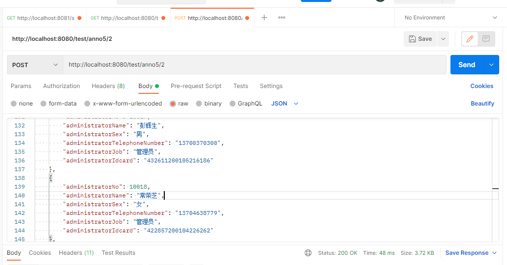


查看结果


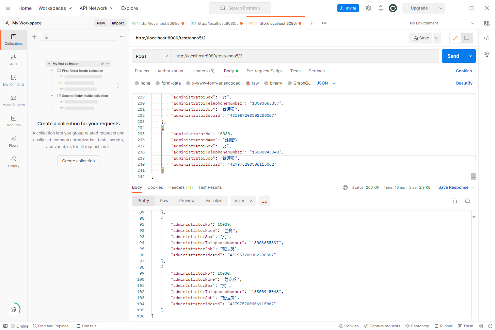


```json
[
    {
        "administratorNo": 10001,
        "administratorName": "唐淑玲",
        "administratorSex": "女",
        "administratorTelephoneNumber": "13801143638",
        "administratorJob": "校长",
        "administratorIdcard": "439165200008274998"
    },
    {
        "administratorNo": 10002,
        "administratorName": "隗瑶",
        "administratorSex": "女",
        "administratorTelephoneNumber": "15302990518",
        "administratorJob": "副校长",
        "administratorIdcard": "422080200209084877"
    },
    {
        "administratorNo": 10003,
        "administratorName": "甫黛",
        "administratorSex": "女",
        "administratorTelephoneNumber": "13204546288",
        "administratorJob": "副校长",
        "administratorIdcard": "435943200304212416"
    },
    {
        "administratorNo": 10004,
        "administratorName": "祖瑶影",
        "administratorSex": "女",
        "administratorTelephoneNumber": "13606453515",
        "administratorJob": "计算机学院院长",
        "administratorIdcard": "437336199902254962"
    },
    {
        "administratorNo": 10008,
        "administratorName": "牛巧",
        "administratorSex": "女",
        "administratorTelephoneNumber": "15906467901",
        "administratorJob": "管理员",
        "administratorIdcard": "427804200109122721"
    },
    {
        "administratorNo": 10011,
        "administratorName": "酆馥霞",
        "administratorSex": "女",
        "administratorTelephoneNumber": "13805661106",
        "administratorJob": "管理员",
        "administratorIdcard": "432958199903241775"
    },
    {
        "administratorNo": 10014,
        "administratorName": "贡瑾育",
        "administratorSex": "女",
        "administratorTelephoneNumber": "13800310215",
        "administratorJob": "管理员",
        "administratorIdcard": "436145200003095722"
    },
    {
        "administratorNo": 10015,
        "administratorName": "钟园璐",
        "administratorSex": "女",
        "administratorTelephoneNumber": "15204391113",
        "administratorJob": "管理员",
        "administratorIdcard": "431764199909143390"
    },
    {
        "administratorNo": 10018,
        "administratorName": "常荣芝",
        "administratorSex": "女",
        "administratorTelephoneNumber": "13704638779",
        "administratorJob": "管理员",
        "administratorIdcard": "422857200104226262"
    },
    {
        "administratorNo": 10021,
        "administratorName": "富凝珠",
        "administratorSex": "女",
        "administratorTelephoneNumber": "13002418313",
        "administratorJob": "管理员",
        "administratorIdcard": "427292200111188298"
    },
    {
        "administratorNo": 10028,
        "administratorName": "百咏眉",
        "administratorSex": "女",
        "administratorTelephoneNumber": "15900848912",
        "administratorJob": "管理员",
        "administratorIdcard": "432945200311205420"
    },
    {
        "administratorNo": 10029,
        "administratorName": "益育",
        "administratorSex": "女",
        "administratorTelephoneNumber": "13003655837",
        "administratorJob": "管理员",
        "administratorIdcard": "431957200302288367"
    },
    {
        "administratorNo": 10030,
        "administratorName": "姓岚玲",
        "administratorSex": "女",
        "administratorTelephoneNumber": "15500945048",
        "administratorJob": "管理员",
        "administratorIdcard": "427975200306115062"
    }
]
```


查看日志

```sh
2022-08-03 13:27:34.328  INFO 6988 --- [nio-8080-exec-8] m.s.controller.TestAnnotationController  : 执行/anno5/2
2022-08-03 13:27:34.329 DEBUG 6988 --- [nio-8080-exec-8] m.s.controller.TestAnnotationController  : 
administratorNo：10001
administratorName：唐淑玲
administratorSex：女
administratorTelephoneNumber：13801143638
administratorJob：校长
administratorIdcard：439165200008274998


2022-08-03 13:27:34.329 DEBUG 6988 --- [nio-8080-exec-8] m.s.controller.TestAnnotationController  : 
administratorNo：10002
administratorName：隗瑶
administratorSex：女
administratorTelephoneNumber：15302990518
administratorJob：副校长
administratorIdcard：422080200209084877


2022-08-03 13:27:34.329 DEBUG 6988 --- [nio-8080-exec-8] m.s.controller.TestAnnotationController  : 
administratorNo：10003
administratorName：甫黛
administratorSex：女
administratorTelephoneNumber：13204546288
administratorJob：副校长
administratorIdcard：435943200304212416


2022-08-03 13:27:34.329 DEBUG 6988 --- [nio-8080-exec-8] m.s.controller.TestAnnotationController  : 
administratorNo：10004
administratorName：祖瑶影
administratorSex：女
administratorTelephoneNumber：13606453515
administratorJob：计算机学院院长
administratorIdcard：437336199902254962


2022-08-03 13:27:34.329 DEBUG 6988 --- [nio-8080-exec-8] m.s.controller.TestAnnotationController  : 
administratorNo：10008
administratorName：牛巧
administratorSex：女
administratorTelephoneNumber：15906467901
administratorJob：管理员
administratorIdcard：427804200109122721


2022-08-03 13:27:34.329 DEBUG 6988 --- [nio-8080-exec-8] m.s.controller.TestAnnotationController  : 
administratorNo：10011
administratorName：酆馥霞
administratorSex：女
administratorTelephoneNumber：13805661106
administratorJob：管理员
administratorIdcard：432958199903241775


2022-08-03 13:27:34.329 DEBUG 6988 --- [nio-8080-exec-8] m.s.controller.TestAnnotationController  : 
administratorNo：10014
administratorName：贡瑾育
administratorSex：女
administratorTelephoneNumber：13800310215
administratorJob：管理员
administratorIdcard：436145200003095722


2022-08-03 13:27:34.329 DEBUG 6988 --- [nio-8080-exec-8] m.s.controller.TestAnnotationController  : 
administratorNo：10015
administratorName：钟园璐
administratorSex：女
administratorTelephoneNumber：15204391113
administratorJob：管理员
administratorIdcard：431764199909143390


2022-08-03 13:27:34.329 DEBUG 6988 --- [nio-8080-exec-8] m.s.controller.TestAnnotationController  : 
administratorNo：10018
administratorName：常荣芝
administratorSex：女
administratorTelephoneNumber：13704638779
administratorJob：管理员
administratorIdcard：422857200104226262


2022-08-03 13:27:34.330 DEBUG 6988 --- [nio-8080-exec-8] m.s.controller.TestAnnotationController  : 
administratorNo：10021
administratorName：富凝珠
administratorSex：女
administratorTelephoneNumber：13002418313
administratorJob：管理员
administratorIdcard：427292200111188298


2022-08-03 13:27:34.330 DEBUG 6988 --- [nio-8080-exec-8] m.s.controller.TestAnnotationController  : 
administratorNo：10028
administratorName：百咏眉
administratorSex：女
administratorTelephoneNumber：15900848912
administratorJob：管理员
administratorIdcard：432945200311205420


2022-08-03 13:27:34.330 DEBUG 6988 --- [nio-8080-exec-8] m.s.controller.TestAnnotationController  : 
administratorNo：10029
administratorName：益育
administratorSex：女
administratorTelephoneNumber：13003655837
administratorJob：管理员
administratorIdcard：431957200302288367


2022-08-03 13:27:34.330 DEBUG 6988 --- [nio-8080-exec-8] m.s.controller.TestAnnotationController  : 
administratorNo：10030
administratorName：姓岚玲
administratorSex：女
administratorTelephoneNumber：15500945048
administratorJob：管理员
administratorIdcard：427975200306115062
```


访问http://localhost:8080/test/anno5/3

post请求


查看结果


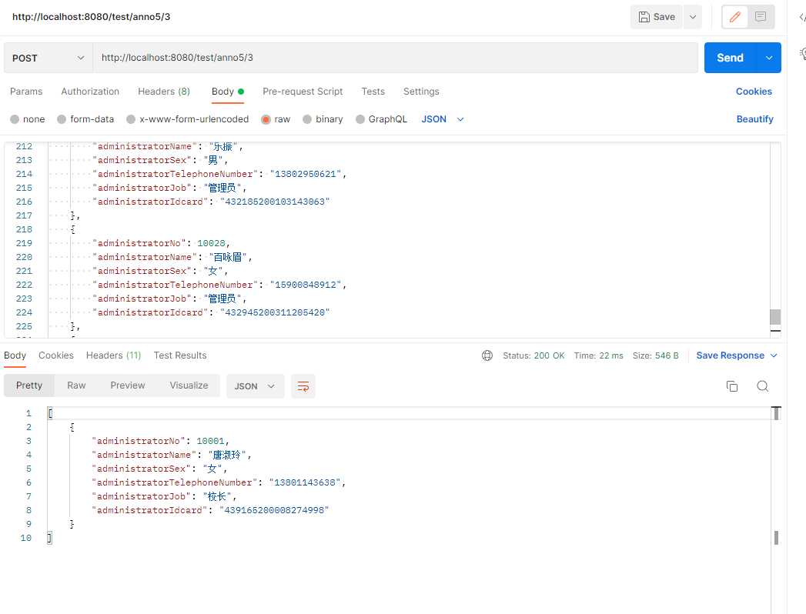


```json
[
    {
        "administratorNo": 10001,
        "administratorName": "唐淑玲",
        "administratorSex": "女",
        "administratorTelephoneNumber": "13801143638",
        "administratorJob": "校长",
        "administratorIdcard": "439165200008274998"
    }
]
```


查看日志


```sh
2022-08-03 13:29:22.806  INFO 6988 --- [nio-8080-exec-2] m.s.controller.TestAnnotationController  : 执行/anno5/3
2022-08-03 13:29:22.806 DEBUG 6988 --- [nio-8080-exec-2] m.s.controller.TestAnnotationController  : 
administratorNo：10001
administratorName：唐淑玲
administratorSex：女
administratorTelephoneNumber：13801143638
administratorJob：校长
administratorIdcard：439165200008274998
```


# 基于数据库实现自动登录


即关闭浏览器再重新打开还能访问访问


## 创建表


```sql
CREATE TABLE `persistent_logins` (
 `username` varchar(64) NOT NULL,
 `series` varchar(64) NOT NULL,
 `token` varchar(64) NOT NULL,
 `last_used` timestamp NOT NULL DEFAULT CURRENT_TIMESTAMP ON UPDATE 
CURRENT_TIMESTAMP,
 PRIMARY KEY (`series`)
) ENGINE=InnoDB DEFAULT CHARSET=utf8;
```


```sh
C:\Users\mao>mysql -u root -p
Enter password: ********
Welcome to the MySQL monitor.  Commands end with ; or \g.
Your MySQL connection id is 9
Server version: 8.0.27 MySQL Community Server - GPL

Copyright (c) 2000, 2021, Oracle and/or its affiliates.

Oracle is a registered trademark of Oracle Corporation and/or its
affiliates. Other names may be trademarks of their respective
owners.

Type 'help;' or '\h' for help. Type '\c' to clear the current input statement.

mysql> show databases;
+--------------------+
| Database           |
+--------------------+
| cloud_order        |
| cloud_user         |
| hotel              |
| information_schema |
| mysql              |
| nacos              |
| performance_schema |
| sakila             |
| seata              |
| seata_demo         |
| shop               |
| student            |
| student1           |
| student_test       |
| sys                |
| test               |
| tx                 |
| world              |
+--------------------+
18 rows in set (0.01 sec)

mysql> use student1;
Database changed
mysql> show tables;
+-------------------------+
| Tables_in_student1      |
+-------------------------+
| administrators          |
| administrators_password |
| class                   |
| course                  |
| forum                   |
| login_log               |
| news                    |
| score                   |
| student                 |
| student_password        |
| teach                   |
| teacher                 |
| teacher_password        |
+-------------------------+
13 rows in set (0.01 sec)

mysql>
mysql> CREATE TABLE `persistent_logins` (
    ->  `username` varchar(64) NOT NULL,
    ->  `series` varchar(64) NOT NULL,
    ->  `token` varchar(64) NOT NULL,
    ->  `last_used` timestamp NOT NULL DEFAULT CURRENT_TIMESTAMP ON UPDATE
    -> CURRENT_TIMESTAMP,
    ->  PRIMARY KEY (`series`)
    -> ) ENGINE=InnoDB DEFAULT CHARSET=utf8;
Query OK, 0 rows affected, 1 warning (0.02 sec)

mysql> show tables;
+-------------------------+
| Tables_in_student1      |
+-------------------------+
| administrators          |
| administrators_password |
| class                   |
| course                  |
| forum                   |
| login_log               |
| news                    |
| persistent_logins       |
| score                   |
| student                 |
| student_password        |
| teach                   |
| teacher                 |
| teacher_password        |
+-------------------------+
14 rows in set (0.00 sec)

mysql>
```


## 编写配置类


创建一个配置类AutoLoginSecurityConfig

```java
package mao.springsecurity_demo.config;

import org.springframework.beans.factory.annotation.Autowired;
import org.springframework.context.annotation.Bean;
import org.springframework.context.annotation.Configuration;
import org.springframework.jdbc.core.JdbcTemplate;
import org.springframework.security.web.authentication.rememberme.JdbcTokenRepositoryImpl;
import org.springframework.security.web.authentication.rememberme.PersistentTokenRepository;

import javax.sql.DataSource;

/**
 * Project name(项目名称)：springSecurity_demo
 * Package(包名): mao.springsecurity_demo.config
 * Class(类名): AutoLoginSecurityConfig
 * Author(作者）: mao
 * Author QQ：1296193245
 * GitHub：https://github.com/maomao124/
 * Date(创建日期)： 2022/8/3
 * Time(创建时间)： 13:43
 * Version(版本): 1.0
 * Description(描述)： 自动登录的配置
 */

@Configuration
public class AutoLoginSecurityConfig
{
    @Autowired
    private DataSource dataSource;

    @Bean
    public PersistentTokenRepository persistentTokenRepository()
    {
        //创建对应的实现类的对象
        JdbcTokenRepositoryImpl jdbcTokenRepository = new JdbcTokenRepositoryImpl();
        //设置数据源
        jdbcTokenRepository.setDataSource(dataSource);
        //自动创建表
        //jdbcTokenRepository.setCreateTableOnStartup(true);
        return jdbcTokenRepository;
    }
}
```


## 更改SecurityConfig


```java
package mao.springsecurity_demo.config;

import org.springframework.beans.factory.annotation.Autowired;
import org.springframework.context.annotation.Configuration;
import org.springframework.security.config.annotation.web.builders.HttpSecurity;
import org.springframework.security.config.annotation.web.configuration.WebSecurityConfigurerAdapter;
import org.springframework.security.core.userdetails.UserDetailsService;
import org.springframework.security.web.authentication.rememberme.PersistentTokenRepository;

/**
 * Project name(项目名称)：springSecurity_demo
 * Package(包名): mao.springsecurity_demo.config
 * Class(类名): SecurityConfig
 * Author(作者）: mao
 * Author QQ：1296193245
 * GitHub：https://github.com/maomao124/
 * Date(创建日期)： 2022/7/30
 * Time(创建时间)： 20:30
 * Version(版本): 1.0
 * Description(描述)： 无
 */

@Configuration
public class SecurityConfig extends WebSecurityConfigurerAdapter
{
    @Autowired
    private PersistentTokenRepository persistentTokenRepository;

    @Autowired
    private UserDetailsService userDetailsService;

    @Override
    protected void configure(HttpSecurity http) throws Exception
    {
        //表单登录配置
        http.formLogin()
                //设置登录页面
                .loginPage("/login.html")
                //设置哪个是登录的 url
                .loginProcessingUrl("/login")
                //设置登录成功之后跳转到哪个 url
                .defaultSuccessUrl("/index.html", false)
                //.successForwardUrl("/index")
                //设置登录失败之后跳转到哪个url
                .failureUrl("/error.html")
                //.failureForwardUrl("fail")
                //设置表单的用户名项参数名称
                .usernameParameter("username")
                //设置表单的密码项参数名称
                .passwordParameter("password");

        //关闭csrf
        http.csrf().disable();

        //异常处理配置，403页面配置
        http.exceptionHandling().accessDeniedPage("/unAuth.html");

        //退出登录配置
        http.logout()
                //设置退出登录的url
                .logoutUrl("/logout")
                //设置退出登录成功后要跳转的url
                .logoutSuccessUrl("/thanks.html")
                .permitAll();

        //自动登录配置
        http.rememberMe()
                //指定要使用的PersistentTokenRepository 。默认是使用TokenBasedRememberMeServices
                .tokenRepository(persistentTokenRepository)
                //指定当记住我令牌有效时用于查找UserDetails的UserDetailsService
                .userDetailsService(userDetailsService)
                //设置有效期，单位是秒，默认是2周时间。即使项目重新启动下次也可以正常登录
                .tokenValiditySeconds(2 * 60)
                //设置表单的记住密码项参数名称，默认是remember-me
                .rememberMeParameter("remember-me");

        //认证配置
        http.authorizeRequests()
                //指定页面不需要验证
                .antMatchers("/login.html", "/login", "/error.html", "/thanks.html",
                        "/css/**", "/js/**", "/img/**",
                        "/test/noauth", "/test/anno5/**")
                .permitAll()
                .antMatchers("/test/root").hasAuthority("root")
                .antMatchers("/test/admin").hasAuthority("admin")
                .antMatchers("/test/rootOrAdmin").hasAnyAuthority("root", "admin")
                .antMatchers("/test/role_root").hasRole("root")
                .antMatchers("/test/role_root_or_admin").hasAnyRole("root", "admin")
                //其它请求都需要身份认证
                .anyRequest()
                .authenticated();

    }


/*
    @Bean
    public PasswordEncoder passwordEncoder()
    {
        return new BCryptPasswordEncoder();
    }
*/

}

```


## 更改表单


添加一个input标签

```html
<input type="checkbox"name="remember-me"title="记住密码"/>
```


```html
<!DOCTYPE html>

<!--
Project name(项目名称)：springSecurity_demo
  File name(文件名): login
  Authors(作者）: mao
  Author QQ：1296193245
  GitHub：https://github.com/maomao124/
  Date(创建日期)： 2022/8/1
  Time(创建时间)： 15:09
  Description(描述)： 无
-->

<html lang="en">
<head>
    <meta charset="UTF-8">
    <title>登录</title>
    <link rel="stylesheet" href="css/form.css">
    <link rel="stylesheet" href="css/animate.css">
    <style>
        body {
            background-color: skyblue;
        }

        #remember-me {
            width: 300px;
            height: 40px;
        }
    </style>
</head>
<body>


<div class="text_position">
    <div class="text animated flipInY">
        登录
    </div>
</div>

<div class="form_position">
    <div class="animated bounceInDown">
        <div class="form">
            <form action="/login" method="post">
                <table border="1">
                    <tr>
                        <td colspan="2" align="center">
                        </td>
                    </tr>
                    <tr>
                        <td class="prompt">用户ID</td>
                        <td>
                            <label>
                                <input class="input" type="text" name="username" required="required">
                            </label>
                        </td>
                    </tr>
                    <tr>
                        <td class="prompt">密码</td>
                        <td>
                            <label>
                                <input class="input" type="password" name="password" required="required">
                            </label>
                        </td>
                    </tr>
                    <tr>
                        <td class="prompt">记住密码</td>
                        <td>
                            <label>
                                <input id="remember-me" class="input" type="checkbox" name="remember-me" title="记住密码">
                            </label>
                        </td>
                    </tr>
                    <tr>
                        <td colspan="2" align="center">
                            <input class="submit" type="submit" value="提交"/>
                        </td>
                    </tr>
                </table>
            </form>
        </div>
    </div>
</div>
</body>

<script>


</script>

</html>
```


## 重启服务


## 访问


登录

勾选记住密码


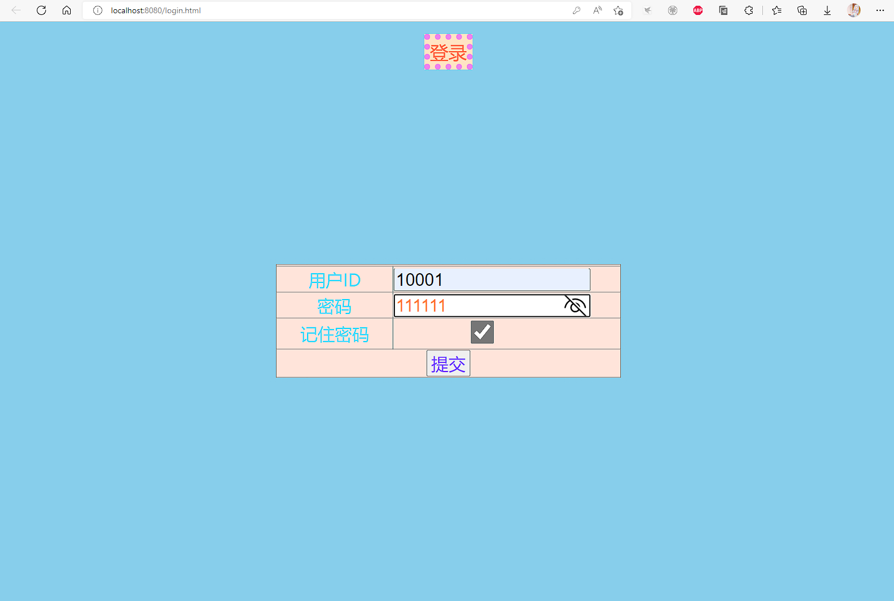


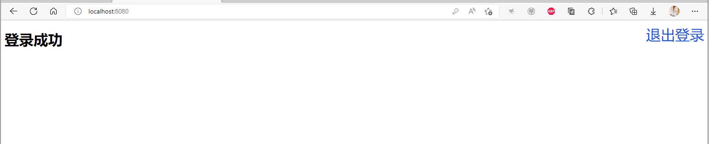


## 访问数据库


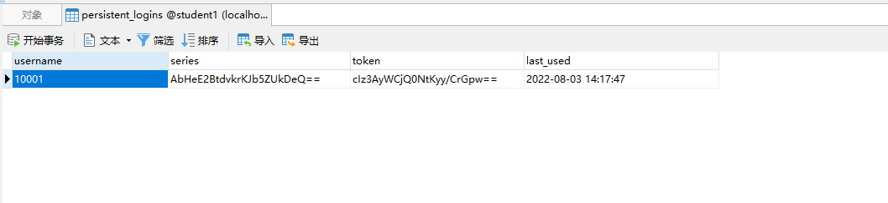


## 重启浏览器


直接跳过了登录


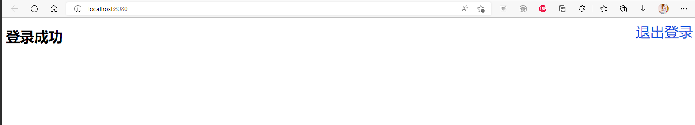


## 访问数据库


最后一个字段的数据被改变

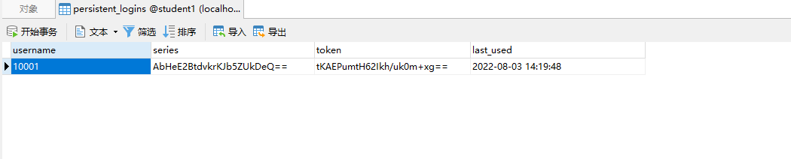


## 等待token过期

token过期后重启浏览器再访问


需要登录


## 再次登录


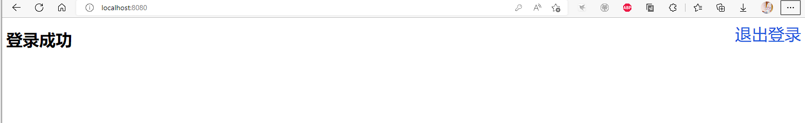


## 查看数据库


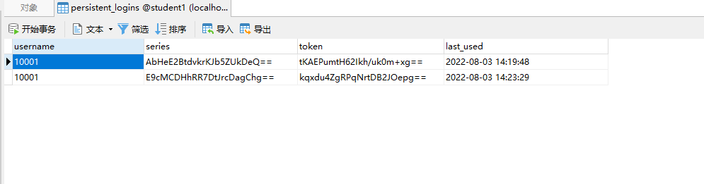


## 退出登录


点击退出登录


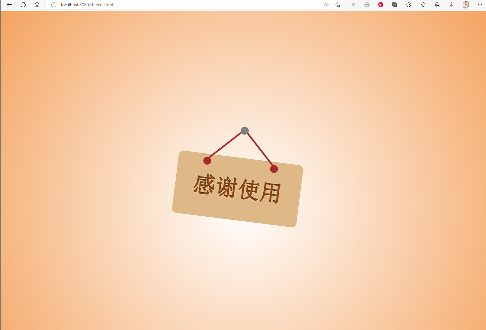


## 查看数据库


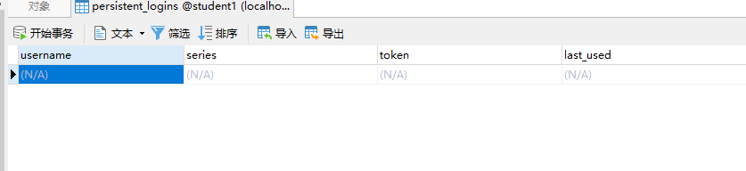


如果再次重启浏览器再访问，就会需要登录


# CSRF


## 概念

跨站请求伪造（英语：Cross-site request forgery），也被称为 one-click  attack 或者 session riding，通常缩写为 CSRF 或者 XSRF， 是一种挟制用户在当前已 登录的 Web 应用程序上执行非本意的操作的攻击方法。跟跨网站脚本（XSS）相比，XSS 利用的是用户对指定网站的信任，CSRF 利用的是网站对用户网页浏览器的信任。

跨站请求攻击，简单地说，是攻击者通过一些技术手段欺骗用户的浏览器去访问一个 自己曾经认证过的网站并运行一些操作（如发邮件，发消息，甚至财产操作如转账和购买 商品）。由于浏览器曾经认证过，所以被访问的网站会认为是真正的用户操作而去运行。 这利用了 web 中用户身份验证的一个漏洞：简单的身份验证只能保证请求发自某个用户的 浏览器，却不能保证请求本身是用户自愿发出的。

从 Spring Security 4.0 开始，默认情况下会启用 CSRF 保护，以防止 CSRF 攻击应用 程序，Spring Security CSRF 会针对 PATCH，POST，PUT 和 DELETE 方法进行防护。


## 原理


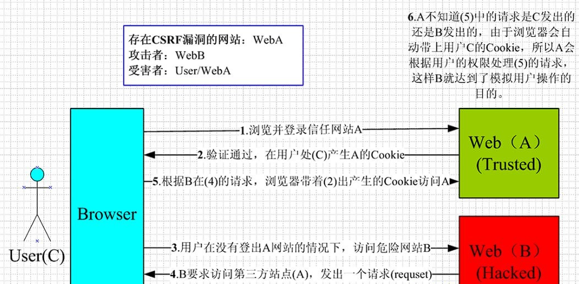


要完成一次CSRF攻击，受害者必须依次完成两个步骤：

*  登录受信任网站A，并在本地生成Cookie。
* 在不登出A的情况下，访问危险网站B。 


## 实现的原理


1. 生成 csrfToken 保存到 HttpSession 或者 Cookie 中


CsrfToken接口

```java
/*
 * Copyright 2002-2013 the original author or authors.
 *
 * Licensed under the Apache License, Version 2.0 (the "License");
 * you may not use this file except in compliance with the License.
 * You may obtain a copy of the License at
 *
 *      https://www.apache.org/licenses/LICENSE-2.0
 *
 * Unless required by applicable law or agreed to in writing, software
 * distributed under the License is distributed on an "AS IS" BASIS,
 * WITHOUT WARRANTIES OR CONDITIONS OF ANY KIND, either express or implied.
 * See the License for the specific language governing permissions and
 * limitations under the License.
 */

package org.springframework.security.web.csrf;

import java.io.Serializable;

/**
 * Provides the information about an expected CSRF token.
 *
 * @author Rob Winch
 * @since 3.2
 * @see DefaultCsrfToken
 */
public interface CsrfToken extends Serializable {

   /**
    * Gets the HTTP header that the CSRF is populated on the response and can be placed
    * on requests instead of the parameter. Cannot be null.
    * @return the HTTP header that the CSRF is populated on the response and can be
    * placed on requests instead of the parameter
    */
   String getHeaderName();

   /**
    * Gets the HTTP parameter name that should contain the token. Cannot be null.
    * @return the HTTP parameter name that should contain the token.
    */
   String getParameterName();

   /**
    * Gets the token value. Cannot be null.
    * @return the token value
    */
   String getToken();

}
```


实现类

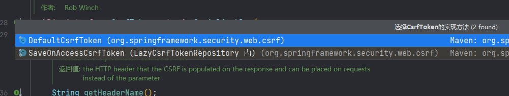


SaveOnAccessCsrfToken类

```java
private static final class SaveOnAccessCsrfToken implements CsrfToken {

   private transient CsrfTokenRepository tokenRepository;

   private transient HttpServletRequest request;

   private transient HttpServletResponse response;

   private final CsrfToken delegate;

   SaveOnAccessCsrfToken(CsrfTokenRepository tokenRepository, HttpServletRequest request,
         HttpServletResponse response, CsrfToken delegate) {
      this.tokenRepository = tokenRepository;
      this.request = request;
      this.response = response;
      this.delegate = delegate;
   }

   @Override
   public String getHeaderName() {
      return this.delegate.getHeaderName();
   }

   @Override
   public String getParameterName() {
      return this.delegate.getParameterName();
   }

   @Override
   public String getToken() {
      saveTokenIfNecessary();
      return this.delegate.getToken();
   }

   @Override
   public boolean equals(Object obj) {
      if (this == obj) {
         return true;
      }
      if (obj == null || getClass() != obj.getClass()) {
         return false;
      }
      SaveOnAccessCsrfToken other = (SaveOnAccessCsrfToken) obj;
      if (this.delegate == null) {
         if (other.delegate != null) {
            return false;
         }
      }
      else if (!this.delegate.equals(other.delegate)) {
         return false;
      }
      return true;
   }

   @Override
   public int hashCode() {
      final int prime = 31;
      int result = 1;
      result = prime * result + ((this.delegate == null) ? 0 : this.delegate.hashCode());
      return result;
   }

   @Override
   public String toString() {
      return "SaveOnAccessCsrfToken [delegate=" + this.delegate + "]";
   }

   private void saveTokenIfNecessary() {
      if (this.tokenRepository == null) {
         return;
      }
      synchronized (this) {
         if (this.tokenRepository != null) {
            this.tokenRepository.saveToken(this.delegate, this.request, this.response);
            this.tokenRepository = null;
            this.request = null;
            this.response = null;
         }
      }
   }

}
```


SaveOnAccessCsrfToken 类有个接口 CsrfTokenRepository


```java
/*
 * Copyright 2002-2013 the original author or authors.
 *
 * Licensed under the Apache License, Version 2.0 (the "License");
 * you may not use this file except in compliance with the License.
 * You may obtain a copy of the License at
 *
 *      https://www.apache.org/licenses/LICENSE-2.0
 *
 * Unless required by applicable law or agreed to in writing, software
 * distributed under the License is distributed on an "AS IS" BASIS,
 * WITHOUT WARRANTIES OR CONDITIONS OF ANY KIND, either express or implied.
 * See the License for the specific language governing permissions and
 * limitations under the License.
 */

package org.springframework.security.web.csrf;

import javax.servlet.http.HttpServletRequest;
import javax.servlet.http.HttpServletResponse;
import javax.servlet.http.HttpSession;

/**
 * An API to allow changing the method in which the expected {@link CsrfToken} is
 * associated to the {@link HttpServletRequest}. For example, it may be stored in
 * {@link HttpSession}.
 *
 * @author Rob Winch
 * @since 3.2
 * @see HttpSessionCsrfTokenRepository
 */
public interface CsrfTokenRepository {

   /**
    * Generates a {@link CsrfToken}
    * @param request the {@link HttpServletRequest} to use
    * @return the {@link CsrfToken} that was generated. Cannot be null.
    */
   CsrfToken generateToken(HttpServletRequest request);

   /**
    * Saves the {@link CsrfToken} using the {@link HttpServletRequest} and
    * {@link HttpServletResponse}. If the {@link CsrfToken} is null, it is the same as
    * deleting it.
    * @param token the {@link CsrfToken} to save or null to delete
    * @param request the {@link HttpServletRequest} to use
    * @param response the {@link HttpServletResponse} to use
    */
   void saveToken(CsrfToken token, HttpServletRequest request, HttpServletResponse response);

   /**
    * Loads the expected {@link CsrfToken} from the {@link HttpServletRequest}
    * @param request the {@link HttpServletRequest} to use
    * @return the {@link CsrfToken} or null if none exists
    */
   CsrfToken loadToken(HttpServletRequest request);

}
```


接口有4个实现类

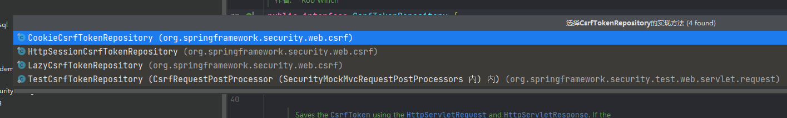


实现类CookieCsrfTokenRepository

```java
package org.springframework.security.web.csrf;

import java.util.UUID;

import javax.servlet.ServletRequest;
import javax.servlet.http.Cookie;
import javax.servlet.http.HttpServletRequest;
import javax.servlet.http.HttpServletResponse;

import org.springframework.util.Assert;
import org.springframework.util.StringUtils;
import org.springframework.web.util.WebUtils;

/**
 * A {@link CsrfTokenRepository} that persists the CSRF token in a cookie named
 * "XSRF-TOKEN" and reads from the header "X-XSRF-TOKEN" following the conventions of
 * AngularJS. When using with AngularJS be sure to use {@link #withHttpOnlyFalse()}.
 *
 * @author Rob Winch
 * @since 4.1
 */
public final class CookieCsrfTokenRepository implements CsrfTokenRepository {

   static final String DEFAULT_CSRF_COOKIE_NAME = "XSRF-TOKEN";

   static final String DEFAULT_CSRF_PARAMETER_NAME = "_csrf";

   static final String DEFAULT_CSRF_HEADER_NAME = "X-XSRF-TOKEN";

   private String parameterName = DEFAULT_CSRF_PARAMETER_NAME;

   private String headerName = DEFAULT_CSRF_HEADER_NAME;

   private String cookieName = DEFAULT_CSRF_COOKIE_NAME;

   private boolean cookieHttpOnly = true;

   private String cookiePath;

   private String cookieDomain;

   private Boolean secure;

   private int cookieMaxAge = -1;

   public CookieCsrfTokenRepository() {
   }

   @Override
   public CsrfToken generateToken(HttpServletRequest request) {
      return new DefaultCsrfToken(this.headerName, this.parameterName, createNewToken());
   }

   @Override
   public void saveToken(CsrfToken token, HttpServletRequest request, HttpServletResponse response) {
      String tokenValue = (token != null) ? token.getToken() : "";
      Cookie cookie = new Cookie(this.cookieName, tokenValue);
      cookie.setSecure((this.secure != null) ? this.secure : request.isSecure());
      cookie.setPath(StringUtils.hasLength(this.cookiePath) ? this.cookiePath : this.getRequestContext(request));
      cookie.setMaxAge((token != null) ? this.cookieMaxAge : 0);
      cookie.setHttpOnly(this.cookieHttpOnly);
      if (StringUtils.hasLength(this.cookieDomain)) {
         cookie.setDomain(this.cookieDomain);
      }
      response.addCookie(cookie);
   }

   @Override
   public CsrfToken loadToken(HttpServletRequest request) {
      Cookie cookie = WebUtils.getCookie(request, this.cookieName);
      if (cookie == null) {
         return null;
      }
      String token = cookie.getValue();
      if (!StringUtils.hasLength(token)) {
         return null;
      }
      return new DefaultCsrfToken(this.headerName, this.parameterName, token);
   }

   /**
    * Sets the name of the HTTP request parameter that should be used to provide a token.
    * @param parameterName the name of the HTTP request parameter that should be used to
    * provide a token
    */
   public void setParameterName(String parameterName) {
      Assert.notNull(parameterName, "parameterName cannot be null");
      this.parameterName = parameterName;
   }

   /**
    * Sets the name of the HTTP header that should be used to provide the token.
    * @param headerName the name of the HTTP header that should be used to provide the
    * token
    */
   public void setHeaderName(String headerName) {
      Assert.notNull(headerName, "headerName cannot be null");
      this.headerName = headerName;
   }

   /**
    * Sets the name of the cookie that the expected CSRF token is saved to and read from.
    * @param cookieName the name of the cookie that the expected CSRF token is saved to
    * and read from
    */
   public void setCookieName(String cookieName) {
      Assert.notNull(cookieName, "cookieName cannot be null");
      this.cookieName = cookieName;
   }

   /**
    * Sets the HttpOnly attribute on the cookie containing the CSRF token. Defaults to
    * <code>true</code>.
    * @param cookieHttpOnly <code>true</code> sets the HttpOnly attribute,
    * <code>false</code> does not set it
    */
   public void setCookieHttpOnly(boolean cookieHttpOnly) {
      this.cookieHttpOnly = cookieHttpOnly;
   }

   private String getRequestContext(HttpServletRequest request) {
      String contextPath = request.getContextPath();
      return (contextPath.length() > 0) ? contextPath : "/";
   }

   /**
    * Factory method to conveniently create an instance that has
    * {@link #setCookieHttpOnly(boolean)} set to false.
    * @return an instance of CookieCsrfTokenRepository with
    * {@link #setCookieHttpOnly(boolean)} set to false
    */
   public static CookieCsrfTokenRepository withHttpOnlyFalse() {
      CookieCsrfTokenRepository result = new CookieCsrfTokenRepository();
      result.setCookieHttpOnly(false);
      return result;
   }

   private String createNewToken() {
      return UUID.randomUUID().toString();
   }

   /**
    * Set the path that the Cookie will be created with. This will override the default
    * functionality which uses the request context as the path.
    * @param path the path to use
    */
   public void setCookiePath(String path) {
      this.cookiePath = path;
   }

   /**
    * Get the path that the CSRF cookie will be set to.
    * @return the path to be used.
    */
   public String getCookiePath() {
      return this.cookiePath;
   }

   /**
    * Sets the domain of the cookie that the expected CSRF token is saved to and read
    * from.
    * @param cookieDomain the domain of the cookie that the expected CSRF token is saved
    * to and read from
    * @since 5.2
    */
   public void setCookieDomain(String cookieDomain) {
      this.cookieDomain = cookieDomain;
   }

   /**
    * Sets secure flag of the cookie that the expected CSRF token is saved to and read
    * from. By default secure flag depends on {@link ServletRequest#isSecure()}
    * @param secure the secure flag of the cookie that the expected CSRF token is saved
    * to and read from
    * @since 5.4
    */
   public void setSecure(Boolean secure) {
      this.secure = secure;
   }

   /**
    * Sets maximum age in seconds for the cookie that the expected CSRF token is saved to
    * and read from. By default maximum age value is -1.
    *
    * <p>
    * A positive value indicates that the cookie will expire after that many seconds have
    * passed. Note that the value is the <i>maximum</i> age when the cookie will expire,
    * not the cookie's current age.
    *
    * <p>
    * A negative value means that the cookie is not stored persistently and will be
    * deleted when the Web browser exits.
    *
    * <p>
    * A zero value causes the cookie to be deleted immediately therefore it is not a
    * valid value and in that case an {@link IllegalArgumentException} will be thrown.
    * @param cookieMaxAge an integer specifying the maximum age of the cookie in seconds;
    * if negative, means the cookie is not stored; if zero, the method throws an
    * {@link IllegalArgumentException}
    * @since 5.5
    */
   public void setCookieMaxAge(int cookieMaxAge) {
      Assert.isTrue(cookieMaxAge != 0, "cookieMaxAge cannot be zero");
      this.cookieMaxAge = cookieMaxAge;
   }

}
```


2. 请求到来时，从请求中提取 csrfToken，和保存的 csrfToken 做比较，进而判断当 前请求是否合法。主要通过 CsrfFilter 过滤器来完成


```java
package org.springframework.security.web.csrf;

import java.io.IOException;
import java.security.MessageDigest;
import java.util.Arrays;
import java.util.HashSet;

import javax.servlet.FilterChain;
import javax.servlet.ServletException;
import javax.servlet.http.HttpServletRequest;
import javax.servlet.http.HttpServletResponse;
import javax.servlet.http.HttpSession;

import org.apache.commons.logging.Log;
import org.apache.commons.logging.LogFactory;

import org.springframework.core.log.LogMessage;
import org.springframework.security.access.AccessDeniedException;
import org.springframework.security.crypto.codec.Utf8;
import org.springframework.security.web.access.AccessDeniedHandler;
import org.springframework.security.web.access.AccessDeniedHandlerImpl;
import org.springframework.security.web.util.UrlUtils;
import org.springframework.security.web.util.matcher.RequestMatcher;
import org.springframework.util.Assert;
import org.springframework.web.filter.OncePerRequestFilter;

/**
 * <p>
 * Applies
 * <a href="https://www.owasp.org/index.php/Cross-Site_Request_Forgery_(CSRF)" >CSRF</a>
 * protection using a synchronizer token pattern. Developers are required to ensure that
 * {@link CsrfFilter} is invoked for any request that allows state to change. Typically
 * this just means that they should ensure their web application follows proper REST
 * semantics (i.e. do not change state with the HTTP methods GET, HEAD, TRACE, OPTIONS).
 * </p>
 *
 * <p>
 * Typically the {@link CsrfTokenRepository} implementation chooses to store the
 * {@link CsrfToken} in {@link HttpSession} with {@link HttpSessionCsrfTokenRepository}
 * wrapped by a {@link LazyCsrfTokenRepository}. This is preferred to storing the token in
 * a cookie which can be modified by a client application.
 * </p>
 *
 * @author Rob Winch
 * @since 3.2
 */
public final class CsrfFilter extends OncePerRequestFilter {

   /**
    * The default {@link RequestMatcher} that indicates if CSRF protection is required or
    * not. The default is to ignore GET, HEAD, TRACE, OPTIONS and process all other
    * requests.
    */
   public static final RequestMatcher DEFAULT_CSRF_MATCHER = new DefaultRequiresCsrfMatcher();

   /**
    * The attribute name to use when marking a given request as one that should not be
    * filtered.
    *
    * To use, set the attribute on your {@link HttpServletRequest}: <pre>
    *     CsrfFilter.skipRequest(request);
    * </pre>
    */
   private static final String SHOULD_NOT_FILTER = "SHOULD_NOT_FILTER" + CsrfFilter.class.getName();

   private final Log logger = LogFactory.getLog(getClass());

   private final CsrfTokenRepository tokenRepository;

   private RequestMatcher requireCsrfProtectionMatcher = DEFAULT_CSRF_MATCHER;

   private AccessDeniedHandler accessDeniedHandler = new AccessDeniedHandlerImpl();

   public CsrfFilter(CsrfTokenRepository csrfTokenRepository) {
      Assert.notNull(csrfTokenRepository, "csrfTokenRepository cannot be null");
      this.tokenRepository = csrfTokenRepository;
   }

   @Override
   protected boolean shouldNotFilter(HttpServletRequest request) throws ServletException {
      return Boolean.TRUE.equals(request.getAttribute(SHOULD_NOT_FILTER));
   }

   @Override
   protected void doFilterInternal(HttpServletRequest request, HttpServletResponse response, FilterChain filterChain)
         throws ServletException, IOException {
      request.setAttribute(HttpServletResponse.class.getName(), response);
      CsrfToken csrfToken = this.tokenRepository.loadToken(request);
      boolean missingToken = (csrfToken == null);
      if (missingToken) {
         csrfToken = this.tokenRepository.generateToken(request);
         this.tokenRepository.saveToken(csrfToken, request, response);
      }
      request.setAttribute(CsrfToken.class.getName(), csrfToken);
      request.setAttribute(csrfToken.getParameterName(), csrfToken);
      if (!this.requireCsrfProtectionMatcher.matches(request)) {
         if (this.logger.isTraceEnabled()) {
            this.logger.trace("Did not protect against CSRF since request did not match "
                  + this.requireCsrfProtectionMatcher);
         }
         filterChain.doFilter(request, response);
         return;
      }
      String actualToken = request.getHeader(csrfToken.getHeaderName());
      if (actualToken == null) {
         actualToken = request.getParameter(csrfToken.getParameterName());
      }
      if (!equalsConstantTime(csrfToken.getToken(), actualToken)) {
         this.logger.debug(
               LogMessage.of(() -> "Invalid CSRF token found for " + UrlUtils.buildFullRequestUrl(request)));
         AccessDeniedException exception = (!missingToken) ? new InvalidCsrfTokenException(csrfToken, actualToken)
               : new MissingCsrfTokenException(actualToken);
         this.accessDeniedHandler.handle(request, response, exception);
         return;
      }
      filterChain.doFilter(request, response);
   }

   public static void skipRequest(HttpServletRequest request) {
      request.setAttribute(SHOULD_NOT_FILTER, Boolean.TRUE);
   }

   /**
    * Specifies a {@link RequestMatcher} that is used to determine if CSRF protection
    * should be applied. If the {@link RequestMatcher} returns true for a given request,
    * then CSRF protection is applied.
    *
    * <p>
    * The default is to apply CSRF protection for any HTTP method other than GET, HEAD,
    * TRACE, OPTIONS.
    * </p>
    * @param requireCsrfProtectionMatcher the {@link RequestMatcher} used to determine if
    * CSRF protection should be applied.
    */
   public void setRequireCsrfProtectionMatcher(RequestMatcher requireCsrfProtectionMatcher) {
      Assert.notNull(requireCsrfProtectionMatcher, "requireCsrfProtectionMatcher cannot be null");
      this.requireCsrfProtectionMatcher = requireCsrfProtectionMatcher;
   }

   /**
    * Specifies a {@link AccessDeniedHandler} that should be used when CSRF protection
    * fails.
    *
    * <p>
    * The default is to use AccessDeniedHandlerImpl with no arguments.
    * </p>
    * @param accessDeniedHandler the {@link AccessDeniedHandler} to use
    */
   public void setAccessDeniedHandler(AccessDeniedHandler accessDeniedHandler) {
      Assert.notNull(accessDeniedHandler, "accessDeniedHandler cannot be null");
      this.accessDeniedHandler = accessDeniedHandler;
   }

   /**
    * Constant time comparison to prevent against timing attacks.
    * @param expected
    * @param actual
    * @return
    */
   private static boolean equalsConstantTime(String expected, String actual) {
      if (expected == actual) {
         return true;
      }
      if (expected == null || actual == null) {
         return false;
      }
      // Encode after ensure that the string is not null
      byte[] expectedBytes = Utf8.encode(expected);
      byte[] actualBytes = Utf8.encode(actual);
      return MessageDigest.isEqual(expectedBytes, actualBytes);
   }

   private static final class DefaultRequiresCsrfMatcher implements RequestMatcher {

      private final HashSet<String> allowedMethods = new HashSet<>(Arrays.asList("GET", "HEAD", "TRACE", "OPTIONS"));

      @Override
      public boolean matches(HttpServletRequest request) {
         return !this.allowedMethods.contains(request.getMethod());
      }

      @Override
      public String toString() {
         return "CsrfNotRequired " + this.allowedMethods;
      }

   }

}
```


## 实现


### 导入模板引擎依赖

```xml
 <!--模板引擎thymeleaf-->
        <dependency>
            <groupId>org.springframework.boot</groupId>
            <artifactId>spring-boot-starter-thymeleaf</artifactId>
        </dependency>

        <!--对Thymeleaf添加Spring Security标签支持-->
        <dependency>
            <groupId>org.thymeleaf.extras</groupId>
            <artifactId>thymeleaf-extras-springsecurity5</artifactId>
        </dependency>
```


```xml
<?xml version="1.0" encoding="UTF-8"?>
<project xmlns="http://maven.apache.org/POM/4.0.0" xmlns:xsi="http://www.w3.org/2001/XMLSchema-instance"
         xsi:schemaLocation="http://maven.apache.org/POM/4.0.0 https://maven.apache.org/xsd/maven-4.0.0.xsd">
    <modelVersion>4.0.0</modelVersion>
    <parent>
        <groupId>org.springframework.boot</groupId>
        <artifactId>spring-boot-starter-parent</artifactId>
        <version>2.7.2</version>
        <relativePath/> <!-- lookup parent from repository -->
    </parent>
    <groupId>mao</groupId>
    <artifactId>springSecurity_demo</artifactId>
    <version>0.0.1-SNAPSHOT</version>
    <name>springSecurity_demo</name>
    <description>springSecurity_demo</description>
    <properties>
        <java.version>11</java.version>
    </properties>
    <dependencies>
        <dependency>
            <groupId>org.springframework.boot</groupId>
            <artifactId>spring-boot-starter-web</artifactId>
        </dependency>

        <dependency>
            <groupId>org.springframework.boot</groupId>
            <artifactId>spring-boot-starter-test</artifactId>
            <scope>test</scope>
        </dependency>

        <!-- spring security 安全框架依赖 -->
        <dependency>
            <groupId>org.springframework.boot</groupId>
            <artifactId>spring-boot-starter-security</artifactId>
        </dependency>

        <!-- spring security 安全框架测试依赖 -->
        <dependency>
            <groupId>org.springframework.security</groupId>
            <artifactId>spring-security-test</artifactId>
            <scope>test</scope>
        </dependency>

        <!--mysql依赖 spring-boot-->
        <dependency>
            <groupId>mysql</groupId>
            <artifactId>mysql-connector-java</artifactId>
            <version>8.0.27</version>
            <scope>runtime</scope>
        </dependency>

        <!--spring-boot druid连接池依赖-->
        <dependency>
            <groupId>com.alibaba</groupId>
            <artifactId>druid-spring-boot-starter</artifactId>
            <version>1.2.8</version>
        </dependency>

        <!--spring-boot mybatis-plus依赖-->
        <dependency>
            <groupId>com.baomidou</groupId>
            <artifactId>mybatis-plus-boot-starter</artifactId>
            <version>3.5.1</version>
        </dependency>

        <!--mybatis-plus代码生成器-->
        <dependency>
            <groupId>com.baomidou</groupId>
            <artifactId>mybatis-plus-generator</artifactId>
            <version>3.5.1</version>
        </dependency>
        <!-- 模板引擎 默认 -->
        <dependency>
            <groupId>org.apache.velocity</groupId>
            <artifactId>velocity-engine-core</artifactId>
            <version>2.3</version>
        </dependency>
        <!--swagger-->
        <dependency>
            <groupId>io.springfox</groupId>
            <artifactId>springfox-swagger2</artifactId>
            <version>2.7.0</version>
        </dependency>

        <!--模板引擎thymeleaf-->
        <dependency>
            <groupId>org.springframework.boot</groupId>
            <artifactId>spring-boot-starter-thymeleaf</artifactId>
        </dependency>

        <!--对Thymeleaf添加Spring Security标签支持-->
        <dependency>
            <groupId>org.thymeleaf.extras</groupId>
            <artifactId>thymeleaf-extras-springsecurity5</artifactId>
        </dependency>


    </dependencies>

    <build>
        <plugins>
            <plugin>
                <groupId>org.springframework.boot</groupId>
                <artifactId>spring-boot-maven-plugin</artifactId>
            </plugin>
        </plugins>
    </build>

</project>
```


### 移动登录页面

移动登录页面到模板引擎目录下


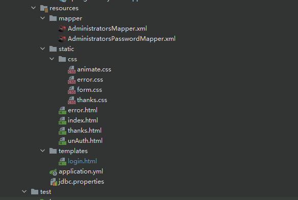


### 更改登录页面

加入以下标签

```html
<input type="hidden" th:if="${_csrf}!=null" th:value="${_csrf.token} " name="_csrf"/>
```


```html
<!DOCTYPE html>

<!--
Project name(项目名称)：springSecurity_demo
  File name(文件名): login
  Authors(作者）: mao
  Author QQ：1296193245
  GitHub：https://github.com/maomao124/
  Date(创建日期)： 2022/8/1
  Time(创建时间)： 15:09
  Description(描述)： 无
-->

<head>
    <meta charset="UTF-8">
    <title>登录</title>
    <link rel="stylesheet" href="css/form.css">
    <link rel="stylesheet" href="css/animate.css">
    <style>
        body {
            background-color: skyblue;
        }

        #remember-me {
            width: 300px;
            height: 40px;
        }
    </style>
</head>
<body>


<div class="text_position">
    <div class="text animated flipInY">
        登录
    </div>
</div>

<div class="form_position">
    <div class="animated bounceInDown">
        <div class="form">
            <form action="/login" method="post">
                <table border="1">
                    <tr>
                        <td colspan="2" align="center">
                        </td>
                    </tr>
                    <tr>
                        <td class="prompt">用户ID</td>
                        <td>
                            <label>
                                <input class="input" type="text" name="username" required="required">
                            </label>
                        </td>
                    </tr>
                    <tr>
                        <td class="prompt">密码</td>
                        <td>
                            <label>
                                <input class="input" type="password" name="password" required="required">
                            </label>
                        </td>
                    </tr>
                    <tr>
                        <td class="prompt">记住密码</td>
                        <td>
                            <label>
                                <input id="remember-me" class="input" type="checkbox" name="remember-me" title="记住密码">
                                <input type="hidden" th:if="${_csrf}!=null" th:value="${_csrf.token} " name="_csrf"/>
                            </label>
                        </td>
                    </tr>
                    <tr>
                        <td colspan="2" align="center">
                            <input class="submit" type="submit" value="提交"/>
                        </td>
                    </tr>
                </table>
            </form>
        </div>
    </div>
</div>
</body>

<script>


</script>

</html>
```


### 更改error.html

```html
<!DOCTYPE html>

<!--
Project name(项目名称)：springSecurity_demo
  File name(文件名): error
  Authors(作者）: mao
  Author QQ：1296193245
  GitHub：https://github.com/maomao124/
  Date(创建日期)： 2022/8/1
  Time(创建时间)： 15:51
  Description(描述)： 无
-->

<html lang="en">
<head>
    <meta charset="UTF-8">
    <title>error</title>
    <link rel="stylesheet" href="css/error.css">
</head>
<body>

<a class="warning" href="/userLogin">错误：账号或者密码不正确</a>

</body>
</html>
```


### 更改thanks.html

```html
<!DOCTYPE html>

<!--
Project name(项目名称)：springSecurity_demo
  File name(文件名): thanks
  Authors(作者）: mao
  Author QQ：1296193245
  GitHub：https://github.com/maomao124/
  Date(创建日期)： 2022/8/2
  Time(创建时间)： 13:27
  Description(描述)： 无
-->

<html lang="en">
<head>
    <meta charset="UTF-8">
    <title>感谢使用</title>
    <link rel="stylesheet" href="/css/thanks.css">
</head>
<body>

<div>
    <div class="thanks">
        <a href="/userLogin" class="sign">感谢使用</a>
        <!--<div class="sign">感谢</div>-->
        <div class="strings"></div>
        <div class="pin top"></div>
        <div class="pin left"></div>
        <div class="pin right"></div>
    </div>
</div>

</body>
</html>
```


### 添加controller

名字PageController


```java
package mao.springsecurity_demo.controller;

import org.slf4j.Logger;
import org.slf4j.LoggerFactory;
import org.springframework.stereotype.Controller;
import org.springframework.web.bind.annotation.RequestMapping;
import org.springframework.web.servlet.ModelAndView;

import javax.servlet.http.HttpServletRequest;

/**
 * Project name(项目名称)：springSecurity_demo
 * Package(包名): mao.springsecurity_demo.controller
 * Class(类名): PageController
 * Author(作者）: mao
 * Author QQ：1296193245
 * GitHub：https://github.com/maomao124/
 * Date(创建日期)： 2022/8/1
 * Time(创建时间)： 16:39
 * Version(版本): 1.0
 * Description(描述)： 无
 */


@Controller
@RequestMapping()
public class PageController
{
    private static final Logger log = LoggerFactory.getLogger(PageController.class);

/*    @RequestMapping("/index")
    public ModelAndView index()
    {
        ModelAndView modelAndView = new ModelAndView();
        modelAndView.setViewName("index");
        return modelAndView;
    }*/

    @RequestMapping("/userLogin")
    public String login(HttpServletRequest httpServletRequest)
    {
        log.debug("IP:" + httpServletRequest.getRemoteAddr() + " get login page");
        return "login";
    }
}
```


### 更改SecurityConfig


```java
package mao.springsecurity_demo.config;

import org.springframework.beans.factory.annotation.Autowired;
import org.springframework.context.annotation.Configuration;
import org.springframework.security.config.annotation.web.builders.HttpSecurity;
import org.springframework.security.config.annotation.web.configuration.WebSecurityConfigurerAdapter;
import org.springframework.security.core.userdetails.UserDetailsService;
import org.springframework.security.web.authentication.rememberme.PersistentTokenRepository;

/**
 * Project name(项目名称)：springSecurity_demo
 * Package(包名): mao.springsecurity_demo.config
 * Class(类名): SecurityConfig
 * Author(作者）: mao
 * Author QQ：1296193245
 * GitHub：https://github.com/maomao124/
 * Date(创建日期)： 2022/7/30
 * Time(创建时间)： 20:30
 * Version(版本): 1.0
 * Description(描述)： 无
 */

@Configuration
public class SecurityConfig extends WebSecurityConfigurerAdapter
{
    @Autowired
    private PersistentTokenRepository persistentTokenRepository;

    @Autowired
    private UserDetailsService userDetailsService;

    @Override
    protected void configure(HttpSecurity http) throws Exception
    {
        //表单登录配置
        http.formLogin()
                //设置登录页面
                .loginPage("/userLogin")
                //设置哪个是登录的 url
                .loginProcessingUrl("/login")
                //设置登录成功之后跳转到哪个 url
                .defaultSuccessUrl("/index.html", false)
                //.successForwardUrl("/index")
                //设置登录失败之后跳转到哪个url
                .failureUrl("/error.html")
                //.failureForwardUrl("fail")
                //设置表单的用户名项参数名称
                .usernameParameter("username")
                //设置表单的密码项参数名称
                .passwordParameter("password");

        //关闭csrf
        //如果启用csrf，则必须要在表单加入以下标签
        //<input type="hidden" th:if="${_csrf}!=null" th:value="${_csrf.token} " name="_csrf"/>
        //http.csrf().disable();

        //异常处理配置，403页面配置
        http.exceptionHandling().accessDeniedPage("/unAuth.html");

        //退出登录配置
        http.logout()
                //设置退出登录的url
                .logoutUrl("/logout")
                //设置退出登录成功后要跳转的url
                .logoutSuccessUrl("/thanks.html")
                .permitAll();

        //自动登录配置
        http.rememberMe()
                //指定要使用的PersistentTokenRepository 。默认是使用TokenBasedRememberMeServices
                .tokenRepository(persistentTokenRepository)
                //指定当记住我令牌有效时用于查找UserDetails的UserDetailsService
                .userDetailsService(userDetailsService)
                //设置有效期，单位是秒，默认是2周时间。即使项目重新启动下次也可以正常登录
                .tokenValiditySeconds(2 * 60 * 60)
                //设置表单的记住密码项参数名称，默认是remember-me
                .rememberMeParameter("remember-me");

        //认证配置
        http.authorizeRequests()
                //指定页面不需要验证
                .antMatchers("/login.html", "/login", "/error.html", "/thanks.html",
                        "/css/**", "/js/**", "/img/**",
                        "/test/noauth", "/test/anno5/**","/userLogin")
                .permitAll()
                .antMatchers("/test/root").hasAuthority("root")
                .antMatchers("/test/admin").hasAuthority("admin")
                .antMatchers("/test/rootOrAdmin").hasAnyAuthority("root", "admin")
                .antMatchers("/test/role_root").hasRole("root")
                .antMatchers("/test/role_root_or_admin").hasAnyRole("root", "admin")
                //其它请求都需要身份认证
                .anyRequest()
                .authenticated();

    }


/*
    @Bean
    public PasswordEncoder passwordEncoder()
    {
        return new BCryptPasswordEncoder();
    }
*/

}
```


### 重启服务


```sh
OpenJDK 64-Bit Server VM warning: Options -Xverify:none and -noverify were deprecated in JDK 13 and will likely be removed in a future release.

  .   ____          _            __ _ _
 /\\ / ___'_ __ _ _(_)_ __  __ _ \ \ \ \
( ( )\___ | '_ | '_| | '_ \/ _` | \ \ \ \
 \\/  ___)| |_)| | | | | || (_| |  ) ) ) )
  '  |____| .__|_| |_|_| |_\__, | / / / /
 =========|_|==============|___/=/_/_/_/
 :: Spring Boot ::                (v2.7.2)

2022-08-03 20:47:41.283  INFO 17400 --- [           main] m.s.SpringSecurityDemoApplication        : Starting SpringSecurityDemoApplication using Java 16.0.2 on mao with PID 17400 (H:\程序\大三暑假\springSecurity_demo\target\classes started by mao in H:\程序\大三暑假\springSecurity_demo)
2022-08-03 20:47:41.285 DEBUG 17400 --- [           main] m.s.SpringSecurityDemoApplication        : Running with Spring Boot v2.7.2, Spring v5.3.22
2022-08-03 20:47:41.286  INFO 17400 --- [           main] m.s.SpringSecurityDemoApplication        : The following 1 profile is active: "dev"
2022-08-03 20:47:42.133  INFO 17400 --- [           main] o.s.b.w.embedded.tomcat.TomcatWebServer  : Tomcat initialized with port(s): 8080 (http)
2022-08-03 20:47:42.140  INFO 17400 --- [           main] o.apache.catalina.core.StandardService   : Starting service [Tomcat]
2022-08-03 20:47:42.141  INFO 17400 --- [           main] org.apache.catalina.core.StandardEngine  : Starting Servlet engine: [Apache Tomcat/9.0.65]
2022-08-03 20:47:42.226  INFO 17400 --- [           main] o.a.c.c.C.[Tomcat].[localhost].[/]       : Initializing Spring embedded WebApplicationContext
2022-08-03 20:47:42.226  INFO 17400 --- [           main] w.s.c.ServletWebServerApplicationContext : Root WebApplicationContext: initialization completed in 905 ms
2022-08-03 20:47:42.287  INFO 17400 --- [           main] c.a.d.s.b.a.DruidDataSourceAutoConfigure : Init DruidDataSource
2022-08-03 20:47:42.377  INFO 17400 --- [           main] com.alibaba.druid.pool.DruidDataSource   : {dataSource-1} inited
 _ _   |_  _ _|_. ___ _ |    _ 
| | |\/|_)(_| | |_\  |_)||_|_\ 
     /               |         
                        3.5.1 
2022-08-03 20:47:42.870  INFO 17400 --- [           main] o.s.b.a.w.s.WelcomePageHandlerMapping    : Adding welcome page: class path resource [static/index.html]
2022-08-03 20:47:43.133  INFO 17400 --- [           main] o.s.s.web.DefaultSecurityFilterChain     : Will secure any request with [org.springframework.security.web.session.DisableEncodeUrlFilter@59e7564b, org.springframework.security.web.context.request.async.WebAsyncManagerIntegrationFilter@482ba4b1, org.springframework.security.web.context.SecurityContextPersistenceFilter@267891bf, org.springframework.security.web.header.HeaderWriterFilter@4b4814d0, org.springframework.security.web.csrf.CsrfFilter@53feeac9, org.springframework.security.web.authentication.logout.LogoutFilter@7af1d072, org.springframework.security.web.authentication.UsernamePasswordAuthenticationFilter@27ffd9f8, org.springframework.security.web.savedrequest.RequestCacheAwareFilter@111a7973, org.springframework.security.web.servletapi.SecurityContextHolderAwareRequestFilter@15369d73, org.springframework.security.web.authentication.rememberme.RememberMeAuthenticationFilter@17216605, org.springframework.security.web.authentication.AnonymousAuthenticationFilter@307af381, org.springframework.security.web.session.SessionManagementFilter@54326e9, org.springframework.security.web.access.ExceptionTranslationFilter@3b170235, org.springframework.security.web.access.intercept.FilterSecurityInterceptor@53d30d23]
2022-08-03 20:47:43.201  INFO 17400 --- [           main] o.s.b.w.embedded.tomcat.TomcatWebServer  : Tomcat started on port(s): 8080 (http) with context path ''
2022-08-03 20:47:43.211  INFO 17400 --- [           main] m.s.SpringSecurityDemoApplication        : Started SpringSecurityDemoApplication in 2.273 seconds (JVM running for 2.791)

```


### 访问

http://localhost:8080/userLogin


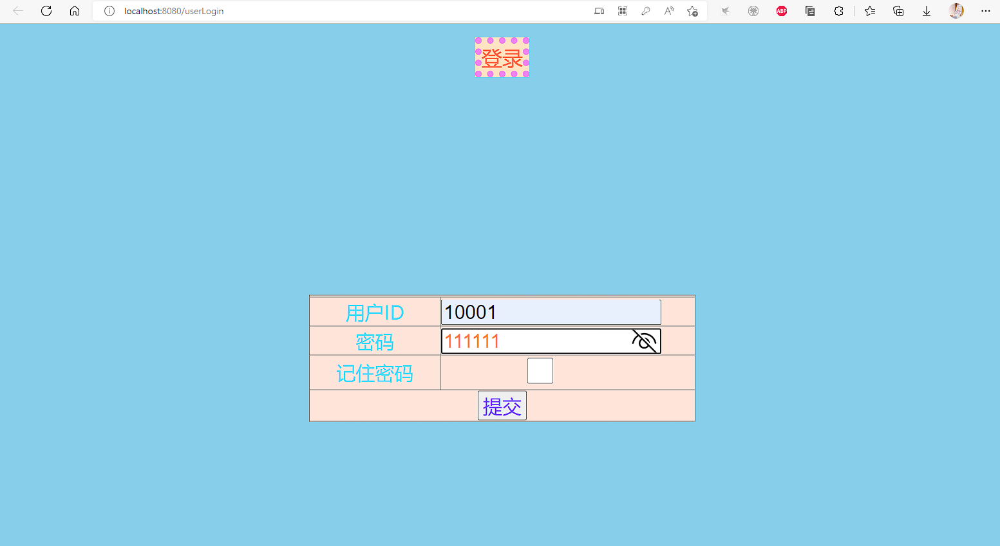


日志

```sh
2022-08-03 20:47:43.201  INFO 17400 --- [           main] o.s.b.w.embedded.tomcat.TomcatWebServer  : Tomcat started on port(s): 8080 (http) with context path ''
2022-08-03 20:47:43.211  INFO 17400 --- [           main] m.s.SpringSecurityDemoApplication        : Started SpringSecurityDemoApplication in 2.273 seconds (JVM running for 2.791)
2022-08-03 20:48:27.747  INFO 17400 --- [nio-8080-exec-1] o.a.c.c.C.[Tomcat].[localhost].[/]       : Initializing Spring DispatcherServlet 'dispatcherServlet'
2022-08-03 20:48:27.748  INFO 17400 --- [nio-8080-exec-1] o.s.web.servlet.DispatcherServlet        : Initializing Servlet 'dispatcherServlet'
2022-08-03 20:48:27.749  INFO 17400 --- [nio-8080-exec-1] o.s.web.servlet.DispatcherServlet        : Completed initialization in 1 ms
2022-08-03 20:48:27.820 DEBUG 17400 --- [nio-8080-exec-2] m.s.controller.PageController            : IP:0:0:0:0:0:0:0:1 get login page
2022-08-03 20:49:05.455 DEBUG 17400 --- [nio-8080-exec-5] m.s.service.AdministratorsLoginService   : 进入AdministratorsLoginService
2022-08-03 20:49:05.709 DEBUG 17400 --- [nio-8080-exec-5] m.s.m.A.selectList                       : ==>  Preparing: SELECT administrator_no,administrator_password FROM administrators_password WHERE (administrator_no = ?)
2022-08-03 20:49:05.724 DEBUG 17400 --- [nio-8080-exec-5] m.s.m.A.selectList                       : ==> Parameters: 10001(Long)
2022-08-03 20:49:05.738 DEBUG 17400 --- [nio-8080-exec-5] m.s.m.A.selectList                       : <==      Total: 1
```


## 解决logout问题

如果启用 CSRF 保护（默认），则请求也必须是 POST。这意味着默认情况下需要 POST "/logout" 来触发注销。如果禁用 CSRF 保护，则允许任何 HTTP 方法。
对任何更改状态（即注销）的操作使用 HTTP POST 以防止CSRF 攻击


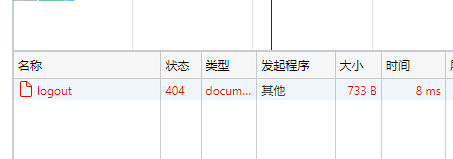


有两种解决方法：

* 方法一：使用post方式提交，可以发送一个空的表单，也可以发送ajax请求，推荐
* 方法二：将/logout路径设置成get请求


### 方法一


更改索引页面


表单方式


```html
<form class="logout" action="/logout" method="post">
    <input type="submit" value="退出登录">
</form>
```


ajax请求


```html
<!DOCTYPE html>

<!--
Project name(项目名称)：springSecurity_demo
  File name(文件名): index
  Authors(作者）: mao
  Author QQ：1296193245
  GitHub：https://github.com/maomao124/
  Date(创建日期)： 2022/8/1
  Time(创建时间)： 18:49
  Description(描述)： 无
-->

<html lang="en">
<head>
    <meta charset="UTF-8">
    <title>索引</title>
    <style>
        .logout {
            position: absolute;
            top: 1%;
            right: 0.5%;
            text-decoration: none;
            font-size: 2em;
            transition: all 1s linear 0s;
            color: royalblue;
        }

        .logout:hover {
            transition: all 1s linear 0s;
            color: red;
        }

    </style>
</head>
<body>

<h1>
    登录成功
</h1>

<!--<a class="logout" href="/logout">退出登录</a>-->

<!--<form class="logout" action="/logout" method="post">-->
<!--    <input type="submit" value="退出登录">-->
<!--</form>-->

<button class="logout" onclick="logout()" id="button">退出登录</button>

<script>

    //XMLHttpRequest对象
    let xhr;
    //是否正在发送请求
    let isSending = false;

    function logout()
    {
        //如果正在发送请求
        if (isSending === true)
        {
            //取消正在发送的请求
            xhr.abort();
        }

        //发起异步请求
        xhr = new XMLHttpRequest();
        //设置响应信息为json
        xhr.responseType = "json";
        //超时设置，单位为毫秒
        xhr.timeout = 5000;
        //超时的回调函数
        xhr.ontimeout = function ()
        {
            alert("请求超时，请稍后再试！");
        }
        //初始化，设置请求方式和url
        xhr.open("post", "/logout");
        //设置状态为正在发送
        isSending = true;
        //发送异步请求
        xhr.send();

        xhr.onreadystatechange = function ()
        {
            //状态为4时处理
            if (xhr.readyState === 4)
            {
                //落在200-300之间处理
                if (xhr.status >= 200 && xhr.status < 300)
                {
                    //将状态设置成false
                    isSending = false;
                    console.log(xhr.response);
                    location.assign("/thanks.html")
                }
            }
        }
    }

</script>

</body>
</html>
```


### 方法二


还原成get请求

```html
<a class="logout" href="/logout">退出登录</a>
```


更改SecurityConfig类

```java
package mao.springsecurity_demo.config;

import org.springframework.beans.factory.annotation.Autowired;
import org.springframework.context.annotation.Configuration;
import org.springframework.security.config.annotation.web.builders.HttpSecurity;
import org.springframework.security.config.annotation.web.configuration.WebSecurityConfigurerAdapter;
import org.springframework.security.core.userdetails.UserDetailsService;
import org.springframework.security.web.authentication.rememberme.PersistentTokenRepository;
import org.springframework.security.web.util.matcher.AntPathRequestMatcher;

/**
 * Project name(项目名称)：springSecurity_demo
 * Package(包名): mao.springsecurity_demo.config
 * Class(类名): SecurityConfig
 * Author(作者）: mao
 * Author QQ：1296193245
 * GitHub：https://github.com/maomao124/
 * Date(创建日期)： 2022/7/30
 * Time(创建时间)： 20:30
 * Version(版本): 1.0
 * Description(描述)： 无
 */

@Configuration
public class SecurityConfig extends WebSecurityConfigurerAdapter
{
    @Autowired
    private PersistentTokenRepository persistentTokenRepository;

    @Autowired
    private UserDetailsService userDetailsService;

    @Override
    protected void configure(HttpSecurity http) throws Exception
    {
        //表单登录配置
        http.formLogin()
                //设置登录页面
                .loginPage("/userLogin")
                //设置哪个是登录的 url
                .loginProcessingUrl("/login")
                //设置登录成功之后跳转到哪个 url
                .defaultSuccessUrl("/index.html", false)
                //.successForwardUrl("/index")
                //设置登录失败之后跳转到哪个url
                .failureUrl("/error.html")
                //.failureForwardUrl("fail")
                //设置表单的用户名项参数名称
                .usernameParameter("username")
                //设置表单的密码项参数名称
                .passwordParameter("password");

        //关闭csrf
        //如果启用csrf，则必须要在表单加入以下标签
        //<input type="hidden" th:if="${_csrf}!=null" th:value="${_csrf.token} " name="_csrf"/>
        //http.csrf().disable();

        //异常处理配置，403页面配置
        http.exceptionHandling().accessDeniedPage("/unAuth.html");

        //退出登录配置
        http.logout()
                //设置退出登录的url
                //如果启用 CSRF 保护（默认），则请求也必须是 POST。这意味着默认情况下需要 POST "/logout" 来触发注销。
                //如果禁用 CSRF 保护，则允许任何 HTTP 方法。
                //对任何更改状态（即注销）的操作使用 HTTP POST 以防止CSRF 攻击 被认为是最好的。
                //如果你真的想使用 HTTP GET，你可以使用logoutRequestMatcher(new AntPathRequestMatcher(logoutUrl, "GET"));
                //.logoutUrl("/logout")
                .logoutRequestMatcher(new AntPathRequestMatcher("/logout", "GET"))
                //设置退出登录成功后要跳转的url
                .logoutSuccessUrl("/thanks.html")
                .permitAll();

        //自动登录配置
        http.rememberMe()
                //指定要使用的PersistentTokenRepository 。默认是使用TokenBasedRememberMeServices
                .tokenRepository(persistentTokenRepository)
                //指定当记住我令牌有效时用于查找UserDetails的UserDetailsService
                .userDetailsService(userDetailsService)
                //设置有效期，单位是秒，默认是2周时间。即使项目重新启动下次也可以正常登录
                .tokenValiditySeconds(2 * 60 * 60)
                //设置表单的记住密码项参数名称，默认是remember-me
                .rememberMeParameter("remember-me");

        //认证配置
        http.authorizeRequests()
                //指定页面不需要验证
                .antMatchers("/login.html", "/login", "/error.html", "/thanks.html",
                        "/css/**", "/js/**", "/img/**",
                        "/test/noauth", "/test/anno5/**","/userLogin")
                .permitAll()
                .antMatchers("/test/root").hasAuthority("root")
                .antMatchers("/test/admin").hasAuthority("admin")
                .antMatchers("/test/rootOrAdmin").hasAnyAuthority("root", "admin")
                .antMatchers("/test/role_root").hasRole("root")
                .antMatchers("/test/role_root_or_admin").hasAnyRole("root", "admin")
                //其它请求都需要身份认证
                .anyRequest()
                .authenticated();

    }


/*
    @Bean
    public PasswordEncoder passwordEncoder()
    {
        return new BCryptPasswordEncoder();
    }
*/

}
```


重启服务


登录


进入索引页面后点击退出登录


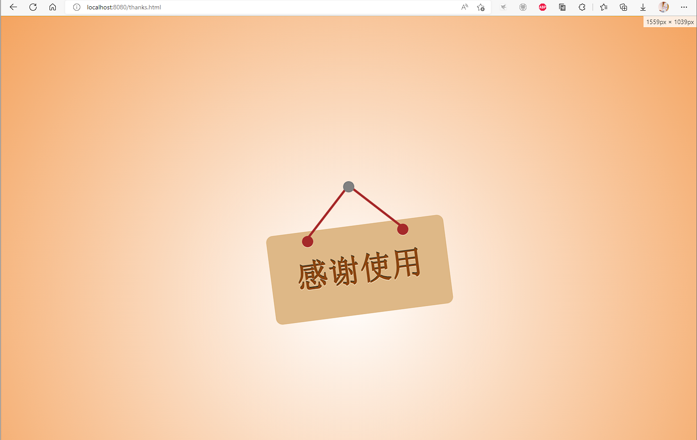


## 项目地址


https://github.com/maomao124/springSecurity_demo.git


# 微服务权限方案


## 认证授权过程分析

* 如果是基于 Session，那么 Spring-security 会对 cookie 里的 sessionid 进行解析，找到服务器存储的 session 信息，然后判断当前用户是否符合请求的要求
* 如果是基于 token，则是解析出 token，然后将当前请求加入到 Spring-security 管理的权限信息中去


如果系统的模块众多，每个模块都需要进行授权与认证，所以我们选择基于 token 的形式 进行授权与认证，用户根据用户名密码认证成功，然后获取当前用户角色的一系列权限 值，并以用户名为 key，权限列表为 value 的形式存入 redis 缓存中，根据用户名相关信息生成 token 返回，浏览器将 token 记录到 cookie 中，每次调用 api 接口都默认将 token 携带 到 header 请求头中，Spring-security 解析 header 头获取 token 信息，解析 token 获取当前 用户名，根据用户名就可以从 redis 中获取权限列表，这样 Spring-security 就能够判断当前请求是否有权限访问


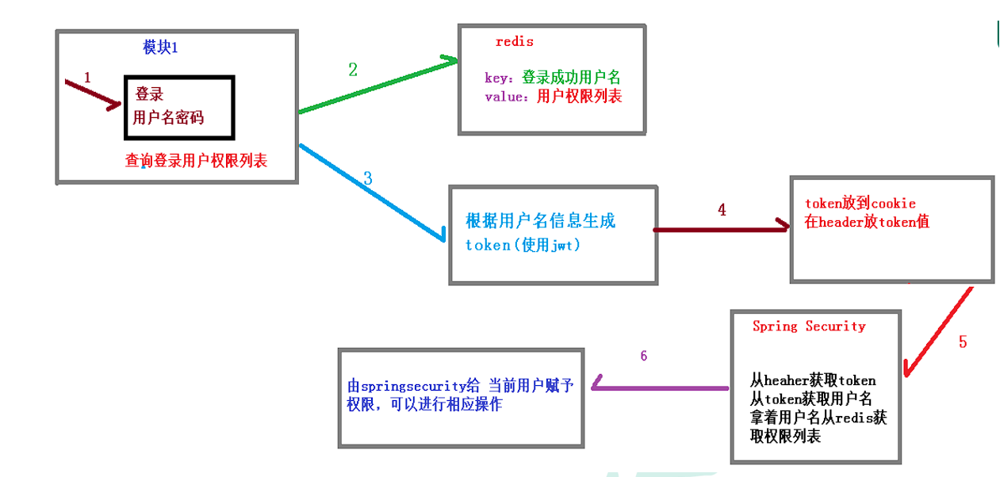


## 权限管理数据模型


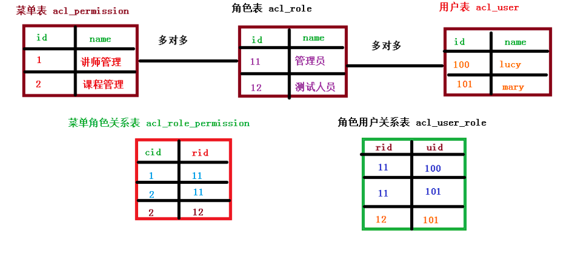


##  JWT


jwt分为三个部分：JWT 头、有效载荷和签名


### JWT 头

JWT 头部分是一个描述 JWT 元数据的 JSON 对象，通常如下所示

```json
{
  "alg": "HS256",
  "typ": "JWT"
}
```


* alg 属性表示签名使用的算法，默认为 HMAC SHA256（写为 HS256）

* typ 属性表示令牌的类型，JWT 令牌统一写为 JWT。

最后，使用 Base64 URL 算法将上述 JSON 对象转换为字符串保存


### 有效载荷

有效载荷部分，是 JWT 的主体内容部分，也是一个 JSON 对象，包含需要传递的数据。 JWT 指定七个默认字段供选择


* iss：发行人 
* exp：到期时间 
* sub：主题 
* aud：用户 
* nbf：在此之前不可用 
* iat：发布时间 
* jti：JWT ID，用于标识该 JWT


除以上默认字段外，我们还可以自定义私有字段，例如：

```json
{
 "sub": "1234567890",
 "name": "Helen",
 "admin": true
}
```


> 默认情况下 JWT 是未加密的，任何人都可以解读其内容，因此不要构建隐私信息 字段，存放保密信息，以防止信息泄露


### 签名哈希

签名哈希部分是对上面两部分数据签名，通过指定的算法生成哈希，以确保数据不会被篡改


首先，需要指定一个密码（secret）。该密码仅仅为保存在服务器中，并且不能向用户公 开。然后，使用标头中指定的签名算法（默认情况下为 HMAC SHA256）根据以下公式生成 签名。


```
HMACSHA256(base64UrlEncode(header) + "." + base64UrlEncode(claims), secret)
```


在计算出签名哈希后，JWT 头，有效载荷和签名哈希的三个部分组合成一个字符串，每个 部分用"."分隔，就构成整个 JWT 对象


### Base64URL 算法

JWT 头和有效载荷序列化的算法都用到了 Base64URL。该算法和常见 Base64 算法类似，稍有差别


作为令牌的 JWT 可以放在 URL 中（例如 api.example/?token=xxx）。 Base64 中用的三个 字符是"+"，"/"和"="，由于在 URL 中有特殊含义，因此 Base64URL 中对他们做了替换： "="去掉，"+"用"-"替换，"/"用"_"替换，这就是 Base64URL 算法。


### 认证流程

* 首先，前端通过Web表单将自己的用户名和密码发送到后端的接口，这个过程一般是一个POST请求。建议的方式是通过SSL加密的传输(HTTPS)，从而避免敏感信息被嗅探
* 后端核对用户名和密码成功后，将包含用户信息的数据作为JWT的Payload，将其与JWT Header分别进行Base64编码拼接后签名，形成一个JWT Token，形成的JWT Token就是一个如同lll.zzz.xxx的字符串
* 后端将JWT Token字符串作为登录成功的结果返回给前端。前端可以将返回的结果保存在浏览器中，退出登录时删除保存的JWT Token即可
* 前端在每次请求时将JWT Token放入HTTP请求头中的Authorization属性中(解决XSS和XSRF问题)
* 后端检查前端传过来的JWT Token，验证其有效性，比如检查签名是否正确、是否过期、token的接收方是否是自己等等
* 验证通过后，后端解析出JWT Token中包含的用户信息，进行其他逻辑操作(一般是根据用户信息得到权限等)，返回结果


### 优势

对比传统的session认证方式，JWT的优势是：

* 简洁：JWT Token数据量小，传输速度也很快。因为JWT Token是以JSON加密形式保存在客户端的，所以JWT是跨语言的，原则上任何web形式都支持
* 不需要在服务端保存会话信息，也就是说不依赖于cookie和session，所以没有了传统session认证的弊端，特别适用于分布式微服务
* 单点登录友好：使用Session进行身份认证的话，由于cookie无法跨域，难以实现单点登录。但是，使用token进行认证的话， token可以被保存在客户端的任意位置的内存中，不一定是cookie，所以不依赖cookie，不会存在这些问题
* 适合移动端应用：使用Session进行身份认证的话，需要保存一份信息在服务器端，而且这种方式会依赖到Cookie（需要 Cookie 保存 SessionId），所以不适合移动端
  


## 实现


### 创建工程


创建项目


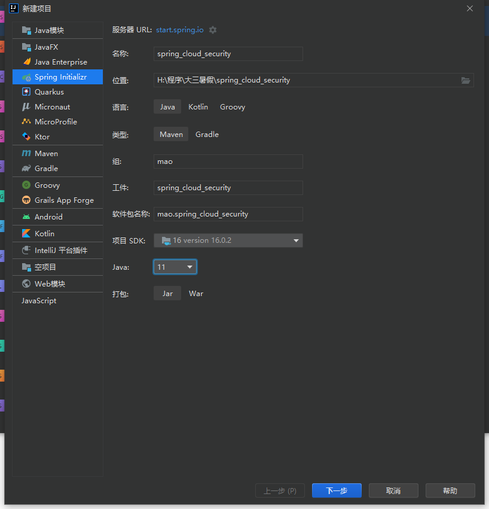


创建子模块


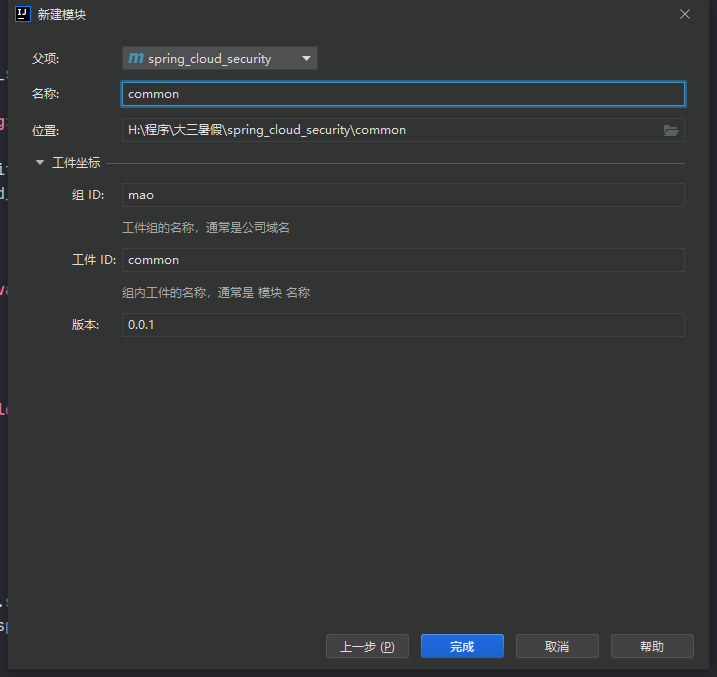


创建子模块


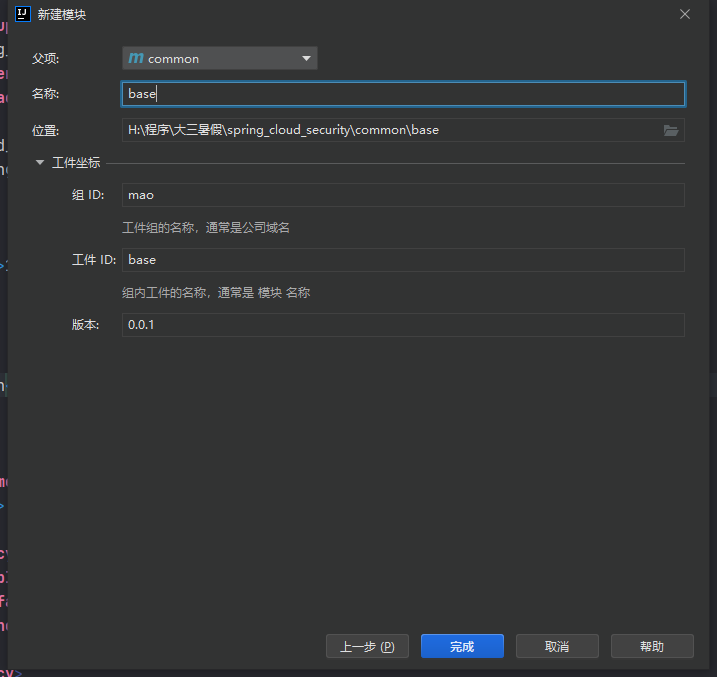


创建子模块

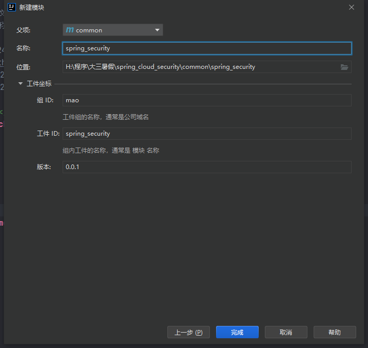


创建子模块

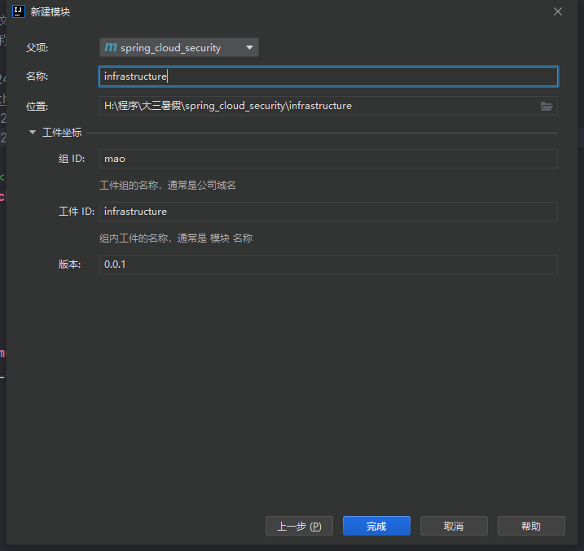


创建子模块


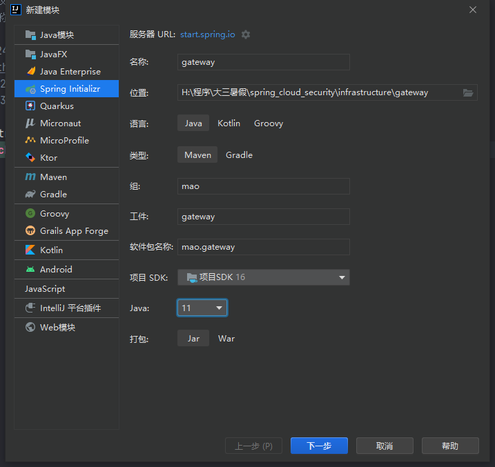


创建子模块

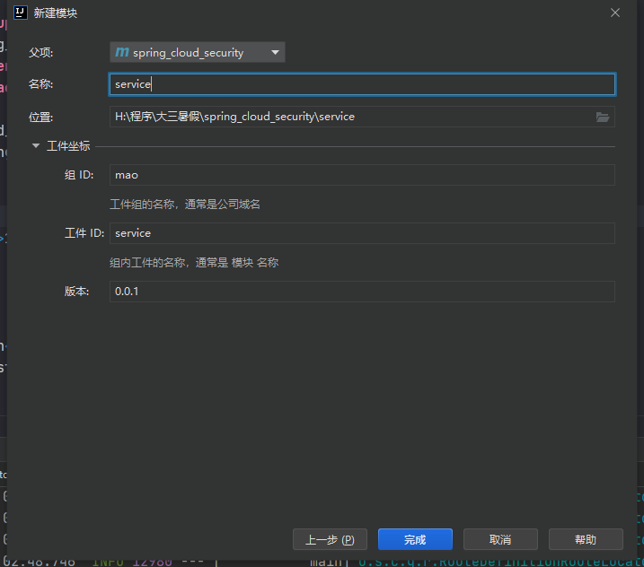

创建子模块

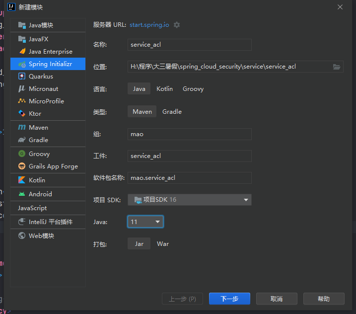


项目结构：


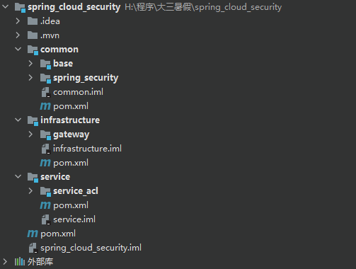


### 编写pom文件


spring_cloud_security


```xml
<?xml version="1.0" encoding="UTF-8"?>
<project xmlns="http://maven.apache.org/POM/4.0.0" xmlns:xsi="http://www.w3.org/2001/XMLSchema-instance"
         xsi:schemaLocation="http://maven.apache.org/POM/4.0.0 https://maven.apache.org/xsd/maven-4.0.0.xsd">
    <modelVersion>4.0.0</modelVersion>


    <parent>
        <groupId>org.springframework.boot</groupId>
        <artifactId>spring-boot-starter-parent</artifactId>
        <version>2.3.9.RELEASE</version>
        <relativePath/> <!-- lookup parent from repository -->
    </parent>

    <groupId>mao</groupId>
    <artifactId>spring_cloud_security</artifactId>
    <version>0.0.1</version>
    <packaging>pom</packaging>

    <name>spring_cloud_security</name>
    <description>spring_cloud_security</description>


    <properties>
        <java.version>11</java.version>
    </properties>


    <modules>
        <module>common</module>
        <module>infrastructure</module>
        <module>service</module>
    </modules>


    <dependencyManagement>
        <dependencies>

            <!--spring-cloud项目依赖-->
            <dependency>
                <groupId>org.springframework.cloud</groupId>
                <artifactId>spring-cloud-dependencies</artifactId>
                <version>Hoxton.SR10</version>
                <type>pom</type>
                <scope>import</scope>
            </dependency>

            <!--spring-cloud-alilbaba管理依赖-->
            <dependency>
                <groupId>com.alibaba.cloud</groupId>
                <artifactId>spring-cloud-alibaba-dependencies</artifactId>
                <version>2.2.6.RELEASE</version>
                <type>pom</type>
                <scope>import</scope>
            </dependency>

            <!--mysql依赖 spring-boot-->
            <dependency>
                <groupId>mysql</groupId>
                <artifactId>mysql-connector-java</artifactId>
                <version>8.0.27</version>
                <scope>runtime</scope>
            </dependency>

            <!--spring-boot druid连接池依赖-->
            <dependency>
                <groupId>com.alibaba</groupId>
                <artifactId>druid-spring-boot-starter</artifactId>
                <version>1.2.8</version>
            </dependency>

            <!--spring-boot mybatis-plus依赖-->
            <dependency>
                <groupId>com.baomidou</groupId>
                <artifactId>mybatis-plus-boot-starter</artifactId>
                <version>3.5.1</version>
            </dependency>

            <!--阿里巴巴的FastJson json解析-->
            <dependency>
                <groupId>com.alibaba</groupId>
                <artifactId>fastjson</artifactId>
                <version>1.2.79</version>
            </dependency>

            <!--mybatis-plus代码生成器-->
            <dependency>
                <groupId>com.baomidou</groupId>
                <artifactId>mybatis-plus-generator</artifactId>
                <version>3.5.1</version>
            </dependency>
            <!-- 模板引擎 默认 -->
            <dependency>
                <groupId>org.apache.velocity</groupId>
                <artifactId>velocity-engine-core</artifactId>
                <version>2.3</version>
            </dependency>
            <!--swagger-->
            <dependency>
                <groupId>io.springfox</groupId>
                <artifactId>springfox-swagger2</artifactId>
                <version>2.7.0</version>
            </dependency>

            <!--jwt 依赖-->
            <dependency>
                <groupId>io.jsonwebtoken</groupId>
                <artifactId>jjwt</artifactId>
                <version>0.9.1</version>
            </dependency>

        </dependencies>
    </dependencyManagement>

    <dependencies>

        <!--spring-boot lombok-->
        <dependency>
            <groupId>org.projectlombok</groupId>
            <artifactId>lombok</artifactId>
            <version>1.18.20</version>
            <optional>true</optional>
        </dependency>

    </dependencies>

</project>

```


common

```xml
<?xml version="1.0" encoding="UTF-8"?>
<project xmlns="http://maven.apache.org/POM/4.0.0"
         xmlns:xsi="http://www.w3.org/2001/XMLSchema-instance"
         xsi:schemaLocation="http://maven.apache.org/POM/4.0.0 http://maven.apache.org/xsd/maven-4.0.0.xsd">


    <parent>
        <artifactId>spring_cloud_security</artifactId>
        <groupId>mao</groupId>
        <version>0.0.1</version>
    </parent>

    <modelVersion>4.0.0</modelVersion>
    <!--
      -maven项目核心配置文件-
    Project name(项目名称)：spring_cloud_security
    Author(作者）: mao
    Author QQ：1296193245
    GitHub：https://github.com/maomao124/
    Date(创建日期)： 2022/8/4
    Time(创建时间)： 21:24
    -->
    <artifactId>common</artifactId>
    <packaging>pom</packaging>


    <properties>

    </properties>

    <modules>
        <module>base</module>
        <module>spring_security</module>
    </modules>

    <dependencies>

    </dependencies>


</project>
```


base

```xml
<?xml version="1.0" encoding="UTF-8"?>
<project xmlns="http://maven.apache.org/POM/4.0.0"
         xmlns:xsi="http://www.w3.org/2001/XMLSchema-instance"
         xsi:schemaLocation="http://maven.apache.org/POM/4.0.0 http://maven.apache.org/xsd/maven-4.0.0.xsd">

    <parent>
        <artifactId>common</artifactId>
        <groupId>mao</groupId>
        <version>0.0.1</version>
    </parent>

    <modelVersion>4.0.0</modelVersion>

    <!--
      -maven项目核心配置文件-
    Project name(项目名称)：spring_cloud_security
    Author(作者）: mao
    Author QQ：1296193245
    GitHub：https://github.com/maomao124/
    Date(创建日期)： 2022/8/4
    Time(创建时间)： 21:29
    -->
    <artifactId>base</artifactId>


    <properties>

    </properties>

    <dependencies>

        <dependency>
            <groupId>org.springframework.boot</groupId>
            <artifactId>spring-boot-starter-web</artifactId>
        </dependency>

        <!--spring-boot mybatis-plus依赖-->
        <dependency>
            <groupId>com.baomidou</groupId>
            <artifactId>mybatis-plus-boot-starter</artifactId>
        </dependency>

        <dependency>
            <groupId>org.springframework.boot</groupId>
            <artifactId>spring-boot-starter-test</artifactId>
            <scope>test</scope>
        </dependency>

    </dependencies>


</project>
```


spring_security

```xml
<?xml version="1.0" encoding="UTF-8"?>
<project xmlns="http://maven.apache.org/POM/4.0.0"
         xmlns:xsi="http://www.w3.org/2001/XMLSchema-instance"
         xsi:schemaLocation="http://maven.apache.org/POM/4.0.0 http://maven.apache.org/xsd/maven-4.0.0.xsd">
    <parent>
        <artifactId>common</artifactId>
        <groupId>mao</groupId>
        <version>0.0.1</version>
    </parent>

    <modelVersion>4.0.0</modelVersion>
    <!--
      -maven项目核心配置文件-
    Project name(项目名称)：spring_cloud_security
    Author(作者）: mao
    Author QQ：1296193245
    GitHub：https://github.com/maomao124/
    Date(创建日期)： 2022/8/4
    Time(创建时间)： 21:31
    -->

    <artifactId>spring_security</artifactId>


    <properties>

    </properties>

    <dependencies>

        <!--mybatis-plus代码生成器-->
        <dependency>
            <groupId>com.baomidou</groupId>
            <artifactId>mybatis-plus-generator</artifactId>
        </dependency>
        <!-- 模板引擎 默认 -->
        <dependency>
            <groupId>org.apache.velocity</groupId>
            <artifactId>velocity-engine-core</artifactId>
        </dependency>
        <!--swagger-->
        <dependency>
            <groupId>io.springfox</groupId>
            <artifactId>springfox-swagger2</artifactId>
        </dependency>

        <!-- spring mao.spring_security.security 安全框架依赖 -->
        <dependency>
            <groupId>org.springframework.boot</groupId>
            <artifactId>spring-boot-starter-security</artifactId>
        </dependency>

        <!-- spring mao.spring_security.security 安全框架测试依赖 -->
        <dependency>
            <groupId>org.springframework.security</groupId>
            <artifactId>spring-security-test</artifactId>
            <scope>test</scope>
        </dependency>

        <!--spring boot redis 依赖-->
        <dependency>
            <groupId>org.springframework.boot</groupId>
            <artifactId>spring-boot-starter-data-redis</artifactId>
        </dependency>

        <dependency>
            <groupId>io.jsonwebtoken</groupId>
            <artifactId>jjwt</artifactId>
        </dependency>

        <!-- 测试框架 -->
        <dependency>
            <groupId>org.junit.jupiter</groupId>
            <artifactId>junit-jupiter</artifactId>
            <version>RELEASE</version>
            <scope>test</scope>
        </dependency>

        <!--阿里巴巴的FastJson json解析-->
        <dependency>
            <groupId>com.alibaba</groupId>
            <artifactId>fastjson</artifactId>
        </dependency>

        <dependency>
            <groupId>javax.xml.bind</groupId>
            <artifactId>jaxb-api</artifactId>
            <version>2.3.0</version>
        </dependency>
        <dependency>
            <groupId>com.sun.xml.bind</groupId>
            <artifactId>jaxb-impl</artifactId>
            <version>2.3.0</version>
        </dependency>
        <dependency>
            <groupId>com.sun.xml.bind</groupId>
            <artifactId>jaxb-core</artifactId>
            <version>2.3.0</version>
        </dependency>
        <dependency>
            <groupId>javax.activation</groupId>
            <artifactId>activation</artifactId>
            <version>1.1.1</version>
        </dependency>

        <dependency>
            <groupId>mao</groupId>
            <artifactId>base</artifactId>
            <version>0.0.1</version>
        </dependency>

    </dependencies>


</project>
```


infrastructure

```xml
<?xml version="1.0" encoding="UTF-8"?>
<project xmlns="http://maven.apache.org/POM/4.0.0"
         xmlns:xsi="http://www.w3.org/2001/XMLSchema-instance"
         xsi:schemaLocation="http://maven.apache.org/POM/4.0.0 http://maven.apache.org/xsd/maven-4.0.0.xsd">

    <parent>
        <artifactId>spring_cloud_security</artifactId>
        <groupId>mao</groupId>
        <version>0.0.1</version>
    </parent>

    <modelVersion>4.0.0</modelVersion>
    <!--
      -maven项目核心配置文件-
    Project name(项目名称)：spring_cloud_security
    Author(作者）: mao
    Author QQ：1296193245
    GitHub：https://github.com/maomao124/
    Date(创建日期)： 2022/8/4
    Time(创建时间)： 21:33
    -->
    <artifactId>infrastructure</artifactId>
    <packaging>pom</packaging>


    <properties>

    </properties>

    <modules>
        <module>gateway</module>
    </modules>

    <dependencies>

    </dependencies>


</project>
```


gateway

```xml
<?xml version="1.0" encoding="UTF-8"?>
<project xmlns="http://maven.apache.org/POM/4.0.0"
         xmlns:xsi="http://www.w3.org/2001/XMLSchema-instance"
         xsi:schemaLocation="http://maven.apache.org/POM/4.0.0 https://maven.apache.org/xsd/maven-4.0.0.xsd">
    <modelVersion>4.0.0</modelVersion>

    <parent>
        <groupId>mao</groupId>
        <artifactId>infrastructure</artifactId>
        <version>0.0.1</version>
    </parent>


    <artifactId>gateway</artifactId>
    <name>gateway</name>
    <description>gateway</description>

    <properties>

    </properties>

    <dependencies>

        <dependency>
            <groupId>org.springframework.boot</groupId>
            <artifactId>spring-boot-starter</artifactId>
        </dependency>

        <dependency>
            <groupId>org.springframework.boot</groupId>
            <artifactId>spring-boot-starter-test</artifactId>
        </dependency>

        <!--gateway 网关依赖-->
        <dependency>
            <groupId>org.springframework.cloud</groupId>
            <artifactId>spring-cloud-starter-gateway</artifactId>
        </dependency>

        <!-- nacos 客户端依赖 -->
        <dependency>
            <groupId>com.alibaba.cloud</groupId>
            <artifactId>spring-cloud-starter-alibaba-nacos-discovery</artifactId>
        </dependency>

    </dependencies>

    <build>
        <plugins>
            <plugin>
                <groupId>org.springframework.boot</groupId>
                <artifactId>spring-boot-maven-plugin</artifactId>
            </plugin>
        </plugins>
    </build>

</project>

```


service

```xml
<?xml version="1.0" encoding="UTF-8"?>
<project xmlns="http://maven.apache.org/POM/4.0.0"
         xmlns:xsi="http://www.w3.org/2001/XMLSchema-instance"
         xsi:schemaLocation="http://maven.apache.org/POM/4.0.0 http://maven.apache.org/xsd/maven-4.0.0.xsd">

    <parent>
        <artifactId>spring_cloud_security</artifactId>
        <groupId>mao</groupId>
        <version>0.0.1</version>
    </parent>

    <modelVersion>4.0.0</modelVersion>
    <!--
      -maven项目核心配置文件-
    Project name(项目名称)：spring_cloud_security
    Author(作者）: mao
    Author QQ：1296193245
    GitHub：https://github.com/maomao124/
    Date(创建日期)： 2022/8/4
    Time(创建时间)： 22:05
    -->
    <artifactId>service</artifactId>
    <packaging>pom</packaging>


    <properties>

    </properties>

    <modules>
        <module>service_acl</module>
    </modules>


    <dependencies>

    </dependencies>


</project>
```


service_acl

```xml
<?xml version="1.0" encoding="UTF-8"?>
<project xmlns="http://maven.apache.org/POM/4.0.0" xmlns:xsi="http://www.w3.org/2001/XMLSchema-instance"
         xsi:schemaLocation="http://maven.apache.org/POM/4.0.0 https://maven.apache.org/xsd/maven-4.0.0.xsd">
    <modelVersion>4.0.0</modelVersion>
    <parent>
        <groupId>mao</groupId>
        <artifactId>service</artifactId>
        <version>0.0.1</version>
    </parent>


    <artifactId>service_acl</artifactId>
    <name>service_acl</name>
    <description>service_acl</description>

    <properties>

    </properties>

    <dependencies>

        <dependency>
            <groupId>org.springframework.boot</groupId>
            <artifactId>spring-boot-starter-web</artifactId>
        </dependency>

        <dependency>
            <groupId>org.springframework.boot</groupId>
            <artifactId>spring-boot-starter-test</artifactId>
            <scope>test</scope>
        </dependency>

        <dependency>
            <groupId>mao</groupId>
            <artifactId>spring_security</artifactId>
            <version>0.0.1</version>
        </dependency>

        <!--mysql依赖 spring-boot-->
        <dependency>
            <groupId>mysql</groupId>
            <artifactId>mysql-connector-java</artifactId>
            <scope>runtime</scope>
        </dependency>

        <!--spring-boot druid连接池依赖-->
        <dependency>
            <groupId>com.alibaba</groupId>
            <artifactId>druid-spring-boot-starter</artifactId>
        </dependency>

        <!--spring-boot mybatis-plus依赖-->
        <dependency>
            <groupId>com.baomidou</groupId>
            <artifactId>mybatis-plus-boot-starter</artifactId>
        </dependency>

        <!--mybatis-plus代码生成器-->
        <dependency>
            <groupId>com.baomidou</groupId>
            <artifactId>mybatis-plus-generator</artifactId>
        </dependency>
        <!-- 模板引擎 默认 -->
        <dependency>
            <groupId>org.apache.velocity</groupId>
            <artifactId>velocity-engine-core</artifactId>
        </dependency>
        <!--swagger-->
        <dependency>
            <groupId>io.springfox</groupId>
            <artifactId>springfox-swagger2</artifactId>
        </dependency>

        <!-- nacos 客户端依赖 -->
        <dependency>
            <groupId>com.alibaba.cloud</groupId>
            <artifactId>spring-cloud-starter-alibaba-nacos-discovery</artifactId>
        </dependency>

        <!--阿里巴巴的FastJson json解析-->
        <dependency>
            <groupId>com.alibaba</groupId>
            <artifactId>fastjson</artifactId>
        </dependency>

        <!--spring boot redis 依赖-->
        <dependency>
            <groupId>org.springframework.boot</groupId>
            <artifactId>spring-boot-starter-data-redis</artifactId>
        </dependency>

        <dependency>
            <groupId>mao</groupId>
            <artifactId>base</artifactId>
            <version>0.0.1</version>
        </dependency>


    </dependencies>

    <build>
        <plugins>
            <plugin>
                <groupId>org.springframework.boot</groupId>
                <artifactId>spring-boot-maven-plugin</artifactId>
            </plugin>
        </plugins>
    </build>

</project>

```


### sql

数据库名称：spring_cloud_security


```sql
#
# Structure for table "acl_permission"
#

CREATE TABLE `acl_permission`
(
    `id`               char(19)            NOT NULL DEFAULT '' COMMENT '编号',
    `pid`              char(19)            NOT NULL DEFAULT '' COMMENT '所属上级',
    `name`             varchar(20)         NOT NULL DEFAULT '' COMMENT '名称',
    `type`             tinyint(3)          NOT NULL DEFAULT '0' COMMENT '类型(1:菜单,2:按钮)',
    `permission_value` varchar(50)                  DEFAULT NULL COMMENT '权限值',
    `path`             varchar(100)                 DEFAULT NULL COMMENT '访问路径',
    `component`        varchar(100)                 DEFAULT NULL COMMENT '组件路径',
    `icon`             varchar(50)                  DEFAULT NULL COMMENT '图标',
    `status`           tinyint(4)                   DEFAULT NULL COMMENT '状态(0:禁止,1:正常)',
    `is_deleted`       tinyint(1) unsigned NOT NULL DEFAULT '0' COMMENT '逻辑删除 1（true）已删除， 0（false）未删除',
    `gmt_create`       datetime                     DEFAULT NULL COMMENT '创建时间',
    `gmt_modified`     datetime                     DEFAULT NULL COMMENT '更新时间',
    PRIMARY KEY (`id`),
    KEY `idx_pid` (`pid`)
) ENGINE = InnoDB
  DEFAULT CHARSET = utf8mb4 COMMENT ='权限';

#
# Data for table "acl_permission"
#

INSERT INTO `acl_permission`
VALUES ('1', '0', '全部数据', 0, NULL, NULL, NULL, NULL, NULL, 0, '2019-11-15 17:13:06', '2019-11-15 17:13:06'),
       ('1195268474480156673', '1', '权限管理', 1, NULL, '/acl', 'Layout', NULL, NULL, 0, '2019-11-15 17:13:06',
        '2019-11-18 13:54:25'),
       ('1195268616021139457', '1195268474480156673', '用户管理', 1, NULL, 'user/list', '/acl/user/list', NULL, NULL, 0,
        '2019-11-15 17:13:40', '2019-11-18 13:53:12'),
       ('1195268788138598401', '1195268474480156673', '角色管理', 1, NULL, 'role/list', '/acl/role/list', NULL, NULL, 0,
        '2019-11-15 17:14:21', '2019-11-15 17:14:21'),
       ('1195268893830864898', '1195268474480156673', '菜单管理', 1, NULL, 'menu/list', '/acl/menu/list', NULL, NULL, 0,
        '2019-11-15 17:14:46', '2019-11-15 17:14:46'),
       ('1195269143060602882', '1195268616021139457', '查看', 2, 'user.list', '', '', NULL, NULL, 0,
        '2019-11-15 17:15:45', '2019-11-17 21:57:16'),
       ('1195269295926206466', '1195268616021139457', '添加', 2, 'user.add', 'user/add', '/acl/user/form', NULL, NULL, 0,
        '2019-11-15 17:16:22', '2019-11-15 17:16:22'),
       ('1195269473479483394', '1195268616021139457', '修改', 2, 'user.update', 'user/update/:id', '/acl/user/form', NULL,
        NULL, 0, '2019-11-15 17:17:04', '2019-11-15 17:17:04'),
       ('1195269547269873666', '1195268616021139457', '删除', 2, 'user.remove', '', '', NULL, NULL, 0,
        '2019-11-15 17:17:22', '2019-11-15 17:17:22'),
       ('1195269821262782465', '1195268788138598401', '修改', 2, 'role.update', 'role/update/:id', '/acl/role/form', NULL,
        NULL, 0, '2019-11-15 17:18:27', '2019-11-15 17:19:53'),
       ('1195269903542444034', '1195268788138598401', '查看', 2, 'role.list', '', '', NULL, NULL, 0,
        '2019-11-15 17:18:47', '2019-11-15 17:18:47'),
       ('1195270037005197313', '1195268788138598401', '添加', 2, 'role.add', 'role/add', '/acl/role/form', NULL, NULL, 0,
        '2019-11-15 17:19:19', '2019-11-18 11:05:42'),
       ('1195270442602782721', '1195268788138598401', '删除', 2, 'role.remove', '', '', NULL, NULL, 0,
        '2019-11-15 17:20:55', '2019-11-15 17:20:55'),
       ('1195270621548568578', '1195268788138598401', '角色权限', 2, 'role.acl', 'role/distribution/:id',
        '/acl/role/roleForm', NULL, NULL, 0, '2019-11-15 17:21:38', '2019-11-15 17:21:38'),
       ('1195270744097742849', '1195268893830864898', '查看', 2, 'permission.list', '', '', NULL, NULL, 0,
        '2019-11-15 17:22:07', '2019-11-15 17:22:07'),
       ('1195270810560684034', '1195268893830864898', '添加', 2, 'permission.add', '', '', NULL, NULL, 0,
        '2019-11-15 17:22:23', '2019-11-15 17:22:23'),
       ('1195270862100291586', '1195268893830864898', '修改', 2, 'permission.update', '', '', NULL, NULL, 0,
        '2019-11-15 17:22:35', '2019-11-15 17:22:35'),
       ('1195270887933009922', '1195268893830864898', '删除', 2, 'permission.remove', '', '', NULL, NULL, 0,
        '2019-11-15 17:22:41', '2019-11-15 17:22:41'),
       ('1195349439240048642', '1', '讲师管理', 1, NULL, '/edu/teacher', 'Layout', NULL, NULL, 0, '2019-11-15 22:34:49',
        '2019-11-15 22:34:49'),
       ('1195349699995734017', '1195349439240048642', '讲师列表', 1, NULL, 'list', '/edu/teacher/list', NULL, NULL, 0,
        '2019-11-15 22:35:52', '2019-11-15 22:35:52'),
       ('1195349810561781761', '1195349439240048642', '添加讲师', 1, NULL, 'create', '/edu/teacher/form', NULL, NULL, 0,
        '2019-11-15 22:36:18', '2019-11-15 22:36:18'),
       ('1195349876252971010', '1195349810561781761', '添加', 2, 'teacher.add', '', '', NULL, NULL, 0,
        '2019-11-15 22:36:34', '2019-11-15 22:36:34'),
       ('1195349979797753857', '1195349699995734017', '查看', 2, 'teacher.list', '', '', NULL, NULL, 0,
        '2019-11-15 22:36:58', '2019-11-15 22:36:58'),
       ('1195350117270261762', '1195349699995734017', '修改', 2, 'teacher.update', 'edit/:id', '/edu/teacher/form', NULL,
        NULL, 0, '2019-11-15 22:37:31', '2019-11-15 22:37:31'),
       ('1195350188359520258', '1195349699995734017', '删除', 2, 'teacher.remove', '', '', NULL, NULL, 0,
        '2019-11-15 22:37:48', '2019-11-15 22:37:48'),
       ('1195350299365969922', '1', '课程分类', 1, NULL, '/edu/subject', 'Layout', NULL, NULL, 0, '2019-11-15 22:38:15',
        '2019-11-15 22:38:15'),
       ('1195350397751758850', '1195350299365969922', '课程分类列表', 1, NULL, 'list', '/edu/subject/list', NULL, NULL, 0,
        '2019-11-15 22:38:38', '2019-11-15 22:38:38'),
       ('1195350500512206850', '1195350299365969922', '导入课程分类', 1, NULL, 'import', '/edu/subject/import', NULL, NULL, 0,
        '2019-11-15 22:39:03', '2019-11-15 22:39:03'),
       ('1195350612172967938', '1195350397751758850', '查看', 2, 'subject.list', '', '', NULL, NULL, 0,
        '2019-11-15 22:39:29', '2019-11-15 22:39:29'),
       ('1195350687590748161', '1195350500512206850', '导入', 2, 'subject.import', '', '', NULL, NULL, 0,
        '2019-11-15 22:39:47', '2019-11-15 22:39:47'),
       ('1195350831744782337', '1', '课程管理', 1, NULL, '/edu/course', 'Layout', NULL, NULL, 0, '2019-11-15 22:40:21',
        '2019-11-15 22:40:21'),
       ('1195350919074385921', '1195350831744782337', '课程列表', 1, NULL, 'list', '/edu/course/list', NULL, NULL, 0,
        '2019-11-15 22:40:42', '2019-11-15 22:40:42'),
       ('1195351020463296513', '1195350831744782337', '发布课程', 1, NULL, 'info', '/edu/course/info', NULL, NULL, 0,
        '2019-11-15 22:41:06', '2019-11-15 22:41:06'),
       ('1195351159672246274', '1195350919074385921', '完成发布', 2, 'course.publish', 'publish/:id', '/edu/course/publish',
        NULL, NULL, 0, '2019-11-15 22:41:40', '2019-11-15 22:44:01'),
       ('1195351326706208770', '1195350919074385921', '编辑课程', 2, 'course.update', 'info/:id', '/edu/course/info', NULL,
        NULL, 0, '2019-11-15 22:42:19', '2019-11-15 22:42:19'),
       ('1195351566221938690', '1195350919074385921', '编辑课程大纲', 2, 'chapter.update', 'chapter/:id',
        '/edu/course/chapter', NULL, NULL, 0, '2019-11-15 22:43:17', '2019-11-15 22:43:17'),
       ('1195351862889254913', '1', '统计分析', 1, NULL, '/statistics/daily', 'Layout', NULL, NULL, 0,
        '2019-11-15 22:44:27', '2019-11-15 22:44:27'),
       ('1195351968841568257', '1195351862889254913', '生成统计', 1, NULL, 'create', '/statistics/daily/create', NULL, NULL,
        0, '2019-11-15 22:44:53', '2019-11-15 22:44:53'),
       ('1195352054917074946', '1195351862889254913', '统计图表', 1, NULL, 'chart', '/statistics/daily/chart', NULL, NULL,
        0, '2019-11-15 22:45:13', '2019-11-15 22:45:13'),
       ('1195352127734386690', '1195352054917074946', '查看', 2, 'daily.list', '', '', NULL, NULL, 0,
        '2019-11-15 22:45:30', '2019-11-15 22:45:30'),
       ('1195352215768633346', '1195351968841568257', '生成', 2, 'daily.add', '', '', NULL, NULL, 0,
        '2019-11-15 22:45:51', '2019-11-15 22:45:51'),
       ('1195352547621965825', '1', 'CMS管理', 1, NULL, '/cms', 'Layout', NULL, NULL, 0, '2019-11-15 22:47:11',
        '2019-11-18 10:51:46'),
       ('1195352856645701633', '1195353513549205505', '查看', 2, 'banner.list', '', NULL, NULL, NULL, 0,
        '2019-11-15 22:48:24', '2019-11-15 22:48:24'),
       ('1195352909401657346', '1195353513549205505', '添加', 2, 'banner.add', 'banner/add', '/cms/banner/form', NULL,
        NULL, 0, '2019-11-15 22:48:37', '2019-11-18 10:52:10'),
       ('1195353051395624961', '1195353513549205505', '修改', 2, 'banner.update', 'banner/update/:id', '/cms/banner/form',
        NULL, NULL, 0, '2019-11-15 22:49:11', '2019-11-18 10:52:05'),
       ('1195353513549205505', '1195352547621965825', 'Bander列表', 1, NULL, 'banner/list', '/cms/banner/list', NULL,
        NULL, 0, '2019-11-15 22:51:01', '2019-11-18 10:51:29'),
       ('1195353672110673921', '1195353513549205505', '删除', 2, 'banner.remove', '', '', NULL, NULL, 0,
        '2019-11-15 22:51:39', '2019-11-15 22:51:39'),
       ('1195354076890370050', '1', '订单管理', 1, NULL, '/order', 'Layout', NULL, NULL, 0, '2019-11-15 22:53:15',
        '2019-11-15 22:53:15'),
       ('1195354153482555393', '1195354076890370050', '订单列表', 1, NULL, 'list', '/order/list', NULL, NULL, 0,
        '2019-11-15 22:53:33', '2019-11-15 22:53:58'),
       ('1195354315093282817', '1195354153482555393', '查看', 2, 'order.list', '', '', NULL, NULL, 0,
        '2019-11-15 22:54:12', '2019-11-15 22:54:12'),
       ('1196301740985311234', '1195268616021139457', '分配角色', 2, 'user.assgin', 'user/role/:id', '/acl/user/roleForm',
        NULL, NULL, 0, '2019-11-18 13:38:56', '2019-11-18 13:38:56');

#
# Structure for table "acl_role"
#

CREATE TABLE `acl_role`
(
    `id`           char(19)            NOT NULL DEFAULT '' COMMENT '角色id',
    `role_name`    varchar(20)         NOT NULL DEFAULT '' COMMENT '角色名称',
    `role_code`    varchar(20)                  DEFAULT NULL COMMENT '角色编码',
    `remark`       varchar(255)                 DEFAULT NULL COMMENT '备注',
    `is_deleted`   tinyint(1) unsigned NOT NULL DEFAULT '0' COMMENT '逻辑删除 1（true）已删除， 0（false）未删除',
    `gmt_create`   datetime            NOT NULL COMMENT '创建时间',
    `gmt_modified` datetime            NOT NULL COMMENT '更新时间',
    PRIMARY KEY (`id`)
) ENGINE = InnoDB
  DEFAULT CHARSET = utf8;

#
# Data for table "acl_role"
#

INSERT INTO `acl_role`
VALUES ('1', '普通管理员', NULL, NULL, 0, '2019-11-11 13:09:32', '2019-11-18 10:27:18'),
       ('1193757683205607426', '课程管理员', NULL, NULL, 0, '2019-11-11 13:09:45', '2019-11-18 10:25:44'),
       ('1196300996034977794', 'test', NULL, NULL, 0, '2019-11-18 13:35:58', '2019-11-18 13:35:58');

#
# Structure for table "acl_role_permission"
#

CREATE TABLE `acl_role_permission`
(
    `id`            char(19)            NOT NULL DEFAULT '',
    `role_id`       char(19)            NOT NULL DEFAULT '',
    `permission_id` char(19)            NOT NULL DEFAULT '',
    `is_deleted`    tinyint(1) unsigned NOT NULL DEFAULT '0' COMMENT '逻辑删除 1（true）已删除， 0（false）未删除',
    `gmt_create`    datetime            NOT NULL COMMENT '创建时间',
    `gmt_modified`  datetime            NOT NULL COMMENT '更新时间',
    PRIMARY KEY (`id`),
    KEY `idx_role_id` (`role_id`),
    KEY `idx_permission_id` (`permission_id`)
) ENGINE = InnoDB
  DEFAULT CHARSET = utf8 COMMENT ='角色权限';

#
# Data for table "acl_role_permission"
#

INSERT INTO `acl_role_permission`
VALUES ('1196301979754455041', '1', '1', 1, '2019-11-18 13:39:53', '2019-11-18 13:39:53'),
       ('1196301979792203778', '1', '1195268474480156673', 1, '2019-11-18 13:39:53', '2019-11-18 13:39:53'),
       ('1196301979821563906', '1', '1195268616021139457', 1, '2019-11-18 13:39:53', '2019-11-18 13:39:53'),
       ('1196301979842535426', '1', '1195269143060602882', 1, '2019-11-18 13:39:53', '2019-11-18 13:39:53'),
       ('1196301979855118338', '1', '1195269295926206466', 1, '2019-11-18 13:39:53', '2019-11-18 13:39:53'),
       ('1196301979880284161', '1', '1195269473479483394', 1, '2019-11-18 13:39:53', '2019-11-18 13:39:53'),
       ('1196301979913838593', '1', '1195269547269873666', 1, '2019-11-18 13:39:53', '2019-11-18 13:39:53'),
       ('1196301979926421506', '1', '1196301740985311234', 1, '2019-11-18 13:39:53', '2019-11-18 13:39:53'),
       ('1196301979951587330', '1', '1195268788138598401', 1, '2019-11-18 13:39:53', '2019-11-18 13:39:53'),
       ('1196301980014501889', '1', '1195269821262782465', 1, '2019-11-18 13:39:53', '2019-11-18 13:39:53'),
       ('1196301980035473410', '1', '1195269903542444034', 1, '2019-11-18 13:39:53', '2019-11-18 13:39:53'),
       ('1196301980052250626', '1', '1195270037005197313', 1, '2019-11-18 13:39:53', '2019-11-18 13:39:53'),
       ('1196301980077416450', '1', '1195270442602782721', 1, '2019-11-18 13:39:53', '2019-11-18 13:39:53'),
       ('1196301980094193665', '1', '1195270621548568578', 1, '2019-11-18 13:39:53', '2019-11-18 13:39:53'),
       ('1196301980119359489', '1', '1195268893830864898', 1, '2019-11-18 13:39:53', '2019-11-18 13:39:53'),
       ('1196301980136136706', '1', '1195270744097742849', 1, '2019-11-18 13:39:53', '2019-11-18 13:39:53'),
       ('1196301980249382913', '1', '1195270810560684034', 1, '2019-11-18 13:39:53', '2019-11-18 13:39:53'),
       ('1196301980270354434', '1', '1195270862100291586', 1, '2019-11-18 13:39:53', '2019-11-18 13:39:53'),
       ('1196301980287131649', '1', '1195270887933009922', 1, '2019-11-18 13:39:53', '2019-11-18 13:39:53'),
       ('1196301980303908866', '1', '1195349439240048642', 1, '2019-11-18 13:39:53', '2019-11-18 13:39:53'),
       ('1196301980320686082', '1', '1195349699995734017', 1, '2019-11-18 13:39:53', '2019-11-18 13:39:53'),
       ('1196301980345851905', '1', '1195349979797753857', 1, '2019-11-18 13:39:53', '2019-11-18 13:39:53'),
       ('1196301980362629121', '1', '1195350117270261762', 1, '2019-11-18 13:39:53', '2019-11-18 13:39:53'),
       ('1196301980383600641', '1', '1195350188359520258', 1, '2019-11-18 13:39:53', '2019-11-18 13:39:53'),
       ('1196301980408766465', '1', '1195349810561781761', 1, '2019-11-18 13:39:53', '2019-11-18 13:39:53'),
       ('1196301980421349378', '1', '1195349876252971010', 1, '2019-11-18 13:39:53', '2019-11-18 13:39:53'),
       ('1196301980438126593', '1', '1195350299365969922', 1, '2019-11-18 13:39:53', '2019-11-18 13:39:53'),
       ('1196301980450709506', '1', '1195350397751758850', 1, '2019-11-18 13:39:53', '2019-11-18 13:39:53'),
       ('1196301980501041153', '1', '1195350612172967938', 1, '2019-11-18 13:39:53', '2019-11-18 13:39:53'),
       ('1196301980517818370', '1', '1195350500512206850', 1, '2019-11-18 13:39:53', '2019-11-18 13:39:53'),
       ('1196301980538789889', '1', '1195350687590748161', 1, '2019-11-18 13:39:53', '2019-11-18 13:39:53'),
       ('1196301980622675970', '1', '1195350831744782337', 1, '2019-11-18 13:39:53', '2019-11-18 13:39:53'),
       ('1196301980639453186', '1', '1195350919074385921', 1, '2019-11-18 13:39:53', '2019-11-18 13:39:53'),
       ('1196301980660424705', '1', '1195351159672246274', 1, '2019-11-18 13:39:53', '2019-11-18 13:39:53'),
       ('1196301980677201922', '1', '1195351326706208770', 1, '2019-11-18 13:39:53', '2019-11-18 13:39:53'),
       ('1196301980698173441', '1', '1195351566221938690', 1, '2019-11-18 13:39:53', '2019-11-18 13:39:53'),
       ('1196301980714950658', '1', '1195351020463296513', 1, '2019-11-18 13:39:53', '2019-11-18 13:39:53'),
       ('1196301980723339266', '1', '1195351862889254913', 1, '2019-11-18 13:39:53', '2019-11-18 13:39:53'),
       ('1196301980744310786', '1', '1195351968841568257', 1, '2019-11-18 13:39:53', '2019-11-18 13:39:53'),
       ('1196301980761088001', '1', '1195352215768633346', 1, '2019-11-18 13:39:53', '2019-11-18 13:39:53'),
       ('1196301980777865217', '1', '1195352054917074946', 1, '2019-11-18 13:39:53', '2019-11-18 13:39:53'),
       ('1196301980794642434', '1', '1195352127734386690', 1, '2019-11-18 13:39:53', '2019-11-18 13:39:53'),
       ('1196301980811419650', '1', '1195352547621965825', 1, '2019-11-18 13:39:53', '2019-11-18 13:39:53'),
       ('1196301980828196865', '1', '1195353513549205505', 1, '2019-11-18 13:39:53', '2019-11-18 13:39:53'),
       ('1196301980844974082', '1', '1195352856645701633', 1, '2019-11-18 13:39:53', '2019-11-18 13:39:53'),
       ('1196301980861751298', '1', '1195352909401657346', 1, '2019-11-18 13:39:53', '2019-11-18 13:39:53'),
       ('1196301980886917122', '1', '1195353051395624961', 1, '2019-11-18 13:39:53', '2019-11-18 13:39:53'),
       ('1196301980928860162', '1', '1195353672110673921', 1, '2019-11-18 13:39:53', '2019-11-18 13:39:53'),
       ('1196301980954025986', '1', '1195354076890370050', 1, '2019-11-18 13:39:53', '2019-11-18 13:39:53'),
       ('1196301980970803201', '1', '1195354153482555393', 1, '2019-11-18 13:39:53', '2019-11-18 13:39:53'),
       ('1196301980987580418', '1', '1195354315093282817', 1, '2019-11-18 13:39:53', '2019-11-18 13:39:53'),
       ('1196305293070077953', '1', '1', 1, '2019-11-18 13:53:03', '2019-11-18 13:53:03'),
       ('1196305293099438081', '1', '1195268474480156673', 1, '2019-11-18 13:53:03', '2019-11-18 13:53:03'),
       ('1196305293120409602', '1', '1195268616021139457', 1, '2019-11-18 13:53:03', '2019-11-18 13:53:03'),
       ('1196305293153964034', '1', '1195269143060602882', 1, '2019-11-18 13:53:03', '2019-11-18 13:53:03'),
       ('1196305293183324162', '1', '1195269295926206466', 1, '2019-11-18 13:53:03', '2019-11-18 13:53:03'),
       ('1196305293212684290', '1', '1195269473479483394', 1, '2019-11-18 13:53:03', '2019-11-18 13:53:03'),
       ('1196305293237850114', '1', '1195269547269873666', 1, '2019-11-18 13:53:03', '2019-11-18 13:53:03'),
       ('1196305293271404545', '1', '1196301740985311234', 1, '2019-11-18 13:53:03', '2019-11-18 13:53:03'),
       ('1196305293485314049', '1', '1195268788138598401', 1, '2019-11-18 13:53:03', '2019-11-18 13:53:03'),
       ('1196305293506285569', '1', '1195269821262782465', 1, '2019-11-18 13:53:03', '2019-11-18 13:53:03'),
       ('1196305293527257089', '1', '1195269903542444034', 1, '2019-11-18 13:53:03', '2019-11-18 13:53:03'),
       ('1196305293552422914', '1', '1195270037005197313', 1, '2019-11-18 13:53:03', '2019-11-18 13:53:03'),
       ('1196305293565005825', '1', '1195270442602782721', 1, '2019-11-18 13:53:03', '2019-11-18 13:53:03'),
       ('1196305293594365954', '1', '1195270621548568578', 1, '2019-11-18 13:53:03', '2019-11-18 13:53:03'),
       ('1196305293611143169', '1', '1195268893830864898', 1, '2019-11-18 13:53:03', '2019-11-18 13:53:03'),
       ('1196305293627920385', '1', '1195270744097742849', 1, '2019-11-18 13:53:03', '2019-11-18 13:53:03'),
       ('1196305293657280513', '1', '1195349439240048642', 1, '2019-11-18 13:53:03', '2019-11-18 13:53:03'),
       ('1196305293674057729', '1', '1195349699995734017', 1, '2019-11-18 13:53:03', '2019-11-18 13:53:03'),
       ('1196305293690834946', '1', '1195349979797753857', 1, '2019-11-18 13:53:03', '2019-11-18 13:53:03'),
       ('1196305293716000770', '1', '1195350117270261762', 1, '2019-11-18 13:53:03', '2019-11-18 13:53:03'),
       ('1196305293736972290', '1', '1195350188359520258', 1, '2019-11-18 13:53:03', '2019-11-18 13:53:03'),
       ('1196305293749555202', '1', '1195349810561781761', 1, '2019-11-18 13:53:03', '2019-11-18 13:53:03'),
       ('1196305293766332417', '1', '1195349876252971010', 1, '2019-11-18 13:53:03', '2019-11-18 13:53:03'),
       ('1196305293795692546', '1', '1195350299365969922', 1, '2019-11-18 13:53:03', '2019-11-18 13:53:03'),
       ('1196305293812469762', '1', '1195350397751758850', 1, '2019-11-18 13:53:03', '2019-11-18 13:53:03'),
       ('1196305293837635586', '1', '1195350612172967938', 1, '2019-11-18 13:53:03', '2019-11-18 13:53:03'),
       ('1196305293858607106', '1', '1195350500512206850', 1, '2019-11-18 13:53:03', '2019-11-18 13:53:03'),
       ('1196305293875384322', '1', '1195350687590748161', 1, '2019-11-18 13:53:03', '2019-11-18 13:53:03'),
       ('1196305293892161538', '1', '1195350831744782337', 1, '2019-11-18 13:53:03', '2019-11-18 13:53:03'),
       ('1196305293950881794', '1', '1195350919074385921', 1, '2019-11-18 13:53:03', '2019-11-18 13:53:03'),
       ('1196305293976047617', '1', '1195351159672246274', 1, '2019-11-18 13:53:03', '2019-11-18 13:53:03'),
       ('1196305294127042561', '1', '1195351326706208770', 1, '2019-11-18 13:53:03', '2019-11-18 13:53:03'),
       ('1196305294156402690', '1', '1195351566221938690', 1, '2019-11-18 13:53:03', '2019-11-18 13:53:03'),
       ('1196305294177374209', '1', '1195351862889254913', 1, '2019-11-18 13:53:03', '2019-11-18 13:53:03'),
       ('1196305294194151425', '1', '1195351968841568257', 1, '2019-11-18 13:53:03', '2019-11-18 13:53:03'),
       ('1196305294223511554', '1', '1195352215768633346', 1, '2019-11-18 13:53:03', '2019-11-18 13:53:03'),
       ('1196305294240288770', '1', '1195352054917074946', 1, '2019-11-18 13:53:03', '2019-11-18 13:53:03'),
       ('1196305294248677377', '1', '1195352127734386690', 1, '2019-11-18 13:53:03', '2019-11-18 13:53:03'),
       ('1196305294248677378', '1', '1195352547621965825', 1, '2019-11-18 13:53:03', '2019-11-18 13:53:03'),
       ('1196305294319980546', '1', '1195353513549205505', 1, '2019-11-18 13:53:03', '2019-11-18 13:53:03'),
       ('1196305294319980547', '1', '1195352856645701633', 1, '2019-11-18 13:53:03', '2019-11-18 13:53:03'),
       ('1196305294319980548', '1', '1195352909401657346', 1, '2019-11-18 13:53:03', '2019-11-18 13:53:03'),
       ('1196305294378700802', '1', '1195353051395624961', 1, '2019-11-18 13:53:03', '2019-11-18 13:53:03'),
       ('1196305294378700803', '1', '1195353672110673921', 1, '2019-11-18 13:53:03', '2019-11-18 13:53:03'),
       ('1196305294458392577', '1', '1195354076890370050', 1, '2019-11-18 13:53:03', '2019-11-18 13:53:03'),
       ('1196305294483558402', '1', '1195354153482555393', 1, '2019-11-18 13:53:03', '2019-11-18 13:53:03'),
       ('1196305294500335618', '1', '1195354315093282817', 1, '2019-11-18 13:53:03', '2019-11-18 13:53:03'),
       ('1196305566656139266', '1', '1', 1, '2019-11-18 13:54:08', '2019-11-18 13:54:08'),
       ('1196305566689693698', '1', '1195268474480156673', 1, '2019-11-18 13:54:08', '2019-11-18 13:54:08'),
       ('1196305566706470913', '1', '1195268616021139457', 1, '2019-11-18 13:54:08', '2019-11-18 13:54:08'),
       ('1196305566740025346', '1', '1195269143060602882', 1, '2019-11-18 13:54:08', '2019-11-18 13:54:08'),
       ('1196305566756802561', '1', '1195269295926206466', 1, '2019-11-18 13:54:08', '2019-11-18 13:54:08'),
       ('1196305566781968385', '1', '1195269473479483394', 1, '2019-11-18 13:54:08', '2019-11-18 13:54:08'),
       ('1196305566811328514', '1', '1195269547269873666', 1, '2019-11-18 13:54:08', '2019-11-18 13:54:08'),
       ('1196305566828105730', '1', '1196301740985311234', 1, '2019-11-18 13:54:08', '2019-11-18 13:54:08'),
       ('1196305566853271554', '1', '1195268788138598401', 1, '2019-11-18 13:54:08', '2019-11-18 13:54:08'),
       ('1196305566878437378', '1', '1195269821262782465', 1, '2019-11-18 13:54:08', '2019-11-18 13:54:08'),
       ('1196305566895214593', '1', '1195269903542444034', 1, '2019-11-18 13:54:08', '2019-11-18 13:54:08'),
       ('1196305566916186113', '1', '1195270037005197313', 1, '2019-11-18 13:54:08', '2019-11-18 13:54:08'),
       ('1196305566949740546', '1', '1195270442602782721', 1, '2019-11-18 13:54:08', '2019-11-18 13:54:08'),
       ('1196305566966517761', '1', '1195270621548568578', 1, '2019-11-18 13:54:08', '2019-11-18 13:54:08'),
       ('1196305566991683585', '1', '1195268893830864898', 1, '2019-11-18 13:54:08', '2019-11-18 13:54:08'),
       ('1196305567012655106', '1', '1195270744097742849', 1, '2019-11-18 13:54:08', '2019-11-18 13:54:08'),
       ('1196305567029432322', '1', '1195270810560684034', 1, '2019-11-18 13:54:08', '2019-11-18 13:54:08'),
       ('1196305567042015233', '1', '1195270862100291586', 1, '2019-11-18 13:54:08', '2019-11-18 13:54:08'),
       ('1196305567100735490', '1', '1195270887933009922', 1, '2019-11-18 13:54:08', '2019-11-18 13:54:08'),
       ('1196305567117512705', '1', '1195349439240048642', 1, '2019-11-18 13:54:08', '2019-11-18 13:54:08'),
       ('1196305567142678530', '1', '1195349699995734017', 1, '2019-11-18 13:54:08', '2019-11-18 13:54:08'),
       ('1196305567155261442', '1', '1195349979797753857', 1, '2019-11-18 13:54:08', '2019-11-18 13:54:08'),
       ('1196305567172038658', '1', '1195350117270261762', 1, '2019-11-18 13:54:08', '2019-11-18 13:54:08'),
       ('1196305567188815873', '1', '1195350188359520258', 1, '2019-11-18 13:54:08', '2019-11-18 13:54:08'),
       ('1196305567218176001', '1', '1195349810561781761', 1, '2019-11-18 13:54:08', '2019-11-18 13:54:08'),
       ('1196305567234953217', '1', '1195349876252971010', 1, '2019-11-18 13:54:08', '2019-11-18 13:54:08'),
       ('1196305567251730434', '1', '1195350299365969922', 1, '2019-11-18 13:54:08', '2019-11-18 13:54:08'),
       ('1196305567272701954', '1', '1195350397751758850', 1, '2019-11-18 13:54:08', '2019-11-18 13:54:08'),
       ('1196305567289479170', '1', '1195350612172967938', 1, '2019-11-18 13:54:08', '2019-11-18 13:54:08'),
       ('1196305567310450690', '1', '1195350500512206850', 1, '2019-11-18 13:54:08', '2019-11-18 13:54:08'),
       ('1196305567327227905', '1', '1195350687590748161', 1, '2019-11-18 13:54:08', '2019-11-18 13:54:08'),
       ('1196305567448862722', '1', '1195350831744782337', 1, '2019-11-18 13:54:08', '2019-11-18 13:54:08'),
       ('1196305567478222850', '1', '1195350919074385921', 1, '2019-11-18 13:54:08', '2019-11-18 13:54:08'),
       ('1196305567495000065', '1', '1195351159672246274', 1, '2019-11-18 13:54:08', '2019-11-18 13:54:08'),
       ('1196305567520165889', '1', '1195351326706208770', 1, '2019-11-18 13:54:08', '2019-11-18 13:54:08'),
       ('1196305567541137409', '1', '1195351566221938690', 1, '2019-11-18 13:54:08', '2019-11-18 13:54:08'),
       ('1196305567570497538', '1', '1195351862889254913', 1, '2019-11-18 13:54:08', '2019-11-18 13:54:08'),
       ('1196305567587274754', '1', '1195351968841568257', 1, '2019-11-18 13:54:08', '2019-11-18 13:54:08'),
       ('1196305567604051970', '1', '1195352215768633346', 1, '2019-11-18 13:54:08', '2019-11-18 13:54:08'),
       ('1196305567633412098', '1', '1195352054917074946', 1, '2019-11-18 13:54:08', '2019-11-18 13:54:08'),
       ('1196305567683743745', '1', '1195352127734386690', 1, '2019-11-18 13:54:08', '2019-11-18 13:54:08'),
       ('1196305567721492481', '1', '1195352547621965825', 1, '2019-11-18 13:54:08', '2019-11-18 13:54:08'),
       ('1196305567742464002', '1', '1195353513549205505', 1, '2019-11-18 13:54:08', '2019-11-18 13:54:08'),
       ('1196305567771824129', '1', '1195352856645701633', 1, '2019-11-18 13:54:08', '2019-11-18 13:54:08'),
       ('1196305567792795650', '1', '1195352909401657346', 1, '2019-11-18 13:54:08', '2019-11-18 13:54:08'),
       ('1196305567809572866', '1', '1195353051395624961', 1, '2019-11-18 13:54:08', '2019-11-18 13:54:08'),
       ('1196305567843127298', '1', '1195353672110673921', 1, '2019-11-18 13:54:08', '2019-11-18 13:54:08'),
       ('1196305567868293122', '1', '1195354076890370050', 1, '2019-11-18 13:54:08', '2019-11-18 13:54:08'),
       ('1196305567885070338', '1', '1195354153482555393', 1, '2019-11-18 13:54:08', '2019-11-18 13:54:08'),
       ('1196305567910236162', '1', '1195354315093282817', 1, '2019-11-18 13:54:08', '2019-11-18 13:54:08'),
       ('1196312702601695234', '1', '1', 0, '2019-11-18 14:22:29', '2019-11-18 14:22:29'),
       ('1196312702652026881', '1', '1195268474480156673', 0, '2019-11-18 14:22:29', '2019-11-18 14:22:29'),
       ('1196312702668804098', '1', '1195268616021139457', 0, '2019-11-18 14:22:29', '2019-11-18 14:22:29'),
       ('1196312702698164226', '1', '1195269143060602882', 0, '2019-11-18 14:22:29', '2019-11-18 14:22:29'),
       ('1196312702723330049', '1', '1195269295926206466', 0, '2019-11-18 14:22:29', '2019-11-18 14:22:29'),
       ('1196312702744301569', '1', '1195269473479483394', 0, '2019-11-18 14:22:29', '2019-11-18 14:22:29'),
       ('1196312702765273089', '1', '1195269547269873666', 0, '2019-11-18 14:22:29', '2019-11-18 14:22:29'),
       ('1196312702790438913', '1', '1196301740985311234', 0, '2019-11-18 14:22:29', '2019-11-18 14:22:29'),
       ('1196312702945628161', '1', '1195268788138598401', 0, '2019-11-18 14:22:29', '2019-11-18 14:22:29'),
       ('1196312702970793985', '1', '1195269821262782465', 0, '2019-11-18 14:22:29', '2019-11-18 14:22:29'),
       ('1196312703000154114', '1', '1195269903542444034', 0, '2019-11-18 14:22:29', '2019-11-18 14:22:29'),
       ('1196312703025319938', '1', '1195270037005197313', 0, '2019-11-18 14:22:29', '2019-11-18 14:22:29'),
       ('1196312703046291458', '1', '1195270442602782721', 0, '2019-11-18 14:22:29', '2019-11-18 14:22:29'),
       ('1196312703063068673', '1', '1195270621548568578', 0, '2019-11-18 14:22:29', '2019-11-18 14:22:29'),
       ('1196312703084040193', '1', '1195268893830864898', 0, '2019-11-18 14:22:29', '2019-11-18 14:22:29'),
       ('1196312703113400321', '1', '1195270744097742849', 0, '2019-11-18 14:22:29', '2019-11-18 14:22:29'),
       ('1196312703134371842', '1', '1195270810560684034', 0, '2019-11-18 14:22:30', '2019-11-18 14:22:30'),
       ('1196312703159537665', '1', '1195270862100291586', 0, '2019-11-18 14:22:30', '2019-11-18 14:22:30'),
       ('1196312703184703490', '1', '1195270887933009922', 0, '2019-11-18 14:22:30', '2019-11-18 14:22:30'),
       ('1196312703209869313', '1', '1195349439240048642', 0, '2019-11-18 14:22:30', '2019-11-18 14:22:30'),
       ('1196312703230840834', '1', '1195349699995734017', 0, '2019-11-18 14:22:30', '2019-11-18 14:22:30'),
       ('1196312703251812354', '1', '1195349979797753857', 0, '2019-11-18 14:22:30', '2019-11-18 14:22:30'),
       ('1196312703272783873', '1', '1195350117270261762', 0, '2019-11-18 14:22:30', '2019-11-18 14:22:30'),
       ('1196312703293755394', '1', '1195350188359520258', 0, '2019-11-18 14:22:30', '2019-11-18 14:22:30'),
       ('1196312703327309826', '1', '1195349810561781761', 0, '2019-11-18 14:22:30', '2019-11-18 14:22:30'),
       ('1196312703348281345', '1', '1195349876252971010', 0, '2019-11-18 14:22:30', '2019-11-18 14:22:30'),
       ('1196312703365058561', '1', '1195350299365969922', 0, '2019-11-18 14:22:30', '2019-11-18 14:22:30'),
       ('1196312703386030082', '1', '1195350397751758850', 0, '2019-11-18 14:22:30', '2019-11-18 14:22:30'),
       ('1196312703440556034', '1', '1195350612172967938', 0, '2019-11-18 14:22:30', '2019-11-18 14:22:30'),
       ('1196312703486693378', '1', '1195350500512206850', 0, '2019-11-18 14:22:30', '2019-11-18 14:22:30'),
       ('1196312703511859202', '1', '1195350687590748161', 0, '2019-11-18 14:22:30', '2019-11-18 14:22:30'),
       ('1196312703654465537', '1', '1195350831744782337', 0, '2019-11-18 14:22:30', '2019-11-18 14:22:30'),
       ('1196312703683825665', '1', '1195350919074385921', 0, '2019-11-18 14:22:30', '2019-11-18 14:22:30'),
       ('1196312703700602882', '1', '1195351159672246274', 0, '2019-11-18 14:22:30', '2019-11-18 14:22:30'),
       ('1196312703717380098', '1', '1195351326706208770', 0, '2019-11-18 14:22:30', '2019-11-18 14:22:30'),
       ('1196312703738351618', '1', '1195351566221938690', 0, '2019-11-18 14:22:30', '2019-11-18 14:22:30'),
       ('1196312703759323137', '1', '1195351020463296513', 0, '2019-11-18 14:22:30', '2019-11-18 14:22:30'),
       ('1196312703776100353', '1', '1195351862889254913', 0, '2019-11-18 14:22:30', '2019-11-18 14:22:30'),
       ('1196312703792877570', '1', '1195351968841568257', 0, '2019-11-18 14:22:30', '2019-11-18 14:22:30'),
       ('1196312703830626305', '1', '1195352215768633346', 0, '2019-11-18 14:22:30', '2019-11-18 14:22:30'),
       ('1196312703843209217', '1', '1195352054917074946', 0, '2019-11-18 14:22:30', '2019-11-18 14:22:30'),
       ('1196312703868375041', '1', '1195352127734386690', 0, '2019-11-18 14:22:30', '2019-11-18 14:22:30'),
       ('1196312703889346561', '1', '1195352547621965825', 0, '2019-11-18 14:22:30', '2019-11-18 14:22:30'),
       ('1196312703901929473', '1', '1195353513549205505', 0, '2019-11-18 14:22:30', '2019-11-18 14:22:30'),
       ('1196312703918706689', '1', '1195352856645701633', 0, '2019-11-18 14:22:30', '2019-11-18 14:22:30'),
       ('1196312703952261121', '1', '1195352909401657346', 0, '2019-11-18 14:22:30', '2019-11-18 14:22:30'),
       ('1196312703973232642', '1', '1195353051395624961', 0, '2019-11-18 14:22:30', '2019-11-18 14:22:30'),
       ('1196312703990009857', '1', '1195353672110673921', 0, '2019-11-18 14:22:30', '2019-11-18 14:22:30'),
       ('1196312704048730114', '1', '1195354076890370050', 0, '2019-11-18 14:22:30', '2019-11-18 14:22:30'),
       ('1196312704069701633', '1', '1195354153482555393', 0, '2019-11-18 14:22:30', '2019-11-18 14:22:30'),
       ('1196312704094867457', '1', '1195354315093282817', 0, '2019-11-18 14:22:30', '2019-11-18 14:22:30');

#
# Structure for table "acl_user"
#

CREATE TABLE `acl_user`
(
    `id`           char(19)            NOT NULL COMMENT '会员id',
    `username`     varchar(20)         NOT NULL DEFAULT '' COMMENT '微信openid',
    `password`     varchar(32)         NOT NULL DEFAULT '' COMMENT '密码',
    `nick_name`    varchar(50)                  DEFAULT NULL COMMENT '昵称',
    `salt`         varchar(255)                 DEFAULT NULL COMMENT '用户头像',
    `token`        varchar(100)                 DEFAULT NULL COMMENT '用户签名',
    `is_deleted`   tinyint(1) unsigned NOT NULL DEFAULT '0' COMMENT '逻辑删除 1（true）已删除， 0（false）未删除',
    `gmt_create`   datetime            NOT NULL COMMENT '创建时间',
    `gmt_modified` datetime            NOT NULL COMMENT '更新时间',
    PRIMARY KEY (`id`),
    UNIQUE KEY `uk_username` (`username`)
) ENGINE = InnoDB
  DEFAULT CHARSET = utf8mb4 COMMENT ='用户表';

#
# Data for table "acl_user"
#

INSERT INTO `acl_user`
VALUES ('1', 'admin', '96e79218965eb72c92a549dd5a330112', 'admin', '', NULL, 0, '2019-11-01 10:39:47',
        '2019-11-01 10:39:47'),
       ('2', 'test', '96e79218965eb72c92a549dd5a330112', 'test', NULL, NULL, 0, '2019-11-01 16:36:07',
        '2019-11-01 16:40:08');

#
# Structure for table "acl_user_role"
#

CREATE TABLE `acl_user_role`
(
    `id`           char(19)            NOT NULL DEFAULT '' COMMENT '主键id',
    `role_id`      char(19)            NOT NULL DEFAULT '0' COMMENT '角色id',
    `user_id`      char(19)            NOT NULL DEFAULT '0' COMMENT '用户id',
    `is_deleted`   tinyint(1) unsigned NOT NULL DEFAULT '0' COMMENT '逻辑删除 1（true）已删除， 0（false）未删除',
    `gmt_create`   datetime            NOT NULL COMMENT '创建时间',
    `gmt_modified` datetime            NOT NULL COMMENT '更新时间',
    PRIMARY KEY (`id`),
    KEY `idx_role_id` (`role_id`),
    KEY `idx_user_id` (`user_id`)
) ENGINE = InnoDB
  DEFAULT CHARSET = utf8;

#
# Data for table "acl_user_role"
#

INSERT INTO `acl_user_role`
VALUES ('1', '1', '2', 0, '2019-11-11 13:09:53', '2019-11-11 13:09:53');
```


```sh
C:\Users\mao>mysql -u root -p
Enter password: ********
Welcome to the MySQL monitor.  Commands end with ; or \g.
Your MySQL connection id is 8
Server version: 8.0.27 MySQL Community Server - GPL

Copyright (c) 2000, 2021, Oracle and/or its affiliates.

Oracle is a registered trademark of Oracle Corporation and/or its
affiliates. Other names may be trademarks of their respective
owners.

Type 'help;' or '\h' for help. Type '\c' to clear the current input statement.

mysql> create database spring_cloud_security;
Query OK, 1 row affected (0.01 sec)

mysql> use spring_cloud_security;
Database changed
mysql>
mysql>
mysql>
mysql> #
mysql> # Structure for table "acl_permission"
mysql> #
mysql>
mysql> CREATE TABLE `acl_permission` (
    ->   `id` char(19) NOT NULL DEFAULT '' COMMENT '编号',
    ->   `pid` char(19) NOT NULL DEFAULT '' COMMENT '所属上级',
    ->   `name` varchar(20) NOT NULL DEFAULT '' COMMENT '名称',
    ->   `type` tinyint(3) NOT NULL DEFAULT '0' COMMENT '类型(1:菜单,2:按钮)',
    ->   `permission_value` varchar(50) DEFAULT NULL COMMENT '权限值',
    ->   `path` varchar(100) DEFAULT NULL COMMENT '访问路径',
    ->   `component` varchar(100) DEFAULT NULL COMMENT '组件路径',
    ->   `icon` varchar(50) DEFAULT NULL COMMENT '图标',
    ->   `status` tinyint(4) DEFAULT NULL COMMENT '状态(0:禁止,1:正常)',
    ->   `is_deleted` tinyint(1) unsigned NOT NULL DEFAULT '0' COMMENT '逻辑删除 1（true）已删除， 0（false） 未删除',
    ->   `gmt_create` datetime DEFAULT NULL COMMENT '创建时间',
    ->   `gmt_modified` datetime DEFAULT NULL COMMENT '更新时间',
    ->   PRIMARY KEY (`id`),
    ->   KEY `idx_pid` (`pid`)
    -> ) ENGINE=InnoDB DEFAULT CHARSET=utf8mb4 COMMENT='权限';
Query OK, 0 rows affected, 3 warnings (0.05 sec)

mysql>
mysql> #
mysql> # Data for table "acl_permission"
mysql> #
mysql>
mysql> INSERT INTO `acl_permission` VALUES ('1','0','全部数据',0,NULL,NULL,NULL,NULL,NULL,0,'2019-11-15 17:13:06','2019-11-15 17:13:06'),('1195268474480156673','1','权限管理',1,NULL,'/acl','Layout',NULL,NULL,0,'2019-11-15 17:13:06','2019-11-18 13:54:25'),('1195268616021139457','1195268474480156673','用户管理',1,NULL,'user/list','/acl/user/list',NULL,NULL,0,'2019-11-15 17:13:40','2019-11-18 13:53:12'),('1195268788138598401','1195268474480156673','角色管理',1,NULL,'role/list','/acl/role/list',NULL,NULL,0,'2019-11-15 17:14:21','2019-11-15 17:14:21'),('1195268893830864898','1195268474480156673','菜单管理',1,NULL,'menu/list','/acl/menu/list',NULL,NULL,0,'2019-11-15 17:14:46','2019-11-15 17:14:46'),('1195269143060602882','1195268616021139457','查看',2,'user.list','','',NULL,NULL,0,'2019-11-15 17:15:45','2019-11-17 21:57:16'),('1195269295926206466','1195268616021139457','添 加',2,'user.add','user/add','/acl/user/form',NULL,NULL,0,'2019-11-15 17:16:22','2019-11-15 17:16:22'),('1195269473479483394','1195268616021139457','修改',2,'user.update','user/update/:id','/acl/user/form',NULL,NULL,0,'2019-11-15 17:17:04','2019-11-15 17:17:04'),('1195269547269873666','1195268616021139457','删除',2,'user.remove','','',NULL,NULL,0,'2019-11-15 17:17:22','2019-11-15 17:17:22'),('1195269821262782465','1195268788138598401',' 修改',2,'role.update','role/update/:id','/acl/role/form',NULL,NULL,0,'2019-11-15 17:18:27','2019-11-15 17:19:53'),('1195269903542444034','1195268788138598401','查看',2,'role.list','','',NULL,NULL,0,'2019-11-15 17:18:47','2019-11-15 17:18:47'),('1195270037005197313','1195268788138598401','添加',2,'role.add','role/add','/acl/role/form',NULL,NULL,0,'2019-11-15 17:19:19','2019-11-18 11:05:42'),('1195270442602782721','1195268788138598401',' 删除',2,'role.remove','','',NULL,NULL,0,'2019-11-15 17:20:55','2019-11-15 17:20:55'),('1195270621548568578','1195268788138598401','角色权限',2,'role.acl','role/distribution/:id','/acl/role/roleForm',NULL,NULL,0,'2019-11-15 17:21:38','2019-11-15 17:21:38'),('1195270744097742849','1195268893830864898','查看',2,'permission.list','','',NULL,NULL,0,'2019-11-15 17:22:07','2019-11-15 17:22:07'),('1195270810560684034','1195268893830864898','添 加',2,'permission.add','','',NULL,NULL,0,'2019-11-15 17:22:23','2019-11-15 17:22:23'),('1195270862100291586','1195268893830864898','修改',2,'permission.update','','',NULL,NULL,0,'2019-11-15 17:22:35','2019-11-15 17:22:35'),('1195270887933009922','1195268893830864898','删除',2,'permission.remove','','',NULL,NULL,0,'2019-11-15 17:22:41','2019-11-15 17:22:41'),('1195349439240048642','1','讲师管理',1,NULL,'/edu/teacher','Layout',NULL,NULL,0,'2019-11-15 22:34:49','2019-11-15 22:34:49'),('1195349699995734017','1195349439240048642','讲师列表',1,NULL,'list','/edu/teacher/list',NULL,NULL,0,'2019-11-15 22:35:52','2019-11-15 22:35:52'),('1195349810561781761','1195349439240048642','添加讲师',1,NULL,'create','/edu/teacher/form',NULL,NULL,0,'2019-11-15 22:36:18','2019-11-15 22:36:18'),('1195349876252971010','1195349810561781761','添加',2,'teacher.add','','',NULL,NULL,0,'2019-11-15 22:36:34','2019-11-15 22:36:34'),('1195349979797753857','1195349699995734017','查看',2,'teacher.list','','',NULL,NULL,0,'2019-11-15 22:36:58','2019-11-15 22:36:58'),('1195350117270261762','1195349699995734017','修改',2,'teacher.update','edit/:id','/edu/teacher/form',NULL,NULL,0,'2019-11-15 22:37:31','2019-11-15 22:37:31'),('1195350188359520258','1195349699995734017','删除',2,'teacher.remove','','',NULL,NULL,0,'2019-11-15 22:37:48','2019-11-15 22:37:48'),('1195350299365969922','1','课程分类',1,NULL,'/edu/subject','Layout',NULL,NULL,0,'2019-11-15 22:38:15','2019-11-15 22:38:15'),('1195350397751758850','1195350299365969922','课程分类列表',1,NULL,'list','/edu/subject/list',NULL,NULL,0,'2019-11-15 22:38:38','2019-11-15 22:38:38'),('1195350500512206850','1195350299365969922','导入课程分类',1,NULL,'import','/edu/subject/import',NULL,NULL,0,'2019-11-15 22:39:03','2019-11-15 22:39:03'),('1195350612172967938','1195350397751758850','查看',2,'subject.list','','',NULL,NULL,0,'2019-11-15 22:39:29','2019-11-15 22:39:29'),('1195350687590748161','1195350500512206850','导入',2,'subject.import','','',NULL,NULL,0,'2019-11-15 22:39:47','2019-11-15 22:39:47'),('1195350831744782337','1','课程管理',1,NULL,'/edu/course','Layout',NULL,NULL,0,'2019-11-15 22:40:21','2019-11-15 22:40:21'),('1195350919074385921','1195350831744782337','课程列表',1,NULL,'list','/edu/course/list',NULL,NULL,0,'2019-11-15 22:40:42','2019-11-15 22:40:42'),('1195351020463296513','1195350831744782337','发布课程',1,NULL,'info','/edu/course/info',NULL,NULL,0,'2019-11-15 22:41:06','2019-11-15 22:41:06'),('1195351159672246274','1195350919074385921','完成发布',2,'course.publish','publish/:id','/edu/course/publish',NULL,NULL,0,'2019-11-15 22:41:40','2019-11-15 22:44:01'),('1195351326706208770','1195350919074385921','编辑课程',2,'course.update','info/:id','/edu/course/info',NULL,NULL,0,'2019-11-15 22:42:19','2019-11-15 22:42:19'),('1195351566221938690','1195350919074385921','编辑课程大纲',2,'chapter.update','chapter/:id','/edu/course/chapter',NULL,NULL,0,'2019-11-15 22:43:17','2019-11-15 22:43:17'),('1195351862889254913','1','统计分析',1,NULL,'/statistics/daily','Layout',NULL,NULL,0,'2019-11-15 22:44:27','2019-11-15 22:44:27'),('1195351968841568257','1195351862889254913','生成统计',1,NULL,'create','/statistics/daily/create',NULL,NULL,0,'2019-11-15 22:44:53','2019-11-15 22:44:53'),('1195352054917074946','1195351862889254913','统计图表',1,NULL,'chart','/statistics/daily/chart',NULL,NULL,0,'2019-11-15 22:45:13','2019-11-15 22:45:13'),('1195352127734386690','1195352054917074946','查看',2,'daily.list','','',NULL,NULL,0,'2019-11-15 22:45:30','2019-11-15 22:45:30'),('1195352215768633346','1195351968841568257','生成',2,'daily.add','','',NULL,NULL,0,'2019-11-15 22:45:51','2019-11-15 22:45:51'),('1195352547621965825','1','CMS管理',1,NULL,'/cms','Layout',NULL,NULL,0,'2019-11-15 22:47:11','2019-11-18 10:51:46'),('1195352856645701633','1195353513549205505','查看',2,'banner.list','',NULL,NULL,NULL,0,'2019-11-15 22:48:24','2019-11-15 22:48:24'),('1195352909401657346','1195353513549205505','添加',2,'banner.add','banner/add','/cms/banner/form',NULL,NULL,0,'2019-11-15 22:48:37','2019-11-18 10:52:10'),('1195353051395624961','1195353513549205505','修改',2,'banner.update','banner/update/:id','/cms/banner/form',NULL,NULL,0,'2019-11-15 22:49:11','2019-11-18 10:52:05'),('1195353513549205505','1195352547621965825','Bander列表',1,NULL,'banner/list','/cms/banner/list',NULL,NULL,0,'2019-11-15 22:51:01','2019-11-18 10:51:29'),('1195353672110673921','1195353513549205505','删除',2,'banner.remove','','',NULL,NULL,0,'2019-11-15 22:51:39','2019-11-15 22:51:39'),('1195354076890370050','1','订单管理',1,NULL,'/order','Layout',NULL,NULL,0,'2019-11-15 22:53:15','2019-11-15 22:53:15'),('1195354153482555393','1195354076890370050','订单列表',1,NULL,'list','/order/list',NULL,NULL,0,'2019-11-15 22:53:33','2019-11-15 22:53:58'),('1195354315093282817','1195354153482555393','查看',2,'order.list','','',NULL,NULL,0,'2019-11-15 22:54:12','2019-11-15 22:54:12'),('1196301740985311234','1195268616021139457','分配角色',2,'user.assgin','user/role/:id','/acl/user/roleForm',NULL,NULL,0,'2019-11-18 13:38:56','2019-11-18 13:38:56');
Query OK, 51 rows affected (0.01 sec)
Records: 51  Duplicates: 0  Warnings: 0

mysql>
mysql> #
mysql> # Structure for table "acl_role"
mysql> #
mysql>
mysql> CREATE TABLE `acl_role` (
    ->   `id` char(19) NOT NULL DEFAULT '' COMMENT '角色id',
    ->   `role_name` varchar(20) NOT NULL DEFAULT '' COMMENT '角色名称',
    ->   `role_code` varchar(20) DEFAULT NULL COMMENT '角色编码',
    ->   `remark` varchar(255) DEFAULT NULL COMMENT '备注',
    ->   `is_deleted` tinyint(1) unsigned NOT NULL DEFAULT '0' COMMENT '逻辑删除 1（true）已删除， 0（false） 未删除',
    ->   `gmt_create` datetime NOT NULL COMMENT '创建时间',
    ->   `gmt_modified` datetime NOT NULL COMMENT '更新时间',
    ->   PRIMARY KEY (`id`)
    -> ) ENGINE=InnoDB DEFAULT CHARSET=utf8;
Query OK, 0 rows affected, 2 warnings (0.02 sec)

mysql>
mysql> #
mysql> # Data for table "acl_role"
mysql> #
mysql>
mysql> INSERT INTO `acl_role` VALUES ('1','普通管理员',NULL,NULL,0,'2019-11-11 13:09:32','2019-11-18 10:27:18'),('1193757683205607426','课程管理员',NULL,NULL,0,'2019-11-11 13:09:45','2019-11-18 10:25:44'),('1196300996034977794','test',NULL,NULL,0,'2019-11-18 13:35:58','2019-11-18 13:35:58');
Query OK, 3 rows affected (0.00 sec)
Records: 3  Duplicates: 0  Warnings: 0

mysql>
mysql> #
mysql> # Structure for table "acl_role_permission"
mysql> #
mysql>
mysql> CREATE TABLE `acl_role_permission` (
    ->   `id` char(19) NOT NULL DEFAULT '',
    ->   `role_id` char(19) NOT NULL DEFAULT '',
    ->   `permission_id` char(19) NOT NULL DEFAULT '',
    ->   `is_deleted` tinyint(1) unsigned NOT NULL DEFAULT '0' COMMENT '逻辑删除 1（true）已删除， 0（false） 未删除',
    ->   `gmt_create` datetime NOT NULL COMMENT '创建时间',
    ->   `gmt_modified` datetime NOT NULL COMMENT '更新时间',
    ->   PRIMARY KEY (`id`),
    ->   KEY `idx_role_id` (`role_id`),
    ->   KEY `idx_permission_id` (`permission_id`)
    -> ) ENGINE=InnoDB DEFAULT CHARSET=utf8 COMMENT='角色权限';
Query OK, 0 rows affected, 2 warnings (0.03 sec)

mysql>
mysql> #
mysql> # Data for table "acl_role_permission"
mysql> #
mysql>
mysql> INSERT INTO `acl_role_permission` VALUES ('1196301979754455041','1','1',1,'2019-11-18 13:39:53','2019-11-18 13:39:53'),('1196301979792203778','1','1195268474480156673',1,'2019-11-18 13:39:53','2019-11-18 13:39:53'),('1196301979821563906','1','1195268616021139457',1,'2019-11-18 13:39:53','2019-11-18 13:39:53'),('1196301979842535426','1','1195269143060602882',1,'2019-11-18 13:39:53','2019-11-18 13:39:53'),('1196301979855118338','1','1195269295926206466',1,'2019-11-18 13:39:53','2019-11-18 13:39:53'),('1196301979880284161','1','1195269473479483394',1,'2019-11-18 13:39:53','2019-11-18 13:39:53'),('1196301979913838593','1','1195269547269873666',1,'2019-11-18 13:39:53','2019-11-18 13:39:53'),('1196301979926421506','1','1196301740985311234',1,'2019-11-18 13:39:53','2019-11-18 13:39:53'),('1196301979951587330','1','1195268788138598401',1,'2019-11-18 13:39:53','2019-11-18 13:39:53'),('1196301980014501889','1','1195269821262782465',1,'2019-11-18 13:39:53','2019-11-18 13:39:53'),('1196301980035473410','1','1195269903542444034',1,'2019-11-18 13:39:53','2019-11-18 13:39:53'),('1196301980052250626','1','1195270037005197313',1,'2019-11-18 13:39:53','2019-11-18 13:39:53'),('1196301980077416450','1','1195270442602782721',1,'2019-11-18 13:39:53','2019-11-18 13:39:53'),('1196301980094193665','1','1195270621548568578',1,'2019-11-18 13:39:53','2019-11-18 13:39:53'),('1196301980119359489','1','1195268893830864898',1,'2019-11-18 13:39:53','2019-11-18 13:39:53'),('1196301980136136706','1','1195270744097742849',1,'2019-11-18 13:39:53','2019-11-18 13:39:53'),('1196301980249382913','1','1195270810560684034',1,'2019-11-18 13:39:53','2019-11-18 13:39:53'),('1196301980270354434','1','1195270862100291586',1,'2019-11-18 13:39:53','2019-11-18 13:39:53'),('1196301980287131649','1','1195270887933009922',1,'2019-11-18 13:39:53','2019-11-18 13:39:53'),('1196301980303908866','1','1195349439240048642',1,'2019-11-18 13:39:53','2019-11-18 13:39:53'),('1196301980320686082','1','1195349699995734017',1,'2019-11-18 13:39:53','2019-11-18 13:39:53'),('1196301980345851905','1','1195349979797753857',1,'2019-11-18 13:39:53','2019-11-18 13:39:53'),('1196301980362629121','1','1195350117270261762',1,'2019-11-18 13:39:53','2019-11-18 13:39:53'),('1196301980383600641','1','1195350188359520258',1,'2019-11-18 13:39:53','2019-11-18 13:39:53'),('1196301980408766465','1','1195349810561781761',1,'2019-11-18 13:39:53','2019-11-18 13:39:53'),('1196301980421349378','1','1195349876252971010',1,'2019-11-18 13:39:53','2019-11-18 13:39:53'),('1196301980438126593','1','1195350299365969922',1,'2019-11-18 13:39:53','2019-11-18 13:39:53'),('1196301980450709506','1','1195350397751758850',1,'2019-11-18 13:39:53','2019-11-18 13:39:53'),('1196301980501041153','1','1195350612172967938',1,'2019-11-18 13:39:53','2019-11-18 13:39:53'),('1196301980517818370','1','1195350500512206850',1,'2019-11-18 13:39:53','2019-11-18 13:39:53'),('1196301980538789889','1','1195350687590748161',1,'2019-11-18 13:39:53','2019-11-18 13:39:53'),('1196301980622675970','1','1195350831744782337',1,'2019-11-18 13:39:53','2019-11-18 13:39:53'),('1196301980639453186','1','1195350919074385921',1,'2019-11-18 13:39:53','2019-11-18 13:39:53'),('1196301980660424705','1','1195351159672246274',1,'2019-11-18 13:39:53','2019-11-18 13:39:53'),('1196301980677201922','1','1195351326706208770',1,'2019-11-18 13:39:53','2019-11-18 13:39:53'),('1196301980698173441','1','1195351566221938690',1,'2019-11-18 13:39:53','2019-11-18 13:39:53'),('1196301980714950658','1','1195351020463296513',1,'2019-11-18 13:39:53','2019-11-18 13:39:53'),('1196301980723339266','1','1195351862889254913',1,'2019-11-18 13:39:53','2019-11-18 13:39:53'),('1196301980744310786','1','1195351968841568257',1,'2019-11-18 13:39:53','2019-11-18 13:39:53'),('1196301980761088001','1','1195352215768633346',1,'2019-11-18 13:39:53','2019-11-18 13:39:53'),('1196301980777865217','1','1195352054917074946',1,'2019-11-18 13:39:53','2019-11-18 13:39:53'),('1196301980794642434','1','1195352127734386690',1,'2019-11-18 13:39:53','2019-11-18 13:39:53'),('1196301980811419650','1','1195352547621965825',1,'2019-11-18 13:39:53','2019-11-18 13:39:53'),('1196301980828196865','1','1195353513549205505',1,'2019-11-18 13:39:53','2019-11-18 13:39:53'),('1196301980844974082','1','1195352856645701633',1,'2019-11-18 13:39:53','2019-11-18 13:39:53'),('1196301980861751298','1','1195352909401657346',1,'2019-11-18 13:39:53','2019-11-18 13:39:53'),('1196301980886917122','1','1195353051395624961',1,'2019-11-18 13:39:53','2019-11-18 13:39:53'),('1196301980928860162','1','1195353672110673921',1,'2019-11-18 13:39:53','2019-11-18 13:39:53'),('1196301980954025986','1','1195354076890370050',1,'2019-11-18 13:39:53','2019-11-18 13:39:53'),('1196301980970803201','1','1195354153482555393',1,'2019-11-18 13:39:53','2019-11-18 13:39:53'),('1196301980987580418','1','1195354315093282817',1,'2019-11-18 13:39:53','2019-11-18 13:39:53'),('1196305293070077953','1','1',1,'2019-11-18 13:53:03','2019-11-18 13:53:03'),('1196305293099438081','1','1195268474480156673',1,'2019-11-18 13:53:03','2019-11-18 13:53:03'),('1196305293120409602','1','1195268616021139457',1,'2019-11-18 13:53:03','2019-11-18 13:53:03'),('1196305293153964034','1','1195269143060602882',1,'2019-11-18 13:53:03','2019-11-18 13:53:03'),('1196305293183324162','1','1195269295926206466',1,'2019-11-18 13:53:03','2019-11-18 13:53:03'),('1196305293212684290','1','1195269473479483394',1,'2019-11-18 13:53:03','2019-11-18 13:53:03'),('1196305293237850114','1','1195269547269873666',1,'2019-11-18 13:53:03','2019-11-18 13:53:03'),('1196305293271404545','1','1196301740985311234',1,'2019-11-18 13:53:03','2019-11-18 13:53:03'),('1196305293485314049','1','1195268788138598401',1,'2019-11-18 13:53:03','2019-11-18 13:53:03'),('1196305293506285569','1','1195269821262782465',1,'2019-11-18 13:53:03','2019-11-18 13:53:03'),('1196305293527257089','1','1195269903542444034',1,'2019-11-18 13:53:03','2019-11-18 13:53:03'),('1196305293552422914','1','1195270037005197313',1,'2019-11-18 13:53:03','2019-11-18 13:53:03'),('1196305293565005825','1','1195270442602782721',1,'2019-11-18 13:53:03','2019-11-18 13:53:03'),('1196305293594365954','1','1195270621548568578',1,'2019-11-18 13:53:03','2019-11-18 13:53:03'),('1196305293611143169','1','1195268893830864898',1,'2019-11-18 13:53:03','2019-11-18 13:53:03'),('1196305293627920385','1','1195270744097742849',1,'2019-11-18 13:53:03','2019-11-18 13:53:03'),('1196305293657280513','1','1195349439240048642',1,'2019-11-18 13:53:03','2019-11-18 13:53:03'),('1196305293674057729','1','1195349699995734017',1,'2019-11-18 13:53:03','2019-11-18 13:53:03'),('1196305293690834946','1','1195349979797753857',1,'2019-11-18 13:53:03','2019-11-18 13:53:03'),('1196305293716000770','1','1195350117270261762',1,'2019-11-18 13:53:03','2019-11-18 13:53:03'),('1196305293736972290','1','1195350188359520258',1,'2019-11-18 13:53:03','2019-11-18 13:53:03'),('1196305293749555202','1','1195349810561781761',1,'2019-11-18 13:53:03','2019-11-18 13:53:03'),('1196305293766332417','1','1195349876252971010',1,'2019-11-18 13:53:03','2019-11-18 13:53:03'),('1196305293795692546','1','1195350299365969922',1,'2019-11-18 13:53:03','2019-11-18 13:53:03'),('1196305293812469762','1','1195350397751758850',1,'2019-11-18 13:53:03','2019-11-18 13:53:03'),('1196305293837635586','1','1195350612172967938',1,'2019-11-18 13:53:03','2019-11-18 13:53:03'),('1196305293858607106','1','1195350500512206850',1,'2019-11-18 13:53:03','2019-11-18 13:53:03'),('1196305293875384322','1','1195350687590748161',1,'2019-11-18 13:53:03','2019-11-18 13:53:03'),('1196305293892161538','1','1195350831744782337',1,'2019-11-18 13:53:03','2019-11-18 13:53:03'),('1196305293950881794','1','1195350919074385921',1,'2019-11-18 13:53:03','2019-11-18 13:53:03'),('1196305293976047617','1','1195351159672246274',1,'2019-11-18 13:53:03','2019-11-18 13:53:03'),('1196305294127042561','1','1195351326706208770',1,'2019-11-18 13:53:03','2019-11-18 13:53:03'),('1196305294156402690','1','1195351566221938690',1,'2019-11-18 13:53:03','2019-11-18 13:53:03'),('1196305294177374209','1','1195351862889254913',1,'2019-11-18 13:53:03','2019-11-18 13:53:03'),('1196305294194151425','1','1195351968841568257',1,'2019-11-18 13:53:03','2019-11-18 13:53:03'),('1196305294223511554','1','1195352215768633346',1,'2019-11-18 13:53:03','2019-11-18 13:53:03'),('1196305294240288770','1','1195352054917074946',1,'2019-11-18 13:53:03','2019-11-18 13:53:03'),('1196305294248677377','1','1195352127734386690',1,'2019-11-18 13:53:03','2019-11-18 13:53:03'),('1196305294248677378','1','1195352547621965825',1,'2019-11-18 13:53:03','2019-11-18 13:53:03'),('1196305294319980546','1','1195353513549205505',1,'2019-11-18 13:53:03','2019-11-18 13:53:03'),('1196305294319980547','1','1195352856645701633',1,'2019-11-18 13:53:03','2019-11-18 13:53:03'),('1196305294319980548','1','1195352909401657346',1,'2019-11-18 13:53:03','2019-11-18 13:53:03'),('1196305294378700802','1','1195353051395624961',1,'2019-11-18 13:53:03','2019-11-18 13:53:03'),('1196305294378700803','1','1195353672110673921',1,'2019-11-18 13:53:03','2019-11-18 13:53:03'),('1196305294458392577','1','1195354076890370050',1,'2019-11-18 13:53:03','2019-11-18 13:53:03'),('1196305294483558402','1','1195354153482555393',1,'2019-11-18 13:53:03','2019-11-18 13:53:03'),('1196305294500335618','1','1195354315093282817',1,'2019-11-18 13:53:03','2019-11-18 13:53:03'),('1196305566656139266','1','1',1,'2019-11-18 13:54:08','2019-11-18 13:54:08'),('1196305566689693698','1','1195268474480156673',1,'2019-11-18 13:54:08','2019-11-18 13:54:08'),('1196305566706470913','1','1195268616021139457',1,'2019-11-18 13:54:08','2019-11-18 13:54:08'),('1196305566740025346','1','1195269143060602882',1,'2019-11-18 13:54:08','2019-11-18 13:54:08'),('1196305566756802561','1','1195269295926206466',1,'2019-11-18 13:54:08','2019-11-18 13:54:08'),('1196305566781968385','1','1195269473479483394',1,'2019-11-18 13:54:08','2019-11-18 13:54:08'),('1196305566811328514','1','1195269547269873666',1,'2019-11-18 13:54:08','2019-11-18 13:54:08'),('1196305566828105730','1','1196301740985311234',1,'2019-11-18 13:54:08','2019-11-18 13:54:08'),('1196305566853271554','1','1195268788138598401',1,'2019-11-18 13:54:08','2019-11-18 13:54:08'),('1196305566878437378','1','1195269821262782465',1,'2019-11-18 13:54:08','2019-11-18 13:54:08'),('1196305566895214593','1','1195269903542444034',1,'2019-11-18 13:54:08','2019-11-18 13:54:08'),('1196305566916186113','1','1195270037005197313',1,'2019-11-18 13:54:08','2019-11-18 13:54:08'),('1196305566949740546','1','1195270442602782721',1,'2019-11-18 13:54:08','2019-11-18 13:54:08'),('1196305566966517761','1','1195270621548568578',1,'2019-11-18 13:54:08','2019-11-18 13:54:08'),('1196305566991683585','1','1195268893830864898',1,'2019-11-18 13:54:08','2019-11-18 13:54:08'),('1196305567012655106','1','1195270744097742849',1,'2019-11-18 13:54:08','2019-11-18 13:54:08'),('1196305567029432322','1','1195270810560684034',1,'2019-11-18 13:54:08','2019-11-18 13:54:08'),('1196305567042015233','1','1195270862100291586',1,'2019-11-18 13:54:08','2019-11-18 13:54:08'),('1196305567100735490','1','1195270887933009922',1,'2019-11-18 13:54:08','2019-11-18 13:54:08'),('1196305567117512705','1','1195349439240048642',1,'2019-11-18 13:54:08','2019-11-18 13:54:08'),('1196305567142678530','1','1195349699995734017',1,'2019-11-18 13:54:08','2019-11-18 13:54:08'),('1196305567155261442','1','1195349979797753857',1,'2019-11-18 13:54:08','2019-11-18 13:54:08'),('1196305567172038658','1','1195350117270261762',1,'2019-11-18 13:54:08','2019-11-18 13:54:08'),('1196305567188815873','1','1195350188359520258',1,'2019-11-18 13:54:08','2019-11-18 13:54:08'),('1196305567218176001','1','1195349810561781761',1,'2019-11-18 13:54:08','2019-11-18 13:54:08'),('1196305567234953217','1','1195349876252971010',1,'2019-11-18 13:54:08','2019-11-18 13:54:08'),('1196305567251730434','1','1195350299365969922',1,'2019-11-18 13:54:08','2019-11-18 13:54:08'),('1196305567272701954','1','1195350397751758850',1,'2019-11-18 13:54:08','2019-11-18 13:54:08'),('1196305567289479170','1','1195350612172967938',1,'2019-11-18 13:54:08','2019-11-18 13:54:08'),('1196305567310450690','1','1195350500512206850',1,'2019-11-18 13:54:08','2019-11-18 13:54:08'),('1196305567327227905','1','1195350687590748161',1,'2019-11-18 13:54:08','2019-11-18 13:54:08'),('1196305567448862722','1','1195350831744782337',1,'2019-11-18 13:54:08','2019-11-18 13:54:08'),('1196305567478222850','1','1195350919074385921',1,'2019-11-18 13:54:08','2019-11-18 13:54:08'),('1196305567495000065','1','1195351159672246274',1,'2019-11-18 13:54:08','2019-11-18 13:54:08'),('1196305567520165889','1','1195351326706208770',1,'2019-11-18 13:54:08','2019-11-18 13:54:08'),('1196305567541137409','1','1195351566221938690',1,'2019-11-18 13:54:08','2019-11-18 13:54:08'),('1196305567570497538','1','1195351862889254913',1,'2019-11-18 13:54:08','2019-11-18 13:54:08'),('1196305567587274754','1','1195351968841568257',1,'2019-11-18 13:54:08','2019-11-18 13:54:08'),('1196305567604051970','1','1195352215768633346',1,'2019-11-18 13:54:08','2019-11-18 13:54:08'),('1196305567633412098','1','1195352054917074946',1,'2019-11-18 13:54:08','2019-11-18 13:54:08'),('1196305567683743745','1','1195352127734386690',1,'2019-11-18 13:54:08','2019-11-18 13:54:08'),('1196305567721492481','1','1195352547621965825',1,'2019-11-18 13:54:08','2019-11-18 13:54:08'),('1196305567742464002','1','1195353513549205505',1,'2019-11-18 13:54:08','2019-11-18 13:54:08'),('1196305567771824129','1','1195352856645701633',1,'2019-11-18 13:54:08','2019-11-18 13:54:08'),('1196305567792795650','1','1195352909401657346',1,'2019-11-18 13:54:08','2019-11-18 13:54:08'),('1196305567809572866','1','1195353051395624961',1,'2019-11-18 13:54:08','2019-11-18 13:54:08'),('1196305567843127298','1','1195353672110673921',1,'2019-11-18 13:54:08','2019-11-18 13:54:08'),('1196305567868293122','1','1195354076890370050',1,'2019-11-18 13:54:08','2019-11-18 13:54:08'),('1196305567885070338','1','1195354153482555393',1,'2019-11-18 13:54:08','2019-11-18 13:54:08'),('1196305567910236162','1','1195354315093282817',1,'2019-11-18 13:54:08','2019-11-18 13:54:08'),('1196312702601695234','1','1',0,'2019-11-18 14:22:29','2019-11-18 14:22:29'),('1196312702652026881','1','1195268474480156673',0,'2019-11-18 14:22:29','2019-11-18 14:22:29'),('1196312702668804098','1','1195268616021139457',0,'2019-11-18 14:22:29','2019-11-18 14:22:29'),('1196312702698164226','1','1195269143060602882',0,'2019-11-18 14:22:29','2019-11-18 14:22:29'),('1196312702723330049','1','1195269295926206466',0,'2019-11-18 14:22:29','2019-11-18 14:22:29'),('1196312702744301569','1','1195269473479483394',0,'2019-11-18 14:22:29','2019-11-18 14:22:29'),('1196312702765273089','1','1195269547269873666',0,'2019-11-18 14:22:29','2019-11-18 14:22:29'),('1196312702790438913','1','1196301740985311234',0,'2019-11-18 14:22:29','2019-11-18 14:22:29'),('1196312702945628161','1','1195268788138598401',0,'2019-11-18 14:22:29','2019-11-18 14:22:29'),('1196312702970793985','1','1195269821262782465',0,'2019-11-18 14:22:29','2019-11-18 14:22:29'),('1196312703000154114','1','1195269903542444034',0,'2019-11-18 14:22:29','2019-11-18 14:22:29'),('1196312703025319938','1','1195270037005197313',0,'2019-11-18 14:22:29','2019-11-18 14:22:29'),('1196312703046291458','1','1195270442602782721',0,'2019-11-18 14:22:29','2019-11-18 14:22:29'),('1196312703063068673','1','1195270621548568578',0,'2019-11-18 14:22:29','2019-11-18 14:22:29'),('1196312703084040193','1','1195268893830864898',0,'2019-11-18 14:22:29','2019-11-18 14:22:29'),('1196312703113400321','1','1195270744097742849',0,'2019-11-18 14:22:29','2019-11-18 14:22:29'),('1196312703134371842','1','1195270810560684034',0,'2019-11-18 14:22:30','2019-11-18 14:22:30'),('1196312703159537665','1','1195270862100291586',0,'2019-11-18 14:22:30','2019-11-18 14:22:30'),('1196312703184703490','1','1195270887933009922',0,'2019-11-18 14:22:30','2019-11-18 14:22:30'),('1196312703209869313','1','1195349439240048642',0,'2019-11-18 14:22:30','2019-11-18 14:22:30'),('1196312703230840834','1','1195349699995734017',0,'2019-11-18 14:22:30','2019-11-18 14:22:30'),('1196312703251812354','1','1195349979797753857',0,'2019-11-18 14:22:30','2019-11-18 14:22:30'),('1196312703272783873','1','1195350117270261762',0,'2019-11-18 14:22:30','2019-11-18 14:22:30'),('1196312703293755394','1','1195350188359520258',0,'2019-11-18 14:22:30','2019-11-18 14:22:30'),('1196312703327309826','1','1195349810561781761',0,'2019-11-18 14:22:30','2019-11-18 14:22:30'),('1196312703348281345','1','1195349876252971010',0,'2019-11-18 14:22:30','2019-11-18 14:22:30'),('1196312703365058561','1','1195350299365969922',0,'2019-11-18 14:22:30','2019-11-18 14:22:30'),('1196312703386030082','1','1195350397751758850',0,'2019-11-18 14:22:30','2019-11-18 14:22:30'),('1196312703440556034','1','1195350612172967938',0,'2019-11-18 14:22:30','2019-11-18 14:22:30'),('1196312703486693378','1','1195350500512206850',0,'2019-11-18 14:22:30','2019-11-18 14:22:30'),('1196312703511859202','1','1195350687590748161',0,'2019-11-18 14:22:30','2019-11-18 14:22:30'),('1196312703654465537','1','1195350831744782337',0,'2019-11-18 14:22:30','2019-11-18 14:22:30'),('1196312703683825665','1','1195350919074385921',0,'2019-11-18 14:22:30','2019-11-18 14:22:30'),('1196312703700602882','1','1195351159672246274',0,'2019-11-18 14:22:30','2019-11-18 14:22:30'),('1196312703717380098','1','1195351326706208770',0,'2019-11-18 14:22:30','2019-11-18 14:22:30'),('1196312703738351618','1','1195351566221938690',0,'2019-11-18 14:22:30','2019-11-18 14:22:30'),('1196312703759323137','1','1195351020463296513',0,'2019-11-18 14:22:30','2019-11-18 14:22:30'),('1196312703776100353','1','1195351862889254913',0,'2019-11-18 14:22:30','2019-11-18 14:22:30'),('1196312703792877570','1','1195351968841568257',0,'2019-11-18 14:22:30','2019-11-18 14:22:30'),('1196312703830626305','1','1195352215768633346',0,'2019-11-18 14:22:30','2019-11-18 14:22:30'),('1196312703843209217','1','1195352054917074946',0,'2019-11-18 14:22:30','2019-11-18 14:22:30'),('1196312703868375041','1','1195352127734386690',0,'2019-11-18 14:22:30','2019-11-18 14:22:30'),('1196312703889346561','1','1195352547621965825',0,'2019-11-18 14:22:30','2019-11-18 14:22:30'),('1196312703901929473','1','1195353513549205505',0,'2019-11-18 14:22:30','2019-11-18 14:22:30'),('1196312703918706689','1','1195352856645701633',0,'2019-11-18 14:22:30','2019-11-18 14:22:30'),('1196312703952261121','1','1195352909401657346',0,'2019-11-18 14:22:30','2019-11-18 14:22:30'),('1196312703973232642','1','1195353051395624961',0,'2019-11-18 14:22:30','2019-11-18 14:22:30'),('1196312703990009857','1','1195353672110673921',0,'2019-11-18 14:22:30','2019-11-18 14:22:30'),('1196312704048730114','1','1195354076890370050',0,'2019-11-18 14:22:30','2019-11-18 14:22:30'),('1196312704069701633','1','1195354153482555393',0,'2019-11-18 14:22:30','2019-11-18 14:22:30'),('1196312704094867457','1','1195354315093282817',0,'2019-11-18 14:22:30','2019-11-18 14:22:30');
Query OK, 199 rows affected (0.01 sec)
Records: 199  Duplicates: 0  Warnings: 0

mysql>
mysql> #
mysql> # Structure for table "acl_user"
mysql> #
mysql>
mysql> CREATE TABLE `acl_user` (
    ->   `id` char(19) NOT NULL COMMENT '会员id',
    ->   `username` varchar(20) NOT NULL DEFAULT '' COMMENT '微信openid',
    ->   `password` varchar(32) NOT NULL DEFAULT '' COMMENT '密码',
    ->   `nick_name` varchar(50) DEFAULT NULL COMMENT '昵称',
    ->   `salt` varchar(255) DEFAULT NULL COMMENT '用户头像',
    ->   `token` varchar(100) DEFAULT NULL COMMENT '用户签名',
    ->   `is_deleted` tinyint(1) unsigned NOT NULL DEFAULT '0' COMMENT '逻辑删除 1（true）已删除， 0（false） 未删除',
    ->   `gmt_create` datetime NOT NULL COMMENT '创建时间',
    ->   `gmt_modified` datetime NOT NULL COMMENT '更新时间',
    ->   PRIMARY KEY (`id`),
    ->   UNIQUE KEY `uk_username` (`username`)
    -> ) ENGINE=InnoDB DEFAULT CHARSET=utf8mb4 COMMENT='用户表';
Query OK, 0 rows affected, 1 warning (0.02 sec)

mysql>
mysql> #
mysql> # Data for table "acl_user"
mysql> #
mysql>
mysql> INSERT INTO `acl_user` VALUES ('1','admin','96e79218965eb72c92a549dd5a330112','admin','',NULL,0,'2019-11-01 10:39:47','2019-11-01 10:39:47'),('2','test','96e79218965eb72c92a549dd5a330112','test',NULL,NULL,0,'2019-11-01 16:36:07','2019-11-01 16:40:08');
Query OK, 2 rows affected (0.00 sec)
Records: 2  Duplicates: 0  Warnings: 0

mysql>
mysql> #
mysql> # Structure for table "acl_user_role"
mysql> #
mysql>
mysql> CREATE TABLE `acl_user_role` (
    ->   `id` char(19) NOT NULL DEFAULT '' COMMENT '主键id',
    ->   `role_id` char(19) NOT NULL DEFAULT '0' COMMENT '角色id',
    ->   `user_id` char(19) NOT NULL DEFAULT '0' COMMENT '用户id',
    ->   `is_deleted` tinyint(1) unsigned NOT NULL DEFAULT '0' COMMENT '逻辑删除 1（true）已删除， 0（false） 未删除',
    ->   `gmt_create` datetime NOT NULL COMMENT '创建时间',
    ->   `gmt_modified` datetime NOT NULL COMMENT '更新时间',
    ->   PRIMARY KEY (`id`),
    ->   KEY `idx_role_id` (`role_id`),
    ->   KEY `idx_user_id` (`user_id`)
    -> ) ENGINE=InnoDB DEFAULT CHARSET=utf8;
Query OK, 0 rows affected, 2 warnings (0.03 sec)

mysql>
mysql> #
mysql> # Data for table "acl_user_role"
mysql> #
mysql>
mysql> INSERT INTO `acl_user_role` VALUES ('1','1','2',0,'2019-11-11 13:09:53','2019-11-11 13:09:53');
Query OK, 1 row affected (0.00 sec)

mysql>
```


### 代码

代码很多，将近1万行，只列举一小部分关键代码


#### TokenSecurityConfig

```java
package mao.spring_security.config;

import mao.spring_security.filter.TokenAuthFilter;
import mao.spring_security.filter.TokenLoginFilter;
import lombok.extern.slf4j.Slf4j;
import org.springframework.beans.factory.annotation.Autowired;
import org.springframework.beans.factory.annotation.Qualifier;
import org.springframework.context.annotation.Configuration;
import org.springframework.data.redis.core.StringRedisTemplate;
import org.springframework.security.config.annotation.authentication.builders.AuthenticationManagerBuilder;
import org.springframework.security.config.annotation.method.configuration.EnableGlobalMethodSecurity;
import org.springframework.security.config.annotation.web.builders.HttpSecurity;
import org.springframework.security.config.annotation.web.builders.WebSecurity;
import org.springframework.security.config.annotation.web.configuration.EnableWebSecurity;
import org.springframework.security.config.annotation.web.configuration.WebSecurityConfigurerAdapter;
import org.springframework.security.core.userdetails.UserDetailsService;
import org.springframework.security.crypto.password.PasswordEncoder;
import mao.spring_security.security.TokenLogoutHandler;
import mao.spring_security.security.TokenManager;
import mao.spring_security.security.UnAuthEntryPoint;

import javax.annotation.PostConstruct;

/**
 * Project name(项目名称)：spring_cloud_security
 * Package(包名): mao.spring_security.config
 * Class(类名): TokenSecurityConfig
 * Author(作者）: mao
 * Author QQ：1296193245
 * GitHub：https://github.com/maomao124/
 * Date(创建日期)： 2022/8/4
 * Time(创建时间)： 23:12
 * Version(版本): 1.0
 * Description(描述)： 无
 */

@Configuration
@Slf4j
@EnableWebSecurity
@EnableGlobalMethodSecurity(prePostEnabled = true)
public class TokenSecurityConfig extends WebSecurityConfigurerAdapter
{
    private final TokenManager tokenManager;
    private final StringRedisTemplate stringRedisTemplate;
    private final PasswordEncoder passwordEncoder;
    private final UserDetailsService userDetailsService;

    @Autowired
    public TokenSecurityConfig(TokenManager tokenManager, StringRedisTemplate stringRedisTemplate,
                               PasswordEncoder passwordEncoder, UserDetailsService userDetailsService)
    {
        this.tokenManager = tokenManager;
        this.stringRedisTemplate = stringRedisTemplate;
        this.passwordEncoder = passwordEncoder;
        this.userDetailsService = userDetailsService;
    }

    @Override
    protected void configure(HttpSecurity http) throws Exception
    {
        //配置异常处理
        http.exceptionHandling()
                //没有权限访问的异常处理器
                .authenticationEntryPoint(new UnAuthEntryPoint());


        //csrf设置
        http.csrf().disable();

        //认证配置
        http.authorizeRequests()
                .anyRequest().authenticated()
                //设置退出路径
                .and().logout().logoutUrl("/admin/acl/index/logout")
                //设置退出登录的处理器
                .addLogoutHandler(new TokenLogoutHandler(tokenManager, stringRedisTemplate))
                .and()
                //设置过滤器
                .addFilter(new TokenLoginFilter(tokenManager, stringRedisTemplate, authenticationManager()))
                .addFilter(new TokenAuthFilter(authenticationManager(), tokenManager, stringRedisTemplate))
                .httpBasic();
    }

    @Override
    public void configure(AuthenticationManagerBuilder auth) throws Exception
    {
        //设置userDetailsService和passwordEncoder
        auth.userDetailsService(userDetailsService).passwordEncoder(passwordEncoder);
    }

    @Override
    public void configure(WebSecurity web) throws Exception
    {
        //设置不进行认证的路径，可以直接访问
        web.ignoring().antMatchers("/api/**", "/test1");
    }


    @PostConstruct
    public void init()
    {
        log.debug("加载TokenSecurityConfig");
    }

}
```


#### SecurityUser

```java
package mao.spring_security.entity;

import org.apache.commons.lang3.StringUtils;
import org.springframework.security.core.GrantedAuthority;
import org.springframework.security.core.authority.SimpleGrantedAuthority;
import org.springframework.security.core.userdetails.UserDetails;

import java.util.ArrayList;
import java.util.Collection;
import java.util.List;

/**
 * Project name(项目名称)：spring_cloud_security
 * Package(包名): mao.spring_security.entity
 * Class(类名): SecurityUser
 * Author(作者）: mao
 * Author QQ：1296193245
 * GitHub：https://github.com/maomao124/
 * Date(创建日期)： 2022/8/4
 * Time(创建时间)： 23:03
 * Version(版本): 1.0
 * Description(描述)： 无
 */


public class SecurityUser implements UserDetails
{

    //当前登录用户
    private transient User currentUserInfo;

    //当前权限列表
    private List<String> permissionValueList;

    /**
     * Instantiates a new Security user.
     */
    public SecurityUser()
    {

    }

    /**
     * Instantiates a new Security user.
     *
     * @param user the user
     */
    public SecurityUser(User user)
    {
        if (user != null)
        {
            this.currentUserInfo = user;
        }
    }

    @Override
    public Collection<? extends GrantedAuthority> getAuthorities()
    {
        Collection<GrantedAuthority> authorities = new ArrayList<>();
        for (String permissionValue : permissionValueList)
        {
            //判断是否为空
            if (StringUtils.isEmpty(permissionValue))
            {
                continue;
            }
            SimpleGrantedAuthority authority = new SimpleGrantedAuthority(permissionValue);
            authorities.add(authority);
        }
        return authorities;
    }

    @Override
    public String getPassword()
    {
        return currentUserInfo.getPassword();
    }

    @Override
    public String getUsername()
    {
        return currentUserInfo.getUsername();
    }

    @Override
    public boolean isAccountNonExpired()
    {
        return true;
    }

    @Override
    public boolean isAccountNonLocked()
    {
        return true;
    }

    @Override
    public boolean isCredentialsNonExpired()
    {
        return true;
    }

    @Override
    public boolean isEnabled()
    {
        return true;
    }

    /**
     * Gets current user info.
     *
     * @return the current user info
     */
    public User getCurrentUserInfo()
    {
        return currentUserInfo;
    }

    /**
     * Sets current user info.
     *
     * @param currentUserInfo the current user info
     */
    public void setCurrentUserInfo(User currentUserInfo)
    {
        this.currentUserInfo = currentUserInfo;
    }

    /**
     * Gets permission value list.
     *
     * @return the permission value list
     */
    public List<String> getPermissionValueList()
    {
        return permissionValueList;
    }

    /**
     * Sets permission value list.
     *
     * @param permissionValueList the permission value list
     */
    public void setPermissionValueList(List<String> permissionValueList)
    {
        this.permissionValueList = permissionValueList;
    }
}
```


#### TokenAuthFilter

```java
package mao.spring_security.filter;

import com.alibaba.fastjson.JSON;
import lombok.extern.slf4j.Slf4j;
import org.springframework.data.redis.core.StringRedisTemplate;
import org.springframework.security.authentication.AuthenticationManager;
import org.springframework.security.authentication.UsernamePasswordAuthenticationToken;
import org.springframework.security.core.GrantedAuthority;
import org.springframework.security.core.authority.SimpleGrantedAuthority;
import org.springframework.security.core.context.SecurityContextHolder;
import org.springframework.security.web.authentication.www.BasicAuthenticationFilter;
import mao.spring_security.security.TokenManager;

import javax.servlet.FilterChain;
import javax.servlet.ServletException;
import javax.servlet.http.HttpServletRequest;
import javax.servlet.http.HttpServletResponse;
import java.io.IOException;
import java.util.ArrayList;
import java.util.Collection;
import java.util.List;

/**
 * Project name(项目名称)：spring_cloud_security
 * Package(包名): mao.spring_security.filter
 * Class(类名): TokenAuthFilter
 * Author(作者）: mao
 * Author QQ：1296193245
 * GitHub：https://github.com/maomao124/
 * Date(创建日期)： 2022/8/5
 * Time(创建时间)： 20:37
 * Version(版本): 1.0
 * Description(描述)： 无
 */

@Slf4j
public class TokenAuthFilter extends BasicAuthenticationFilter
{
    private final TokenManager tokenManager;
    private final StringRedisTemplate stringRedisTemplate;


    public TokenAuthFilter(AuthenticationManager authenticationManager, TokenManager tokenManager, StringRedisTemplate stringRedisTemplate)
    {
        super(authenticationManager);
        this.tokenManager = tokenManager;
        this.stringRedisTemplate = stringRedisTemplate;
    }

    @Override
    protected void doFilterInternal(HttpServletRequest request, HttpServletResponse response, FilterChain chain)
            throws IOException, ServletException
    {
        log.debug("开始执行TokenAuthFilter过滤器的doFilterInternal方法");
        //获取当前认证成功用户权限信息
        UsernamePasswordAuthenticationToken authentication = this.getAuthentication(request);
        //判断如果有权限信息，放到权限上下文中
        if (authentication != null)
        {
            SecurityContextHolder.getContext().setAuthentication(authentication);
        }
        chain.doFilter(request, response);
    }

    /**
     * 从request里获取用户的信息
     *
     * @param request HttpServletRequest
     * @return UsernamePasswordAuthenticationToken
     */
    private UsernamePasswordAuthenticationToken getAuthentication(HttpServletRequest request)
    {
        log.debug("获取token");
        //从请求头里获取token
        String token = request.getHeader("token");
        if (token != null)
        {
            //从请求头里获取用户名
            String userInfoFromToken = tokenManager.getUserInfoFromToken(token);
            //从redis里获取权限列表
            String json = stringRedisTemplate.opsForValue().get("mao.spring_security.security:user:" + userInfoFromToken);
            if (json == null)
            {
                return null;
            }
            List<String> permissionValueList = JSON.parseArray(json, String.class);
            if (permissionValueList == null)
            {
                permissionValueList = new ArrayList<>();
            }
            log.debug("用户为" + userInfoFromToken + "权限列表为：" + permissionValueList);
            Collection<GrantedAuthority> authority = new ArrayList<>();
            for (String permissionValue : permissionValueList)
            {
                SimpleGrantedAuthority auth = new SimpleGrantedAuthority(permissionValue);
                authority.add(auth);
            }
            return new UsernamePasswordAuthenticationToken(userInfoFromToken, token, authority);
        }
        return null;
    }
}
```


#### TokenLoginFilter

```java
package mao.spring_security.filter;

import com.alibaba.fastjson.JSON;
import com.fasterxml.jackson.databind.ObjectMapper;
import mao.spring_security.entity.SecurityUser;
import mao.spring_security.entity.User;
import lombok.extern.slf4j.Slf4j;
import org.springframework.data.redis.core.StringRedisTemplate;
import org.springframework.security.authentication.AuthenticationManager;
import org.springframework.security.authentication.UsernamePasswordAuthenticationToken;
import org.springframework.security.core.Authentication;
import org.springframework.security.core.AuthenticationException;
import org.springframework.security.web.authentication.UsernamePasswordAuthenticationFilter;
import mao.spring_security.security.TokenManager;
import utils.ResponseUtil;
import utils.Result;

import javax.servlet.FilterChain;
import javax.servlet.ServletException;
import javax.servlet.http.HttpServletRequest;
import javax.servlet.http.HttpServletResponse;
import java.io.IOException;

/**
 * Project name(项目名称)：spring_cloud_security
 * Package(包名): mao.spring_security.filter
 * Class(类名): TokenLoginFilter
 * Author(作者）: mao
 * Author QQ：1296193245
 * GitHub：https://github.com/maomao124/
 * Date(创建日期)： 2022/8/5
 * Time(创建时间)： 20:06
 * Version(版本): 1.0
 * Description(描述)： 无
 */

@Slf4j
public class TokenLoginFilter extends UsernamePasswordAuthenticationFilter
{
    private final TokenManager tokenManager;
    private final StringRedisTemplate stringRedisTemplate;
    private final AuthenticationManager authenticationManager;


    public TokenLoginFilter(TokenManager tokenManager, StringRedisTemplate stringRedisTemplate, AuthenticationManager authenticationManager)
    {
        this.tokenManager = tokenManager;
        this.stringRedisTemplate = stringRedisTemplate;
        this.authenticationManager = authenticationManager;
    }

    @Override
    public Authentication attemptAuthentication(HttpServletRequest request, HttpServletResponse response)
            throws AuthenticationException
    {
        log.debug("开始获取表单提交的用户名和密码");
        //获取表单提交的用户名和密码
        try
        {
            User user = new ObjectMapper().readValue(request.getInputStream(), User.class);
            return authenticationManager.authenticate(new UsernamePasswordAuthenticationToken(user.getUsername(), user.getPassword()));
            //return authenticationManager.authenticate(new UsernamePasswordAuthenticationToken("admin", "123"));
        }
        catch (IOException e)
        {
            throw new RuntimeException(e);
        }
    }

    @Override
    protected void successfulAuthentication(HttpServletRequest request, HttpServletResponse response, FilterChain chain, Authentication authResult)
            throws IOException, ServletException
    {
        log.debug("认证成功，调用TokenLoginFilter的successfulAuthentication方法");
        //认证成功调用该方法
        //获取用户信息
        SecurityUser user = (SecurityUser) authResult.getPrincipal();
        //根据用户名生成token
        String token = tokenManager.createToken(user.getCurrentUserInfo().getUsername());
        //把用户名称和用户权限列表放到redis
        String json = JSON.toJSONString(user.getPermissionValueList());
        stringRedisTemplate.opsForValue().set("mao.spring_security.security:user:" + user.getCurrentUserInfo().getUsername(), json);
        log.debug("将权限列表放入redis：" + json);
        //返回token
        log.debug("返回token：\n" + token + "\n");
        ResponseUtil.out(response, Result.ok().data("token", token));
    }

    @Override
    protected void unsuccessfulAuthentication(HttpServletRequest request, HttpServletResponse response, AuthenticationException failed)
            throws IOException, ServletException
    {
        log.debug("认证失败");
        //返回失败
        ResponseUtil.out(response, Result.error().message("认证失败"));
    }
}
```


#### MD5PasswordEncoder

```java
package mao.spring_security.security;

import org.springframework.security.crypto.password.PasswordEncoder;
import org.springframework.stereotype.Component;
import utils.sha.MD5;

/**
 * Project name(项目名称)：spring_cloud_security
 * Package(包名): mao.spring_security.security
 * Class(类名): MD5PasswordEncoder
 * Author(作者）: mao
 * Author QQ：1296193245
 * GitHub：https://github.com/maomao124/
 * Date(创建日期)： 2022/8/4
 * Time(创建时间)： 23:19
 * Version(版本): 1.0
 * Description(描述)： 无
 */

@Component
public class MD5PasswordEncoder implements PasswordEncoder
{
    @Override
    public String encode(CharSequence charSequence)
    {
        return MD5.getMD5(charSequence.toString());
    }

    @Override
    public boolean matches(CharSequence charSequence, String s)
    {
        return s.equals(MD5.getMD5(charSequence.toString()));
    }
}
```


#### TokenLogoutHandler

```java
package mao.spring_security.security;

import lombok.extern.slf4j.Slf4j;
import org.springframework.data.redis.core.StringRedisTemplate;
import org.springframework.security.core.Authentication;
import org.springframework.security.web.authentication.logout.LogoutHandler;
import utils.ResponseUtil;
import utils.Result;

import javax.servlet.http.HttpServletRequest;
import javax.servlet.http.HttpServletResponse;

/**
 * Project name(项目名称)：spring_cloud_security
 * Package(包名): mao.spring_security.security
 * Class(类名): TokenLogoutHandler
 * Author(作者）: mao
 * Author QQ：1296193245
 * GitHub：https://github.com/maomao124/
 * Date(创建日期)： 2022/8/5
 * Time(创建时间)： 19:57
 * Version(版本): 1.0
 * Description(描述)： 退出处理器
 */

@Slf4j
public class TokenLogoutHandler implements LogoutHandler
{
    private final TokenManager tokenManager;
    private final StringRedisTemplate stringRedisTemplate;


    /**
     * Instantiates a new Token logout handler.
     *
     * @param tokenManager        the token manager
     * @param stringRedisTemplate the string redis template
     */
    public TokenLogoutHandler(TokenManager tokenManager, StringRedisTemplate stringRedisTemplate)
    {
        this.tokenManager = tokenManager;
        this.stringRedisTemplate = stringRedisTemplate;
    }

    @Override
    public void logout(HttpServletRequest request, HttpServletResponse response, Authentication authentication)
    {
        String token = request.getHeader("token");
        if (token != null)
        {
            tokenManager.removeToken(token);
            String userInfoFromToken = tokenManager.getUserInfoFromToken(token);
            stringRedisTemplate.delete("mao.spring_security.security:user:" + userInfoFromToken);
            log.debug("用户" + userInfoFromToken + "退出登录");
        }
        ResponseUtil.out(response, Result.ok().message("退出成功"));
    }
}
```


#### TokenManager

```java
package mao.spring_security.security;

import io.jsonwebtoken.CompressionCodecs;
import io.jsonwebtoken.Jwts;
import io.jsonwebtoken.SignatureAlgorithm;
import org.springframework.stereotype.Component;

import java.util.Date;

/**
 * Project name(项目名称)：spring_cloud_security
 * Package(包名): mao.spring_security.security
 * Class(类名): TokenManager
 * Author(作者）: mao
 * Author QQ：1296193245
 * GitHub：https://github.com/maomao124/
 * Date(创建日期)： 2022/8/4
 * Time(创建时间)： 23:27
 * Version(版本): 1.0
 * Description(描述)： 无
 */

@Component
public class TokenManager
{
    //token有效时长，单位为毫秒
    private final long tokenEffectiveTime = 24 * 60 * 60 * 1000;
    //编码秘钥
    private final String tokenSignKey = "123456";

    /**
     * 使用jwt根据用户名生成token
     *
     * @param username 用户名
     * @return token
     */
    public String createToken(String username)
    {
        String token = Jwts.builder().setSubject(username)
                //设置过期时间
                .setExpiration(new Date(System.currentTimeMillis() + tokenEffectiveTime))
                //设置JWA算法和编码秘钥
                .signWith(SignatureAlgorithm.HS512, tokenSignKey)
                //设置压缩算法的编解码器
                .compressWith(CompressionCodecs.GZIP)
                .compact();
        return token;
    }

    /**
     * 根据token字符串得到用户信息
     *
     * @param token token
     * @return userinfo
     */
    public String getUserInfoFromToken(String token)
    {
        String userInfo = Jwts.parser()
                .setSigningKey(tokenSignKey)
                .parseClaimsJws(token)
                .getBody()
                .getSubject();
        return userInfo;
    }

    /**
     * 删除token
     *
     * @param token token
     */
    public void removeToken(String token)
    {

    }


}
```


#### UnAuthEntryPoint

```java
package mao.spring_security.security;

import org.springframework.security.core.AuthenticationException;
import org.springframework.security.web.AuthenticationEntryPoint;
import utils.ResponseUtil;
import utils.Result;

import javax.servlet.ServletException;
import javax.servlet.http.HttpServletRequest;
import javax.servlet.http.HttpServletResponse;
import java.io.IOException;

/**
 * Project name(项目名称)：spring_cloud_security
 * Package(包名): mao.spring_security.security
 * Class(类名): UnAuthEntryPoint
 * Author(作者）: mao
 * Author QQ：1296193245
 * GitHub：https://github.com/maomao124/
 * Date(创建日期)： 2022/8/4
 * Time(创建时间)： 23:24
 * Version(版本): 1.0
 * Description(描述)： 无
 */

public class UnAuthEntryPoint implements AuthenticationEntryPoint
{

    @Override
    public void commence(HttpServletRequest httpServletRequest, HttpServletResponse httpServletResponse, AuthenticationException e)
            throws IOException, ServletException
    {
        ResponseUtil.out(httpServletResponse, Result.error().message(e.getMessage()));
    }
}
```


## 项目地址


### 后端

https://github.com/maomao124/spring_cloud_security.git


### 前端

https://github.com/maomao124/springsecurity-admin.git


---

end

---

by mao

2022  08  08

---

